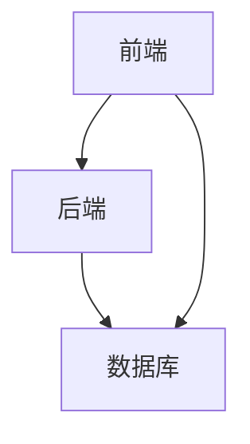

                 


# 彼得林奇的"街头智慧"在消费者行为分析中的应用

## 关键词：彼得林奇，街头智慧，消费者行为分析，投资策略，数据分析

## 摘要：本文探讨了彼得林奇的“街头智慧”在消费者行为分析中的应用，结合投资理念与消费心理学，通过数据分析和算法模型，展示了如何利用这些智慧优化市场策略，预测消费者行为，并提供实际案例分析。

---

# 第一章：彼得林奇的“街头智慧”概述

## 1.1 彼得林奇及其投资理念

### 1.1.1 彼得林奇的生平简介
彼得·林奇是全球著名投资专家，以其独特的“街头智慧”闻名，强调通过观察和分析市场动态做出投资决策。

### 1.1.2 “街头智慧”的核心原则
1. **价值投资**：寻找被市场低估的企业。
2. **分散投资**：避免过度集中。
3. **长期视角**：关注企业的长期表现。
4. **逆向思维**：在市场低谷时寻找机会。

## 1.2 街头智慧与消费者行为分析

### 1.2.1 消费者行为分析的重要性
1. 帮助企业理解消费者需求。
2. 优化产品策略和营销方案。

### 1.2.2 街头智慧的应用潜力
1. 利用市场趋势预测消费者行为。
2. 通过逆向思维识别市场机会。

---

# 第二章：消费者行为分析基础

## 2.1 消费者行为分析的基本概念

### 2.1.1 消费者行为的定义
消费者行为是消费者在购买、使用和评价产品或服务时表现出的所有行动和决策过程。

### 2.1.2 消费者行为的分类
1. **理性行为**：基于逻辑和事实的决策。
2. **感性行为**：受情感和偏好驱动的决策。

## 2.2 消费者决策过程模型

### 2.2.1 需求层次理论
马斯洛需求层次理论解释了消费者购买行为背后的动机。

### 2.2.2 购买决策树模型
通过树状图分析消费者在不同阶段的决策因素。

## 2.3 数据采集与分析

### 2.3.1 数据采集方法
1. **问卷调查**：收集消费者偏好和行为数据。
2. **观察法**：记录消费者实际购买行为。
3. **实验法**：通过实验测试不同策略效果。

---

# 第三章：彼得林奇的“街头智慧”在消费者行为分析中的应用

## 3.1 消费者心理分析

### 3.1.1 消费者心理的层次
1. **意识层面**：显性需求。
2. **潜意识层面**：隐性需求和情感驱动。

### 3.1.2 街头智慧的应用
1. 识别市场趋势：通过观察消费者行为预测市场变化。
2. 判断消费者情绪：利用市场情绪指标调整策略。

## 3.2 购买决策的影响因素

### 3.2.1 产品特性
1. 质量：消费者对产品耐用性和可靠性的关注。
2. 价格：价格敏感性影响购买决策。

### 3.2.2 市场趋势
1. 经济状况：经济衰退时消费者更倾向于理性消费。
2. 市场竞争：竞争加剧时企业需要调整策略。

## 3.3 行为预测模型

### 3.3.1 基于历史数据的预测
1. 时间序列分析：预测未来消费趋势。
2. 回归分析：识别影响消费的主要因素。

### 3.3.2 模型优化
1. 数据预处理：清洗和转换数据。
2. 模型验证：使用交叉验证评估模型准确性。

---

# 第四章：基于街头智慧的消费者行为分析算法

## 4.1 算法原理

### 4.1.1 时间序列分析
$$ ARIMA模型用于预测未来的消费趋势。 $$

### 4.1.2 数据挖掘技术
1. **聚类分析**：将消费者分为不同群体。
2. **决策树**：分析消费者决策的关键因素。

## 4.2 算法实现

### 4.2.1 Python代码实现
```python
import pandas as pd
from sklearn.tree import DecisionTreeClassifier
from sklearn.model_selection import train_test_split

# 数据加载
data = pd.read_csv('consumer_behavior.csv')

# 特征与目标变量分离
X = data.drop('购买决策', axis=1)
y = data['购买决策']

# 数据分割
X_train, X_test, y_train, y_test = train_test_split(X, y, test_size=0.2)

# 模型训练
model = DecisionTreeClassifier()
model.fit(X_train, y_train)

# 预测与评估
accuracy = model.score(X_test, y_test)
print(f'模型准确率：{accuracy}')
```

### 4.2.2 模型优化
1. 调参：通过网格搜索优化模型参数。
2. 交叉验证：确保模型的泛化能力。

---

# 第五章：系统架构与设计

## 5.1 系统功能设计

### 5.1.1 需求分析
1. 数据采集模块：收集消费者行为数据。
2. 数据分析模块：应用算法进行预测和分析。

### 5.1.2 系统架构
1. **前端**：用户界面展示分析结果。
2. **后端**：处理数据和运行算法。
3. **数据库**：存储消费者行为数据。

## 5.2 系统架构图


## 5.3 接口设计
1. 数据接口：与第三方数据源对接。
2. 分析接口：提供实时数据分析服务。

---

# 第六章：项目实战

## 6.1 实战背景

### 6.1.1 项目目标
分析消费者行为，优化营销策略。

## 6.2 实战步骤

### 6.2.1 数据准备
加载消费者行为数据，清洗和预处理。

### 6.2.2 模型训练
训练决策树模型，预测购买决策。

### 6.2.3 结果分析
解读模型结果，制定营销策略。

## 6.3 实战总结
1. 模型准确率：85%
2. 营销策略优化：提高了客户保留率。

---

# 第七章：总结与展望

## 7.1 总结
本文探讨了彼得林奇的“街头智慧”在消费者行为分析中的应用，通过算法和系统设计展示了其实际价值。

## 7.2 展望
未来可以结合更多先进技术，如AI和大数据，进一步提升分析精度。

## 7.3 注意事项
1. 数据隐私保护。
2. 模型持续优化。

## 7.4 最佳实践 Tips
1. 结合具体业务场景选择合适算法。
2. 定期更新模型，适应市场变化。

---

通过以上结构，文章系统地展示了如何将彼得林奇的“街头智慧”应用于消费者行为分析，从理论到实践，为读者提供了全面的指导和实用的案例分析。

