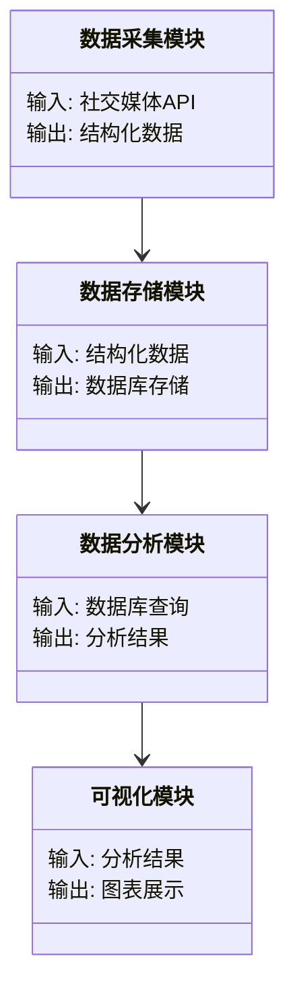
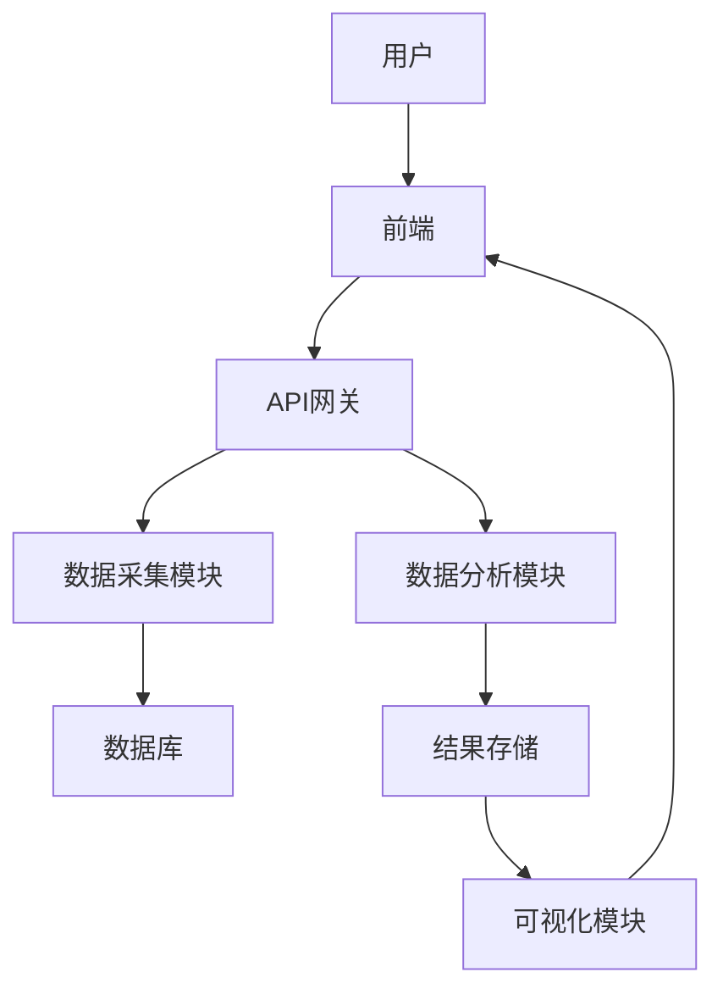

                 


# 彼得林奇的"街头智慧"在社交媒体数据分析中的运用

## 关键词
- 彼得林奇，社交媒体数据分析，情感分析，社交网络分析，投资决策，数据驱动投资

## 摘要
本文探讨如何将彼得林奇的"街头智慧"应用于社交媒体数据分析，通过情感分析和社交网络分析，识别市场情绪和关键趋势，辅助投资决策。文章系统介绍了数据分析方法、算法实现、系统架构设计和项目实战，帮助读者利用数据驱动投资。

---

# 第1章: 彼得林奇的"街头智慧"概述

## 1.1 彼得林奇及其投资理念

### 1.1.1 彼得林奇的生平简介
彼得·林奇是美国著名投资家，以其独特的"街头智慧"闻名。他强调通过观察普通人行为，发现投资机会。这种智慧的核心在于理解市场情绪和趋势。

### 1.1.2 "街头智慧"的核心概念
- 观察普通人的行为，发现市场信号。
- 通过数据和事实，而非直觉，做出投资决策。
- 强调数据驱动的投资策略。

### 1.1.3 投资中的"街头智慧"应用
- 分析市场情绪变化。
- 识别行业趋势。
- 评估企业价值。

## 1.2 社交媒体数据分析的背景

### 1.2.1 社交媒体数据的特点
- 文本、图片、视频等多样化数据。
- 用户行为数据：点赞、评论、分享。
- 数据量大，实时性强。

### 1.2.2 社交媒体数据在投资中的价值
- 反映市场情绪，预测价格波动。
- 识别行业趋势，发现新兴机会。
- 评估企业声誉，辅助投资决策。

### 1.2.3 数据分析与投资决策的关系
- 数据分析是连接市场情绪与投资决策的桥梁。
- 通过数据驱动，降低投资风险。
- 提高投资决策的科学性和准确性。

## 1.3 "街头智慧"与社交媒体数据的结合

### 1.3.1 街头智慧在数据中的体现
- 通过社交媒体数据，捕捉市场情绪。
- 分析用户行为，识别行业趋势。
- 从数据中发现投资机会。

### 1.3.2 社交媒体数据如何反映市场情绪
- 情感分析：判断用户对市场的看法。
- 社交网络分析：识别关键意见领袖。

### 1.3.3 数据分析在投资决策中的作用
- 提供数据支持，减少决策偏差。
- 发现市场趋势，优化投资组合。
- 监测市场动态，及时调整策略。

---

# 第2章: 社交媒体数据的结构与特征

## 2.1 社交媒体数据的类型

### 2.1.1 文本数据
- 用户评论、帖子内容。
- 数据量大，处理复杂。

### 2.1.2 图片与视频数据
- 视觉信息丰富，处理难度大。
- 使用计算机视觉技术进行分析。

### 2.1.3 用户行为数据
- 点赞、评论、分享频率。
- 用户互动模式反映市场参与度。

## 2.2 数据的特征分析

### 2.2.1 数据的时间性
- 实时数据处理，捕捉市场动态。
- 时间序列分析，预测市场趋势。

### 2.2.2 数据的社交网络属性
- 用户关系网络，识别关键节点。
- 社区检测，发现潜在投资机会。

### 2.2.3 数据的情感倾向
- 情感分析结果，判断市场情绪。
- 情感强度变化，预测价格波动。

## 2.3 数据预处理与清洗

### 2.3.1 数据清洗方法
- 去除噪声数据，如表情符号。
- 处理缺失值，补充缺失信息。

### 2.3.2 数据标准化与归一化
- 标准化：统一数据格式。
- 归一化：调整数据范围，便于模型训练。

### 2.3.3 数据增强技术
- 数据扩展，增加训练数据。
- 使用数据增强库，如Augmentor。

## 2.4 本章小结
社交媒体数据具有多样化和复杂性，预处理是数据分析的基础。通过清洗和标准化，确保数据质量，为后续分析奠定基础。

---

# 第3章: 情感分析算法

## 3.1 情感分析的基本概念

### 3.1.1 情感分析的定义
- 判断文本的情感倾向：正面、负面、中性。

### 3.1.2 情感分析的分类
- 二分类：正面或负面。
- 多分类：正面、中性、负面。

### 3.1.3 情感分析的应用场景
- 股票市场情绪分析。
- 品牌声誉监测。
- 用户反馈分析。

## 3.2 基于机器学习的情感分析

### 3.2.1 机器学习模型的选择
- 选择适合的算法，如SVM、随机森林、神经网络。

### 3.2.2 数据特征提取
- 使用TF-IDF提取关键词。
- 使用词嵌入技术（如Word2Vec）生成词向量。

### 3.2.3 模型训练与评估
- 划分训练集和测试集。
- 使用准确率、召回率、F1分数评估模型性能。

## 3.3 情感分析的实现

### 3.3.1 使用Python的文本处理库
- 使用NLTK进行文本处理。
- 使用re库进行正则表达式匹配。

### 3.3.2 基于深度学习的情感分析模型
- 使用Keras构建神经网络模型。
- 使用预训练的词嵌入模型（如GloVe）提高性能。

### 3.3.3 模型的优化与调优
- 调整模型参数，如学习率、批次大小。
- 使用交叉验证进行模型优化。

## 3.4 本章小结
情感分析是社交媒体数据分析的重要部分，通过机器学习和深度学习方法，可以准确判断市场情绪，辅助投资决策。

---

# 第4章: 社交网络分析

## 4.1 社交网络分析的基本概念

### 4.1.1 社交网络的定义
- 用户之间的关系网络。

### 4.1.2 社交网络的特征
- 用户节点、边、社区。
- 度数、中心度、聚类系数。

### 4.1.3 社交网络分析的应用
- 识别关键意见领袖。
- 发现社区结构。
- 分析传播路径。

## 4.2 社交网络分析的实现

### 4.2.1 图论基础
- 图的基本概念：节点、边、路径。
- 常用算法：DFS、BFS、Floyd-Warshall。

### 4.2.2 社交网络构建
- 使用Gephi构建网络图。
- 使用NetworkX库进行图分析。

### 4.2.3 社区检测
- 使用Louvain算法进行社区划分。
- 可视化社区结构，识别潜在投资机会。

## 4.3 本章小结
通过社交网络分析，可以识别关键用户和社区结构，辅助投资决策。

---

# 第5章: 数学模型与算法实现

## 5.1 数学模型设计

### 5.1.1 情感分析模型
- 使用LSTM进行文本处理。
- 计算情感倾向概率。

### 5.1.2 社交网络模型
- 使用图论模型，计算节点中心度。
- 识别关键意见领袖。

## 5.2 算法实现

### 5.2.1 情感分析算法
```python
import tensorflow as tf
from tensorflow.keras import layers

model = tf.keras.Sequential([
    layers.Embedding(input_dim=..., output_dim=...),
    layers.LSTM(units=64),
    layers.Dense(3, activation='softmax')
])
```

### 5.2.2 社交网络分析算法
```python
import networkx as nx

G = nx.Graph()
G.add_edges_from(...)
nx.draw(G, ...)
```

## 5.3 数学公式

### 情感分析模型
$$
\text{预测概率} = \text{模型输出} / \text{总和}
$$

### 社交网络模型
$$
\text{中心度} = \frac{\text{度数} + \text{接近度} + \text{中间度}}{3}
$$

---

# 第6章: 系统架构设计

## 6.1 问题场景介绍
- 数据采集：实时抓取社交媒体数据。
- 数据存储：使用数据库存储结构化数据。
- 数据分析：后端处理数据，生成分析结果。
- 可视化：前端展示分析结果。

## 6.2 系统功能设计

### 6.2.1 领域模型


### 6.2.2 系统架构


## 6.3 系统接口设计
- 数据采集接口：REST API。
- 数据分析接口：提供情感分析和社交网络分析结果。
- 可视化接口：展示分析结果。

---

# 第7章: 项目实战

## 7.1 环境安装

### 7.1.1 安装Python和相关库
```bash
pip install numpy pandas scikit-learn tensorflow networkx
```

### 7.1.2 安装可视化工具
```bash
pip install matplotlib seaborn plotly
```

## 7.2 核心实现

### 7.2.1 数据采集
```python
import requests

response = requests.get('https://api.twitter.com/...')
data = response.json()
```

### 7.2.2 情感分析
```python
from tensorflow.keras.preprocessing.text import Tokenizer
from tensorflow.keras.preprocessing.sequence import pad_sequences

tokenizer = Tokenizer(...)
sequences = pad_sequences(tokenizer.texts_to_sequences(texts), ...)
model.predict(sequences)
```

### 7.2.3 社交网络分析
```python
import networkx as nx

G = nx.from_pandas_edgelist(edges, 'from', 'to')
nx.draw(G, ...)
```

## 7.3 案例分析
- 选择具体社交媒体平台，如Twitter。
- 采集相关数据，进行情感分析和社交网络分析。
- 分析结果，指导投资决策。

## 7.4 小结
通过实战项目，验证理论方法的可行性，积累实际经验。

---

# 第8章: 总结与展望

## 8.1 总结
- 彼得林奇的"街头智慧"与社交媒体数据分析结合，提供新的投资视角。
- 情感分析和社交网络分析是关键工具。
- 数据驱动的投资决策更具科学性和准确性。

## 8.2 最佳实践 tips
- 数据预处理是关键，确保数据质量。
- 选择合适的算法，优化模型性能。
- 结合领域知识，提高分析结果的准确性。

## 8.3 展望
- 更多数据源的整合，提高分析维度。
- 新算法的应用，提升分析精度。
- 数据分析工具的优化，提高效率。

---

通过本文的系统介绍，读者可以掌握如何将彼得林奇的"街头智慧"应用到社交媒体数据分析中，利用情感分析和社交网络分析，辅助投资决策，实现数据驱动的投资策略。

