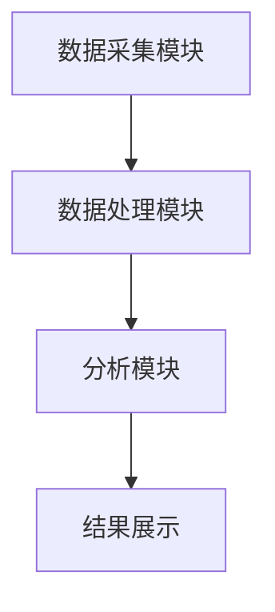

                 


# 彼得林奇的"街头智慧"在社交媒体时代的应用

## 关键词：彼得林奇，街头智慧，社交媒体，投资分析，自然语言处理，大数据

## 摘要：  
本文探讨了彼得林奇的"街头智慧"在社交媒体时代的应用，结合社交媒体数据的获取、处理、分析方法，以及情感分析、主题建模等算法，构建了一个基于社交媒体数据的投资分析系统。文章详细介绍了系统架构设计、项目实战案例，并总结了最佳实践和注意事项。

---

## 第一章：引言

### 1.1 投资理念与方法
彼得林奇以其独特的投资理念闻名，他主张通过深入研究企业的基本面和市场动态来做出投资决策。"街头智慧"指的是从日常生活中观察到的市场信息，帮助投资者识别潜在的投资机会。这种智慧在社交媒体时代，通过海量数据的实时传播，为投资分析提供了新的可能性。

### 1.2 社交媒体时代的投资环境
社交媒体的兴起改变了信息传播的方式，投资者可以实时获取市场动态、用户反馈和行业趋势。然而，如何从海量数据中提取有价值的信息，成为投资者面临的新挑战。本文将探讨如何利用社交媒体数据，结合彼得林奇的"街头智慧"，提升投资分析的效率和准确性。

---

## 第二章：社交媒体数据的获取与处理

### 2.1 数据收集方法
#### 2.1.1 数据来源
- **API接口**：使用Twitter、Facebook等平台的API获取实时数据。
- **网络爬虫**：通过爬虫技术抓取社交媒体上的公开数据。
- **数据清洗**：去除噪声数据，如重复内容和无效信息。

#### 2.1.2 数据特征分析
- **用户行为模式**：分析用户的活跃时间、互动频率等。
- **内容主题提取**：通过主题建模识别社交媒体上的主要讨论话题。

### 2.2 数据预处理
#### 2.2.1 文本清洗
- 去除标点符号、停用词和特殊字符。
- 分词处理：使用分词工具对中文文本进行分词。

#### 2.2.2 数据增强
- 数据扩展：通过数据增强技术增加数据多样性。

---

## 第三章：情感分析与主题建模

### 3.1 情感分析算法
#### 3.1.1 算法原理
- **词袋模型**：将文本表示为词袋，计算每个词的权重。
- **情感分类**：使用机器学习算法（如SVM、LSTM）对文本进行情感分类。

#### 3.1.2 情感分析的数学模型
- **词袋模型公式**：$$f(x) = \sum_{i=1}^{n} w_i x_i$$
- **LSTM结构**：详细解释LSTM的结构和工作原理。

### 3.2 主题建模
#### 3.2.1 LDA模型
- **主题建模原理**：通过LDA模型识别文本中的主题分布。
- **主题分布计算**：使用概率公式计算每个主题的分布。

---

## 第四章：系统架构设计

### 4.1 系统功能模块
- **数据采集模块**：负责从社交媒体获取数据。
- **数据处理模块**：对数据进行清洗和预处理。
- **分析模块**：包括情感分析和主题建模。

### 4.2 系统架构图


### 4.3 系统接口设计
- **API接口**：提供RESTful API供其他系统调用。
- **数据接口**：与数据库进行交互，存储和检索数据。

---

## 第五章：项目实战

### 5.1 环境安装
- **工具安装**：安装Python、Jieba、NLTK等工具。
- **数据获取**：使用Twitter API获取相关数据。

### 5.2 核心实现代码
```python
import tweepy
from textblob import TextBlob

# 授权认证
auth = tweepy.OAuthHandler(consumer_key, consumer_secret)
api = tweepy.API(auth)

# 获取推文
tweets = api.search(q="投资", count=100)

# 情感分析
for tweet in tweets:
    blob = TextBlob(tweet.text)
    print(tweet.text, blob.sentiment.polarity)
```

### 5.3 实例分析
- **案例分析**：分析某公司的社交媒体数据，预测其股价走势。
- **结果解读**：解释分析结果对投资决策的影响。

---

## 第六章：最佳实践与总结

### 6.1 总结
- 彼得林奇的"街头智慧"在社交媒体时代焕发了新的活力。
- 社交媒体数据为投资分析提供了丰富的信息源。

### 6.2 注意事项
- **数据隐私**：注意用户隐私和数据安全。
- **算法局限性**：情感分析可能受到文本复杂性的影响。

### 6.3 未来研究方向
- **多模态分析**：结合图像和视频进行投资分析。
- **实时监控**：开发实时数据监控系统。

---

## 参考文献
1. 彼得林奇的《投资》书籍。
2. 相关技术文献和论文。

---

通过以上章节，我们详细探讨了彼得林奇的"街头智慧"在社交媒体时代的应用，从数据获取到系统构建，再到实际案例分析，为投资者提供了新的思路和方法。希望本文能为投资分析领域带来一些启发和帮助。

