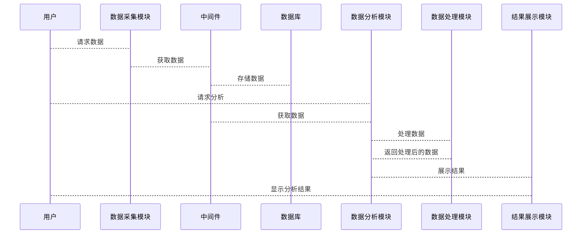

                 


# 彼得林奇的"街头智慧"在社交媒体舆情分析中的应用

> 关键词：社交媒体舆情分析，彼得林奇，街头智慧，情感分析，数据驱动决策，投资分析

> 摘要：本文探讨了将彼得林奇的"街头智慧"投资理念应用于社交媒体舆情分析的可能性与实践方法。通过分析社交媒体数据的特点，结合街头智慧的核心思想，提出了一套适用于社交媒体舆情分析的框架，旨在帮助投资者和分析师更有效地利用社交媒体信息做出决策。本文从理论分析、算法实现、系统设计、项目实战等多个维度展开，全面展示了街头智慧在社交媒体舆情分析中的应用价值。

---

## 第一部分: 背景介绍与核心概念

### 第1章: 社交媒体舆情分析的背景与重要性

#### 1.1 社交媒体的崛起与影响力

- **1.1.1 社交媒体的定义与现状**  
  - 社交媒体的定义：社交媒体是指通过互联网平台进行信息传播和互动的工具，如微博、Twitter、Facebook等。  
  - 当前社交媒体的使用现状：用户数量庞大，信息传播速度快，成为信息传播的重要渠道。  

- **1.1.2 社交媒体在信息传播中的作用**  
  - 社交媒体成为公众意见表达的主要平台。  
  - 社交媒体能够快速传播信息，影响公众舆论。  

- **1.1.3 社交媒体舆情分析的必要性**  
  - 企业需要通过舆情分析了解公众对其产品或服务的评价。  
  - 政府需要通过舆情分析了解民众对政策的反应。  
  - 投资者需要通过舆情分析获取市场信息，做出投资决策。  

#### 1.2 彼得林奇的"街头智慧"概述

- **1.2.1 彼得林奇及其投资理念**  
  - 彼得·林奇是美国著名投资家，以其独特的"街头智慧"投资理念闻名。  
  - 他强调通过观察和分析普通人的行为和决策来寻找投资机会。  

- **1.2.2 街头智慧的核心思想**  
  - 观察与推理相结合：通过观察市场中的现象，推导出潜在的投资机会。  
  - 简单与复杂的平衡：避免过度复杂的分析，抓住问题的本质。  
  - 数据驱动的决策：基于实际数据和市场反馈做出决策。  

- **1.2.3 街头智慧在投资分析中的应用**  
  - 通过分析市场中的价格走势和交易行为，寻找投资机会。  
  - 通过观察市场参与者的反应，判断市场的心理变化。  

#### 1.3 街头智慧与社交媒体舆情分析的结合

- **1.3.1 社交媒体数据的特点**  
  - 数据量大：社交媒体每天产生海量信息。  
  - 数据分散：信息分布在不同的平台和用户中。  
  - 数据实时性：社交媒体信息具有较强的实时性。  

- **1.3.2 街头智慧在社交媒体分析中的潜在价值**  
  - 通过分析社交媒体上的用户评论和互动，了解市场情绪。  
  - 通过观察社交媒体上的热点话题，发现市场趋势。  

- **1.3.3 本书的核心目标与意义**  
  - 探讨如何将街头智慧的理念应用于社交媒体舆情分析。  
  - 提供一种新的视角来理解社交媒体数据的价值。  

---

### 第2章: 社交媒体舆情分析的核心概念与框架

#### 2.1 舆情分析的基本概念

- **2.1.1 舆情分析的定义**  
  - 舆情分析是指通过分析社交媒体上的文本数据，了解公众对某个话题、品牌或事件的态度和情感。  

- **2.1.2 舆情分析的主要方法**  
  - 情感分析：判断文本的情感倾向（正面、负面、中性）。  
  - 主题分析：识别文本中的主要话题和关键词。  
  - 趋势分析：分析舆情的变化趋势。  

- **2.1.3 舆情分析的指标体系**  
  - 情感极性：文本的情感倾向。  
  - 主题相关性：文本与特定主题的相关性。  
  - 热度指标：文本的传播广度和关注度。  

#### 2.2 彼得林奇街头智慧的分析框架

- **2.2.1 街头智慧的核心要素**  
  - 观察：通过观察市场现象获取信息。  
  - 推理：基于观察到的现象进行逻辑推理。  
  - 决策：根据推理结果做出决策。  

- **2.2.2 街头智慧在社交媒体分析中的映射**  
  - 观察：分析社交媒体上的用户评论和互动。  
  - 推理：通过分析评论内容推断用户的态度和情感。  
  - 决策：基于分析结果做出投资或运营决策。  

- **2.2.3 本书的分析框架**  
  - 数据收集：从社交媒体平台获取相关数据。  
  - 数据分析：利用情感分析等技术对数据进行处理。  
  - 结果应用：将分析结果应用于投资或运营决策。  

#### 2.3 本书的分析框架

- **2.3.1 数据收集与处理**  
  - 数据来源：社交媒体平台（如微博、Twitter）。  
  - 数据清洗：去除噪声数据，提取有用信息。  

- **2.3.2 数据分析与建模**  
  - 情感分析模型：基于机器学习的情感分类器。  
  - 趋势分析模型：基于时间序列分析的舆情趋势预测。  

- **2.3.3 结果解读与应用**  
  - 根据分析结果制定投资策略或运营计划。  

---

### 第3章: 情感分析算法原理

#### 3.1 情感分析的基本原理

- **3.1.1 情感分析的定义**  
  - 情感分析是通过自然语言处理技术，判断文本的情感倾向。  

- **3.1.2 情感分析的主要方法**  
  - 基于词典的方法：利用预定义的情感词典对文本进行打分。  
  - 基于机器学习的方法：利用训练好的模型对文本进行分类。  

- **3.1.3 基于词典的情感分析**  
  - 使用情感词典（如AFINN、VADER等）对文本进行情感打分。  
  - 根据分数判断文本的情感倾向。  

#### 3.2 情感分析算法的实现

- **3.2.1 算法实现步骤**  
  1. 数据预处理：去除停用词，进行分词和词干提取。  
  2. 情感词典的构建：收集并整理情感词汇，赋予每个词汇情感分值。  
  3. 文本情感计算：对文本进行情感打分，根据总分判断情感倾向。  

- **3.2.2 情感分析的代码实现**  
  ```python
  # 示例代码：基于VADER的情感分析
  from vaderSentiment.vaderSentiment import SentimentIntensityAnalyzer

  analyzer = SentimentIntensityAnalyzer()

  def analyze_sentiment(text):
      sentiment = analyzer.polarity_scores(text)
      if sentiment['compound'] >= 0.05:
          return '正面'
      elif sentiment['compound'] <= -0.05:
          return '负面'
      else:
          return '中性'

  text = "这个产品真的很好用！"
  print(analyze_sentiment(text))  # 输出：正面
  ```

- **3.2.3 情感分析的数学模型**  
  - 情感得分计算公式：  
    $$ \text{compound} = w1 \times \text{pos} + w2 \times \text{neg} $$  
    其中，$w1$ 和 $w2$ 是权重系数，$\text{pos}$ 和 $\text{neg}$ 分别是正面和负面情感得分。  

---

### 第4章: 系统分析与架构设计

#### 4.1 问题场景介绍

- **4.1.1 问题背景**  
  - 企业需要通过社交媒体分析了解市场舆情。  
  - 投资者需要通过社交媒体分析获取投资信息。  

- **4.1.2 问题目标**  
  - 构建一个基于社交媒体数据的舆情分析系统。  
  - 实现情感分析、主题分析等功能。  

#### 4.2 系统功能设计

- **4.2.1 功能模块划分**  
  - 数据采集模块：从社交媒体平台获取数据。  
  - 数据处理模块：清洗和预处理数据。  
  - 数据分析模块：进行情感分析和主题分析。  
  - 结果展示模块：以可视化形式展示分析结果。  

- **4.2.2 领域模型（Mermaid 类图）**  
  ```mermaid
  classDiagram
      class 数据采集模块 {
          获取数据
      }
      class 数据处理模块 {
          清洗数据
      }
      class 数据分析模块 {
          情感分析
          主题分析
      }
      class 结果展示模块 {
          可视化展示
      }
      数据采集模块 --> 数据处理模块
      数据处理模块 --> 数据分析模块
      数据分析模块 --> 结果展示模块
  ```

#### 4.3 系统架构设计

- **4.3.1 系统架构图（Mermaid 架构图）**  
  ```mermaid
  architecture 
      客户端 <--net--》 中间件 
      中间件 <--net--》 数据库 
      中间件 <--net--》 分析模块 
      分析模块 <--net--》 结果展示模块
  ```

- **4.3.2 系统接口设计**  
  - 数据采集接口：从社交媒体API获取数据。  
  - 数据处理接口：对数据进行清洗和预处理。  
  - 数据分析接口：调用情感分析和主题分析模块。  

#### 4.4 系统交互设计（Mermaid 序列图）  


---

### 第5章: 项目实战

#### 5.1 环境安装

- **5.1.1 系统环境**  
  - 操作系统：Windows、Linux 或 macOS。  
  - Python 版本：3.6 以上。  

- **5.1.2 工具安装**  
  - Python 包管理工具：pip  
  - 情感分析库：vaderSentiment  
  - 数据分析库：pandas、numpy  
  - 可视化库：matplotlib  

#### 5.2 核心实现代码

- **5.2.1 数据采集代码**  
  ```python
  import requests

  def get_data(url):
      response = requests.get(url)
      return response.text

  url = "https://api.twitter.com/..."
  data = get_data(url)
  ```

- **5.2.2 数据处理代码**  
  ```python
  import pandas as pd

  def process_data(data):
      df = pd.DataFrame(data)
      df = df.dropna()
      return df

  processed_data = process_data(data)
  ```

- **5.2.3 情感分析代码**  
  ```python
  from vaderSentiment.vaderSentiment import SentimentIntensityAnalyzer

  analyzer = SentimentIntensityAnalyzer()

  def analyze_sentiment(text):
      sentiment = analyzer.polarity_scores(text)
      if sentiment['compound'] >= 0.05:
          return '正面'
      elif sentiment['compound'] <= -0.05:
          return '负面'
      else:
          return '中性'

  result = analyze_sentiment("这是一个好产品！")
  ```

#### 5.3 案例分析

- **5.3.1 案例背景**  
  - 分析某品牌在社交媒体上的用户评论。  

- **5.3.2 数据分析**  
  - 使用情感分析模型对评论进行分类。  
  - 统计正面、负面和中性评论的数量。  

- **5.3.3 结果解读**  
  - 根据分析结果制定品牌推广策略。  

#### 5.4 项目小结

- **5.4.1 项目总结**  
  - 成功实现了社交媒体舆情分析系统。  
  - 系统具备数据采集、处理、分析和展示功能。  

- **5.4.2 经验与教训**  
  - 数据清洗和预处理是关键步骤。  
  - 情感分析模型的准确性需要进一步优化。  

---

### 第6章: 最佳实践与小结

#### 6.1 最佳实践

- **6.1.1 数据收集与处理**  
  - 确保数据的完整性和准确性。  
  - 使用适当的数据清洗方法。  

- **6.1.2 数据分析与建模**  
  - 选择合适的分析方法和模型。  
  - 定期更新模型，以适应数据变化。  

- **6.1.3 系统设计与实现**  
  - 采用模块化设计，便于维护和扩展。  
  - 使用高效的编程语言和工具。  

#### 6.2 小结

- **6.2.1 本书的核心内容总结**  
  - 探讨了彼得林奇的街头智慧在社交媒体舆情分析中的应用。  
  - 提供了情感分析算法和系统设计的详细步骤。  

- **6.2.2 未来的展望**  
  - 研究更复杂的情感分析模型，如深度学习。  
  - 探讨街头智慧在其他领域的应用潜力。  

#### 6.3 注意事项

- **6.3.1 数据隐私问题**  
  - 遵守数据隐私法律法规，保护用户隐私。  

- **6.3.2 模型的局限性**  
  - 情感分析模型可能受到数据偏差的影响。  

- **6.3.3 实际应用中的挑战**  
  - 社交媒体数据的多样性和复杂性。  

#### 6.4 拓展阅读

- **6.4.1 推荐书籍**  
  - 《彼得·林奇的投资心理分析》  
  - 《自然语言处理实战：基于Python的机器学习与深度学习》  

- **6.4.2 推荐博客与资源**  
  - 自然语言处理技术博客：https://towardsdatascience.com/  
  - 情感分析开源库：https://github.com  

---

### 结语

通过本书的探讨，我们了解了如何将彼得林奇的街头智慧理念应用于社交媒体舆情分析。从理论分析到算法实现，从系统设计到项目实战，我们全面展示了这一理念的应用价值。希望本书能够为投资者、分析师以及技术开发者提供有价值的参考和启发。

---

**THE END**

