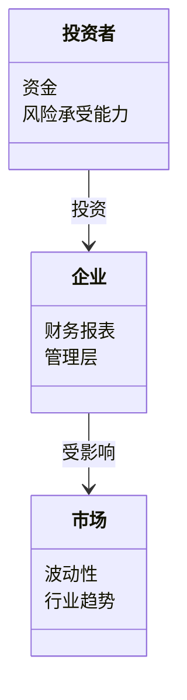

                 


# 彼得林奇的"街头智慧"投资法

> 关键词：彼得·林奇，投资法，街头智慧，价值投资，投资策略，风险管理

> 摘要：本文将介绍彼得·林奇的“街头智慧”投资法，探讨其核心概念、投资策略、风险管理方法以及实际案例分析。通过系统化的分析和流程图的展示，帮助读者理解如何在日常生活中应用这些投资智慧。

---

# 第一部分: 投资的基础与彼得林奇的背景

## 第1章: 投资的基本概念与背景介绍

### 1.1 投资的基本概念

#### 1.1.1 投资的定义与分类

**投资**是指将资金投入某个项目或资产，以期望在未来获得超过初始投入的收益。根据风险和收益的不同，投资可以分为以下几类：

1. **固定收益投资**：如债券、定期存款等，收益相对固定，风险较低。
2. **权益投资**：如股票投资，收益不确定，风险较高。
3. **房地产投资**：通过购买房产获得租金收入或资本增值。
4. **期货与期权**：高风险的投资工具，适合有经验的投资者。

#### 1.1.2 传统投资与现代投资的区别

- **传统投资**：注重长期价值，以股息、利息等固定收益为主。
- **现代投资**：注重短期收益和市场波动，大量依赖技术分析和市场预测。

#### 1.1.3 投资市场的基本构成

投资市场由以下几个基本要素构成：

1. **投资者**：个人或机构，将资金投入市场。
2. **融资者**：企业或政府，通过发行债券、股票等融资。
3. **中介服务机构**：如证券公司、银行等，提供交易和信息服务。
4. **监管机构**：如证监会，确保市场的公平与透明。

### 1.2 彼得·林奇的生平与投资理念

#### 1.2.1 彼得·林奇的个人经历

彼得·林奇（Peter Lynch）是美国著名的职业棒球运动员和投资专家。他在1985年加入红袜队，并在职业生涯中多次获得冠军。他的投资理念深受其运动生涯的影响，强调观察和实践的重要性。

#### 1.2.2 林奇的投资哲学与方法

林奇的投资哲学可以概括为以下几点：

1. **长期投资**：避免频繁交易，长期持有优质资产。
2. **价值投资**：寻找被市场低估的企业，关注其内在价值。
3. **分散投资**：不要将所有资金投入单一资产，降低风险。

#### 1.2.3 林奇对投资市场的独特见解

林奇认为，投资市场的波动性为长期投资者提供了机会。他强调，投资者应关注企业的基本面，而不是市场的短期波动。

## 第2章: 街头智慧投资法的核心概念

### 2.1 街头智慧投资法的定义

**街头智慧投资法**是指通过日常生活中的观察和经验，总结出的投资策略。这种方法强调实践和观察，而不是依赖复杂的数学模型。

### 2.2 林奇的三圈理论

#### 2.2.1 三圈理论的提出背景

林奇提出的“三圈理论”是基于他对市场的长期观察。他认为，市场中的机会可以分为三个层次：

1. **第一层**：市场波动带来的短期机会。
2. **第二层**：企业基本面带来的长期价值。
3. **第三层**：行业趋势带来的结构性机会。

#### 2.2.2 三圈理论的构成与特点

- **市场波动**：短期市场波动带来的交易机会。
- **企业基本面**：企业的盈利能力、成长性等。
- **行业趋势**：行业的发展方向和趋势。

#### 2.2.3 三圈理论在投资中的应用

通过三圈理论，投资者可以在不同层次上寻找投资机会，从而实现长期稳定的收益。

## 第3章: 投资决策的核心要素

### 3.1 企业基本面分析

#### 3.1.1 企业财务报表的核心指标

- **净利润**：企业的盈利能力。
- **营业收入**：企业的收入来源。
- **资产负债表**：企业的资产、负债和所有者权益。

#### 3.1.2 企业盈利能力的评估

通过分析企业的净利润率、ROE（净资产收益率）等指标，评估企业的盈利能力。

#### 3.1.3 企业成长性的判断

通过分析企业的收入增长率、净利润增长率等指标，判断企业的成长性。

### 3.2 管理层能力评估

#### 3.2.1 管理层的诚信与能力

通过分析企业的管理层背景、过往业绩等，评估其诚信和能力。

#### 3.2.2 管理层决策对企业的影响

管理层的决策直接影响企业的经营状况和投资价值。

#### 3.2.3 管理层的稳定性分析

管理层的稳定性是企业长期发展的关键因素之一。

### 3.3 市场环境与行业分析

#### 3.3.1 行业周期的判断

分析行业所处的周期，如成长期、成熟期或衰退期。

#### 3.3.2 市场竞争格局的分析

分析行业内的主要竞争者，判断企业的竞争优势。

#### 3.3.3 宏观经济环境对投资的影响

宏观经济环境如GDP增长率、利率、通货膨胀等都会影响投资决策。

## 第4章: 投资策略与风险管理

### 4.1 林奇的投资策略

#### 4.1.1 长期投资与短期投资的平衡

林奇主张长期投资，但也会根据市场情况调整投资组合。

#### 4.1.2 价值投资与成长投资的结合

结合企业的内在价值和成长潜力进行投资。

#### 4.1.3 分散投资与集中投资的权衡

分散投资可以降低风险，但集中投资可以提高收益。

### 4.2 风险管理的核心原则

#### 4.2.1 风险的定义与分类

- **系统性风险**：市场整体波动带来的风险。
- **非系统性风险**：特定企业或行业带来的风险。

#### 4.2.2 投资组合的风险分散策略

通过多元化投资降低风险。

#### 4.2.3 个人风险承受能力的评估

根据个人的财务状况、风险偏好等，评估风险承受能力。

---

# 第二部分: 投资策略与实战

## 第5章: 投资策略的核心模型与数学公式

### 5.1 投资回报率的计算

#### 5.1.1 投资回报率的公式

$$ ROI = \frac{利润}{投资成本} \times 100\% $$

#### 5.1.2 净资产收益率（ROE）

$$ ROE = \frac{净利润}{净资产} \times 100\% $$

#### 5.1.3 资产回报率（ROA）

$$ ROA = \frac{净利润}{总资产} \times 100\% $$

### 5.2 投资决策的数学模型

#### 5.2.1 价值投资模型

$$ \text{内在价值} = \frac{\text{未来现金流的现值}}{\text{折现率}} $$

#### 5.2.2 成长投资模型

$$ \text{增长率} = \frac{\text{净利润增长率}}{1 - \text{净利润增长率}} $$

---

## 第6章: 系统分析与架构设计方案

### 6.1 系统功能设计

#### 6.1.1 领域模型



#### 6.1.2 系统架构设计


---

## 第7章: 项目实战与案例分析

### 7.1 投资环境的安装与配置

#### 7.1.1 投资平台的选择

- **股票交易软件**：如通达信、东方财富等。
- **数据分析工具**：如Excel、Python等。

### 7.2 系统核心实现源代码

#### 7.2.1 企业基本面分析代码

```python
import pandas as pd

# 假设df是财务数据的DataFrame
def calculate_roe(df):
    return df['净利润'] / df['净资产']

# 示例数据
data = {
    '净利润': [100, 200, 300],
    '净资产': [500, 600, 700]
}
df = pd.DataFrame(data)
print(calculate_roe(df))
```

#### 7.2.2 风险评估代码

```python
import numpy as np

def portfolio_risk(returns):
    return np.std(returns)

# 示例数据
returns = [0.05, 0.03, 0.07, 0.02]
print(portfolio_risk(returns))
```

### 7.3 实际案例分析

#### 7.3.1 案例一：价值投资

**目标企业**：苹果公司

- **内在价值**：通过现金流折现法计算。
- **市场价值**：当前股价与内在价值对比。

#### 7.3.2 案例二：风险管理

**投资组合**：股票、债券、房地产。

- **风险分散**：通过不同资产的配置降低风险。
- **定期调整**：根据市场变化调整投资比例。

---

## 第8章: 最佳实践与小结

### 8.1 小结

彼得林奇的“街头智慧”投资法强调实践和观察，通过长期持有优质资产实现财富增长。投资者应结合市场环境、企业基本面和自身风险承受能力，制定合理的投资策略。

### 8.2 注意事项

- **避免过度杠杆**：高杠杆会增加风险。
- **定期复盘**：及时评估投资组合的表现。
- **持续学习**：关注市场动态和企业变化。

### 8.3 拓展阅读

- 《彼得·林奇的成功投资》
- 《投资学基础》
- 《风险管理的艺术》

---

通过以上步骤的详细分析和实战案例，读者可以更好地理解彼得林奇的“街头智慧”投资法，并在实际投资中灵活运用。

