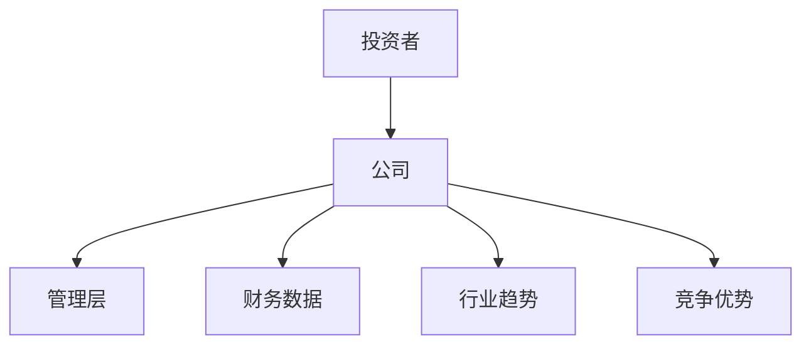
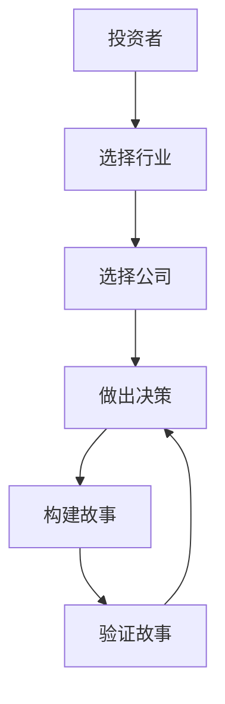
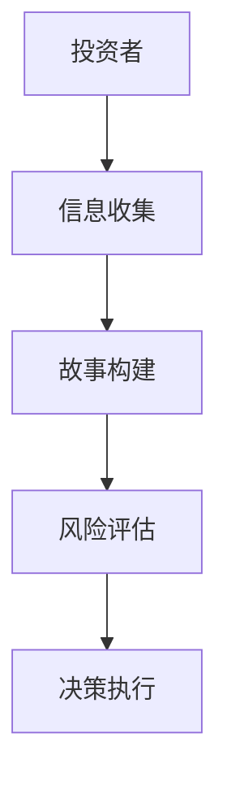

                 


# 彼得林奇的"讲故事"投资法

## 关键词：彼得林奇、投资法、故事法、基本面分析、投资策略、风险管理

## 摘要：  
彼得林奇的"讲故事"投资法是一种独特而有效的方法，通过将投资标的视为一个“故事”，深入分析其基本面、行业地位、竞争优势和管理层能力等关键要素，构建投资逻辑并制定投资策略。本文将从故事法的背景、核心原理、算法流程、系统架构、实战案例、数学模型等方面，全面解析这一投资方法的内在逻辑和实践应用，帮助读者更好地理解和运用这一策略。

---

## 第一部分：彼得林奇"讲故事"投资法的背景与基础

### 第1章：投资的基本概念与背景

#### 1.1 投资的基本概念  
- **什么是投资？**  
  投资是指将资金投入特定资产或项目，以期望在未来获得超过初始投入的收益。  
- **投资的基本原则**  
  投资需遵循分散化、长期持有、风险与收益匹配等原则。  
- **投资的分类与特点**  
  主要包括股票、债券、基金、房地产等多种形式，每种形式有其独特的风险收益特征。

#### 1.2 彼得林奇与"讲故事"投资法  
- **彼得林奇的生平简介**  
  彼得林奇是美国著名基金经理，以其在富达麦哲伦基金的卓越表现闻名，被称为“股票投资之神”。  
- **"讲故事"投资法的提出背景**  
  在20世纪80年代，彼得林奇总结其投资经验，提出了一种基于基本面分析的投资方法，即“讲故事”投资法。  
- **该方法的核心理念与优势**  
  通过将公司视为一个“故事”，深入分析其商业模式、财务状况、行业地位等因素，帮助投资者做出更明智的决策。

#### 1.3 "讲故事"投资法的起源与发展  
- **传统投资方法的局限性**  
  传统方法往往依赖技术分析或短期市场波动，忽视了公司的基本面。  
- **故事法的创新点**  
  从公司基本面出发，构建逻辑清晰的投资故事，帮助投资者识别优质标的。  
- **该方法在投资领域的应用现状**  
  目前已被广泛应用于股票投资，尤其适合长期价值投资者。

---

### 第2章：故事法投资的核心概念与联系

#### 2.1 故事法投资的原理  
- **故事法的核心原理**  
  将公司视为一个“故事”，从商业模式、财务状况、行业地位等方面构建逻辑链条，判断其是否具有长期投资价值。  
- **投资故事的构建逻辑**  
  包括公司背景、财务数据、行业趋势、管理层能力等因素的分析。  
- **故事法与基本面分析的关系**  
  故事法是基本面分析的一种具体应用，通过构建故事来深入理解公司。

#### 2.2 核心概念对比表  
| 核心概念 | 故事法 | 传统价值投资 | 技术分析 |
|----------|--------|--------------|----------|
| 核心依据 | 公司基本面 | 公司内在价值 | 市场价格波动 |
| 分析重点 | 公司故事构建 | 股票内在价值 | 价格图表 |
| 适用场景 | 长期投资 | 长期投资 | 短期交易 |

#### 2.3 实体关系图  


---

## 第二部分：故事法投资的算法原理

### 第3章：故事法投资的流程

#### 3.1 故事法投资的流程  


#### 3.2 故事法投资的数学模型  
- **投资收益的计算公式**  
  $$ \text{收益} = \text{卖出价} - \text{买入价} $$
- **风险评估的数学模型**  
  $$ \text{风险} = \text{标准差}(r) $$
- **投资组合优化的数学方法**  
  使用均值-方差优化模型，$$ \min \sigma^2 \text{ s.t. } \mu \geq r $$

---

### 第4章：故事法投资的系统架构设计

#### 4.1 投资流程系统  
- **信息收集模块**  
  从财务报表、行业报告等来源获取数据。  
- **故事构建模块**  
  分析公司基本面，构建投资故事。  
- **风险评估模块**  
  计算投资风险，评估是否符合投资者的风险承受能力。  
- **决策执行模块**  
  根据分析结果，做出买入、卖出或持有决策。

#### 4.2 系统架构图  


---

### 第5章：故事法投资的实战案例

#### 5.1 案例分析  
- **案例背景介绍**  
  某公司处于行业领先地位，财务状况良好，管理层能力强。  
- **故事构建过程**  
  分析公司竞争优势、行业趋势，构建投资故事。  
- **投资决策与结果分析**  
  买入该股票，长期持有，获得超额收益。

#### 5.2 代码实现  
```python
def calculate_return(price):
    return price[1] - price[0]

def calculate_risk(returns):
    import numpy as np
    return np.std(returns)

def investment_decision(story, risk_level):
    if story["value"] > story["price"]:
        if story["risk"] < risk_level:
            return "买入"
    return "观望"
```

---

### 第6章：故事法投资的最佳实践与注意事项

#### 6.1 最佳实践  
- **投资前的准备工作**  
  充分了解市场和公司基本面。  
- **故事构建的关键点**  
  重点分析公司的竞争优势和管理层能力。  
- **决策过程中的注意事项**  
  风险控制是投资成功的关键。

#### 6.2 小结与总结  
- **本章内容回顾**  
  介绍了故事法投资的核心理念和应用方法。  
- **投资故事法的未来展望**  
  随着市场的发展，故事法投资将更加注重数据化和智能化。  
- **对投资者的建议与鼓励**  
  坚持长期投资，不断学习和优化自己的投资策略。

---

### 第7章：故事法投资的数学模型与公式

#### 7.1 投资收益计算  
- **单利与复利的计算公式**  
  $$ \text{单利} = P \times r \times t $$  
  $$ \text{复利} = P \times (1 + r)^t $$  
- **投资组合的收益计算**  
  $$ \text{组合收益} = \sum w_i \times r_i $$  

#### 7.2 风险评估公式  
- **方差与标准差的计算**  
  $$ \text{方差} = \sigma^2 = \frac{1}{n}\sum (x_i - \mu)^2 $$  
  $$ \text{标准差} = \sqrt{\sigma^2} $$  
- **VaR与CVaR的计算方法**  
  VaR是指在一定置信水平下可能的最大损失，CVaR是VaR的平均值。

---

## 第三部分：总结与展望

彼得林奇的"讲故事"投资法是一种以基本面分析为核心，通过构建公司故事来做出投资决策的方法。本文从背景、原理、算法、系统架构、实战案例和数学模型等多个方面进行了详细分析，帮助读者全面理解这一投资方法。未来，随着市场的变化和技术的进步，故事法投资将更加注重数据化和智能化，为投资者提供更强大的工具和方法。

