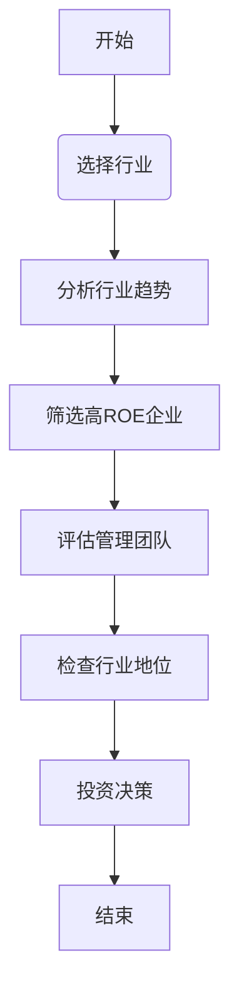
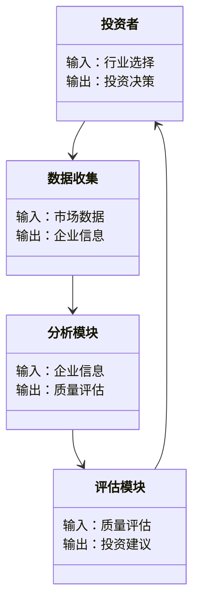
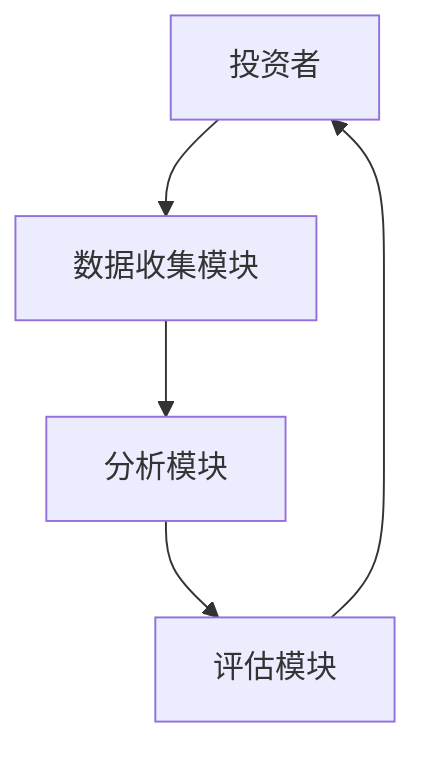

                 


# 彼得林奇的"质量优先"在不同行业的应用

> 关键词：彼得林奇，质量优先，投资策略，行业应用，系统分析

> 摘要：本文详细探讨了彼得林奇的质量优先投资策略，并分析了其在不同行业中的应用。通过系统分析和项目实战，结合算法原理和架构设计，展示了如何在实际投资中应用这一策略，提供了最佳实践和注意事项。

---

## 第一部分：彼得林奇质量优先策略概述

### 第1章：彼得林奇与质量优先策略

#### 1.1 彼得林奇及其投资哲学

彼得·林奇（Peter Lynch）是全球最著名的职业基金经理之一，以其在富达投资管理公司（Fidelity）的卓越表现闻名。他强调“质量优先”的投资策略，即选择那些基本面强劲、管理优秀、行业地位稳固的公司进行投资。

#### 1.2 质量优先策略的定义与特点

质量优先策略的核心在于关注企业的内在质量，而非短期市场波动。其特点包括：

- **长期视角**：关注企业的长期盈利能力，而非短期股价波动。
- **基本面分析**：重视企业的财务健康状况、管理团队和行业地位。
- **分散投资**：通过投资于多个优质企业来分散风险。
- **避免短期决策**：不因市场波动频繁调整投资组合。

---

## 第二部分：质量优先策略的核心概念与联系

### 第2章：质量优先策略的核心概念

#### 2.1 核心概念的原理

质量优先策略的核心在于识别具有以下特征的企业：

- **高ROE（净资产收益率）**：ROE = 净利润 / 平均股东权益，反映了企业使用股东资金的效率。
- **稳定的收入来源**：企业具备稳定的现金流和收入增长能力。
- **强大的管理团队**：管理团队经验丰富，战略清晰。
- **行业领导地位**：企业在行业内具有竞争优势。

#### 2.2 核心概念的属性特征对比

以下是不同概念的属性特征对比：

| 概念          | 属性                         | 特征描述                               |
|---------------|------------------------------|----------------------------------------|
| 企业质量      | 盈利能力                     | 高ROE，稳定的收入增长                   |
| 管理团队       | 经验与战略                   | 丰富的行业经验，清晰的战略规划         |
| 行业地位       | 市场份额                     | 领先的市场份额，竞争优势明显           |

#### 2.3 ER实体关系图

以下是质量优先策略的ER实体关系图：

```mermaid
erd
    管理团队 -[1..n]-> 企业
    企业 -[1]-> 行业
    行业 -[1..n]-> 质量评估指标
```

---

## 第三部分：质量优先策略的算法原理讲解

### 第3章：算法原理

#### 3.1 投资决策算法

以下是投资决策算法的流程图：



#### 3.2 Python代码实现

以下是计算企业ROE的Python代码：

```python
import pandas as pd

def calculate_roe(financial_data):
    net_profit = financial_data['净利润']
    average_equity = (financial_data['股东权益（期初）'] + financial_data['股东权益（期末）']) / 2
    roe = net_profit / average_equity
    return roe

# 示例数据
data = {
    '净利润': [100, 200, 300],
    '股东权益（期初）': [500, 600, 700],
    '股东权益（期末）': [550, 650, 750]
}
df = pd.DataFrame(data)
roes = data.apply(lambda x: calculate_roe(x), axis=1)
print(roes)
```

#### 3.3 数学模型与公式

ROE的计算公式为：

$$ROE = \frac{\text{净利润}}{\text{平均股东权益}}$$

其中，平均股东权益为：

$$\text{平均股东权益} = \frac{\text{股东权益（期初）} + \text{股东权益（期末）}}{2}$$

---

## 第四部分：质量优先策略的系统分析与架构设计

### 第4章：系统分析与架构设计方案

#### 4.1 投资场景介绍

在当前市场环境下，投资者需要借助系统化的工具来分析企业的质量和行业趋势，以制定有效的投资策略。

#### 4.2 系统功能设计

以下是系统功能模块的设计：



#### 4.3 系统架构设计

以下是系统架构图：



---

## 第五部分：质量优先策略的项目实战

### 第5章：项目实战

#### 5.1 环境安装

- **工具**：Python 3.8+
- **库**：pandas, numpy

#### 5.2 核心代码实现

以下是质量评估的核心代码：

```python
import pandas as pd

def calculate_roe(financial_data):
    net_profit = financial_data['净利润']
    equity1 = financial_data['股东权益（期初）']
    equity2 = financial_data['股东权益（期末）']
    average_equity = (equity1 + equity2) / 2
    roe = net_profit / average_equity
    return roe

# 数据预处理
data = {
    '公司': ['A', 'B', 'C'],
    '净利润': [150, 200, 250],
    '股东权益（期初）': [600, 700, 800],
    '股东权益（期末）': [650, 750, 850]
}
df = pd.DataFrame(data)
df['ROE'] = df.apply(lambda x: calculate_roe(x), axis=1)
print(df)
```

#### 5.3 案例分析

以科技行业为例，分析苹果公司：

- **ROE**：计算得出苹果的ROE远高于行业平均水平，显示出强大的盈利能力。
- **管理团队**：蒂姆·库克的领导下，苹果持续创新，保持行业领导地位。
- **行业地位**：苹果在智能手机市场占据领先地位，具有强大的品牌影响力。

---

## 第六部分：质量优先策略的最佳实践与小结

### 第6章：最佳实践与小结

#### 6.1 小结

质量优先策略强调长期投资，注重企业的内在质量。通过系统的分析和评估，投资者可以做出更明智的投资决策。

#### 6.2 注意事项

- **数据准确性**：确保数据来源可靠，避免因数据错误导致决策失误。
- **风险管理**：分散投资，避免过度集中于单一行业或企业。
- **持续学习**：市场环境不断变化，投资者需要持续学习和调整策略。

#### 6.3 拓展阅读

- 《彼得·林奇的选股方法》
- 《投资之道》

---

## 附录

### 附录A：术语表

- **ROE**：净资产收益率
- **盈利能力**：企业赚取利润的能力
- **管理团队**：企业的高层管理者

### 附录B：工具推荐

- **Python**：数据分析和编程工具
- **Pandas**：数据分析库
- **Mermaid**：图表绘制工具

### 附录C：参考文献

- 彼得·林奇：《彼得·林奇的成功投资策略》
- 投资学相关书籍和论文

---

通过以上步骤，我们可以全面理解彼得林奇的质量优先策略，并将其应用于不同行业的投资决策中，帮助投资者制定更科学的投资策略。

