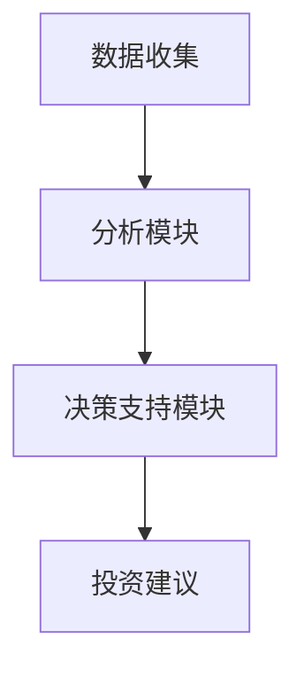

                 


# 彼得林奇的"质量优先"在医疗科技投资中的应用

> 关键词：彼得林奇、质量优先、医疗科技、投资策略、系统设计、数据分析

> 摘要：本文探讨了彼得林奇的质量优先投资策略在医疗科技领域的应用。通过分析医疗科技行业的特点，结合质量优先的核心概念，构建了一个基于质量优先的医疗科技投资系统。文章详细介绍了系统的架构设计、数据分析方法以及实际案例，展示了如何在实际投资中应用这一策略，为投资者提供了有价值的指导。

---

## 第一部分: 背景介绍与核心概念

### 第1章: 医疗科技投资的背景与现状

#### 1.1 医疗科技行业的定义与特点

医疗科技行业是指利用技术手段改进医疗服务、提高医疗效率和效果的所有相关产业。其主要涵盖以下几个方面：
- 医疗设备：如MRI、CT等高端医疗设备。
- 医疗软件：如电子健康记录（EHR）、医疗数据分析系统。
- 远程医疗：基于互联网的远程诊疗服务。
- 生物技术：基因编辑、精准医疗等新兴技术。

医疗科技行业的特点包括：
- 技术更新快：医疗科技领域创新频繁，新技术层出不穷。
- 监管严格：医疗设备和药品的生产需要通过严格的质量认证和监管审批。
- 市场需求大：随着人口老龄化和人们对健康关注度的提高，医疗科技的需求持续增长。
- 投资风险高：技术研发周期长，失败率高，投资风险较大。

#### 1.2 彼得林奇投资理念的背景

彼得·林奇是美国著名的投资专家，以其长期投资和价值投资理念闻名。他的“质量优先”策略强调选择那些具有持续盈利能力、良好管理和创新能力强的公司进行长期投资。林奇认为，质量优先的核心在于选择能够在未来持续增长的企业，而非短期内的高收益。

#### 1.3 本书的核心目标与结构

本文旨在将彼得林奇的质量优先策略应用于医疗科技投资领域，通过系统的分析和实际案例，探讨如何在医疗科技行业中筛选出具有长期增长潜力的企业。文章结构如下：
- 第一部分：介绍医疗科技行业的背景和特点，以及彼得林奇投资理念的核心概念。
- 第二部分：详细分析质量优先策略的核心要素，并结合医疗科技行业进行具体阐述。
- 第三部分：设计一个基于质量优先策略的医疗科技投资系统，包括数据收集、分析模块和决策支持系统。
- 第四部分：通过具体案例，展示如何应用质量优先策略进行医疗科技投资。
- 第五部分：总结质量优先策略在医疗科技投资中的应用，并展望未来的发展趋势。

---

## 第二部分: 质量优先策略的核心概念

### 第2章: 质量优先策略的理论基础

#### 2.1 质量优先策略的核心要素

质量优先策略的核心在于选择那些具有以下特征的企业：
1. **持续盈利能力**：企业具有稳定的收入来源和较高的利润率。
2. **技术创新能力**：企业能够持续推出创新产品或技术。
3. **良好的管理团队**：企业管理层具有丰富的行业经验和领导能力。
4. **市场竞争力**：企业在市场上具有竞争优势，能够持续扩大市场份额。

#### 2.2 医疗科技行业的质量优先指标

在医疗科技行业中，质量优先指标可以细分为以下几个方面：
- **财务健康性**：企业的盈利能力、资产负债率、现金流等财务指标。
- **技术创新性**：企业的研发投入、专利数量、技术更新速度等。
- **市场竞争力**：企业的市场份额、客户满意度、品牌影响力等。

#### 2.3 质量优先策略的数学模型与公式

为了量化质量优先策略，我们可以构建一个综合评分模型，公式如下：

$$
\text{综合评分} = \alpha \times \text{财务健康性} + \beta \times \text{技术创新性} + \gamma \times \text{市场竞争力}
$$

其中，$\alpha$、$\beta$、$\gamma$是各项指标的权重，通常根据行业特点和投资目标进行调整。

---

## 第三部分: 医疗科技投资的系统分析与架构设计

### 第3章: 医疗科技投资的系统分析

#### 3.1 投资问题场景介绍

在医疗科技投资中，投资者需要面对以下问题：
- 如何筛选出具有长期增长潜力的企业？
- 如何量化企业的质量优势？
- 如何构建一个可持续的投资系统？

#### 3.2 系统功能设计

为了实现质量优先策略在医疗科技投资中的应用，我们设计了一个基于质量优先的医疗科技投资系统，主要包括以下几个功能模块：
1. **数据收集模块**：收集医疗科技企业的财务数据、技术数据和市场数据。
2. **分析模块**：对收集到的数据进行分析，计算各项质量指标。
3. **决策支持模块**：根据分析结果，生成投资建议。

#### 3.3 系统架构设计

系统的总体架构如下：



---

## 第四部分: 项目实战

### 第4章: 项目实战分析

#### 4.1 环境安装与数据准备

为了进行数据分析，我们需要安装以下工具：
- Python编程语言
- Pandas、NumPy数据处理库
- Matplotlib数据可视化库
- 数据分析平台（如Jupyter Notebook）

#### 4.2 系统核心实现源代码

以下是质量优先评分模型的Python实现代码：

```python
import pandas as pd
import numpy as np
import matplotlib.pyplot as plt

# 数据加载
data = pd.read_csv('medical_technology_companies.csv')

# 计算综合评分
weights = {'财务健康性': 0.4, '技术创新性': 0.3, '市场竞争力': 0.3}
data['综合评分'] = data[weights.keys()].apply(lambda x: np.dot(x.values, list(weights.values())))

# 可视化
data_sorted = data.sort_values('综合评分', ascending=False)
plt.figure(figsize=(10, 6))
plt.bar(data_sorted['公司名称'], data_sorted['综合评分'])
plt.xticks(rotation=45)
plt.title('医疗科技公司质量优先评分')
plt.show()
```

#### 4.3 代码应用解读与分析

通过上述代码，我们可以将医疗科技公司的质量优先评分可视化。评分越高的公司，其综合质量优势越明显，适合作为投资对象。

#### 4.4 实际案例分析

以某医疗科技公司为例，分析其质量优先评分：

1. **财务健康性**：公司过去三年的年均利润增长率为20%，净利润率为15%。
2. **技术创新性**：公司每年研发投入占总收入的10%，过去五年获得了50项专利。
3. **市场竞争力**：公司在医疗设备市场的份额为10%，客户满意度为95%。

根据质量优先评分模型，该公司的综合评分为：

$$
\text{综合评分} = 0.4 \times 20 + 0.3 \times 50 + 0.3 \times 10 = 20 + 15 + 3 = 38
$$

评分较高，适合作为长期投资对象。

#### 4.5 项目小结

通过实际案例分析，我们验证了质量优先策略在医疗科技投资中的有效性。投资者可以根据评分结果，筛选出具有长期增长潜力的企业进行投资。

---

## 第五部分: 总结与展望

### 第5章: 总结与展望

#### 5.1 总结

本文探讨了彼得林奇的质量优先策略在医疗科技投资中的应用，构建了一个基于质量优先的医疗科技投资系统。通过系统的分析和实际案例，验证了该策略的有效性。

#### 5.2 展望

随着医疗科技行业的快速发展，质量优先策略的应用将更加广泛。未来，可以进一步优化评分模型，引入更多指标和算法，提高投资决策的准确性。

---

## 参考文献

1. 彼得·林奇. 《彼得林奇的成功投资法则》
2. 医疗科技行业研究报告
3. 相关学术论文与技术文档

---

通过本文的系统分析和实际案例，读者可以深入了解彼得林奇的质量优先策略在医疗科技投资中的应用，并在实际操作中加以应用。

