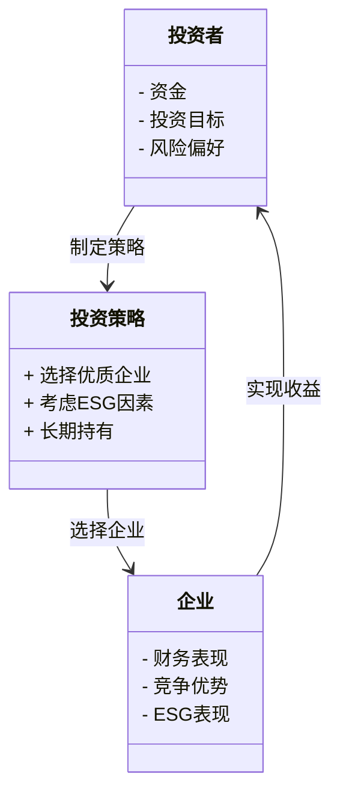

                 


# 彼得林奇的"质量优先"在可持续发展投资中的应用

---

## 关键词

- 彼得林奇
- 质量优先
- 可持续发展投资
- ESG
- 投资策略
- 可持续性

---

## 摘要

本文探讨了彼得林奇的“质量优先”投资策略在可持续发展投资中的应用。首先，文章介绍了“质量优先”策略的核心理念及其在传统投资中的表现。然后，分析了可持续发展投资的基本概念及其与“质量优先”策略的结合点。通过对比分析，文章揭示了两者结合的优势与挑战，并提出了在可持续发展框架下优化投资策略的方法。最后，文章通过实际案例和系统设计，展示了如何将“质量优先”策略应用于可持续发展投资中，以实现长期的经济和社会效益。

---

## 正文

### 第一部分：背景介绍

#### 第1章：彼得林奇的“质量优先”投资策略概述

##### 1.1 什么是“质量优先”？

“质量优先”是彼得林奇在其投资生涯中提出的的核心策略，强调选择那些具有强大基本面、良好管理和竞争优势的公司进行长期投资。这种策略的核心在于，通过深入研究和分析，挑选出能够在长期内持续增长并为股东创造价值的企业。

- **质量优先的定义**：选择公司质量高于行业平均水平，具有稳定的盈利能力和良好管理团队的企业。
- **投资哲学**：长期持有优质资产，通过时间复利效应实现财富增长。
- **与传统投资策略的对比**：不同于短期交易或趋势投资，“质量优先”注重企业内在质量和长期增长潜力。

##### 1.2 可持续发展投资的基本概念

可持续发展投资（Sustainable Investment，简称SI）是一种关注环境、社会和治理（ESG）因素的投资策略。它不仅关注企业的财务表现，还关注企业在可持续发展方面的表现，旨在通过投资促进社会和环境的积极变化。

- **可持续发展投资的定义**：一种将环境、社会和治理因素纳入投资决策的投资方式，旨在实现长期经济收益与社会价值的双重目标。
- **核心要素**：环境（Environmental）、社会（Social）、治理（Governance）。
- **与传统投资的区别**：传统投资主要关注财务回报，而可持续发展投资强调综合考虑经济、社会和环境效益。

#### 第2章：“质量优先”与可持续发展投资的结合

##### 2.1 结合的背景

当前，全球范围内对可持续发展的关注日益增加，投资者越来越重视企业在可持续发展方面的表现。与此同时，彼得林奇的“质量优先”策略强调选择优质企业，这与可持续发展投资的目标不谋而合。两者的结合不仅能够实现长期的财务回报，还能推动社会和环境的积极变化。

- **当前投资环境的变化**：全球市场波动加剧，传统投资策略面临挑战。
- **可持续发展的全球趋势**：各国政府和企业纷纷制定可持续发展目标，推动绿色经济。
- **投资者对社会责任的关注**：越来越多的投资者希望其投资行为能够对社会和环境产生积极影响。

##### 2.2 结合的优势与挑战

- **优势**：
  - **长期收益**：选择具有高质量和可持续发展表现的企业，能够在长期内实现稳定的收益。
  - **风险分散**：通过关注ESG因素，降低企业面临的环境和社会风险。
  - **社会责任感**：投资于具有社会责任感的企业，推动社会和环境的积极变化。

- **挑战**：
  - **数据获取难度**：可持续发展数据的收集和评估需要较高的成本和时间投入。
  - **信息不对称**：企业可能存在ESG信息披露不完整或不透明的问题。
  - **平衡质量与可持续性**：如何在选择优质企业的同时，确保其在可持续发展方面的表现，是一个需要权衡的问题。

---

### 第二部分：核心概念与联系

#### 第3章：“质量优先”策略的原理与属性

##### 3.1 核心原理

“质量优先”策略的核心在于选择那些具有强大基本面和竞争优势的企业。具体来说，包括以下几个方面：

- **核心要素**：
  - 财务健康：企业具有稳定的盈利能力、良好的财务状况和健康的现金流。
  - 竞争优势：企业在市场上具有独特的竞争优势，能够持续获取市场份额。
  - 管理团队：管理团队具有丰富的经验和良好的声誉，能够带领企业实现长期增长。

- **评估标准**：
  - 盈利能力：如ROE（净资产收益率）、净利润增长率等。
  - 财务稳定性：如债务负担、现金流状况等。
  - 市场地位：如市场份额、品牌影响力等。

##### 3.2 可持续发展投资的属性

可持续发展投资关注企业在环境、社会和治理方面的表现，具体包括：

- **环境因素**：企业对环境保护的重视程度，如碳排放、资源利用效率等。
- **社会因素**：企业对社会责任的承担，如员工权益、社区贡献等。
- **治理因素**：企业治理结构的透明度和效率，如董事会结构、内部控制等。

---

#### 第4章：核心概念的对比与联系

##### 4.1 对比分析

| **维度**       | **“质量优先”策略**                        | **可持续发展投资**                   |
|----------------|------------------------------------------|--------------------------------------|
| 核心目标       | 选择优质企业，实现长期收益               | 综合考虑经济、社会和环境效益         |
| 投资策略       | 侧重企业质量和长期增长潜力               | 侧重企业ESG表现和社会责任           |
| 风险与收益     | 风险较低，收益稳定                       | 风险较高，收益可能波动较大           |

##### 4.2 联系

- **如何促进可持续发展**：通过选择具有强大质量和可持续发展表现的企业，投资者能够推动企业采取更加环保和社会责任的经营方式。
- **如何提升投资质量**：可持续发展投资不仅关注企业的经济表现，还关注其社会责任和环境表现，从而提升投资的综合质量。

---

### 第三部分：系统分析与架构设计

#### 第5章：系统功能设计

##### 5.1 领域模型



##### 5.2 系统架构设计


---

### 第四部分：项目实战

#### 第6章：环境安装与源代码实现

##### 6.1 环境安装

- **工具**：Python 3.8+, Jupyter Notebook, Mermaid CLI
- **库**：pandas, numpy, matplotlib, seaborn

##### 6.2 核心代码实现

```python
import pandas as pd
import numpy as np

def calculate_esg_score(company_data):
    # 示例：计算企业的ESG得分
    esg_weights = {'Environmental': 0.4, 'Social': 0.3, 'Governance': 0.3}
    esg_score = np.dot(company_data[['Environmental', 'Social', 'Governance']].values, 
                        list(esg_weights.values()))
    return esg_score

# 示例数据
data = {
    'Company': ['Company A', 'Company B', 'Company C'],
    'Environmental': [85, 70, 90],
    'Social': [80, 60, 95],
    'Governance': [75, 80, 85]
}

df = pd.DataFrame(data)
df['ESG Score'] = df.apply(lambda x: calculate_esg_score(x), axis=1)
print(df)
```

##### 6.3 代码解读与分析

- **代码功能**：上述代码定义了一个计算企业ESG得分的函数，并使用示例数据进行计算。
- **关键点**：
  - `calculate_esg_score`函数：根据环境、社会和治理因素的权重计算企业的ESG得分。
  - `df` DataFrame：包含企业的基本信息和计算后的ESG得分。

---

### 第五部分：最佳实践与小结

#### 第7章：最佳实践

- **持续学习与优化**：投资者需要不断学习新的投资策略和可持续发展知识，以适应市场变化。
- **数据驱动决策**：利用数据分析工具和平台，获取准确的ESG数据，辅助投资决策。
- **长期视角**：可持续发展投资需要长期视角，耐心持有优质资产，避免短期波动影响投资决策。

#### 7.2 小结

本文通过分析彼得林奇的“质量优先”策略与可持续发展投资的结合，探讨了如何在当前的投资环境中实现长期的经济和社会效益。通过系统设计和实际案例分析，展示了如何将“质量优先”策略应用于可持续发展投资中，以实现双赢的目标。

---

### 第六部分：注意事项与拓展阅读

#### 8.1 注意事项

- **数据质量**：确保使用的ESG数据准确可靠，避免因数据问题导致的投资失误。
- **风险管理**：在选择企业时，需综合考虑企业的财务和非财务风险，制定合理的风险管理策略。
- **长期视角**：可持续发展投资需要长期视角，投资者需耐心持有优质资产，避免短期波动影响投资决策。

#### 8.2 拓展阅读

- **书籍推荐**：
  - 《彼得·林奇的成功投资》
  - 《可持续投资：理论与实践》
- **网站推荐**：
  - MSCI ESG Ratings
  - 彭博可持续金融平台
  - 瑞士百达财富管理可持续投资报告

---

### 第七部分：总结

通过本文的分析，我们可以看到，彼得林奇的“质量优先”策略与可持续发展投资的结合，不仅能够实现长期的经济收益，还能推动社会和环境的积极变化。对于投资者来说，这种结合提供了新的投资思路和机会，同时也需要我们不断学习和优化，以应对复杂多变的投资环境。未来，随着可持续发展理念的进一步普及，这种结合将变得更加重要和必要。

---

**声明：本文内容仅用于学术研究和知识分享，不构成投资建议。投资需谨慎，建议根据自身情况和专业意见进行决策。**

