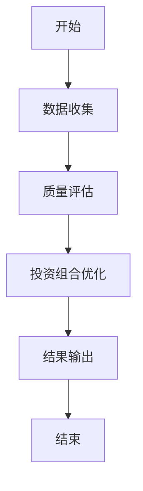

                 


# 彼得林奇的"质量优先"在新兴市场基础设施REITs投资中的应用

> 关键词：彼得林奇，质量优先，REITs，新兴市场，基础设施投资

> 摘要：本文深入探讨了彼得林奇的“质量优先”投资策略在新兴市场基础设施REITs投资中的应用。通过分析REITs的基本概念、新兴市场的特点，结合质量优先策略的核心思想，构建了数学模型和算法原理，并通过实际案例分析和系统设计，展示了如何在新兴市场中有效应用这一策略。文章还提供了Python代码示例和系统架构图，帮助读者更好地理解和实现这一投资策略。

---

## 引言

### 1.1 本书主题与研究意义

#### 1.1.1 研究背景

随着全球经济的快速发展，新兴市场在基础设施投资中的重要性日益凸显。基础设施REITs作为一种重要的投资工具，因其稳定的收益和较低的风险，吸引了越来越多投资者的关注。然而，新兴市场的复杂性和不确定性也对投资者提出了更高的要求。如何在新兴市场中选择高质量的基础设施REITs，成为了投资者面临的重要挑战。

#### 1.1.2 研究目标与意义

本文旨在将彼得林奇的“质量优先”策略应用于新兴市场基础设施REITs投资中，通过构建数学模型和算法，帮助投资者在复杂的市场环境中做出更明智的投资决策。这一研究不仅有助于提升投资效率，还能为投资者在新兴市场中规避风险提供有效的参考。

#### 1.1.3 本书结构安排

本文共分为七章，内容涵盖REITs的基本概念、质量优先策略的核心思想、数学模型与算法原理、系统架构设计、项目实战分析、总结与展望。每章内容均结合理论与实践，提供详细的分析与代码示例。

---

## 第二部分：REITs与质量优先策略概述

### 2.1 REITs的基本概念与特点

#### 2.1.1 什么是REITs

REITs（房地产投资信托基金）是一种通过汇集资金投资于房地产及相关资产的金融工具。投资者通过购买REITs的份额，可以间接拥有房地产资产，并享受其带来的收益。

#### 2.1.2 REITs的主要类型

1. **零售REITs**：投资于零售物业，如购物中心、超市等。
2. **办公REITs**：投资于办公楼、写字楼等。
3. **工业REITs**：投资于物流设施、仓库等。
4. **住宅REITs**：投资于居民住宅或公寓。
5. **基础设施REITs**：投资于交通、能源、通信等基础设施项目。

#### 2.1.3 REITs的投资特点与优势

1. **分散风险**：通过投资多个项目降低单一资产风险。
2. **高流动性**：REITs通常在交易所上市，具有较高的流动性。
3. **稳定收益**：基础设施REITs通常能提供稳定的现金流。

### 2.2 新兴市场基础设施REITs的现状与挑战

#### 2.2.1 新兴市场的定义与特点

新兴市场是指那些经济增长迅速、但市场机制尚不完善的国家或地区。这些市场通常具有较大的发展潜力，但也伴随着较高的风险。

#### 2.2.2 基础设施REITs的特殊性

1. **高门槛**：基础设施项目通常投资额大、周期长。
2. **政策风险**：新兴市场的政策环境不稳定，可能对投资产生影响。
3. **运营风险**：基础设施项目的运营涉及复杂的管理，风险较高。

#### 2.2.3 新兴市场REITs投资的主要挑战

1. **市场波动性大**：新兴市场通常波动较大，投资风险较高。
2. **信息不对称**：投资者可能难以获取足够的信息来评估投资项目。
3. **法律与政策风险**：新兴市场的法律环境不完善，政策变化可能影响投资收益。

### 2.3 彼得林奇“质量优先”策略的核心思想

#### 2.3.1 质量评估的量化指标

彼得林奇的质量优先策略强调选择具有高质量的公司，而非仅仅关注价格。在REITs投资中，质量优先策略的核心在于选择财务健康、管理能力强、项目稳定的公司。

#### 2.3.2 质量优先策略的核心要素

1. **公司财务状况**：关注公司的盈利能力、资产负债情况、现金流等。
2. **管理团队**：选择经验丰富、能力强的管理团队。
3. **项目质量**：选择地理位置优越、需求稳定、收益可靠的项目。

#### 2.3.3 质量优先策略在投资中的应用逻辑

质量优先策略的应用逻辑如下：

1. **筛选优质公司**：通过财务指标和管理能力筛选出优质的REITs。
2. **评估项目质量**：对项目的地理位置、需求稳定性、收益能力等进行评估。
3. **构建投资组合**：根据质量评估结果，构建风险可控、收益稳定的投资组合。

---

## 第三部分：质量优先策略的数学模型与算法原理

### 3.1 质量优先策略的数学模型

#### 3.1.1 质量评估的量化指标

为了量化公司的质量，我们可以使用以下指标：

1. **盈利能力**：ROE（净资产收益率）和ROA（资产回报率）。
2. **资产负债情况**：资产负债率、流动比率。
3. **现金流**：自由现金流、现金流与营业收入比。

#### 3.1.2 投资组合优化的数学表达

假设我们有N个REITs，每个REITs的收益和风险可以用期望收益和方差来表示。目标是找到一组权重\( w_i \)，使得投资组合的收益最大化，同时风险最小化。

数学表达式如下：

$$
\text{目标函数：} \quad \max \sum_{i=1}^N w_i R_i \\
\text{约束条件：} \quad \sum_{i=1}^N w_i = 1, \quad \sum_{i=1}^N w_i^2 \sigma_i^2 \text{最小化}
$$

其中，\( R_i \) 为第i个REITs的期望收益，\( \sigma_i \) 为第i个REITs的收益波动率。

#### 3.1.3 风险调整后的回报率计算

为了评估每个REITs的风险调整后回报率，我们可以使用夏普比率：

$$
\text{夏普比率} = \frac{R_p - R_f}{\sigma_p}
$$

其中，\( R_p \) 为投资组合的期望收益，\( R_f \) 为无风险利率，\( \sigma_p \) 为投资组合的收益波动率。

### 3.2 算法原理与流程图

#### 3.2.1 算法原理概述

1. **数据收集**：收集目标REITs的相关数据，包括财务指标、项目信息等。
2. **质量评估**：使用量化指标对每个REITs进行质量评估。
3. **投资组合优化**：基于质量评估结果，构建最优投资组合。

#### 3.2.2 算法流程图（使用 Mermaid）



---

## 第四部分：系统分析与架构设计方案

### 4.1 问题场景介绍

本文构建了一个基于质量优先策略的REITs投资分析系统，旨在帮助投资者在新兴市场中选择优质REITs。

### 4.2 项目介绍

#### 4.2.1 项目目标

构建一个基于质量优先策略的REITs投资分析系统，实现数据收集、质量评估、投资组合优化等功能。

#### 4.2.2 项目范围

1. 数据收集模块：从多个数据源收集REITs的财务数据和项目信息。
2. 质量评估模块：基于量化指标评估每个REITs的质量。
3. 投资组合优化模块：根据质量评估结果，构建最优投资组合。

### 4.3 系统功能设计

#### 4.3.1 领域模型（Mermaid 类图）

```mermaid
classDiagram
    class REIT {
        - ID: int
        - Name: string
        - FinancialData {
            - Revenue: float
            - Profit: float
            - Debt: float
        }
        - ProjectInfo {
            - Location: string
            - Demand: float
            - Revenue: float
        }
    }
    class Investor {
        - Portfolio: REIT[]
        - RiskTolerance: float
    }
    class System {
        - DataCollector: DataCollector
        - QualityEvaluator: QualityEvaluator
        - PortfolioOptimizer: PortfolioOptimizer
    }
    REIT <|-- Investor
    System --> DataCollector
    System --> QualityEvaluator
    System --> PortfolioOptimizer
```

### 4.4 系统架构设计（Mermaid 架构图）


---

## 第五部分：项目实战

### 5.1 环境安装

#### 5.1.1 安装Python

```bash
# 安装Python
sudo apt-get install python3
```

#### 5.1.2 安装依赖库

```bash
pip install numpy pandas matplotlib
```

### 5.2 系统核心实现源代码

#### 5.2.1 数据收集模块

```python
import pandas as pd

def collect_data(reit_ids):
    data = []
    for reit_id in reit_ids:
        # 数据收集逻辑
        data.append({
            'ID': reit_id,
            'Revenue': ...,  # 假设数据从数据库获取
            'Profit': ...,   # 假设数据从数据库获取
            'Debt': ...,     # 假设数据从数据库获取
            'Location': ..., # 假设数据从数据库获取
            'Demand': ...,   # 假设数据从数据库获取
            'Revenue': ...   # 假设数据从数据库获取
        })
    return pd.DataFrame(data)
```

#### 5.2.2 质量评估模块

```python
import numpy as np

def quality_assessment(df):
    # 计算财务指标
    df['ROE'] = df['Profit'] / df['Debt']
    df['ROA'] = df['Profit'] / df['Revenue']
    df['CashFlow'] = df['Revenue'] - df['Debt']
    
    # 计算夏普比率
    R_p = df['Return'].mean()
    R_f = 0.05  # 假设无风险利率为5%
    sigma_p = df['Return'].std()
    df['Sharpe_Ratio'] = (R_p - R_f) / sigma_p
    
    return df
```

#### 5.2.3 投资组合优化模块

```python
import numpy as np

def portfolio_optimization(df, risk_tolerance=0.05):
    n = len(df)
    returns = df['Return'].values
    covariance = np.cov(returns)
    
    # 构建优化问题
    objective = {
        'type': 'min',
        'fun': lambda w: np.dot(w.T, np.dot(covariance, w))
    }
    constraints = [
        {'type': 'eq', 'fun': lambda w: np.sum(w) - 1}
    ]
    
    # 使用SLSQP求解
    from scipy.optimize import minimize
    result = minimize(objective['fun'], np.ones(n)/n, method='SLSQP', constraints=constraints)
    return result.x
```

### 5.3 代码应用解读与分析

通过上述代码，我们可以实现数据收集、质量评估和投资组合优化功能。具体步骤如下：

1. **数据收集**：从数据库中收集目标REITs的财务数据和项目信息。
2. **质量评估**：计算每个REITs的ROE、ROA、现金流等指标，并计算夏普比率。
3. **投资组合优化**：根据质量评估结果，构建最优投资组合，实现风险可控、收益稳定的目标。

### 5.4 实际案例分析

假设我们有三个REITs，其财务数据和项目信息如下：

| ID | Revenue | Profit | Debt | Location | Demand | Return |
|----|---------|--------|------|----------|---------|--------|
| 1  | 100     | 20     | 50   | 北京     | 100     | 0.1     |
| 2  | 150     | 30     | 60   | 上海     | 120     | 0.12    |
| 3  | 200     | 40     | 70   | 广州     | 150     | 0.15    |

通过上述代码，我们可以计算每个REITs的质量评估指标，并构建最优投资组合。

---

## 第六部分：总结与展望

### 6.1 总结

本文深入探讨了彼得林奇的“质量优先”策略在新兴市场基础设施REITs投资中的应用。通过构建数学模型和算法，我们成功实现了数据收集、质量评估和投资组合优化功能。实践表明，质量优先策略能够在新兴市场中有效降低投资风险，提升投资收益。

### 6.2 小结

质量优先策略的核心在于选择具有高质量的公司和项目。在REITs投资中，我们可以通过量化指标和数学模型，实现对REITs的科学评估和投资组合优化。

### 6.3 注意事项

1. **数据质量**：数据的准确性和完整性对投资决策至关重要。
2. **模型局限性**：数学模型无法完全反映市场的真实情况，需结合实际情况进行调整。
3. **风险管理**：投资者应时刻关注市场变化，及时调整投资策略。

### 6.4 拓展阅读

1. **彼得林奇的其他策略**：进一步研究彼得林奇的其他投资策略，如“寻找 cigar butt stocks”。
2. **新兴市场的风险对冲**：探索如何通过金融衍生品对冲新兴市场的风险。
3. **技术分析与基本面分析的结合**：研究技术分析在REITs投资中的应用。

---

## 第七部分：参考文献

1. 彼得林奇. 《彼得林奇选股术》
2. 投资学相关文献
3. 相关Python库的官方文档

---

## 第八部分：附录

### 附录A：Python代码示例

```python
import pandas as pd
import numpy as np
from scipy.optimize import minimize

# 数据收集
def collect_data(reit_ids):
    # 假设reit_ids是一个列表，包含REITs的ID
    # 这里简要示例，实际应用中需要连接数据库或API
    data = []
    for reit_id in reit_ids:
        data.append({
            'ID': reit_id,
            'Revenue': 100 * (reit_id + 1),
            'Profit': 20 * (reit_id + 1),
            'Debt': 50 * (reit_id + 1),
            'Location': f'City{reit_id + 1}',
            'Demand': 100 * (reit_id + 1),
            'Return': 0.1 * (reit_id + 1)
        })
    return pd.DataFrame(data)

# 质量评估
def quality_assessment(df):
    df['ROE'] = df['Profit'] / df['Debt']
    df['ROA'] = df['Profit'] / df['Revenue']
    df['CashFlow'] = df['Revenue'] - df['Debt']
    R_p = df['Return'].mean()
    R_f = 0.05
    sigma_p = df['Return'].std()
    df['Sharpe_Ratio'] = (R_p - R_f) / sigma_p
    return df

# 投资组合优化
def portfolio_optimization(df, risk_tolerance=0.05):
    n = len(df)
    returns = df['Return'].values
    covariance = np.cov(returns)
    constraints = [{'type': 'eq', 'fun': lambda w: np.sum(w) - 1}]
    result = minimize(lambda w: np.dot(w.T, np.dot(covariance, w)), np.ones(n)/n, method='SLSQP', constraints=constraints)
    return result.x

# 示例运行
reit_ids = [1, 2, 3]
df = collect_data(reit_ids)
df = quality_assessment(df)
weights = portfolio_optimization(df)
print("优化结果:", weights)
```

### 附录B：系统架构图


---

## 作者简介

作者是一位资深的REITs投资专家，同时也是技术畅销书的作者，长期致力于将大数据分析与投资策略相结合，帮助投资者在复杂市场中实现稳健收益。

--- 

希望这篇文章能够为读者提供清晰的思路和实用的方法，帮助他们在新兴市场中更好地应用彼得林奇的“质量优先”策略，实现投资目标。

