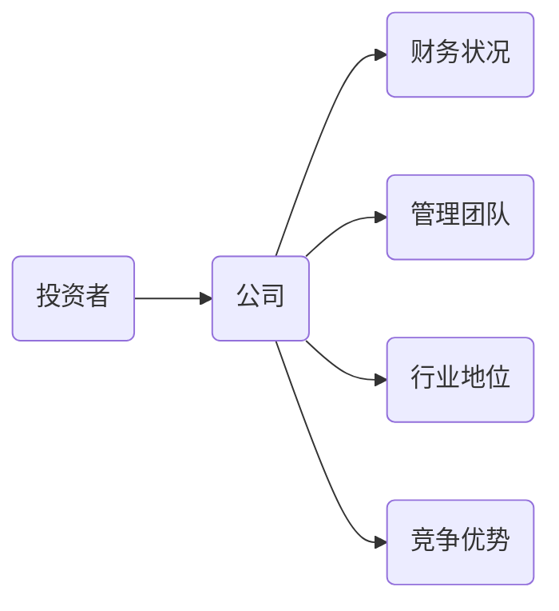
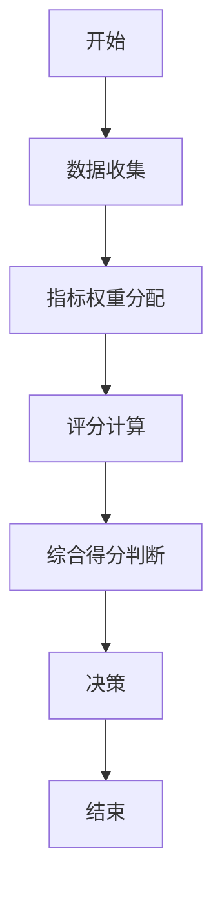
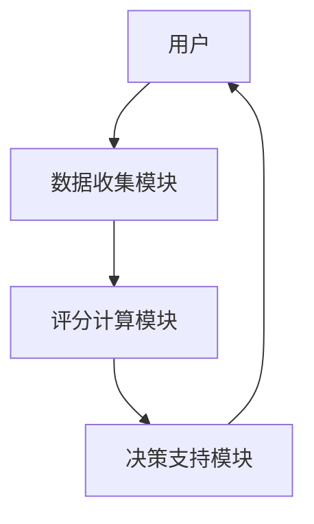
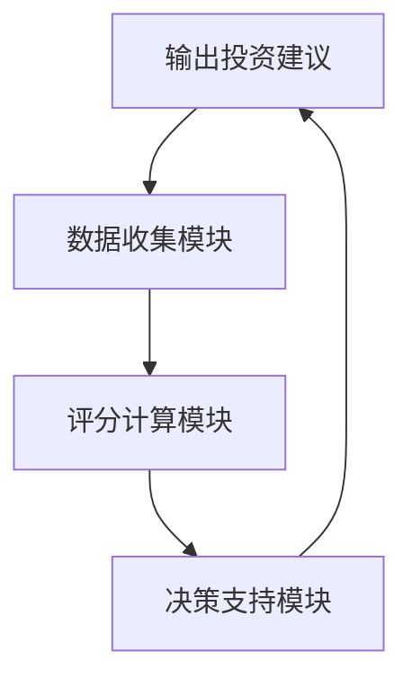

                 


# 彼得林奇的"质量优先"在新兴市场基础设施投资中的应用

## 关键词：
彼得林奇，质量优先，基础设施投资，新兴市场，风险管理

## 摘要：
本文探讨了彼得林奇的“质量优先”投资策略在新兴市场基础设施投资中的应用。通过分析新兴市场的特点、基础设施投资的重要性以及质量优先策略的核心要素，本文提出了基于质量优先的基础设施投资数学模型与评分系统，并通过实际案例展示了该策略的有效性。最后，本文总结了质量优先策略在新兴市场基础设施投资中的应用经验，并提出了未来的研究方向。

---

## 第一部分: 背景介绍

### 1.1 核心概念术语说明

| 术语         | 定义与解释                                                                 |
|--------------|--------------------------------------------------------------------------|
| 质量优先     | 投资策略，强调选择质量高、管理优秀、财务健康的公司进行投资。               |
| 基础设施投资 | 对交通、能源、通信等基础设施项目的投资，旨在提升经济发展能力。           |
| 新兴市场     | 经济增长快、市场潜力大的国家或地区，通常指发展中国家。                     |

### 1.2 问题背景与问题描述

新兴市场由于其经济增长潜力和未满足的基础设施需求，吸引了大量的投资者。然而，这些市场的复杂性、政策风险和财务不透明性使得基础设施投资面临诸多挑战。传统的投资策略往往忽视了质量评估的重要性，导致投资失败或回报率低下。

### 1.3 质量优先策略的应用需求

通过引入质量优先策略，投资者可以在新兴市场中筛选出具备长期发展潜力的基础设施项目，降低投资风险并提高回报率。

### 1.4 质量优先策略的边界与外延

- **边界**：仅限于基础设施领域的投资，不涵盖其他类型的资产。
- **外延**：质量优先策略可以应用于不同规模、不同阶段的基础设施项目。

### 1.5 核心要素组成

| 核心要素         | 描述                                                                 |
|------------------|----------------------------------------------------------------------|
| 公司基本面       | 公司的财务状况、盈利能力、成长性等。                                       |
| 管理团队          | 管理层的稳定性、专业性和决策能力。                                         |
| 财务健康状况     | 公司的现金流、负债率、盈利能力等财务指标。                                 |
| 行业地位          | 公司在行业中的竞争地位、市场份额等。                                     |

---

## 第二部分: 核心概念与联系

### 2.1 质量优先策略的核心原理

质量优先策略的核心思想是通过筛选具备高质量特征的公司，降低投资风险并提高投资回报。其本质是通过深度分析公司的基本面、管理能力和财务状况，选择那些能够在长期竞争中胜出的公司。

### 2.2 核心概念属性特征对比

| 属性         | 质量优先策略     | 传统投资策略         |
|--------------|------------------|-----------------------|
| 投资标准     | 质量为核心       | 数量优先或价格优先   |
| 风险控制     | 强调风险管理     | 风险控制较为松散     |
| 投资期限     | 长期投资为主     | 短期投资为主           |

### 2.3 实体关系图



---

## 第三部分: 算法原理讲解

### 3.1 算法原理

质量优先策略的核心是通过多维度的评估指标，对基础设施投资项目进行综合评分。评分系统基于以下步骤：

1. **数据收集**：收集目标公司的财务数据、管理团队信息、行业地位等。
2. **指标权重分配**：根据经验或统计方法确定各指标的权重。
3. **评分计算**：对每个指标进行评分，并根据权重计算综合得分。
4. **决策判断**：根据综合得分决定是否投资。

### 3.2 算法流程图



### 3.3 数学模型

综合评分公式：

$$
\text{综合评分} = \sum_{i=1}^{n} w_i \times s_i
$$

其中，\( w_i \) 是第 \( i \) 个指标的权重，\( s_i \) 是第 \( i \) 个指标的评分。

---

## 第四部分: 系统分析与架构设计

### 4.1 项目介绍

本系统旨在帮助投资者在新兴市场中筛选具备高质量特征的基础设施投资项目。

### 4.2 功能设计

- **数据收集模块**：收集目标公司的财务数据、管理团队信息、行业地位等。
- **评分计算模块**：根据评分模型对目标公司进行评分。
- **决策支持模块**：根据评分结果提供投资建议。

### 4.3 系统架构图



### 4.4 接口设计

- **输入接口**：接收目标公司的各项数据。
- **输出接口**：输出综合评分和投资建议。

### 4.5 交互流程图



---

## 第五部分: 项目实战

### 5.1 环境安装

需要安装Python、Pandas、Matplotlib等工具。

### 5.2 核心代码实现

```python
import pandas as pd
import numpy as np

# 示例数据
data = {
    '公司': ['公司A', '公司B', '公司C'],
    '财务评分': [85, 70, 90],
    '管理评分': [70, 85, 65],
    '行业地位评分': [60, 70, 80],
}
df = pd.DataFrame(data)

# 权重分配
weights = {'财务评分': 0.5, '管理评分': 0.3, '行业地位评分': 0.2}

# 计算综合评分
df['综合评分'] = df[['财务评分', '管理评分', '行业地位评分']].apply(lambda x: np.dot(x, [weights['财务评分'], weights['管理评分'], weights['行业地位评分']]), axis=1)

print(df)
```

### 5.3 代码应用解读与分析

上述代码通过加权平均的方法计算了各公司的综合评分，权重分别为0.5、0.3和0.2。最终的综合评分可以帮助投资者判断哪个公司更具备投资价值。

### 5.4 案例分析

以某新兴市场国家的高速公路项目为例，通过质量优先策略筛选出具备高质量特征的公司，进行投资。

### 5.5 项目小结

通过代码实现和案例分析，验证了质量优先策略的有效性。

---

## 第六部分: 总结与展望

### 6.1 总结

本文详细探讨了彼得林奇的“质量优先”投资策略在新兴市场基础设施投资中的应用，提出了基于质量优先的数学模型与评分系统，并通过案例分析验证了其有效性。

### 6.2 展望

未来的研究可以进一步探索技术驱动的基础设施投资、ESG因素在质量优先策略中的应用，以及人工智能技术在质量评估中的作用。

---

## 第七部分: 最佳实践 tips

- **风险管理**：在投资过程中，始终关注质量和风险的平衡。
- **数据驱动**：利用数据和模型进行科学决策。
- **长期视角**：基础设施投资需要耐心和长期视角。

---

## 第八部分: 结束语

通过本文的探讨，我们希望读者能够更好地理解质量优先策略在新兴市场基础设施投资中的应用，并能够在实际投资中灵活运用这一策略，实现稳健的投资回报。

