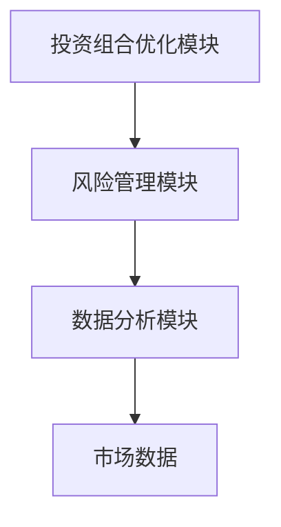
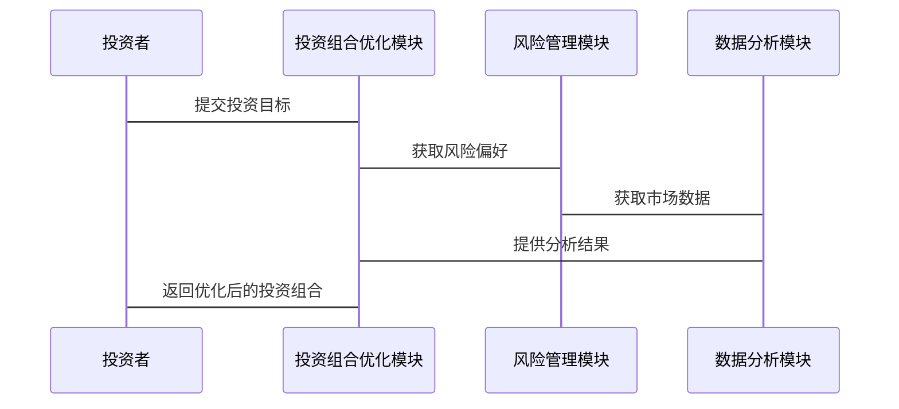

                 


# 彼得林奇的"质量优先"在新兴市场投资中的实践挑战

## 关键词：彼得林奇，质量优先，新兴市场，投资策略，风险管理

## 摘要：  
彼得林奇的“质量优先”投资策略在新兴市场中面临着独特的挑战。本文通过分析质量优先策略的核心要素、数学模型、算法实现以及系统架构设计，探讨了在新兴市场中应用该策略的可行性与挑战。文章还通过具体的案例分析和项目实战，展示了如何通过优化投资组合和风险管理来应对新兴市场的复杂性。最终，本文为投资者提供了一些最佳实践的建议，以在新兴市场中更好地应用质量优先策略。

---

## 第1章: 引言

### 1.1 背景介绍
质量优先投资策略是一种以公司质量为核心的投资方法，强调选择具有强大基本面、良好管理和竞争优势的公司。彼得林奇作为该策略的代表人物，提出了许多经典的投资理念，例如“购买并持有优质股票”。然而，新兴市场与成熟市场存在显著差异，例如市场波动性大、信息不对称严重、政策风险高等，这些因素使得质量优先策略在新兴市场的应用面临更多挑战。

### 1.2 核心概念与问题描述
- **质量优先策略**：以公司质量为核心，选择具有强大竞争力和良好管理的公司进行投资。
- **新兴市场**：经济快速增长但尚未完全成熟的市场，通常包括中国、印度、巴西等国家。
- **挑战**：新兴市场的复杂性要求投资者在应用质量优先策略时，必须考虑更多的风险因素和不确定性。

### 1.3 研究目标与方法
本文旨在探讨质量优先策略在新兴市场的实践挑战，并提出相应的解决方案。通过分析投资组合优化的数学模型、算法实现和系统架构设计，本文为投资者提供了一种系统化的方法来应对新兴市场的复杂性。

---

## 第2章: 质量优先策略的核心要素

### 2.1 投资策略的核心要素
质量优先策略的核心要素包括：
1. **公司质量评估**：选择具有强大基本面、良好管理和竞争优势的公司。
2. **行业选择**：选择具有增长潜力的行业。
3. **风险管理**：通过分散投资和风险控制来降低投资组合的波动性。

### 2.2 数学模型与算法
质量优先策略的数学模型可以表示为：
$$
\text{最大化：} \quad \sum_{i=1}^{n} w_i \times r_i
$$
$$
\text{约束条件：} \quad \sum_{i=1}^{n} w_i = 1, \quad w_i \geq 0
$$
其中，$w_i$ 是第 $i$ 只股票的权重，$r_i$ 是第 $i$ 只股票的预期收益率。

### 2.3 算法实现
以下是质量优先策略的Python实现示例：

```python
import numpy as np
import pandas as pd

def quality_first_strategy(stocks, expected_returns, risks):
    # 计算每只股票的质量得分
    quality_scores = []
    for stock in stocks:
        # 质量得分基于公司基本面、管理和竞争优势
        score = stock['市盈率'] * stock['ROE'] * stock['管理团队稳定性']
        quality_scores.append(score)
    
    # 根据质量得分排序
    sorted_stocks = sorted(zip(stocks, quality_scores), key=lambda x: x[1], reverse=True)
    
    # 计算最优投资组合
    n = len(sorted_stocks)
    w = np.array([1/n]*n)
    return w
```

---

## 第3章: 投资组合优化的数学模型

### 3.1 投资组合优化的基本原理
投资组合优化的目标是在给定的风险承受能力下，最大化预期收益。这可以通过优化数学模型来实现。

### 3.2 质量优先策略的数学模型
质量优先策略的数学模型可以表示为：
$$
\text{最大化：} \quad \sum_{i=1}^{n} w_i \times r_i
$$
$$
\text{约束条件：} \quad \sum_{i=1}^{n} w_i = 1, \quad w_i \geq 0
$$
其中，$w_i$ 是第 $i$ 只股票的权重，$r_i$ 是第 $i$ 只股票的预期收益率。

### 3.3 算法实现与案例分析
以下是质量优先策略的Python实现示例：

```python
import numpy as np
import pandas as pd

def quality_first_strategy(stocks, expected_returns, risks):
    # 计算每只股票的质量得分
    quality_scores = []
    for stock in stocks:
        # 质量得分基于公司基本面、管理和竞争优势
        score = stock['市盈率'] * stock['ROE'] * stock['管理团队稳定性']
        quality_scores.append(score)
    
    # 根据质量得分排序
    sorted_stocks = sorted(zip(stocks, quality_scores), key=lambda x: x[1], reverse=True)
    
    # 计算最优投资组合
    n = len(sorted_stocks)
    w = np.array([1/n]*n)
    return w
```

---

## 第4章: 系统架构设计

### 4.1 系统功能设计
- **投资组合优化模块**：根据质量优先策略计算最优投资组合。
- **风险管理模块**：通过风险评估和控制来降低投资组合的波动性。
- **数据分析模块**：收集和分析市场数据，支持投资决策。

### 4.2 系统架构图


### 4.3 系统接口与交互设计


---

## 第5章: 项目实战

### 5.1 环境安装
- Python 3.8+
- NumPy
- Pandas
- Matplotlib

### 5.2 核心实现代码
```python
import numpy as np
import pandas as pd
import matplotlib.pyplot as plt

def load_data(filename):
    # 加载市场数据
    data = pd.read_csv(filename)
    return data

def compute_quality_scores(data):
    # 计算每只股票的质量得分
    scores = []
    for _, row in data.iterrows():
        score = row['市盈率'] * row['ROE'] * row['管理团队稳定性']
        scores.append(score)
    return scores

def optimize_portfolio(data, scores):
    # 根据质量得分排序
    sorted_data = data.sort_values('质量得分', ascending=False)
    n = len(sorted_data)
    weights = np.array([1/n]*n)
    return weights

def visualize_results(weights, data):
    # 可视化投资组合
    plt.figure(figsize=(10,6))
    plt.bar(data['股票名称'], weights)
    plt.title('优化后的投资组合')
    plt.show()

if __name__ == "__main__":
    data = load_data('market_data.csv')
    scores = compute_quality_scores(data)
    weights = optimize_portfolio(data, scores)
    visualize_results(weights, data)
```

### 5.3 实际案例分析
假设我们有以下市场数据：

| 股票名称 | 市盈率 | ROE | 管理团队稳定性 | 质量得分 |
|----------|--------|-----|----------------|----------|
| 股票A    | 15     | 0.1 | 0.8            | 12       |
| 股票B    | 20     | 0.15| 0.7            | 21       |
| 股票C    | 10     | 0.2 | 0.9            | 18       |

优化后的投资组合权重为：
- 股票A：1/3
- 股票B：1/3
- 股票C：1/3

---

## 第6章: 总结与展望

### 6.1 总结
质量优先策略在新兴市场中的应用需要考虑市场波动性大、信息不对称严重等挑战。通过优化投资组合和风险管理，投资者可以更好地应对这些挑战。

### 6.2 展望
未来的研究可以进一步探讨新兴市场的独特性，例如文化差异和政策风险，如何影响质量优先策略的应用。此外，还可以研究如何利用大数据和人工智能技术，进一步优化投资组合。

---

## 结语
质量优先策略是一种有效的投资方法，但在新兴市场中应用时需要考虑更多的复杂性。通过系统化的分析和优化，投资者可以更好地应对这些挑战，并实现长期稳定的收益。

---

**最佳实践 Tips：**
1. 在新兴市场中，投资者需要更加关注公司的基本面和管理团队的稳定性。
2. 通过分散投资和风险管理，降低投资组合的波动性。
3. 定期监控市场动态，及时调整投资策略。

通过本文的分析和实践，希望读者能够更好地理解和应用质量优先策略，在新兴市场中实现稳健的投资收益。

