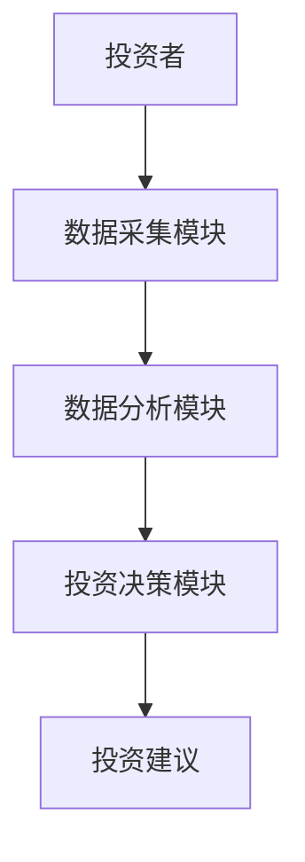

                 


# 彼得林奇的"质量优先"在新兴市场的应用挑战

> **关键词**：彼得林奇，质量优先，投资策略，新兴市场，风险管理，数据分析  
> **摘要**：本文深入分析了彼得林奇的“质量优先”投资策略在新兴市场的应用挑战，探讨了企业质量评估的核心概念、数学模型、系统架构设计以及实战案例。通过详细的技术分析和案例解读，揭示了质量优先策略在新兴市场中的独特价值与实施难点。

---

## 第一章：背景介绍

### 1.1 质量优先策略的核心概念

#### 1.1.1 投资策略的基本定义
彼得林奇是全球闻名的价值投资者，他的“质量优先”策略强调选择那些具有持续增长潜力的优质企业。这一策略的核心在于通过对企业基本面的深入分析，寻找那些能够在长期竞争中胜出的企业。

#### 1.1.2 策略的起源与演变
“质量优先”策略起源于彼得林奇在波士顿基金的长期实践中，他通过对企业盈利能力、成长性和管理团队的分析，构建了一个以质量为核心的投资组合。这种方法在传统市场中表现优异，但在新兴市场中面临新的挑战。

#### 1.1.3 策略的核心要素与边界
质量优先策略的核心要素包括：
- **企业质量**：盈利能力、ROE（净资产收益率）、管理团队稳定性。
- **成长性**：收入增长、市场份额扩张潜力。
- **风险控制**：行业风险、政策风险、财务风险。

策略的边界在于新兴市场的特殊性，如信息不透明、市场波动大、企业治理问题等。

---

### 1.2 质量优先策略在投资中的作用

#### 1.2.1 策略的目标与应用场景
彼得林奇的质量优先策略旨在通过长期持有优质企业股票，实现超额收益。其应用场景包括：
- 企业质量评估。
- 投资组合优化。
- 风险管理。

#### 1.2.2 策略在传统市场的表现
在传统市场中，质量优先策略通过筛选优质企业，规避了周期性波动的风险，实现了稳定增长。

#### 1.2.3 新兴市场的特殊性与挑战
新兴市场具有以下特点：
- 市场波动性高。
- 企业治理不完善。
- 行业集中度低。
- 政策风险高。

这些特点使得质量优先策略在新兴市场的应用更具挑战性。

---

## 第二章：质量优先策略的核心概念与联系

### 2.1 质量优先策略的原理

#### 2.1.1 投资决策的关键指标
质量优先策略的关键指标包括：
- **ROE**：衡量企业的盈利能力。
- **收入增长率**：反映企业的成长性。
- **管理团队稳定性**：影响企业的长期发展。

#### 2.1.2 企业质量评估的维度
企业质量评估的维度包括：
- 财务表现：利润、收入、现金流。
- 管理能力：团队稳定性、战略规划。
- 市场地位：市场份额、行业影响力。

#### 2.1.3 质量优先策略的数学模型
质量优先评分模型如下：
$$
\text{企业质量评分} = \alpha \cdot \text{ROE} + \beta \cdot \text{收入增长率} + \gamma \cdot \text{管理稳定性}
$$
其中，$\alpha$、$\beta$、$\gamma$为权重系数，需根据市场环境调整。

---

### 2.2 核心概念的属性特征对比

#### 2.2.1 企业质量与财务表现的关系
企业质量与财务表现高度相关，但并非完全一致。高质量企业通常具有较高的ROE和稳定的收入增长。

#### 2.2.2 市场波动对企业质量的影响
市场波动可能导致企业质量评估的偏差，需通过长期数据观察。

#### 2.2.3 竞争环境对企业质量的塑造
竞争环境直接影响企业的市场地位和成长潜力。

---

## 第三章：质量优先策略在新兴市场的应用挑战

### 3.1 新兴市场的特点与风险

#### 3.1.1 市场波动性与不稳定性
新兴市场的波动性远高于成熟市场，企业质量评估难度更大。

#### 3.1.2 政治经济环境的影响
政策变化和经济波动对新兴市场的影响更为显著。

#### 3.1.3 企业治理与透明度问题
新兴市场中，企业治理不完善和信息不透明现象普遍。

---

### 3.2 质量优先策略在新兴市场的挑战

#### 3.2.1 企业质量评估的难度
新兴市场中，企业财务数据的准确性和完整性较差，增加了质量评估的难度。

#### 3.2.2 市场信息的不透明性
信息不对称问题在新兴市场中尤为突出，影响投资决策。

#### 3.2.3 投资风险的复杂性
新兴市场的风险来源多样，包括政策风险、汇率风险和市场波动风险。

---

## 第四章：质量优先策略的数学模型与算法

### 4.1 质量优先评分模型

#### 4.1.1 模型输入
- 企业财务数据：ROE、收入增长率。
- 管理团队稳定性评分。
- 市场环境数据：行业竞争状况、政策环境。

#### 4.1.2 模型输出
- 企业质量评分。
- 投资建议。

#### 4.1.3 模型实现
以下为Python实现的示例代码：
```python
def calculate_quality_score(roe, revenue_growth, management_score):
    alpha = 0.5
    beta = 0.3
    gamma = 0.2
    quality_score = alpha * roe + beta * revenue_growth + gamma * management_score
    return quality_score

# 示例数据
roe = 20
revenue_growth = 15
management_score = 0.8

score = calculate_quality_score(roe, revenue_growth, management_score)
print(f"企业质量评分为：{score}")
```

---

## 第五章：系统架构设计

### 5.1 系统功能设计

#### 5.1.1 系统模块划分
- 数据采集模块：收集企业财务数据、市场数据。
- 数据分析模块：计算企业质量评分。
- 投资决策模块：生成投资建议。

#### 5.1.2 系统架构图


---

## 第六章：项目实战

### 6.1 环境安装与配置

#### 6.1.1 数据源
使用新兴市场的企业数据，如中国、印度等市场的企业财务数据。

#### 6.1.2 工具安装
- Python：数据处理与建模。
- Pandas：数据清洗。
- Scikit-learn：机器学习模型。

---

### 6.2 核心代码实现

#### 6.2.1 数据清洗与预处理
```python
import pandas as pd

# 示例数据
data = {
    '企业名称': ['A', 'B', 'C'],
    'ROE': [20, 15, 25],
    '收入增长率': [10, 20, 15],
    '管理评分': [0.8, 0.7, 0.9]
}

df = pd.DataFrame(data)
print(df)
```

#### 6.2.2 质量评分模型实现
```python
def calculate_quality_score(roe, revenue_growth, management_score):
    alpha = 0.5
    beta = 0.3
    gamma = 0.2
    quality_score = alpha * roe + beta * revenue_growth + gamma * management_score
    return quality_score

# 应用模型
scores = []
for index, row in df.iterrows():
    score = calculate_quality_score(row['ROE'], row['收入增长率'], row['管理评分'])
    scores.append(score)

df['质量评分'] = scores
print(df)
```

---

## 第七章：总结与展望

### 7.1 总结
质量优先策略在新兴市场的应用具有特殊性，需结合市场特点进行调整。本文通过理论分析和实战案例，展示了质量优先策略在新兴市场的潜力与挑战。

### 7.2 展望
未来的研究可进一步探索新兴市场的独特因素，优化质量评估模型，并结合机器学习技术提升投资决策的准确性。

---

## 附录

### 附录1：最佳实践 tips
- 在新兴市场中，需特别关注政策风险和企业治理问题。
- 数据清洗与预处理是质量评估的关键步骤。

### 附录2：小结
质量优先策略在新兴市场的应用需要结合市场特点，通过系统化的方法和技术创新，克服评估难度和信息不对称的挑战。

---

以上为完整的目录大纲与文章内容，您可以根据需要进行调整和补充。

