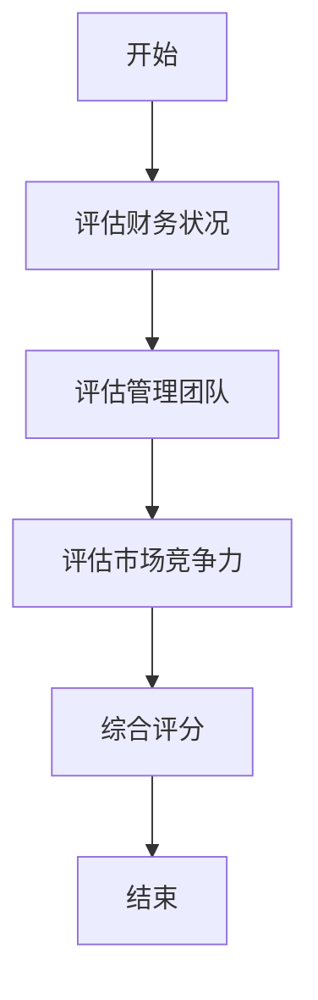
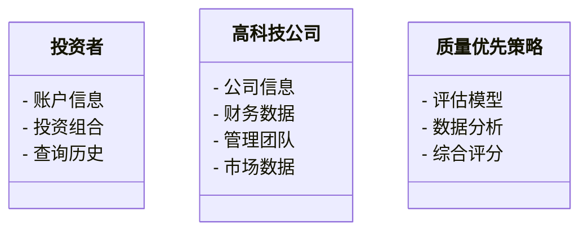
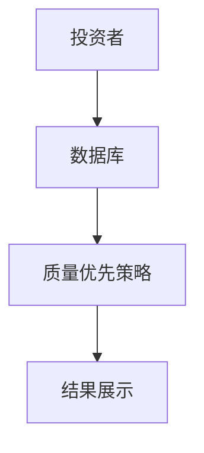
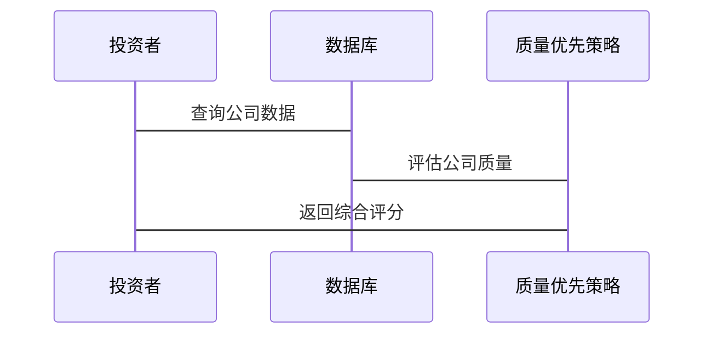

                 


# 彼得林奇的"质量优先"在高科技行业的应用

> **关键词**：彼得林奇，质量优先，高科技行业，投资策略，财务评估  
> **摘要**：本文探讨了彼得林奇的“质量优先”投资策略在高科技行业中的应用，通过分析其核心概念、算法原理、系统架构及实际案例，展示了如何将该策略转化为具体的投资实践。

---

## 第一部分: 背景介绍与核心概念

### 第1章: 彼得林奇"质量优先"投资策略概述

#### 1.1 质量优先策略的定义
##### 1.1.1 投资策略的基本概念
彼得林奇是美国著名的投资专家，他的“质量优先”策略强调在投资决策中，优先选择那些具备优秀基本面、强大管理团队和竞争优势的公司。这种策略的核心在于“选择好公司”，而非仅仅关注市场波动。

##### 1.1.2 质量优先的核心理念
- **长期投资**：关注公司的长期盈利能力，而非短期市场波动。
- **基本面分析**：通过财务数据、管理团队和行业地位等指标评估公司的质量。
- **风险控制**：通过选择优质公司降低投资风险。

##### 1.1.3 质量优先与高科技行业的契合点
高科技行业具有高增长潜力，但也伴随着高风险和快速的技术迭代。质量优先策略可以帮助投资者在高科技行业中筛选出具备长期竞争优势的公司。

#### 1.2 高科技行业的特点
##### 1.2.1 高科技行业的定义与范围
高科技行业涵盖信息技术、人工智能、生物技术、航空航天等领域，其核心是技术创新和知识密集型。

##### 1.2.2 高科技行业的增长模式
- **技术创新驱动**：高科技行业的发展依赖于持续的技术创新。
- **高增长与高风险并存**：高科技行业的公司可能在短时间内实现爆发式增长，但也可能因技术落后而迅速被淘汰。

##### 1.2.3 高科技行业的风险与机遇
- **机遇**：技术创新和市场需求带来投资机会。
- **风险**：技术失败、市场竞争激烈、政策变化等风险。

---

### 第2章: 质量优先策略在高科技行业的应用背景

#### 2.1 高科技行业投资的复杂性
##### 2.1.1 高科技行业的技术门槛
高科技行业的技术门槛较高，投资者需要具备专业知识才能准确评估公司的技术实力。

##### 2.1.2 高科技行业的市场波动
高科技行业的股票价格波动较大，市场情绪对股价的影响显著。

##### 2.1.3 高科技行业的竞争格局
高科技行业竞争激烈，技术迭代快，企业需要不断创新才能保持竞争优势。

#### 2.2 彼得林奇策略在高科技行业的适用性
##### 2.2.1 质量优先策略的核心要素
- **财务健康状况**：公司是否有稳定的盈利能力。
- **管理团队能力**：管理团队的经验和能力。
- **市场竞争力**：公司在市场中的地位和竞争优势。

##### 2.2.2 高科技行业的质量评估标准
- **技术创新能力**：公司是否具备持续创新能力。
- **市场占有率**：公司在市场中的份额。
- **财务稳定性**：公司是否有健康的财务状况。

##### 2.2.3 高科技行业与传统行业的差异
高科技行业强调技术创新和知识资本，而传统行业更依赖于劳动力和自然资源。因此，质量优先策略在高科技行业的应用需要考虑其独特的行业特点。

---

## 第二部分: 核心概念与联系

### 第3章: 质量优先策略的核心要素

#### 3.1 质量优先的定义与属性
##### 3.1.1 质量优先的定义
质量优先策略是指在投资决策中，优先选择那些具备优秀基本面、强大管理团队和竞争优势的公司。

##### 3.1.2 质量优先的核心属性对比
| 属性         | 传统行业   | 高科技行业 |
|--------------|------------|------------|
| 财务健康      | 利润稳定   | 高研发投入 |
| 管理团队      | 经验丰富   | 技术专家驱动 |
| 市场竞争力    | 品牌优势   | 技术领先 |

#### 3.2 高科技行业中的质量评估维度
##### 3.2.1 财务健康状况
- 利润率：衡量公司的盈利能力。
- 研发投入：高科技公司的重要支出。

##### 3.2.2 管理团队能力
- 团队经验：管理团队是否有成功的经验。
- 技术专家：团队是否具备技术专长。

##### 3.2.3 市场竞争力
- 市场份额：公司在市场中的份额。
- 技术创新：公司是否具备持续创新能力。

#### 3.3 质量优先策略的ER实体关系图
```mermaid
er
actor: 投资者
model: 质量优先策略
entity: 高科技公司
attribute: 财务状况, 管理团队, 市场竞争力
```

---

### 第4章: 质量优先策略的算法原理

#### 4.1 质量优先策略的评估流程


#### 4.2 质量优先策略的数学模型
##### 4.2.1 综合评分公式
$$ \text{综合评分} = 0.4 \times \text{财务状况} + 0.3 \times \text{管理团队} + 0.3 \times \text{市场竞争力} $$

##### 4.2.2 示例计算
假设某高科技公司：
- 财务状况 = 80
- 管理团队 = 75
- 市场竞争力 = 85

综合评分：
$$ 0.4 \times 80 + 0.3 \times 75 + 0.3 \times 85 = 32 + 22.5 + 25.5 = 80 $$

---

## 第三部分: 系统分析与架构设计

### 第5章: 系统分析与架构设计方案

#### 5.1 项目介绍
本系统旨在帮助投资者在高科技行业中应用彼得林奇的“质量优先”策略，通过数据分析和评估模型筛选出具备高质量的公司。

#### 5.2 系统功能设计
##### 5.2.1 领域模型


##### 5.2.2 系统架构设计


##### 5.2.3 系统接口设计
- 输入接口：投资者输入筛选条件。
- 输出接口：系统返回符合条件的公司列表。

##### 5.2.4 系统交互流程


---

## 第四部分: 项目实战

### 第6章: 项目实战

#### 6.1 环境安装
- 数据库：MySQL 或 PostgreSQL
- 开发工具：Python、Jupyter Notebook
- 依赖库：pandas, numpy, matplotlib

#### 6.2 核心代码实现
```python
import pandas as pd
import numpy as np

# 数据加载
df = pd.read_csv('high-tech_companies.csv')

# 定义评估函数
def calculate_score(row):
    financial_health = row['财务状况']
    management_team = row['管理团队']
    market_competition = row['市场竞争力']
    return 0.4 * financial_health + 0.3 * management_team + 0.3 * market_competition

# 计算综合评分
df['综合评分'] = df.apply(calculate_score, axis=1)

# 筛选高质量公司
high_quality = df[df['综合评分'] > 80]
```

#### 6.3 案例分析
以某高科技公司为例：
- 公司名称：XYZ科技
- 财务状况：85
- 管理团队：80
- 市场竞争力：85

综合评分：
$$ 0.4 \times 85 + 0.3 \times 80 + 0.3 \times 85 = 34 + 24 + 25.5 = 83.5 $$

由于综合评分大于80，XYZ科技被归类为高质量公司。

---

## 第五部分: 最佳实践与总结

### 第7章: 最佳实践与总结

#### 7.1 投资建议
- **长期持有**：选择高质量公司后，建议长期持有，避免频繁交易。
- **分散投资**：不要将所有资金投入到单一公司，分散投资以降低风险。
- **定期评估**：定期评估公司的财务状况和市场竞争力，及时调整投资组合。

#### 7.2 小结
本文通过分析彼得林奇的“质量优先”策略在高科技行业中的应用，展示了如何通过基本面分析、管理团队评估和市场竞争力分析筛选出高质量公司。结合实际案例和系统设计，为投资者提供了一套可行的投资方法。

#### 7.3 注意事项
- 投资有风险，需谨慎决策。
- 建议在专业指导下进行投资。

#### 7.4 拓展阅读
- 彼得林奇的《股市长盛不衰》
- 约翰·博格的《投资法则》

---

以上是《彼得林奇的"质量优先"在高科技行业的应用》的完整目录和内容框架。

