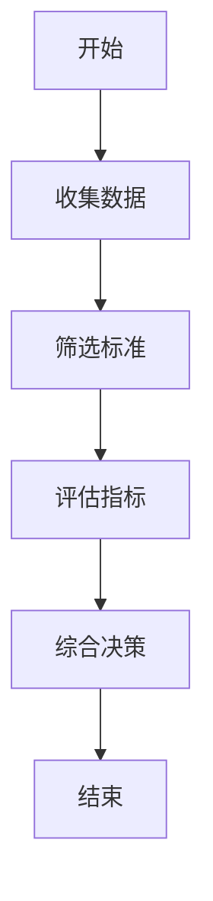
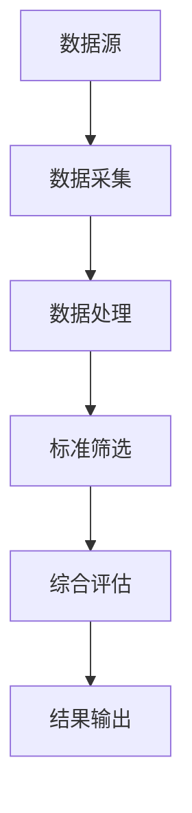

                 


# 彼得林奇的"质量优先"选股标准

## 关键词：彼得林奇，质量优先，选股标准，投资策略，价值投资，财务指标

## 摘要：彼得林奇的“质量优先”选股标准是一种以公司质量为核心的投资策略，强调通过分析公司的财务状况、行业地位和竞争优势来选择具有长期增长潜力的股票。本文将详细阐述这一选股标准的核心概念、算法原理、系统架构设计以及实际案例分析，帮助读者深入了解并掌握这一投资方法。

---

## 第一部分：彼得林奇“质量优先”选股标准概述

### 第1章：质量优先选股的背景与意义

#### 1.1 投资的基本概念
- **投资的定义与分类**：投资是将资金投入到某个项目或资产中，以期获得收益的行为。股票投资是其中的重要组成部分，而选股标准是投资者选择股票的核心依据。
- **股票投资的核心要素**：包括公司基本面、行业地位、财务状况、管理团队等。
- **质量优先选股的起源与发展**：彼得林奇作为美国著名的投资专家，提出了一套以公司质量为核心的投资策略，强调选择具有强大基本面和竞争优势的公司。

#### 1.2 彼得林奇的投资理念
- **彼得林奇的生平简介**：彼得·林奇是美国富达投资集团的前董事长，以其成功的投资业绩和独特的选股方法闻名。
- **质量优先选股的核心思想**：林奇认为，选择股票的关键在于公司本身的质量，而非市场的短期波动。他强调深入研究公司基本面，寻找具有持续增长潜力的企业。
- **质量优先与价值投资的联系与区别**：质量优先选股与价值投资有相似之处，但更注重公司的内在质量和竞争优势。

---

### 第2章：质量优先选股的标准与特征

#### 2.1 质量优先选股的核心标准
- **公司基本面分析**：包括收入、利润、现金流等财务指标。
- **财务指标的重要性**：如市盈率（P/E）、市净率（P/B）、负债率等。
- **行业地位与竞争优势**：公司是否在行业中具有领先地位，是否具备独特的竞争优势。

#### 2.2 质量优先选股的特征对比
- **财务健康状况对比**：通过对比公司的财务指标，评估其财务健康状况。
- **市场表现与估值对比**：分析股票的市场表现和估值水平，判断其是否被市场低估。
- **管理团队与企业治理对比**：评估公司的管理团队能力和企业治理结构。

---

### 第3章：质量优先选股的算法与流程

#### 3.1 选股算法的步骤
- **数据收集与整理**：收集目标公司的财务数据、行业数据等。
- **标准筛选与排序**：根据质量优先的标准筛选出符合条件的公司，并进行排序。
- **综合评估与决策**：综合评估公司的各项指标，最终决定是否投资。

#### 3.2 算法流程图


---

### 第4章：质量优先选股的数学模型

#### 4.1 财务指标的数学分析
- **市盈率（P/E）计算公式**：  
  $$ P/E = \frac{股票价格}{每股收益} $$
- **市净率（P/B）计算公式**：  
  $$ P/B = \frac{股票价格}{每股净资产} $$
- **资产负债率计算公式**：  
  $$ 资产负债率 = \frac{总负债}{总资产} $$

#### 4.2 综合评分模型
- **综合评分公式**：  
  $$ 综合评分 = \sum (各项指标评分 \times 权重) $$

---

### 第5章：系统分析与架构设计

#### 5.1 系统功能设计
- **数据采集模块**：负责收集目标公司的财务数据、行业数据等。
- **标准筛选模块**：根据质量优先的标准筛选出符合条件的公司。
- **综合评估模块**：对筛选出的公司进行综合评估，生成投资建议。

#### 5.2 系统架构图


---

### 第6章：项目实战与案例分析

#### 6.1 环境安装与数据准备
- **数据源选择**：选择包含公司财务数据的可靠数据源。
- **数据清洗与预处理**：对数据进行清洗，去除无效数据，补充缺失数据。
- **数据存储与管理**：将数据存储在数据库中，方便后续处理。

#### 6.2 核心代码实现
- **数据采集代码**：  
  ```python
  import pandas as pd
  df = pd.read_csv('data.csv')
  ```
- **标准筛选代码**：  
  ```python
  filtered = df[df['P/E'] < 15]
  ```
- **综合评估代码**：  
  ```python
  def calculate_score(row):
      score = 0
      score += row['P/E'] * 0.3
      score += row['P/B'] * 0.3
      score += row['ROE'] * 0.4
      return score
  df['Score'] = df.apply(calculate_score, axis=1)
  ```

---

### 第7章：总结与最佳实践

#### 7.1 本章小结
- **质量优先选股的核心要点**：选择具有强大基本面和竞争优势的公司，注重公司的财务健康和行业地位。
- **最佳实践**：定期更新数据，持续关注公司的财务状况和行业动态，避免盲目跟风。

#### 7.2 注意事项
- **数据质量**：确保数据来源可靠，数据清洗充分。
- **模型优化**：根据市场变化，及时调整选股标准和权重。

#### 7.3 拓展阅读
- 推荐阅读彼得·林奇的书籍《彼得林奇选股术》和《股市漫步》。

---

以上是《彼得林奇的"质量优先"选股标准》的技术博客文章框架，涵盖了从基础概念到实际应用的各个方面，帮助读者全面理解并掌握这一投资策略。

