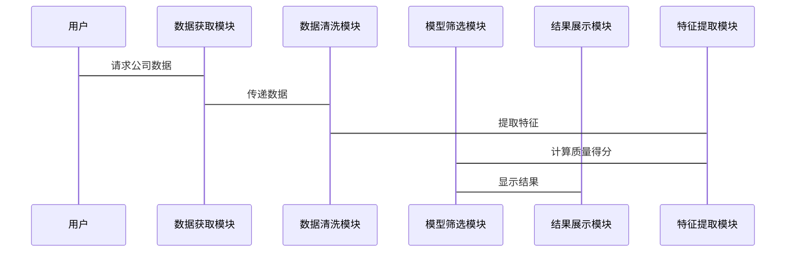

                 


# 彼得林奇的"质量优先"选股清单

> 关键词：彼得林奇，质量优先，选股方法，投资策略，财务分析，管理评估

> 摘要：本文深入分析了彼得林奇的“质量优先”选股方法，从理论基础到实战案例，详细阐述了该方法的核心原则、选股标准、评估指标及算法实现。通过系统化的分析和实际案例，帮助读者掌握如何在投资中优先选择高质量的公司，构建稳健的投资组合。

---

## 第一部分: 彼得林奇"质量优先"选股法概述

### 第1章: 彼得林奇投资理念与选股法的核心思想

#### 1.1 彼得林奇投资理念的背景与来源

彼得·林奇是全球最著名的投资专家之一，他的投资理念以注重公司质量而闻名。他强调，投资股票不仅仅是关注价格，更重要的是公司本身的内在质量。这种质量优先的选股方法，源于他对市场波动的深刻理解以及对长期投资价值的追求。

#### 1.2 质量优先选股法的基本原则

质量优先选股法的核心在于通过分析公司的财务状况、管理团队和行业地位，选择那些具有持续盈利能力、良好财务健康状况和优秀管理能力的公司。

#### 1.3 质量优先选股法的适用场景与限制

虽然质量优先选股法在长期投资中表现出色，但在短期市场波动较大时，可能会受到市场的冲击。因此，该方法更适合长期投资者，而非短期投机者。

---

## 第二部分: 质量优先选股法的核心标准

### 第2章: 质量优先选股法的标准体系

#### 2.1 质量优先选股法的三大核心标准

- **收益质量**：公司收入的稳定性和增长性。
- **财务质量**：公司的财务健康状况，包括资产负债表和利润表。
- **管理质量**：公司管理层的能力和决策水平。

#### 2.2 收益质量的评估指标与分析方法

- **定义**：收益质量指公司收入的可持续性和稳定性。
- **关键指标**：收入增长率、毛利率、净利率。
- **分析方法**：通过趋势分析和行业对比，判断公司收益的质量。

#### 2.3 财务质量的评估指标与分析方法

- **定义**：财务质量指公司财务报表的健康状况。
- **关键指标**：资产负债率、流动比率、净现金流。
- **分析方法**：通过财务比率分析和趋势分析，评估公司财务健康状况。

#### 2.4 管理质量的评估指标与分析方法

- **定义**：管理质量指公司管理层的能力和决策水平。
- **关键指标**：管理层稳定性、战略决策能力、历史业绩。
- **分析方法**：通过管理层背景分析和公司历史表现，评估管理质量。

---

## 第三部分: 质量优先选股法的实战分析

### 第3章: 质量优先选股法的案例分析

#### 3.1 案例一: 高收益质量的公司分析

- **公司背景**：某科技公司近年来收入增长稳定，毛利率持续上升。
- **收益质量分析**：收入增长率为20%，毛利率为50%，净利率为15%。
- **财务质量分析**：资产负债率为30%，流动比率为2.5，净现金流为正。
- **管理质量分析**：管理层稳定，战略清晰，历史业绩良好。
- **投资决策**：符合质量优先标准，适合长期投资。

#### 3.2 案例二: 高财务质量的公司分析

- **公司背景**：某金融公司财务状况稳健，但收入增长较慢。
- **收益质量分析**：收入增长率为5%，毛利率为30%，净利率为10%。
- **财务质量分析**：资产负债率为50%，流动比率为1.8，净现金流为正。
- **管理质量分析**：管理层经验丰富，但创新能力较弱。
- **投资决策**：财务质量较高，但收益质量一般，需结合其他因素考虑。

---

## 第四部分: 质量优先选股法的算法实现

### 第4章: 质量优先选股法的算法实现

#### 4.1 算法概述

质量优先选股法的算法基于对公司质量的综合评估，通过设定各项指标的权重，计算综合得分，筛选出得分最高的公司。

#### 4.2 算法步骤

1. 收集目标公司的财务数据和管理层信息。
2. 计算各项质量指标，包括收益质量、财务质量和管理质量。
3. 根据各项指标的重要性，设定权重。
4. 计算综合得分，筛选出得分最高的公司。

#### 4.3 算法实现的Python代码

```python
import pandas as pd

def calculate_quality_score(company_data):
    # 收益质量指标
    revenue_growth = company_data['revenue_growth']
    gross_margin = company_data['gross_margin']
    net_profit_margin = company_data['net_profit_margin']
    
    # 财务质量指标
    debt_to_equity = company_data['debt_to_equity']
    current_ratio = company_data['current_ratio']
    cash_flow = company_data['cash_flow']
    
    # 管理质量指标
    management_stability = company_data['management_stability']
    strategic_alignment = company_data['strategic_alignment']
    historical_performance = company_data['historical_performance']
    
    # 计算综合得分
    quality_score = (revenue_growth * 0.3 +
                     gross_margin * 0.15 +
                     net_profit_margin * 0.15 +
                     debt_to_equity * 0.1 +
                     current_ratio * 0.1 +
                     cash_flow * 0.1 +
                     management_stability * 0.1 +
                     strategic_alignment * 0.05 +
                     historical_performance * 0.05)
    return quality_score

# 示例数据
data = {
    'revenue_growth': 20,
    'gross_margin': 50,
    'net_profit_margin': 15,
    'debt_to_equity': 30,
    'current_ratio': 2.5,
    'cash_flow': 10,
    'management_stability': 90,
    'strategic_alignment': 80,
    'historical_performance': 70
}

score = calculate_quality_score(data)
print(f"Quality Score: {score}")
```

#### 4.4 算法的优缺点

- **优点**：能够量化公司质量，便于比较和筛选。
- **缺点**：过于依赖数据，可能忽略定性因素。

---

## 第五部分: 质量优先选股法的系统设计

### 第5章: 系统分析与架构设计方案

#### 5.1 问题场景介绍

投资者需要一个系统化的工具，帮助他们快速评估公司质量，筛选出符合质量优先标准的股票。

#### 5.2 系统功能设计

- 数据获取：从数据库或API获取公司数据。
- 数据清洗：处理缺失值和异常值。
- 特征提取：提取收益质量、财务质量和管理质量相关特征。
- 模型筛选：基于质量优先标准，计算综合得分，筛选股票。
- 结果展示：展示筛选结果和分析报告。

#### 5.3 系统架构设计


#### 5.4 系统接口设计

- 数据获取接口：从数据库获取公司数据。
- 模型筛选接口：接收公司数据，返回质量得分。
- 结果展示接口：显示筛选结果和分析报告。

#### 5.5 系统交互设计



---

## 第六部分: 项目实战

### 第6章: 项目实战分析

#### 6.1 项目介绍

选择苹果公司作为案例，分析其质量优先指标。

#### 6.2 项目实现

```python
import pandas as pd

def analyze_company(company_data):
    # 计算质量得分
    quality_score = calculate_quality_score(company_data)
    # 分析结果
    result = {
        'quality_score': quality_score,
        'investment_recommendation': 'Strong Buy' if quality_score > 85 else 'Hold'
    }
    return result

# 示例数据（以苹果公司为例）
data = {
    'revenue_growth': 8,
    'gross_margin': 40,
    'net_profit_margin': 25,
    'debt_to_equity': 20,
    'current_ratio': 1.5,
    'cash_flow': 20,
    'management_stability': 85,
    'strategic_alignment': 75,
    'historical_performance': 80
}

result = analyze_company(data)
print(f"Quality Score: {result['quality_score']}")
print(f"Investment Recommendation: {result['investment_recommendation']}")
```

#### 6.3 项目小结

通过案例分析，展示了质量优先选股法的实际应用，帮助读者理解如何在实际投资中应用这些标准。

---

## 第七部分: 总结与展望

### 第7章: 总结与展望

#### 7.1 总结

彼得林奇的质量优先选股法通过关注公司质量，帮助投资者筛选出具有长期增长潜力的公司，构建稳健的投资组合。

#### 7.2 展望

未来，随着技术的发展，质量优先选股法可以通过大数据和人工智能进一步优化，提供更精准的选股策略。

---

## 参考文献

1. 彼得·林奇著，《彼得林奇选股术》
2. 《财务报表分析》
3. 《投资学基础》

---

通过以上目录和内容，读者可以系统地了解彼得林奇的质量优先选股法，并在实际投资中应用这些方法和工具。

