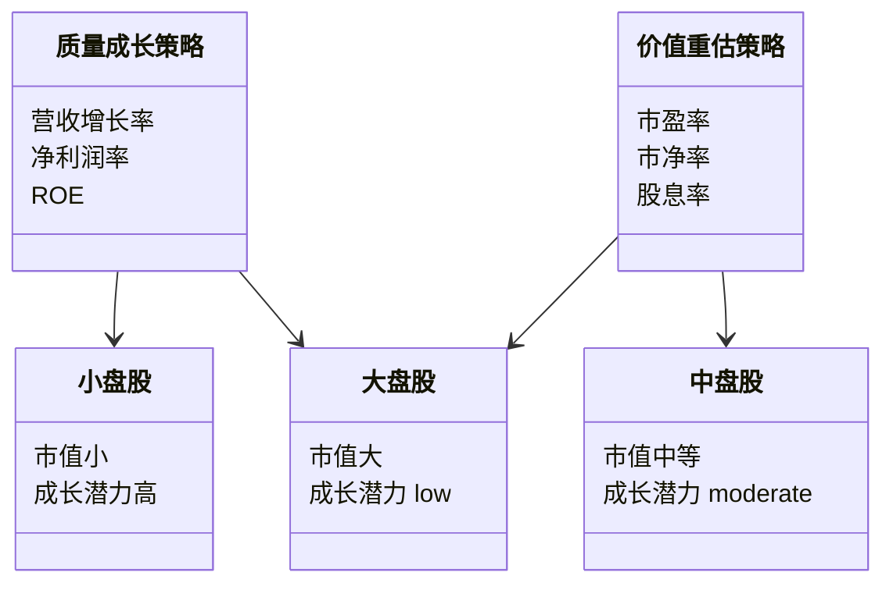
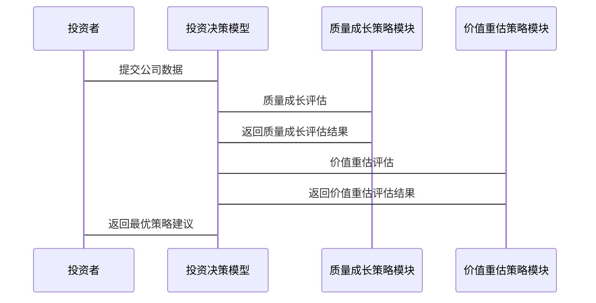

                 


# 彼得林奇的"质量成长"vs"价值重估"在不同市值公司中的应用

## 关键词：投资策略，质量成长，价值重估，彼得·林奇，市值公司

## 摘要：本文深入分析了彼得·林奇提出的“质量成长”和“价值重估”两种投资策略，并探讨了这两种策略在小盘股、中盘股和大盘股中的具体应用。通过理论与实践相结合的方式，详细阐述了这两种策略的优缺点、适用场景以及在不同市值公司中的表现，帮助投资者更好地理解如何在实际投资中选择合适的策略。

---

## 第一部分：彼得林奇的"质量成长"与"价值重估"概述

### 1.1 质量成长与价值重估的定义与区别

#### 1.1.1 质量成长的定义与核心要素
质量成长策略是一种长期投资策略，关注那些具有持续增长潜力的公司。其核心在于选择具有强大竞争优势、良好管理团队和稳定增长前景的企业。质量成长策略注重企业的基本面，尤其是营收增长率、净利润率和ROE（净资产收益率）等指标。

#### 1.1.2 价值重估的定义与核心要素
价值重估策略是一种寻找市场价格低于其内在价值的投资策略。其核心在于识别那些被市场低估的公司，通常由于市场情绪或短期波动导致股价被压制。价值重估策略关注企业的内在价值，尤其是市盈率（P/E）、市净率（P/B）和股息率等指标。

#### 1.1.3 两种策略的异同对比
- **相同点**：两者都注重企业的基本面分析，关注企业的盈利能力和成长潜力。
- **不同点**：质量成长策略侧重于长期增长潜力，而价值重估策略侧重于短期价格波动和市场低估。

### 1.2 彼得林奇投资策略的背景与应用

#### 1.2.1 彼得林奇的投资理念
彼得·林奇是美国著名的职业基金经理，以其在富达基金（Fidelity）的长期投资业绩而闻名。他认为，投资的核心在于选择那些具有持续增长潜力的公司，并长期持有。

#### 1.2.2 质量成长策略的适用场景
质量成长策略适用于那些具有强大竞争优势、管理团队优秀且市场前景广阔的公司。通常，这些公司属于成长型企业，具有较高的营收增长率和净利润率。

#### 1.2.3 价值重估策略的适用场景
价值重估策略适用于那些由于市场情绪或短期波动导致股价被低估的公司。通常，这些公司具有较高的股息率或较低的市盈率和市净率。

---

## 第二部分：质量成长与价值重估的理论基础

### 2.1 质量成长策略的理论基础

#### 2.1.1 质量成长的经济学原理
质量成长策略基于凯恩斯的“有效市场假说”和米勒的“资本资产定价模型”（CAPM）。其核心思想是，企业的价值与其未来的现金流折现值密切相关，因此选择具有持续增长潜力的公司能够为投资者带来超额收益。

#### 2.1.2 质量成长与企业生命周期的关系
企业生命周期分为导入期、成长期、成熟期和衰退期。质量成长策略适用于企业处于成长期和成熟期，此时企业具有稳定的盈利能力和增长潜力。

#### 2.1.3 质量成长的数学模型与公式
质量成长策略的核心指标包括：
- **营收增长率**：$$ \text{营收增长率} = \frac{\text{本年营收} - \text{上年营收}}{\text{上年营收}} \times 100\% $$
- **净利润率**：$$ \text{净利润率} = \frac{\text{净利润}}{\text{营收}} \times 100\% $$
- **ROE（净资产收益率）**：$$ \text{ROE} = \frac{\text{净利润}}{\text{股东权益}} \times 100\% $$

### 2.2 价值重估策略的理论基础

#### 2.2.1 价值重估的经济学原理
价值重估策略基于格雷厄姆的价值投资理论，认为市场的短期波动会导致股票价格偏离其内在价值。因此，通过寻找价格低于内在价值的公司，投资者可以在市场复苏时获得超额收益。

#### 2.2.2 价值重估与市场周期的关系
价值重估策略适用于市场周期的底部或震荡期，此时市场情绪低落，股价被低估。在市场复苏或牛市中，价值重估策略的表现可能不如质量成长策略。

#### 2.2.3 价值重估的数学模型与公式
价值重估策略的核心指标包括：
- **市盈率（P/E）**：$$ \text{P/E} = \frac{\text{股价}}{\text{每股净利润}} $$
- **市净率（P/B）**：$$ \text{P/B} = \frac{\text{股价}}{\text{每股净资产}} $$
- **股息率**：$$ \text{股息率} = \frac{\text{每股股息}}{\text{股价}} \times 100\% $$

### 2.3 质量成长与价值重估的对比分析

#### 2.3.1 理论基础对比
质量成长策略基于企业的长期增长潜力，而价值重估策略基于企业的内在价值与市场价格的偏离。

#### 2.3.2 实践应用对比
质量成长策略适用于成长型企业，而价值重估策略适用于价值被低估的企业。

#### 2.3.3 优缺点对比
| 策略 | 优点 | 缺点 |
|------|------|------|
| 质量成长 | 长期增长潜力高，适合成长型企业 | 对宏观经济波动敏感，短期波动大 |
| 价值重估 | 价格波动小，适合价值投资者 | 找准低估企业难度大，需要深入分析 |

---

## 第三部分：质量成长与价值重估在不同市值公司中的应用

### 3.1 小盘股中的质量成长策略

#### 3.1.1 小盘股的特点与投资机会
小盘股通常具有较高的增长潜力，但市场关注度较低，容易被忽视。然而，这也意味着小盘股的波动性较大，风险较高。

#### 3.1.2 质量成长策略在小盘股中的应用
选择具有持续增长潜力的小盘股，重点关注营收增长率和净利润率。例如，一些新兴行业的初创企业可能符合质量成长策略的要求。

#### 3.1.3 案例分析：小盘股中的质量成长投资
以某家新兴科技公司为例，假设该公司的营收增长率为30%，净利润率为15%，ROE为25%。这些指标表明该公司具有较高的增长潜力，符合质量成长策略的要求。

### 3.2 中盘股中的价值重估策略

#### 3.2.1 中盘股的特点与投资机会
中盘股介于小盘股和大盘股之间，具有一定的增长潜力，同时价格波动相对较小。中盘股通常被市场忽视，适合价值重估策略。

#### 3.2.2 价值重估策略在中盘股中的应用
选择市盈率和市净率较低的中盘股，重点关注股息率和ROE。例如，一些传统行业中的优质企业可能符合价值重估策略的要求。

#### 3.2.3 案例分析：中盘股中的价值重估投资
以某家传统制造公司为例，假设该公司的市盈率为10，市净率为2，股息率为5%。这些指标表明该公司价格低于其内在价值，符合价值重估策略的要求。

### 3.3 大盘股中的策略选择

#### 3.3.1 大盘股的特点与投资机会
大盘股通常具有稳定的盈利能力和较高的市场流动性，但增长潜力有限。大盘股适合长期投资，但需要根据市场环境选择合适的策略。

#### 3.3.2 大盘股中的质量成长与价值重估策略
在大盘股中，质量成长策略适用于那些具有持续增长潜力的企业，如科技巨头和消费龙头企业；价值重估策略适用于那些因市场波动导致股价被低估的优质企业。

#### 3.3.3 案例分析：大盘股中的策略选择
以苹果公司为例，假设其市盈率为20，市净率为4，股息率为2%。如果苹果公司具有较高的营收增长率和净利润率，符合质量成长策略的要求；如果苹果公司的股价因市场波动而被低估，符合价值重估策略的要求。

---

## 第四部分：系统分析与架构设计方案

### 4.1 问题场景介绍
为了更好地理解质量成长和价值重估策略在不同市值公司中的应用，我们需要构建一个投资决策模型，用于分析和选择合适的策略。

### 4.2 项目介绍
本项目旨在构建一个基于彼得林奇策略的投资决策模型，帮助投资者在不同市值公司中选择合适的策略。

### 4.3 系统功能设计（领域模型）



### 4.4 系统架构设计


### 4.5 系统接口设计
- 质量成长评估接口：接收公司基本面数据，返回质量成长策略评估结果。
- 价值重估评估接口：接收公司估值指标，返回价值重估策略评估结果。
- 市值分类接口：接收公司市值数据，返回市值分类结果。

### 4.6 系统交互流程图



---

## 第五部分：项目实战

### 5.1 环境安装
- 安装Python和相关库（如pandas、numpy、scikit-learn）。
- 安装Jupyter Notebook用于数据分析和可视化。

### 5.2 核心代码实现

```python
import pandas as pd
import numpy as np

# 示例数据：假设我们有一个包含公司基本面数据的DataFrame
data = {
    '公司名称': ['公司A', '公司B', '公司C'],
    '营收增长率': [0.3, 0.2, 0.15],
    '净利润率': [0.2, 0.15, 0.1],
    'ROE': [0.25, 0.2, 0.15],
    '市盈率': [20, 15, 25],
    '市净率': [4, 3, 5],
    '股息率': [0.02, 0.015, 0.01]
}
df = pd.DataFrame(data)

# 质量成长策略筛选
quality_growth_mask = (df['营收增长率'] > 0.2) & (df['净利润率'] > 0.15) & (df['ROE'] > 0.2)
quality_growth_companies = df[quality_growth_mask]

# 价值重估策略筛选
value_revaluation_mask = (df['市盈率'] < 15) & (df['市净率'] < 3) & (df['股息率'] > 0.015)
value_revaluation_companies = df[value_revaluation_mask]

print("质量成长策略筛选结果：")
print(quality_growth_companies)
print("\n价值重估策略筛选结果：")
print(value_revaluation_companies)
```

### 5.3 案例分析与项目总结
通过上述代码，我们可以筛选出符合质量成长和价值重估策略的公司。质量成长策略筛选出的公司具有较高的营收增长率和净利润率，而价值重估策略筛选出的公司具有较低的市盈率和市净率以及较高的股息率。

---

## 第六部分：最佳实践、小结、注意事项和拓展阅读

### 6.1 最佳实践
- **策略结合**：在实际投资中，可以结合质量成长和价值重估策略，根据市场环境选择合适的策略。
- **分散投资**：避免将所有资金投入到单一策略中，分散投资可以降低风险。
- **持续监控**：市场环境不断变化，需要持续监控公司基本面和市场指标，及时调整投资策略。

### 6.2 小结
本文深入分析了彼得·林奇提出的质量成长和价值重估策略，并探讨了这两种策略在不同市值公司中的应用。通过理论与实践相结合的方式，帮助投资者更好地理解如何在实际投资中选择合适的策略。

### 6.3 注意事项
- **市场风险**：投资有风险，需谨慎操作。
- **数据准确性**：数据的准确性和及时性对投资决策至关重要。
- **个人风险承受能力**：投资者需根据自身的风险承受能力选择合适的投资策略。

### 6.4 拓展阅读
- 彼得·林奇的《彼得·林奇的成功投资：写给经理人的投资策略》
- 格雷厄姆的《证券分析》
- 巴菲特的《巴菲特致股东的信》

---

## 结语
通过本文的分析，投资者可以更好地理解质量成长和价值重估策略在不同市值公司中的应用，并根据市场环境和个人风险承受能力选择合适的投资策略。希望本文能为投资者提供有价值的参考和启发。

--- 

如果您对我的思考过程和内容有任何疑问或需要进一步的解释，请随时告诉我。

