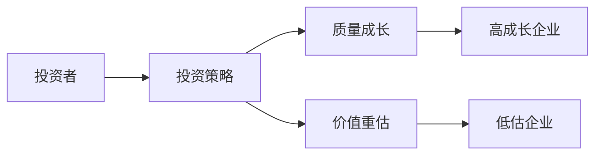
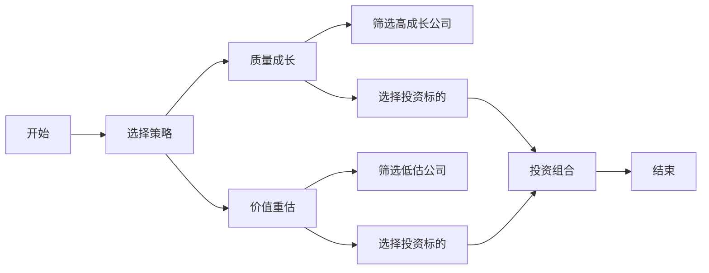
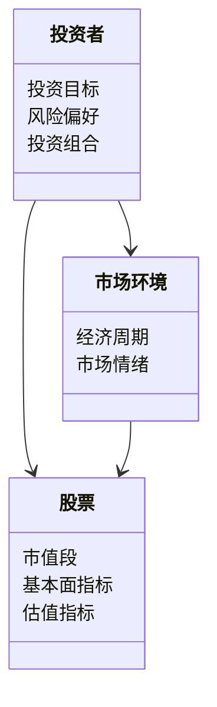
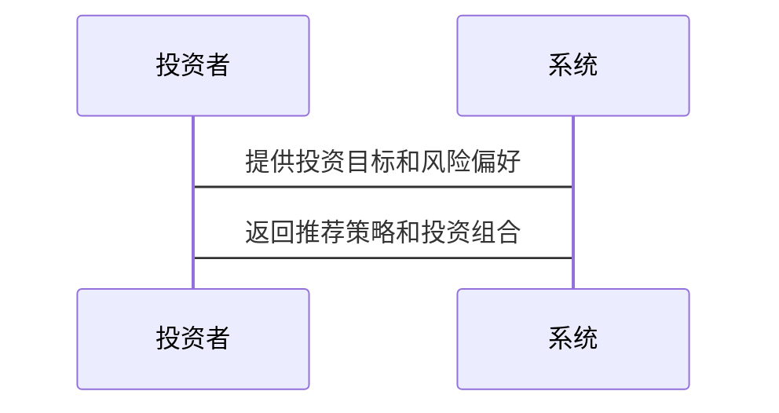

                 


# 彼得林奇的"质量成长"vs"价值重估"在不同市值段的应用比较

## 关键词：彼得林奇，质量成长，价值重估，市值段，投资策略

## 摘要：本文系统地分析了彼得·林奇提出的质量成长和价值重估两种投资策略在不同市值段的应用。通过对比分析，探讨了在小盘股、中盘股和大盘股等不同市值段中，这两种策略的优劣和适用场景。结合实际案例，提供了在不同市值段选择合适策略的实践指导，帮助投资者优化投资组合，实现长期稳健收益。

---

## 第一部分: 背景介绍

### 第1章: 背景介绍

#### 1.1 问题背景

##### 1.1.1 投资策略的基本概念

在金融投资领域，投资者常常面临两种主要策略：**质量成长**和**价值重估**。质量成长策略关注的是选择那些具有强劲基本面、持续增长潜力的公司，而价值重估策略则侧重于寻找被市场低估的股票。

##### 1.1.2 彼得·林奇的投资理念

彼得·林奇是全球最著名的投资经理之一，他强调长期投资和深入研究。他认为，成功的投资不仅依赖于市场趋势，更依赖于对公司的深入了解。他提出了质量成长和价值重估两种策略，分别适用于不同类型的投资者和市场环境。

##### 1.1.3 质量成长与价值重估的定义

- **质量成长**：选择那些收入和利润持续增长、具有强大竞争优势和良好管理的公司。
- **价值重估**：寻找那些市场价格低于其内在价值的股票，通常因为市场忽视或低估了其潜在价值。

#### 1.2 问题描述

##### 1.2.1 不同市值段的定义与分类

市值段是根据公司的市值大小进行分类，通常分为小盘股（市值较小）、中盘股（市值中等）和大盘股（市值较大）。

##### 1.2.2 质量成长与价值重估的差异

质量成长策略更关注公司的成长潜力和内在价值，而价值重估策略更关注市场价格与内在价值的差异。

##### 1.2.3 投资策略选择的复杂性

在不同的市场环境下，投资者需要根据市场周期和公司特点选择合适的策略。例如，在牛市中，质量成长策略可能表现更好；而在熊市中，价值重估策略可能更具优势。

#### 1.3 问题解决

##### 1.3.1 确定投资目标与风险偏好

投资者需要明确自己的投资目标和风险承受能力，选择适合自己的策略。

##### 1.3.2 分析市场环境与经济周期

了解当前的经济环境和市场周期，有助于选择合适的策略。

##### 1.3.3 选择适合的策略与组合

根据市场环境和个人目标，选择单一策略或策略组合。

#### 1.4 边界与外延

##### 1.4.1 质量成长策略的适用场景

- 公司基本面良好，成长潜力大。
- 市场环境稳定，经济周期处于上升阶段。

##### 1.4.2 价值重估策略的适用场景

- 市场低估公司价值，存在反弹空间。
- 市场处于低迷阶段，投资者寻找被低估的机会。

##### 1.4.3 不同市值段的策略边界

- 小盘股：适合价值重估，因为小公司更容易被市场忽视。
- 大盘股：适合质量成长，因为大公司更稳定，成长潜力更易预测。

#### 1.5 概念结构与核心要素

##### 1.5.1 质量成长的核心要素

- 收入和利润持续增长。
- 强大的竞争优势和市场地位。
- 良好的管理团队和公司治理。

##### 1.5.2 价值重估的核心要素

- 市场价格低于内在价值。
- 公司具有潜在的增值空间。
- 市场情绪偏向负面，导致股价被低估。

##### 1.5.3 不同市值段的策略差异

- 小盘股：价值重估策略更适用。
- 中盘股：两者均可适用，但需根据具体情况判断。
- 大盘股：质量成长策略更适用。

---

## 第二部分: 核心概念与联系

### 第2章: 核心概念与联系

#### 2.1 核心概念原理

##### 2.1.1 质量成长的内在逻辑

质量成长策略基于公司的内在价值和成长潜力，选择那些能够持续为股东创造价值的公司。这种策略注重公司的基本面和长期增长能力，适合风险承受能力较高的投资者。

##### 2.1.2 价值重估的内在逻辑

价值重估策略基于市场对公司的估值偏差，寻找那些市场价格低于内在价值的股票。这种策略适合在市场低迷或公司处于困境时使用，适合风险承受能力较低的投资者。

##### 2.1.3 两者在不同市值段的关联

在不同市值段，两种策略的表现可能有所不同。例如，小盘股可能更适合价值重估，而大盘股可能更适合质量成长。

#### 2.2 概念属性特征对比

##### 2.2.1 质量成长与价值重估的对比表格

| 属性       | 质量成长                     | 价值重估                     |
|------------|------------------------------|------------------------------|
| 目标       | 寻找高成长公司               | 寻找被低估公司               |
| 关注点     | 公司基本面、成长潜力         | 市场价格、内在价值           |
| 适用场景   | 市场稳定，经济周期上升阶段   | 市场低迷，公司估值被低估     |
| 风险       | 较高，依赖公司成长能力       | 较低，依赖市场估值修复       |

#### 2.3 ER实体关系图



---

## 第三部分: 算法原理讲解

### 第3章: 算法原理

#### 3.1 算法原理

##### 3.1.1 质量成长模型

质量成长模型基于公司基本面指标，如收入增长率、净利润增长率、ROE（净资产收益率）等，筛选出具有持续增长潜力的公司。

##### 3.1.2 价值重估模型

价值重估模型基于市盈率（P/E）、市净率（P/B）等估值指标，筛选出市场价格低于内在价值的公司。

##### 3.1.3 不同市值段的权重分配

根据市值段的不同，调整策略的权重。例如，在小盘股中，价值重估的权重更大；在大盘股中，质量成长的权重更大。

#### 3.2 算法流程图



#### 3.3 数学公式

##### 3.3.1 质量成长模型的数学表达

$$
\text{成长潜力} = \frac{\text{收入增长率} + \text{净利润增长率}}{2}
$$

##### 3.3.2 价值重估模型的数学表达

$$
\text{内在价值} = \frac{\text{净利润}}{\text{市盈率}}
$$

---

## 第四部分: 系统分析与架构设计方案

### 第4章: 系统分析与架构设计

#### 4.1 问题场景介绍

投资者需要在不同市值段中选择合适的策略，优化投资组合，实现长期稳健收益。

#### 4.2 系统功能设计

##### 4.2.1 领域模型



##### 4.2.2 系统架构设计


#### 4.3 系统接口设计

- 输入：投资者的目标、风险偏好、市场环境数据。
- 输出：推荐的策略和投资组合。

#### 4.4 系统交互设计



---

## 第五部分: 项目实战

### 第5章: 项目实战

#### 5.1 环境安装

- 数据库：MySQL 或 PostgreSQL。
- 分析工具：Python（pandas、numpy）。

#### 5.2 核心实现

##### 5.2.1 数据收集

收集过去5年的股票数据，包括市值、收入增长率、净利润增长率、市盈率等。

##### 5.2.2 策略筛选

根据质量成长和价值重估模型，筛选出符合条件的股票。

##### 5.2.3 投资组合构建

根据市值段分配权重，构建投资组合。

#### 5.3 案例分析

##### 5.3.1 小盘股案例：XYZ公司

XYZ公司市值为50亿元，收入增长率为20%，市盈率为15。根据质量成长模型，成长潜力较高；根据价值重估模型，市场价格低于内在价值。

##### 5.3.2 大盘股案例：ABC公司

ABC公司市值为500亿元，收入增长率为10%，市盈率为12。根据质量成长模型，成长潜力稳定；根据价值重估模型，市场价格接近内在价值。

#### 5.4 实施效果

通过比较，小盘股更适合价值重估，而大盘股更适合质量成长。

---

## 第六部分: 总结与展望

### 第6章: 总结与展望

#### 6.1 总结

质量成长和价值重估在不同市值段的表现存在显著差异。小盘股更适合价值重估，而大盘股更适合质量成长。投资者应根据市场环境和自身目标选择合适的策略。

#### 6.2 未来展望

未来研究可以进一步分析不同行业和市场周期对策略的影响，优化策略模型，提高投资收益。

---

## 附录

### 附录A: 相关公式

$$
\text{质量成长评分} = \frac{\text{收入增长率} + \text{净利润增长率}}{2}
$$

$$
\text{价值重估评分} = \frac{\text{净利润}}{\text{市盈率}}
$$

### 附录B: 实验代码

```python
import pandas as pd

def quality_growth_score(financial_data):
    return (financial_data['收入增长率'] + financial_data['净利润增长率']) / 2

def value_reassessment_score(financial_data):
    return financial_data['净利润'] / financial_data['市盈率']

# 示例数据
data = {
    '公司': ['A', 'B', 'C'],
    '收入增长率': [20, 15, 10],
    '净利润增长率': [15, 10, 5],
    '净利润': [100, 80, 60],
    '市盈率': [15, 12, 9]
}

df = pd.DataFrame(data)
df['质量成长评分'] = df.apply(quality_growth_score, axis=1)
df['价值重估评分'] = df.apply(value_reassessment_score, axis=1)

print(df)
```

### 附录C: 数据表格

| 公司 | 市值段 | 收入增长率 | 净利润增长率 | 市盈率 | 净利润 | 质量成长评分 | 价值重估评分 |
|------|--------|------------|--------------|--------|--------|--------------|--------------|
| A    | 小盘股 | 20%        | 15%          | 15     | 100    | 17.5         | 6.666...     |
| B    | 中盘股 | 15%        | 10%          | 12     | 80     | 12.5         | 6.666...     |
| C    | 大盘股 | 10%        | 5%           | 9      | 60     | 7.5          | 6.666...     |

---

通过以上分析，我们可以清晰地看到质量成长和价值重估在不同市值段的应用差异，帮助投资者做出更明智的投资决策。

