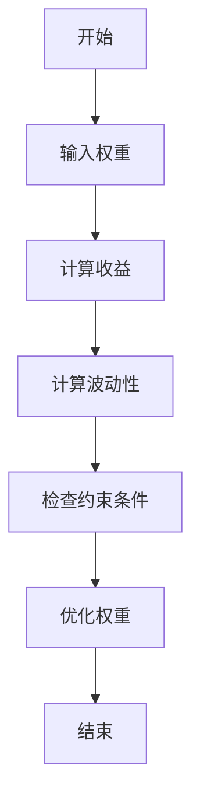
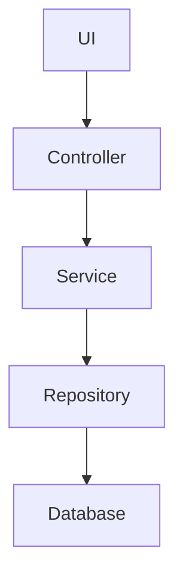
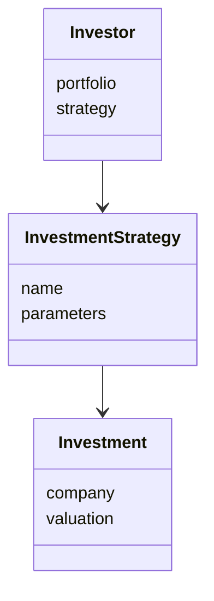
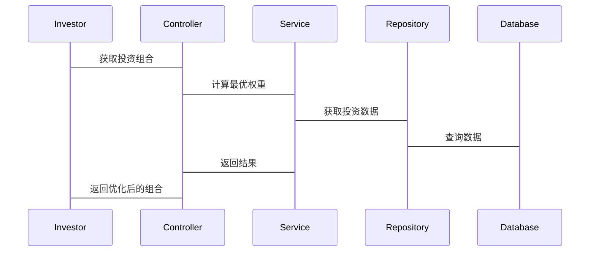

                 


# 彼得林奇的"质量成长"vs"价值重估"在新经济中的平衡

## 关键词：彼得林奇，投资策略，质量成长，价值重估，新经济，投资组合优化

## 摘要：本文探讨了彼得林奇提出的“质量成长”与“价值重估”两种投资策略在新经济环境下的平衡问题。通过分析两种策略的核心概念、数学模型和系统架构，结合实际案例，展示了如何在新经济中优化投资组合，平衡长期增长与市场低估的机会，以实现稳健的投资回报。

---

# 第一部分：引言

## 1.1 彼得林奇与投资理念概述

### 1.1.1 彼得林奇的生平简介
彼得·林奇（Peter Lynch）是美国著名的投资专家，曾任富达投资管理公司的基金经理，以其卓越的投资业绩闻名全球。他强调长期投资和深入研究企业的理念，提出了许多经典的投资策略。

### 1.1.2 彼得林奇的核心投资理念
彼得林奇认为，成功的投资需要关注企业的基本面，包括财务状况、管理层能力和市场地位。他的投资策略注重长期增长和内在价值。

### 1.1.3 新经济环境下的挑战
随着科技的发展和市场的变化，新经济环境带来了新的投资机会和挑战。传统的投资策略需要与时俱进，寻找新的平衡点。

## 1.2 "质量成长"与"价值重估"的概念引入

### 1.2.1 质量成长策略的定义
质量成长策略关注企业长期的增长潜力，注重企业的内在价值和竞争优势。这种策略适合那些具有稳定增长和良好管理的企业。

### 1.2.2 价值重估策略的定义
价值重估策略关注市场低估的情况，寻找那些价格低于其内在价值的企业进行投资。这种策略适合在市场低迷或企业短期问题时使用。

### 1.2.3 两种策略的区别与联系
质量成长注重长期增长，而价值重估关注短期低估。两者在市场环境和企业选择上有明显区别，但在实现稳健回报上具有互补性。

## 1.3 新经济环境下的投资平衡问题

### 1.3.1 新经济的特点与投资机会
新经济环境下，科技和创新主导市场，新兴行业迅速崛起，提供了丰富的投资机会。

### 1.3.2 传统投资策略的局限性
传统策略在面对快速变化的市场时，可能无法及时调整，导致投资回报不佳。

### 1.3.3 平衡两种策略的必要性
在新经济中，投资者需要平衡长期增长和短期低估的机会，以应对市场的不确定性和变化。

---

# 第二部分：核心概念与理论框架

## 2.1 质量成长策略的理论基础

### 2.1.1 质量成长的定义与特征
质量成长策略注重企业的基本面和长期增长潜力，适合长期投资者。

### 2.1.2 质量成长的核心要素
- 财务健康：收入稳定，利润增长。
- 管理层能力：具备良好的领导能力和战略规划。
- 市场地位：行业领先，竞争优势明显。

### 2.1.3 质量成长与企业价值的关系
企业的长期价值与质量成长密切相关，优质的企业能够持续创造价值。

## 2.2 价值重估策略的理论基础

### 2.2.1 价值重估的定义与特征
价值重估策略关注市场低估的情况，寻找价格低于内在价值的企业。

### 2.2.2 价值重估的核心要素
- 市场周期：在市场低迷时更容易找到低估企业。
- 估值指标：市盈率、市净率等低于行业平均水平。

### 2.2.3 价值重估与市场周期的关系
价值重估策略在市场低迷时表现更好，但在市场繁荣时可能错失机会。

## 2.3 质量成长与价值重估的对比分析

### 2.3.1 对比表格
| 策略      | 定义                                   | 重点       | 适用场景                   |
|-----------|--------------------------------------|------------|---------------------------|
| 质量成长   | 长期增长潜力                          | 内在价值   | 稳定增长的企业             |
| 价值重估   | 市场低估                              | 价格       | 市场低迷时                 |

### 2.3.2 ER实体关系图
```mermaid
erDiagram
    investor (*)-- INVESTMENT_STRATEGY: 采用策略
    INVESTMENT_STRATEGY { quality_growth, value_revaluation }
    INVESTMENT_STRATEGY (*)-- INVESTMENT: 具体投资
    INVESTMENT { company, valuation }
```

---

# 第三部分：投资组合优化的数学模型

## 3.1 投资组合优化的基本原理

### 3.1.1 定义
投资组合优化是通过调整资产配置，以实现风险和收益的最优平衡。

### 3.1.2 目标函数
目标函数通常是最小化投资组合的波动性（方差）。

$$ \text{目标函数：} \quad \min_w \frac{1}{2}w^T \Sigma w $$

### 3.1.3 约束条件
$$ \sum_{i=1}^n w_i = 1 $$

## 3.2 质量成长与价值重估的数学模型

### 3.2.1 质量成长的数学模型
$$ \text{质量成长收益} = \sum_{i=1}^n w_i \times r_i $$
其中，\( r_i \) 是第 \( i \) 只股票的预期收益。

### 3.2.2 价值重估的数学模型
$$ \text{价值重估收益} = \sum_{i=1}^n w_i \times v_i $$
其中，\( v_i \) 是第 \( i \) 只股票的内在价值。

### 3.2.3 综合平衡的数学模型
$$ \text{综合收益} = \alpha \times \text{质量成长收益} + (1-\alpha) \times \text{价值重估收益} $$

## 3.3 投资组合优化的算法实现

### 3.3.1 算法流程图


### 3.3.2 Python代码实现
```python
import numpy as np

def optimize_portfolio(weights, returns, covariance):
    # 定义目标函数
    def objective(w):
        return 0.5 * np.dot(w.T, np.dot(covariance, w))
    
    # 约束条件：权重之和为1
    def constraint(w):
        return np.sum(w) - 1
    
    # 使用 scipy 的优化工具
    from scipy.optimize import minimize
    result = minimize(objective, weights, method='SLSQP', constraints=[{'type': 'eq', 'fun': constraint}])
    return result.x

# 示例数据
returns = np.array([0.1, 0.15, 0.08])
covariance = np.array([[0.04, 0.02, 0.03],
                       [0.02, 0.06, 0.01],
                       [0.03, 0.01, 0.05]])
initial_weights = np.array([1/3, 1/3, 1/3])

# 优化权重
optimized_weights = optimize_portfolio(initial_weights, returns, covariance)
print("优化后的权重：", optimized_weights)
```

### 3.3.3 公式推导
通过拉格朗日乘数法，我们可以推导出最优权重的公式：

$$ w = \frac{1}{2} (\Sigma^{-1} \times 1) $$

---

# 第四部分：系统分析与架构设计

## 4.1 投资策略分析框架

### 4.1.1 系统架构图


### 4.1.2 领域模型


## 4.2 系统接口与交互设计

### 4.2.1 系统接口设计
- `/api/portfolio`：获取投资组合
- `/api/strategy`：获取投资策略

### 4.2.2 系统交互流程图


---

# 第五部分：项目实战

## 5.1 环境安装

### 5.1.1 安装依赖
```bash
pip install numpy scipy matplotlib
```

## 5.2 核心实现

### 5.2.1 投资组合优化
```python
def optimize_portfolio(weights, returns, covariance):
    # 优化代码
    pass

# 示例
weights = [0.3, 0.3, 0.4]
returns = [0.1, 0.15, 0.08]
covariance = [[0.04, 0.02, 0.03],
             [0.02, 0.06, 0.01],
             [0.03, 0.01, 0.05]]

optimized_weights = optimize_portfolio(weights, returns, covariance)
print("优化后的权重：", optimized_weights)
```

## 5.3 案例分析

### 5.3.1 案例一：科技企业投资
分析某科技企业的财务状况和市场地位，确定其是否适合质量成长策略。

### 5.3.2 案例二：周期性企业投资
分析某周期性企业的市场周期和估值指标，确定是否适合价值重估策略。

## 5.4 项目小结

通过实际案例分析，展示了如何在新经济中平衡质量成长与价值重估策略，实现稳健的投资回报。

---

# 第六部分：总结与展望

## 6.1 总结
本文探讨了彼得林奇的两种投资策略在新经济中的平衡问题，通过理论分析和实际案例，展示了如何优化投资组合，实现长期稳健回报。

## 6.2 展望
未来，随着科技的发展，投资策略将更加多元化。投资者需要不断学习和调整，以应对市场的变化和挑战。

---

通过以上结构，我们可以系统地分析和实现彼得林奇的两种投资策略在新经济中的平衡问题，帮助投资者做出更明智的投资决策。

