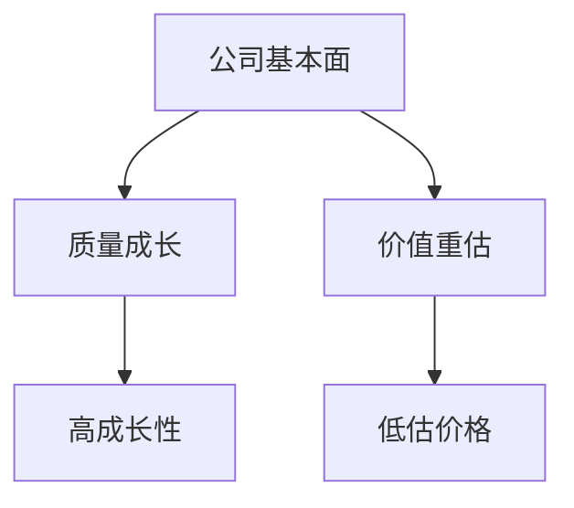
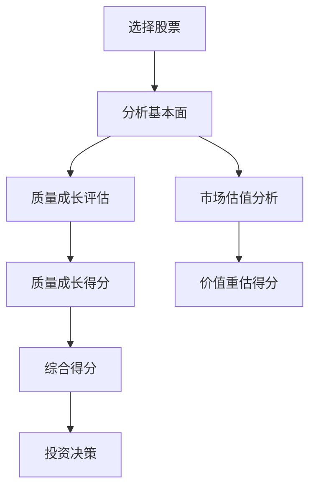
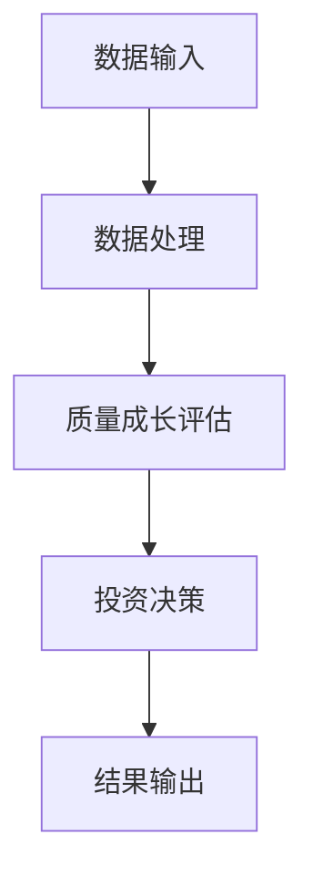
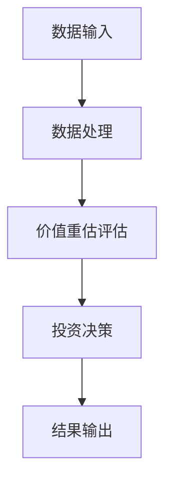

                 


# 彼得林奇的"质量成长"vs"价值重估"在新经济股中的权衡

## 关键词：
彼得林奇、质量成长、价值重估、新经济股、投资策略

## 摘要：
本文深入探讨了彼得·林奇提出的“质量成长”与“价值重估”两种投资策略在新经济股中的应用与权衡。通过对比分析，结合新经济股的特点，构建了一个综合策略模型，并通过实际案例和系统设计展示了如何在实际投资中应用这些策略。文章内容丰富，逻辑清晰，结合理论与实践，为投资者提供了有价值的参考。

---

## 第一部分：引言

### 1.1 彼得·林奇的投资理念概述

#### 1.1.1 彼得·林奇的生平与投资风格
彼得·林奇（Peter Lynch）是美国著名的投资经理人，以其在富达麦哲伦基金的卓越表现而闻名。他强调长期投资和对公司基本面的深入分析，倡导寻找具有持续增长潜力的公司。林奇的投资风格注重质量和成长性，而非短期市场波动。

#### 1.1.2 质量成长与价值重估的定义与区别
- **质量成长**：关注公司的基本面，寻找具有稳定收入增长、高利润率和良好市场地位的企业。
- **价值重估**：关注市场对公司的估值是否合理，寻找被市场低估的股票。

#### 1.1.3 新经济股的特征与投资机会
新经济股通常指科技、互联网、电子商务等行业的股票，具有高增长潜力和高波动性。这些行业的公司往往符合质量成长的特征，但也可能因市场情绪而被低估或高估。

---

## 第二部分：质量成长策略的核心要素

### 2.1 质量成长的定义与核心指标

#### 2.1.1 质量成长的定义
质量成长策略的核心在于选择那些具有持续收入增长、高利润率和强大市场地位的公司。这些公司在市场中具备竞争优势，能够持续为股东创造价值。

#### 2.1.2 质量成长的核心指标
- **收入增长率**：衡量公司业务扩展能力。
- **净利润率**：反映公司的盈利能力。
- **ROE（净资产收益率）**：衡量公司使用股东资金的效率。

#### 2.1.3 质量成长与新经济股的结合
新经济股的高增长性和创新性使其成为质量成长策略的理想目标。例如，科技公司在技术研发和市场扩张方面具有持续增长潜力。

---

### 2.2 质量成长策略的优缺点

#### 2.2.1 优点：长期稳定的收益
质量成长策略注重公司基本面，能够在长期为投资者带来稳定的收益。例如，苹果公司通过持续创新和市场扩展，实现了长期的增长。

#### 2.2.2 缺点：短期波动风险与市场波动的影响
尽管质量成长策略注重长期增长，但在市场波动中，优质成长股可能因短期市场情绪而出现价格波动，影响投资者的短期收益。

---

## 第三部分：价值重估的核心要素

### 3.1 价值重估的定义与核心指标

#### 3.1.1 价值重估的定义
价值重估策略关注市场对公司的估值是否合理，寻找那些被市场低估的股票。这种策略通常在市场低迷或公司暂时遇到困难时表现良好。

#### 3.1.2 价值重估的核心指标
- **市盈率（P/E）**：衡量股价与公司盈利之间的关系。
- **市净率（P/B）**：衡量股价与公司资产之间的关系。

#### 3.1.3 价值重估与新经济股的结合
新经济股因高成长性和创新性，有时会被市场高估。价值重估策略可以帮助投资者识别那些因市场情绪被低估的新经济股。

---

### 3.2 价值重估策略的优缺点

#### 3.2.1 优点：捕捉市场低估的机会
价值重估策略能够在市场低估时捕捉到优质股票，为投资者带来超额收益。

#### 3.2.2 缺点：周期性波动与市场情绪的影响
价值重估策略受市场情绪影响较大，可能因市场周期性波动而影响投资收益。

---

## 第四部分：质量成长与价值重估的权衡与结合

### 4.1 质量成长与价值重估的对比分析

#### 4.1.1 核心概念对比表格
| **维度**       | **质量成长**                     | **价值重估**                     |
|----------------|----------------------------------|----------------------------------|
| 核心关注点     | 公司基本面与成长性               | 市场估值与价格合理性             |
| 适用场景       | 高成长性公司                   | 市场低估或被忽视的公司           |
| 风险           | 高成长公司的估值可能偏高         | 市场低估可能导致短期波动          |

#### 4.1.2 ER实体关系图（Mermaid流程图）


### 4.2 质量成长与价值重估的权衡模型

#### 4.2.1 权衡模型的构建（Mermaid流程图）


#### 4.2.2 数学模型与公式
- **质量成长得分**：综合收入增长率、净利润率和ROE计算。
  $$ \text{质量成长得分} = \frac{\text{收入增长率} + \text{净利润率} + \text{ROE}}{3} $$
- **价值重估得分**：综合市盈率和市净率计算。
  $$ \text{价值重估得分} = \frac{\text{市盈率} + \text{市净率}}{2} $$

---

## 第五部分：新经济股中的策略应用

### 5.1 新经济股的特点与分类

#### 5.1.1 新经济股的定义与分类
新经济股主要指科技、互联网、电子商务等行业的股票，具有高增长性和创新性。

#### 5.1.2 新经济股与传统经济股的对比
- **新经济股**：高增长、高波动。
- **传统经济股**：稳定增长、低波动。

---

### 5.2 新经济股中的质量成长策略应用

#### 5.2.1 典型案例分析
以苹果公司为例，其高收入增长率和高净利润率使其成为质量成长策略的理想选择。

#### 5.2.2 系统架构设计（Mermaid架构图）


#### 5.2.3 项目实战：环境安装与代码实现
- **环境安装**：安装Python和相关库（如pandas、numpy）。
- **代码实现**：
  ```python
  import pandas as pd
  df = pd.read_csv('data.csv')
  df['质量成长得分'] = (df['收入增长率'] + df['净利润率'] + df['ROE']) / 3
  ```

---

### 5.3 新经济股中的价值重估策略应用

#### 5.3.1 典型案例分析
以某互联网公司为例，当市盈率低于行业平均水平时，可能被市场低估，适合价值重估策略。

#### 5.3.2 系统架构设计（Mermaid架构图）


---

## 第六部分：质量成长与价值重估的综合策略

### 6.1 综合策略的构建与实施

#### 6.1.1 综合策略的核心思想
结合质量成长和价值重估的优势，根据市场环境动态调整投资策略。

---

## 第七部分：结论与建议

### 7.1 总结
质量成长和价值重估各有优缺点，在新经济股中可以根据市场环境和公司基本面进行权衡。

### 7.2 最佳实践 tips
- 定期评估公司基本面和市场估值。
- 根据市场环境动态调整策略。

### 7.3 小结
通过综合策略的应用，投资者可以在新经济股中实现长期稳定的收益。

### 7.4 注意事项
- 风险提示：投资需谨慎，市场波动不可预测。
- 持续学习：关注行业动态和市场变化。

### 7.5 拓展阅读
推荐阅读彼得·林奇的《投资最重要的事》和《股市投资策略》。

--- 

以上是完整的大纲结构，具体内容可以根据上述结构展开详细写作。

