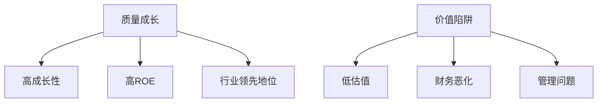

                 

# 彼得林奇的"质量成长"vs"价值陷阱"

> 关键词：彼得·林奇，质量成长，价值陷阱，投资策略，基本面分析

> 摘要：本文详细探讨了彼得·林奇提出的“质量成长”和“价值陷阱”两个核心投资概念。通过对比分析，帮助投资者理解如何在股票投资中识别和选择具有长期增长潜力的公司，同时避免那些看似便宜实则存在重大问题的价值陷阱。文章结合理论与实践，提供了丰富的案例分析和系统化的投资策略。

---

# 第一部分: 投资基础与彼得·林奇的投资理念

## 第1章: 投资基础与基本面分析

### 1.1 投资的基本概念

#### 1.1.1 投资的定义与分类

- **投资的定义**: 
  投资是指将资金投入到某个资产或项目中，以期获得未来收益的行为。根据资产类型，投资可以分为股票、债券、房地产、基金等多种形式。
  
- **分类**:
  - **股票投资**: 通过购买公司股份，成为股东，分享公司利润。
  - **债券投资**: 购买政府或企业发行的债券，获得固定利息收入。
  - **房地产投资**: 通过购买房地产资产获取租金收入或资本增值。
  - **其他投资**: 包括黄金、艺术品等。

#### 1.1.2 股票投资的基本原理

- **股票的性质**:
  股票代表公司所有权的一部分，持有股票的投资者有权参与公司利润分配和决策。

- **股票价格的影响因素**:
  - **宏观经济因素**: 利率、通货膨胀、GDP增长等。
  - **行业因素**: 行业发展趋势、政策影响。
  - **公司因素**: 财务状况、管理团队、产品竞争力。

#### 1.1.3 基本面分析的核心要素

- **基本面分析**:
  基本面分析是通过研究公司的财务报表、行业地位、管理团队等因素，评估其内在价值的过程。

- **核心要素**:
  - **财务报表**: 利润表、资产负债表、现金流量表。
  - **盈利能力**: 净利润、ROE（净资产收益率）。
  - **成长能力**: 收入增长率、净利润增长率。
  - **财务健康状况**: 负债率、流动比率。

---

### 1.2 彼得·林奇的投资理念

#### 1.2.1 彼得·林奇的生平简介

- 彼得·林奇（Peter Lynch）是美国著名投资经理，曾管理富达麦哲伦基金，创造了年化29%的惊人回报率。
- 他以选股能力强著称，尤其擅长挖掘那些具有长期增长潜力的公司。

#### 1.2.2 彼得·林奇的投资哲学

- **长期投资**: 林奇主张长期持有优质股票，避免频繁交易。
- **质量成长**: 选择那些具有强大竞争优势、良好财务状况和持续增长潜力的公司。
- **分散投资**: 通过投资不同行业和公司的股票，降低风险。

#### 1.2.3 彼得·林奇的长期投资策略

- **长期持有**: 林奇认为，短期市场波动难以预测，长期持有优质股票才能获得超额收益。
- **注重基本面**: 通过深入分析公司的财务报表和行业地位，选择具有竞争优势的公司。
- **避免短期干扰**: 不受市场情绪影响，专注于公司的长期增长潜力。

---

## 第2章: 质量成长的定义与核心要素

### 2.1 质量成长的定义

#### 2.1.1 质量成长的定义与特点

- **定义**: 质量成长是指投资那些具有强大竞争优势、良好财务状况和持续增长潜力的公司。这些公司通常处于高增长行业，市场份额稳定，并且具有较高的ROE（净资产收益率）。
- **特点**:
  - 高成长性: 收入和利润持续增长。
  - 高ROE: 净利润与净资产的比率高。
  - 行业领先地位: 在行业中具有竞争优势。

#### 2.1.2 质量成长公司的核心特征

- **高成长性**:
  - 收入增长率>10%。
  - 净利润增长率>10%。

- **高ROE**:
  - ROE > 15%。
  - 净利润与净资产的比率高。

- **行业地位**:
  - 市场份额领先。
  - 行业壁垒高。

#### 2.1.3 质量成长与价值投资的区别

- **价值投资**: 寻找被市场低估的股票，等待其价值回归。
- **质量成长**: 寻找具有持续增长潜力的公司，长期持有。

---

### 2.2 质量成长的核心要素

#### 2.2.1 公司基本面分析

- **利润表**: 重点关注收入和利润的增长。
- **资产负债表**: 重点关注负债水平和现金流状况。
- **现金流量表**: 重点关注经营活动现金流是否为正。

#### 2.2.2 行业地位与竞争优势

- **行业趋势**: 行业是否处于增长期。
- **市场份额**: 公司在行业中的市场份额。
- **竞争优势**: 技术优势、成本优势、品牌优势。

#### 2.2.3 财务健康状况与增长潜力

- **财务健康**:
  - 负债率低。
  - 流动比率高。
  - 净利润增长稳定。

- **增长潜力**:
  - 行业增长空间大。
  - 公司管理团队优秀。
  - 创新能力强。

---

## 第3章: 价值陷阱的定义与识别

### 3.1 价值陷阱的定义

#### 3.1.1 价值陷阱的定义与特点

- **定义**: 价值陷阱是指那些表面上看似便宜，但实际上存在重大问题，无法长期持有的股票。这些股票可能因为行业衰退、管理不善或财务问题导致价值持续下降。
- **特点**:
  - 低估值: 市盈率或市净率低于行业平均水平。
  - 高负债: 负债率高，财务风险大。
  - 管理问题: 公司管理混乱，缺乏战略规划。

#### 3.1.2 价值陷阱与价值投资的差异

- **价值投资**:
  - 寻找被市场低估的股票。
  - 公司基本面良好，具有长期增长潜力。
- **价值陷阱**:
  - 表面看似便宜，但基本面存在问题。
  - 公司可能面临重大风险，难以恢复。

#### 3.1.3 价值陷阱的常见类型

- **行业衰退型**: 所在行业处于衰退期，市场需求下降。
- **管理混乱型**: 公司管理不善，战略不清。
- **财务恶化型**: 财务状况恶化，负债累累，现金流为负。

---

### 3.2 价值陷阱的核心特征

#### 3.2.1 财务状况恶化

- **高负债**: 负债率 > 50%。
- **现金流为负**: 经营活动现金流 < 0。
- **净利润为负**: 净利润 < 0。

#### 3.2.2 行业竞争格局变化

- **行业饱和**: 市场竞争激烈，需求不足。
- **技术落后**: 产品或技术落后于行业平均水平。
- **政策变化**: 行业政策变化导致公司业务受限。

#### 3.2.3 公司管理问题

- **管理层动荡**: 高层频繁变动。
- **治理结构混乱**: 股东与管理层利益不一致。
- **内部控制失效**: 公司内部管理混乱，存在舞弊行为。

---

## 第4章: 质量成长与价值陷阱的比较分析

### 4.1 质量成长与价值陷阱的对比

#### 4.1.1 核心概念对比表

| 对比维度         | 质量成长                               | 价值陷阱                               |
|------------------|--------------------------------------|--------------------------------------|
| 定义             | 投资具有持续增长潜力的公司             | 投资表面上看似便宜，但存在重大问题的股票 |
| 核心特征         | 高ROE、高成长性、行业领先地位         | 低估值、高负债、管理问题、财务恶化     |
| 投资策略         | 长期持有，分享公司增长                | 避免投资，及时止损                   |

#### 4.1.2 质量成长与价值陷阱的实体关系图

### 4.2 质量成长与价值陷阱的区分方法

#### 4.2.1 基于财务指标的区分

- **ROE**: 质量成长公司的ROE > 15%，而价值陷阱公司的ROE < 10%。
- **收入增长率**: 质量成长公司的收入增长率 > 10%，而价值陷阱公司的收入增长率 < 5%。
- **净利润增长率**: 质量成长公司的净利润增长率 > 10%，而价值陷阱公司的净利润可能为负。

#### 4.2.2 基于行业趋势的区分

- **行业增长空间**: 质量成长公司所在的行业具有较大的增长空间，而价值陷阱公司所在的行业可能处于衰退期。
- **市场份额**: 质量成长公司市场份额领先，而价值陷阱公司可能市场份额逐渐被蚕食。

#### 4.2.3 基于公司治理的区分

- **管理层稳定性**: 质量成长公司管理层稳定，战略清晰，而价值陷阱公司管理层可能存在动荡。
- **公司治理结构**: 质量成长公司治理结构良好，股东与管理层利益一致，而价值陷阱公司治理结构可能存在混乱。

---

## 第5章: 质量成长与价值陷阱的数学分析

### 5.1 质量成长的数学模型

#### 5.1.1 ROE的计算

$$ \text{ROE} = \frac{\text{净利润}}{\text{净资产}} $$

- 质量成长公司的ROE > 15%。

#### 5.1.2 收入增长率的计算

$$ \text{收入增长率} = \frac{\text{本年收入} - \text{上年收入}}{\text{上年收入}} \times 100\% $$

- 质量成长公司的收入增长率 > 10%。

#### 5.1.3 净利润增长率的计算

$$ \text{净利润增长率} = \frac{\text{本年净利润} - \text{上年净利润}}{\text{上年净利润}} \times 100\% $$

- 质量成长公司的净利润增长率 > 10%。

### 5.2 价值陷阱的数学模型

#### 5.2.1 负债率的计算

$$ \text{负债率} = \frac{\text{总负债}}{\text{总资产}} \times 100\% $$

- 价值陷阱公司的负债率 > 50%。

#### 5.2.2 现金流为负的判断

$$ \text{经营活动现金流} < 0 $$

- 价值陷阱公司经营活动现金流为负。

#### 5.2.3 净利润为负的判断

$$ \text{净利润} < 0 $$

- 价值陷阱公司净利润为负。

---

## 第6章: 投资策略与实战分析

### 6.1 投资策略

#### 6.1.1 选择质量成长公司的策略

- **行业分析**: 选择处于高增长行业的公司。
- **基本面分析**: 重点关注ROE、收入增长率和净利润增长率。
- **公司治理**: 选择管理层稳定、治理结构良好的公司。

#### 6.1.2 避免价值陷阱的策略

- **避免低估值陷阱**: 不要仅看市盈率或市净率，还要看公司基本面。
- **避免财务恶化陷阱**: 重点关注负债率、现金流和净利润。
- **避免管理混乱陷阱**: 关注管理层稳定性。

### 6.2 实战分析

#### 6.2.1 案例分析

- **质量成长案例**: 苹果公司（AAPL）
  - 高ROE（ROE > 20%）。
  - 高收入增长率（> 10%）。
  - 行业领先地位（全球最大的科技公司之一）。
  
- **价值陷阱案例**: 黑莓公司（BB）
  - 负债率 > 50%。
  - 经营活动现金流为负。
  - 管理层动荡。

#### 6.2.2 投资组合管理

- **分散投资**: 不将所有资金投入单一行业或公司。
- **定期复盘**: 每季度复盘一次投资组合，评估公司基本面变化。
- **风险管理**: 设定止损点，避免重大损失。

---

## 第7章: 总结与展望

### 7.1 总结

- 彼得·林奇的“质量成长”和“价值陷阱”为我们提供了两种截然不同的投资思路。
- 质量成长强调选择具有持续增长潜力的公司，而价值陷阱提醒我们避免那些看似便宜但实则存在重大问题的股票。
- 投资者需要结合基本面分析和行业趋势，选择真正具有长期增长潜力的公司。

### 7.2 展望

- 随着全球经济的变化，投资环境也在不断变化。
- 未来，投资者需要更加注重公司的创新能力和应对市场变化的能力。
- 通过深入研究和持续学习，投资者可以在复杂的市场中找到真正具有质量成长的公司。

---

## 第8章: 最佳实践与注意事项

### 8.1 最佳实践

#### 8.1.1 小结

- 理解“质量成长”和“价值陷阱”的核心概念。
- 学习基本面分析方法，识别具有长期增长潜力的公司。
- 避免价值陷阱，保护投资本金。

#### 8.1.2 注意事项

- **避免短期波动干扰**: 长期持有优质股票，避免因短期市场波动而做出错误决策。
- **持续学习**: 市场在不断变化，投资者需要不断学习新的知识和技能。
- **分散投资**: 不要将所有资金投入单一行业或公司，降低投资风险。

#### 8.1.3 拓展阅读

- 《彼得·林奇的成功投资》。
- 《价值投资入门》。
- 《投资学基础》。

---

# 结语

彼得·林奇的“质量成长”和“价值陷阱”为我们提供了重要的投资思路。通过深入分析公司的基本面和行业趋势，投资者可以更好地识别具有长期增长潜力的公司，同时避免那些看似便宜实则存在重大问题的价值陷阱。投资需要耐心和持续学习，只有不断精进自己的投资策略，才能在复杂的市场中获得长期稳定的收益。

--- 

希望这篇文章能满足您的需求！如果需要进一步调整或补充，请随时告诉我。

