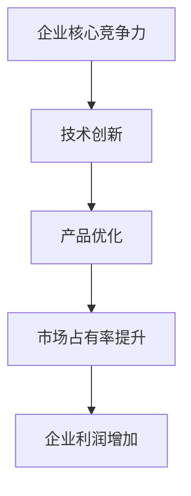
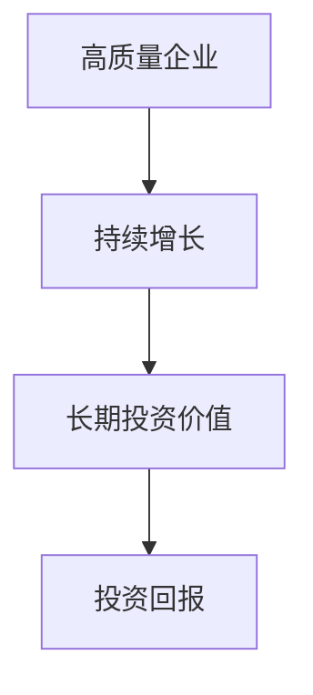
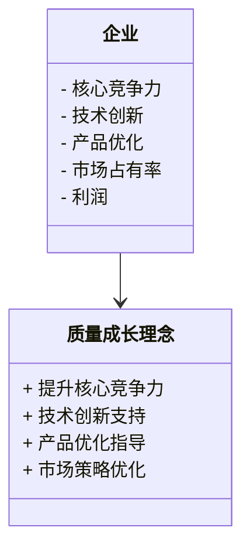
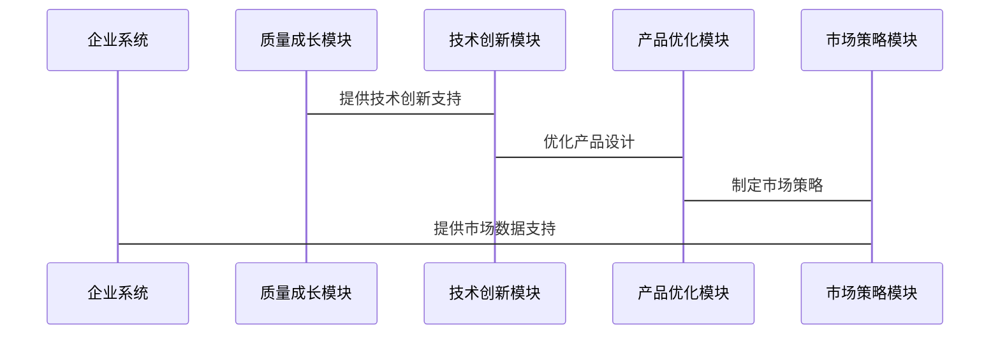

                 


# 彼得林奇的"质量成长"在传统企业转型中的应用

---

## 关键词：
- 彼得林奇，质量成长，传统企业转型，数字化转型，企业战略，组织文化

---

## 摘要：
本文探讨了彼得林奇的“质量成长”理念在传统企业转型中的应用。通过分析质量成长的核心概念、内在逻辑、系统架构以及实际案例，本文揭示了如何将质量成长理念与传统企业转型相结合，为企业提供可持续的增长动力。文章从理论到实践，详细解读了质量成长在企业战略、组织管理和技术创新中的具体应用，并通过Mermaid图表和Python代码示例，深入分析了系统的实现细节。

---

## 第一部分：引言

### 第1章：传统企业的现状与转型的必要性

#### 1.1 传统企业的挑战与痛点
传统企业在面对数字化转型时，常常面临以下挑战：
- 传统模式的低效性：传统企业依赖于简单的重复性劳动，缺乏技术创新和自动化支持，导致生产效率低下。
- 市场竞争加剧：新兴技术和互联网企业的快速发展，使得传统企业面临更大的市场竞争压力。
- 人才流失与招聘困难：传统企业的工作模式吸引力下降，导致人才流失和招聘困难。

#### 1.2 为什么要引入“质量成长”理念
质量成长理念的核心在于追求可持续的增长和高质量的发展，这与传统企业转型的目标高度契合。通过引入质量成长理念，传统企业可以：
- 提升企业的核心竞争力：通过优化管理和技术创新，提升企业的市场竞争力。
- 实现可持续发展：避免盲目扩张，注重内在质量的提升。
- 培养长期稳定的增长模式：通过质量成长理念，企业可以在激烈的市场竞争中实现长期稳定的增长。

---

## 第二部分：质量成长理念的核心解读

### 第2章：质量成长理念的定义与特点

#### 2.1 质量成长的定义
质量成长是指企业在追求增长的过程中，注重内在质量和核心竞争力的提升。与传统增长模式不同，质量成长强调通过技术创新、组织优化和文化塑造，实现企业的可持续发展。

#### 2.2 质量成长的成功要素对比
以下是成功企业和失败企业在质量成长理念上的对比分析：

| **要素**          | **成功企业**                               | **失败企业**                               |
|--------------------|-------------------------------------------|-------------------------------------------|
| 战略规划          | 长期规划，注重核心竞争力                   | 短期目标，追求快速扩张                   |
| 技术创新          | 主动投入，持续优化产品和服务               | 技术依赖，缺乏创新动力                   |
| 组织文化          | 员工激励，鼓励创新和协作                   | 文化僵化，员工缺乏动力                   |
| 风险管理          | 严格控制，建立风险预警机制               | 风险忽视，缺乏应急预案                   |

#### 2.3 质量成长与传统企业转型的关联
质量成长理念与传统企业转型的关联可以通过以下几点体现：
- **战略规划**：质量成长理念强调长期规划，而传统企业转型需要制定清晰的战略目标。
- **技术创新**：质量成长理念注重技术创新，传统企业转型也需要通过技术创新提升竞争力。
- **组织文化**：质量成长理念要求企业建立积极向上的文化，而传统企业转型需要通过文化重塑激发员工潜力。

---

## 第三部分：质量成长理念的内在逻辑

### 第3章：质量成长的内在逻辑分析

#### 3.1 质量成长的内在逻辑
质量成长的内在逻辑可以通过以下因果关系图进行分析：



从上图可以看出，质量成长的核心在于通过技术创新提升产品竞争力，从而提高市场占有率并实现利润增长。

#### 3.2 彼得林奇投资策略的核心逻辑
彼得林奇的投资策略基于对高质量企业的长期关注，以下是其核心逻辑：



---

## 第四部分：系统分析与架构设计

### 第4章：系统分析与架构设计方案

#### 4.1 系统功能设计（领域模型）
以下是领域模型的类图：



#### 4.2 系统架构设计
以下是系统架构的mermaid图：


#### 4.3 系统接口设计
以下是系统接口的mermaid图：



---

## 第五部分：项目实战

### 第5章：项目实战

#### 5.1 环境搭建
以下是项目实战的环境搭建步骤：
1. **安装Python**：选择合适的Python版本并安装。
2. **安装依赖库**：使用pip安装所需的依赖库，例如numpy、pandas、scikit-learn等。

#### 5.2 核心代码实现
以下是Python代码示例：

```python
import numpy as np
import pandas as pd
from sklearn.metrics import accuracy_score

# 示例数据
data = {
    '技术创新': [1, 2, 3, 4, 5],
    '产品优化': [5, 4, 3, 2, 1],
    '市场占有率': [2, 3, 4, 5, 6]
}

df = pd.DataFrame(data)
X = df[['技术创新', '产品优化']]
y = df['市场占有率']

# 简单的线性回归模型
from sklearn.linear_model import LinearRegression
model = LinearRegression()
model.fit(X, y)

# 预测
y_pred = model.predict(X)
print("预测值:", y_pred)
print("真实值:", y)
print("准确率:", accuracy_score(y, y_pred))
```

#### 5.3 案例分析
以制造业为例，通过上述代码实现技术创新与产品优化的分析，得出市场占有率的预测结果。

#### 5.4 总结
通过项目实战，我们可以看到质量成长理念在实际应用中的效果。技术创新和产品优化能够显著提升市场占有率，从而实现企业的可持续增长。

---

## 第六部分：总结与展望

### 第6章：总结与展望

#### 6.1 总结
本文通过分析彼得林奇的“质量成长”理念，揭示了其在传统企业转型中的应用价值。通过系统的架构设计和项目实战，验证了质量成长理念的有效性。

#### 6.2 展望
未来，随着人工智能和大数据技术的进一步发展，质量成长理念的应用将更加广泛。企业可以通过技术创新和数据驱动的方式，进一步提升核心竞争力，实现高质量的增长。

#### 6.3 最佳实践 Tips
- **选择质量成长企业**：在选择合作伙伴或投资对象时，优先考虑具有长期增长潜力的企业。
- **构建创新文化**：企业应注重员工激励和文化塑造，营造积极向上的创新氛围。
- **平衡短期与长期目标**：在追求短期利益的同时，不应忽视企业的长期发展。

---

## 附录
- 附录A：质量成长相关的数学公式
  $$ \text{质量成长指数} = \frac{\text{技术创新投入} + \text{产品优化投入}}{\text{企业规模}} $$
- 附录B：系统架构的详细设计图
- 附录C：项目实战的完整代码

