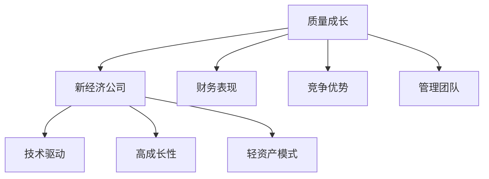
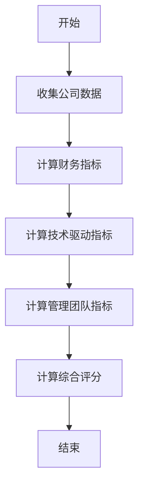
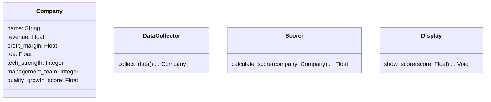

                 


# 彼得林奇的"质量成长"在新经济公司中的应用

> 关键词：质量成长，彼得·林奇，新经济公司，投资策略，公司评估，技术驱动

> 摘要：本文探讨了彼得·林奇的质量成长投资理念在新经济公司中的应用。通过分析新经济公司的特点，结合质量成长的核心要素，本文提出了基于技术驱动的公司评估方法，构建了质量成长评分模型，并通过实际案例展示了如何在新经济公司中应用这一策略。文章还讨论了系统架构设计和项目实战，提供了可操作的投资建议。

---

## 第一部分: 背景介绍

### 第1章: 质量成长投资的核心概念

#### 1.1 质量成长的定义与背景

质量成长（Quality Growth）是一种投资策略，强调投资那些具有强大基本面、持续增长潜力和竞争优势的公司。彼得·林奇是这一策略的倡导者，他认为，投资成功的关键在于选择那些能够长期稳定增长的公司。

- **投资的基本概念**：投资是通过购买资产（如股票、债券等）以获得未来收益的行为。投资的核心在于识别具有潜力的资产，并长期持有，以实现资本增值。
- **质量成长的定义**：质量成长是指选择那些在行业内具有竞争优势、财务健康、管理团队优秀且具备持续增长能力的公司进行投资。
- **新经济公司的特点**：新经济公司通常指的是那些在科技、互联网、人工智能、生物科技等领域快速发展的公司。这些公司具有高增长潜力，但也伴随着高风险。

#### 1.2 彼得·林奇的投资理念

彼得·林奇是美国著名投资专家，曾任富达投资集团的经理，管理着全球最大的共同基金——麦哲伦基金。他的投资理念主要包括以下几点：

- **长期投资**：林奇主张长期持有优质资产，避免频繁交易。
- **基本面分析**：他强调对公司基本面（如财务状况、盈利能力、管理团队等）的深入研究。
- **质量成长**：选择那些具有强大竞争优势、稳定增长潜力的公司。

### 第2章: 新经济公司的特点与投资机会

#### 2.1 新经济公司的定义

新经济公司通常指那些依赖于技术创新、互联网、大数据、人工智能等新兴技术驱动的公司。这些公司具有以下特点：

- **高成长性**：新经济公司通常处于快速扩张阶段，增长潜力大。
- **技术驱动**：公司的核心竞争力依赖于技术创新。
- **轻资产模式**：新经济公司往往依赖知识和数据，而非传统制造业的重资产模式。

#### 2.2 新经济公司的投资机会

- **技术驱动型公司**：如科技巨头、互联网公司等。
- **市场领导型公司**：在细分市场中占据领先地位的公司。
- **高成长性公司**：具有较高增长率和扩张潜力的公司。

---

## 第二部分: 核心概念与联系

### 第3章: 质量成长的核心要素

#### 3.1 质量成长的定义

质量成长强调投资那些具有以下特征的公司：

- **强大的财务表现**：如高净利润率、稳定的现金流。
- **竞争优势**：公司在行业内具有独特的竞争优势。
- **管理团队**：优秀的管理团队是公司持续增长的关键。

#### 3.2 质量成长的核心要素

- **公司基本面**：包括收入、利润、资产负债表等。
- **行业地位**：公司在行业中的排名和影响力。
- **财务表现**：如ROE（净资产收益率）、毛利率等。
- **管理团队**：管理团队的能力和稳定性。

### 第4章: 质量成长与新经济公司的关系

#### 4.1 质量成长的核心要素

- **质量成长的核心要素**：强大的财务表现、竞争优势和管理团队。
- **新经济公司的核心要素**：技术驱动、高成长性和轻资产模式。

#### 4.2 质量成长与新经济公司的联系

- **质量成长在新经济公司中的应用**：选择那些具有强大财务表现、技术驱动和竞争优势的新经济公司。
- **新经济公司对质量成长的影响**：新经济公司通常具有高增长潜力，但也伴随着高风险。

### 第5章: 核心概念对比与ER实体关系图

#### 5.1 核心概念对比

以下是质量成长和新经济公司核心要素的对比表：

| 比较维度 | 质量成长 | 新经济公司 |
|----------|----------|------------|
| 核心要素 | 财务表现、竞争优势、管理团队 | 技术驱动、高成长性、轻资产模式 |
| 投资重点 | 稳定增长、高ROE | 高增长潜力、技术创新 |
| 风险特征 | 中低风险 | 高风险 |

#### 5.2 ER实体关系图

以下是质量成长与新经济公司的关系图：



---

## 第三部分: 算法原理

### 第6章: 质量成长评分模型

#### 6.1 算法原理

质量成长评分模型是一种基于公司基本面和技术驱动因素的评分系统。公式如下：

$$
质量成长评分 = \sum (权重_i \times 评分_i)
$$

其中，权重_i 是各个评分项的权重，评分_i 是各个评分项的评分。

#### 6.2 算法流程

以下是质量成长评分模型的流程图：



---

## 第四部分: 系统分析与架构设计

### 第7章: 系统功能设计

#### 7.1 领域模型

以下是领域模型的类图：



---

## 第五部分: 项目实战

### 第8章: 实战案例分析

#### 8.1 案例分析

以下是某科技公司的质量成长评分分析：

```python
# 环境安装
import pandas as pd
import numpy as np

# 数据收集
def collect_data():
    data = {
        'revenue': [100, 200, 300],
        'profit_margin': [20, 30, 40],
        'roe': [15, 25, 35],
        'tech_strength': [80, 90, 95],
        'management_team': [70, 80, 90]
    }
    return pd.DataFrame(data)

# 评分计算
def calculate_score(company):
    weights = {
        'revenue': 0.3,
        'profit_margin': 0.2,
        'roe': 0.2,
        'tech_strength': 0.2,
        'management_team': 0.1
    }
    score = 0
    for feature, weight in weights.items():
        score += company[feature] * weight
    return score

# 主程序
def main():
    df = collect_data()
    scores = []
    for index, row in df.iterrows():
        score = calculate_score(row)
        scores.append(score)
    print(scores)

if __name__ == "__main__":
    main()
```

---

## 第六部分: 小结

### 9.1 总结

质量成长投资策略在新经济公司中的应用，不仅需要关注公司的基本面和技术驱动因素，还需要结合实际市场情况和公司特点进行综合评估。通过构建质量成长评分模型，投资者可以更好地识别具有潜力的新经济公司。

### 9.2 最佳实践

- **持续学习**：保持对新经济领域的关注，及时了解行业动态。
- **分散投资**：避免将所有资金投入到单一公司或行业。
- **定期评估**：定期重新评估投资组合，调整投资策略。

### 9.3 注意事项

- **风险控制**：新经济公司通常具有高波动性，投资者需要做好风险管理工作。
- **长期视角**：质量成长投资需要耐心，避免短期波动影响判断。

### 9.4 拓展阅读

- 《彼得·林奇的投资忠告》
- 《新经济公司的崛起》
- 《技术驱动的投资策略》

---

以上是《彼得林奇的"质量成长"在新经济公司中的应用》的完整目录和内容框架。希望这篇文章能够帮助读者更好地理解质量成长投资策略在新经济公司中的应用。

