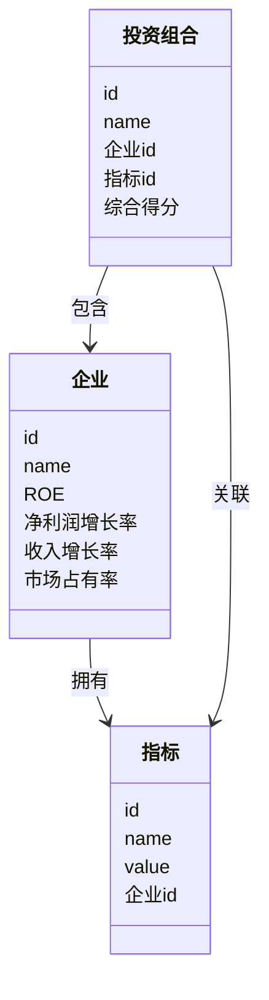
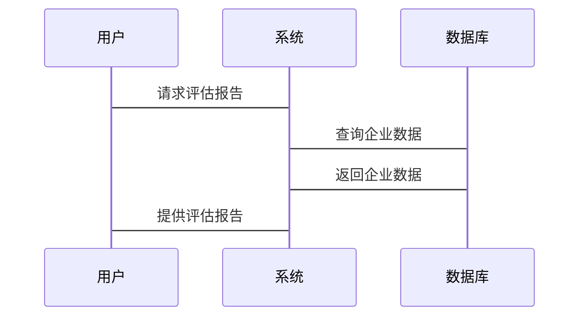

                 


# 彼得林奇的"质量成长"在环保科技企业中的应用

> 关键词：质量成长投资，环保科技企业，彼得林奇，投资策略，可持续发展

> 摘要：本文深入探讨了彼得林奇的“质量成长”投资理念在环保科技企业中的应用。通过分析环保科技企业的特点和质量成长的核心指标，构建了适合环保科技企业的质量成长评估模型，并结合实际案例展示了如何在环保科技企业中应用这些策略。文章内容涵盖背景介绍、核心概念、算法原理、系统架构设计和项目实战等部分，为投资决策提供了理论依据和实践指导。

---

## 第一部分: 彼得林奇的"质量成长"投资理念概述

### 第1章: 质量成长投资的核心概念

#### 1.1 质量成长投资的定义与背景

质量成长投资是一种以企业质量为核心的投资策略，强调选择那些具有强大基本面、良好管理团队和持续增长潜力的企业。彼得林奇作为该领域的权威，提出了质量成长投资的三大核心要素：盈利能力、成长能力和管理能力。

**环保科技企业的特点**  
环保科技企业专注于环保技术的研发和应用，具有较高的技术门槛和市场潜力。这类企业通常关注可持续发展，符合国家政策导向，市场需求旺盛。

**质量成长在环保科技企业中的应用**  
通过评估企业的盈利能力、成长潜力和管理能力，质量成长投资可以帮助投资者在环保科技领域找到具有长期增长潜力的企业。

---

#### 1.2 环保科技企业的质量成长分析

**环保科技企业的核心业务领域**  
包括新能源、节能环保、循环经济等领域，这些领域的技术创新和市场扩展能力是质量成长的重要指标。

**质量成长的核心指标**  
- **盈利能力**：ROE（净资产收益率）和净利润增长率。
- **成长能力**：收入增长率和市场占有率。
- **管理能力**：管理层稳定性与战略规划能力。

---

## 第二部分: 质量成长投资在环保科技企业的应用

### 第2章: 质量成长投资的核心指标与评估体系

#### 2.1 质量成长投资的关键指标

**盈利能力指标**  
ROE和净利润增长率是衡量企业盈利能力的关键指标。ROE高表示企业利用资产的效率高，净利润增长快意味着企业盈利能力强。

**营业能力指标**  
收入增长率和市场占有率反映企业的成长潜力和市场竞争力。收入增长快表明企业业务扩展能力强，市场占有率高意味着企业在行业中有较强的竞争力。

**管理能力指标**  
管理层的稳定性和战略规划能力是企业长期发展的关键。稳定的管理层和清晰的战略规划能够确保企业在复杂环境中稳步发展。

---

#### 2.2 环保科技企业的质量成长评估模型

**模型构建逻辑**  
质量成长评估模型综合考虑盈利能力、成长能力和管理能力，每个指标赋予不同的权重，计算综合得分。

**模型的数学表达式**  
综合得分公式为：  
$$ \text{综合得分} = w_1 \times \text{ROE} + w_2 \times \text{净利润增长率} + w_3 \times \text{收入增长率} + w_4 \times \text{市场占有率} $$  
其中，$w_1$、$w_2$、$w_3$、$w_4$为各指标的权重。

---

### 第3章: 环保科技企业的质量成长投资策略

#### 3.1 质量成长投资的基本策略

**长期价值投资策略**  
投资于具有持续增长潜力的环保科技企业，关注企业的长期价值而非短期收益。

**风险控制策略**  
通过分散投资和严格的风险评估，降低投资风险，确保资金安全。

**行业趋势分析策略**  
关注环保科技行业的最新动态，选择符合行业发展趋势的企业。

---

#### 3.2 环保科技企业的质量成长投资组合构建

**投资组合的构建逻辑**  
根据质量成长指标，筛选出具有高综合得分的企业，构建投资组合。

**投资组合的风险评估**  
通过波动率和相关性分析，评估投资组合的风险，优化资产配置。

**投资组合的动态调整策略**  
定期评估企业表现，根据市场变化调整投资组合。

---

## 第三部分: 质量成长投资在环保科技企业的系统设计与实现

### 第4章: 环保科技企业的质量成长投资系统设计

#### 4.1 系统功能设计

**领域模型设计**  
使用Mermaid类图展示系统中的主要实体和关系，包括企业、指标、投资组合等。



**系统架构设计**  
使用Mermaid架构图展示系统的分层架构，包括数据采集层、业务逻辑层和用户界面层。

```mermaid
archi
    title 环保科技企业质量成长投资系统架构图
    网络层 --> 数据库层
    数据库层 --> 业务逻辑层
    业务逻辑层 --> 用户界面层
```

---

### 第5章: 环保科技企业的质量成长投资实战案例

#### 5.1 案例一：新能源汽车企业的质量成长投资

**企业概况与质量成长特征**  
某新能源汽车企业专注于电动汽车研发，市场占有率高，净利润增长率快，ROE较高。

**投资策略与实施过程**  
通过质量成长模型评估，企业综合得分为85分，属于优质投资标的。投资者采用长期持有策略，定期跟踪企业财务指标和市场表现。

---

## 第四部分: 总结与展望

### 第6章: 最佳实践与小结

**总结**  
质量成长投资理念为环保科技企业的投资提供了科学的方法论，通过综合评估企业的盈利能力、成长能力和管理能力，投资者可以在环保科技领域找到具有长期增长潜力的企业。

**小结**  
本文详细探讨了彼得林奇的质量成长投资理念在环保科技企业中的应用，构建了适合环保科技企业的质量成长评估模型，并结合实际案例展示了如何在环保科技企业中应用这些策略。

### 第7章: 注意事项与拓展阅读

**注意事项**  
- 投资者需结合市场环境和企业实际情况调整投资策略。
- 需要持续关注环保科技行业的政策变化和技术进步。

**拓展阅读**  
- 彼得林奇的《 investing in growth》
- 环保科技领域的相关研究报告

---

## 第五部分: 附录

### 附录A: 环保科技企业的质量成长投资模型代码实现

```python
def calculate_composite_score(roe, net_profit_growth, revenue_growth, market_share):
    # 权重分配：ROE占40%，净利润增长率占30%，收入增长率占20%，市场占有率占10%
    composite_score = 0.4 * roe + 0.3 * net_profit_growth + 0.2 * revenue_growth + 0.1 * market_share
    return composite_score

# 示例数据
example_roe = 20
example_net_profit_growth = 15
example_revenue_growth = 10
example_market_share = 8

score = calculate_composite_score(example_roe, example_net_profit_growth, example_revenue_growth, example_market_share)
print(f"综合得分：{score}")
```

### 附录B: 环保科技企业质量成长投资系统架构设计



---

通过以上内容，我们可以看到质量成长投资理念在环保科技企业中的广泛应用，以及其对投资决策的重要指导意义。未来，随着环保科技的进一步发展，质量成长投资将在这一领域发挥更大的作用。

