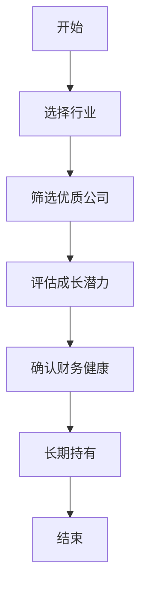
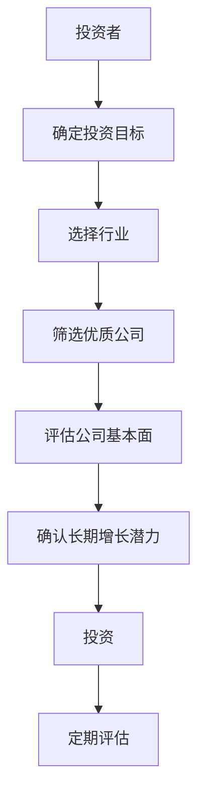
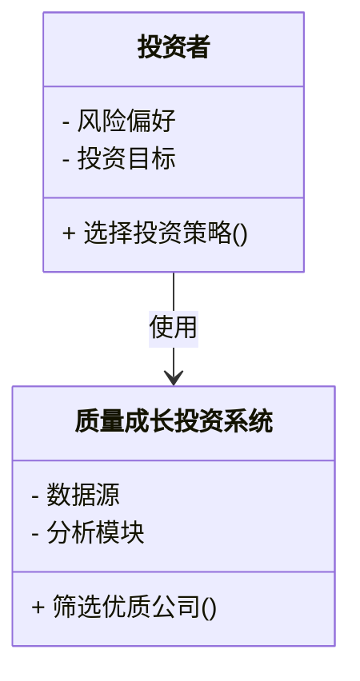
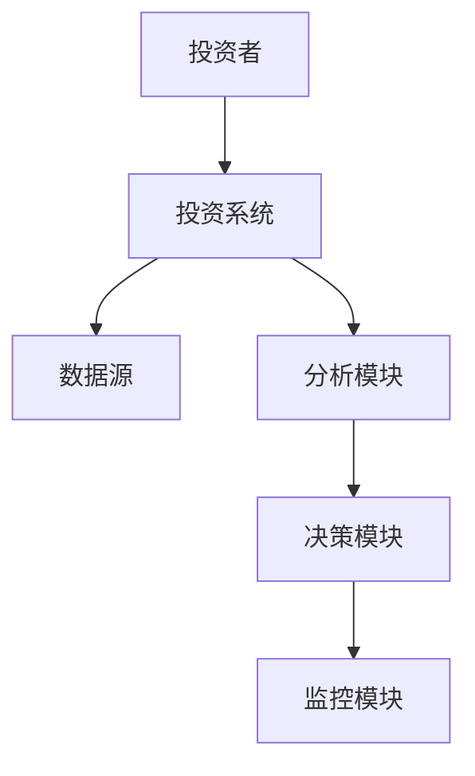
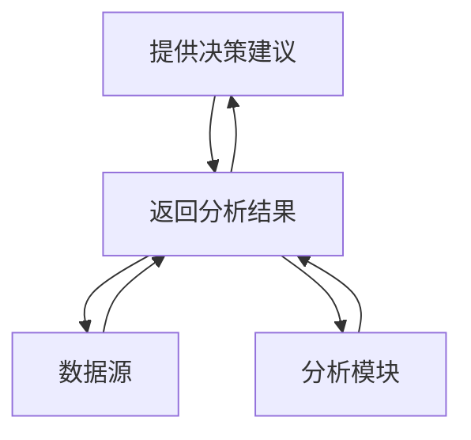

                 


# 彼得林奇的"质量成长"投资方法

> 关键词：彼得·林奇，质量成长，投资方法，优质公司，长期持有

> 摘要：本文深入探讨了彼得·林奇的质量成长投资方法，从核心概念、算法原理、系统架构到实战案例，全面分析了该方法的精髓，帮助投资者掌握优质公司的识别与长期投资策略。

---

## 第1章: 彼得林奇及其投资理念

### 1.1 彼得·林奇的背景介绍

#### 1.1.1 彼得·林奇的生平简介

彼得·林奇（Peter Lynch）是美国著名的投资专家，曾任Fidelity Management公司的基金经理。他以独特的投资方法闻名，尤其是对“质量成长”投资理念的倡导，帮助众多投资者实现了财富增长。

#### 1.1.2 他的投资哲学与理念

林奇的投资哲学强调选择优质公司长期持有，避免频繁交易。他认为，市场波动不应影响长期投资者的决策，优质公司的内在价值才是关键。

#### 1.1.3 质量成长投资的定义与核心要素

质量成长投资是指选择那些具备持续增长潜力和强劲财务表现的公司进行投资。核心要素包括稳定的收益、健康的财务状况和良好的管理团队。

### 1.2 质量成长投资的背景与现状

#### 1.2.1 投资市场的演变

随着市场的成熟，投资者逐渐认识到长期持有优质公司的价值，质量成长投资应运而生。

#### 1.2.2 质量成长投资的兴起

20世纪80年代，林奇的成功使质量成长投资成为主流策略，尤其在科技和医疗行业表现突出。

#### 1.2.3 当前投资环境中的质量成长策略

在当前市场环境下，质量成长投资依然有效，但需要结合宏观经济和行业趋势进行调整。

---

## 第2章: 质量成长投资的核心概念与联系

### 2.1 质量成长投资的核心概念

#### 2.1.1 优质公司的定义

优质公司是指在行业内具有领先地位，财务健康，且具备持续增长能力的企业。

#### 2.1.2 成长公司的特征

成长公司的特征包括高增长率、创新能力和较大的市场潜力。

#### 2.1.3 质量与成长的平衡

质量与成长并非对立，优质公司往往具备持续的成长能力，而成长公司也需要有坚实的质量基础。

### 2.2 核心概念的对比分析

#### 2.2.1 质量与成长的对比表格

| 特性 | 质量 | 成长 |
|------|------|------|
| 稳定性 | 高   | 中   |
| 市场地位 | 强 | 中 |
| 增长潜力 | 中 | 高 |

#### 2.2.2 质量成长与其他投资策略的ER实体关系图

```mermaid
erDiagram
    actor 投资者 {
        <属性> 投资目标
        <属性> 风险偏好
    }
    class 质量成长投资 {
        <属性> 优质公司
        <属性> 长期持有
    }
    class 价值投资 {
        <属性> 低估值
        <属性> 高股息
    }
    class 成长投资 {
        <属性> 高增长率
        <属性> 高风险
    }
    投资者 --> 质量成长投资 : 选择
    投资者 --> 价值投资 : 选择
    投资者 --> 成长投资 : 选择
```

---

## 第3章: 质量成长投资的算法原理

### 3.1 算法原理概述

#### 3.1.1 质量成长投资的筛选流程



#### 3.1.2 投资决策的逻辑框架

彼得·林奇的逻辑框架包括行业分析、公司基本面评估和管理层能力评估。

### 3.2 算法流程图

#### 3.2.1 mermaid流程图展示



### 3.3 数学模型与公式

#### 3.3.1 价值评估模型

$$ \text{内在价值} = \sum_{t=1}^{n} \frac{\text{现金流}_t}{(1 + r)^t} $$

其中，r是折现率，现金流_t是第t年的现金流。

#### 3.3.2 增长率计算公式

$$ \text{年增长率} = \frac{\text{收入增长额}}{\text{原收入}} \times 100\% $$

---

## 第4章: 系统分析与架构设计

### 4.1 投资系统分析

#### 4.1.1 系统功能设计

投资系统包括数据采集、分析、决策和监控功能。

#### 4.1.2 领域模型mermaid类图



### 4.2 系统架构设计

#### 4.2.1 mermaid架构图



#### 4.2.2 系统接口设计

API接口包括数据获取、分析结果输出和投资决策反馈。

#### 4.2.3 系统交互序列图



---

## 第5章: 项目实战

### 5.1 环境安装与配置

#### 5.1.1 投资分析工具安装

安装Python和相关库（如Pandas、NumPy）。

#### 5.1.2 数据源配置

使用Yahoo Finance获取股票数据。

### 5.2 核心代码实现

#### 5.2.1 数据筛选与分析代码

```python
import pandas as pd

def get_quality_growthCompanies(data):
    # 筛选优质公司
    quality_companies = data[data['ROE'] > data['ROE'].mean()]
    # 筛选成长公司
    growth_companies = data[data['Revenue_Growth'] > data['Revenue_Growth'].mean()]
    # 交集为质量成长公司
    return quality_companies[growth_companies.columns]
```

#### 5.2.2 投资组合优化代码

```python
def optimize_portfolio(companies):
    # 计算每只股票的预期收益和风险
    # 使用现代投资组合理论优化
    pass
```

### 5.3 实际案例分析

#### 5.3.1 案例背景介绍

以科技行业为例，筛选具备高ROE和Revenue Growth的公司。

#### 5.3.2 投资决策过程

选择苹果公司作为投资标的，分析其财务状况和市场地位。

#### 5.3.3 结果分析与总结

苹果公司的稳定收益和成长潜力使其成为优质投资标的。

---

## 第6章: 最佳实践与小结

### 6.1 投资策略总结

#### 6.1.1 质量成长投资的关键点

选择优质公司、长期持有、定期评估。

#### 6.1.2 投资中的注意事项

分散投资、关注宏观经济、保持耐心。

### 6.2 小结与展望

#### 6.2.1 本书内容回顾

全面介绍了质量成长投资的方法和应用。

#### 6.2.2 未来投资趋势分析

科技和医疗行业将继续是质量成长投资的重点领域。

---

## 第7章: 附录

### 7.1 术语表

#### 7.1.1 专业术语解释

- ROE：净资产收益率
- Revenue Growth：收入增长率

### 7.2 参考文献

#### 7.2.1 主要参考文献

- 彼得·林奇的书籍《彼得·林奇的投资哲学》
- 《投资学基础》

### 7.3 索引

按字母顺序排列主要术语和概念。

---

通过以上结构和内容，本文系统地介绍了彼得·林奇的质量成长投资方法，从理论到实践，为投资者提供了全面的指导。

