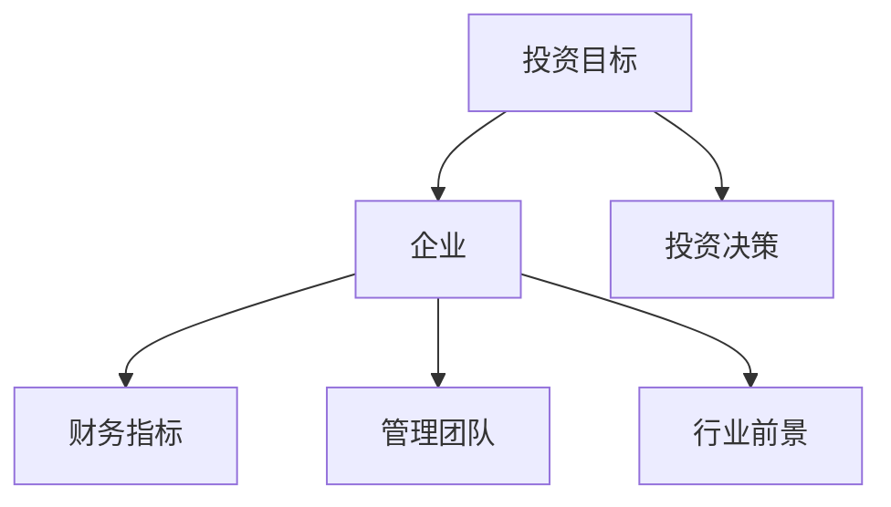
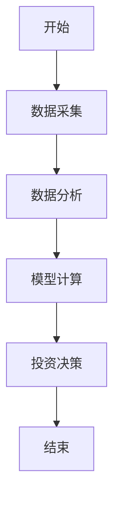

                 


# 彼得林奇的"质量成长"投资案例

## 关键词：投资策略，彼得林奇，质量成长，投资分析，财务指标，行业前景，管理团队

## 摘要：  
本文深入分析了彼得·林奇的"质量成长"投资策略，通过详细的案例分析和系统设计，展示了如何通过质量成长投资实现长期收益最大化。文章从投资的基本概念、质量成长投资的核心要素、算法原理、系统架构到实际项目案例，层层剖析，为读者提供了一套完整的质量成长投资方法论。

---

## 第一部分：背景介绍

### 第1章：投资的基本概念

#### 1.1 投资的定义与分类  
- **投资的定义**：投资是指将资金投入到某一领域或资产中，以期获得未来收益的行为。  
- **投资的主要分类**：包括股票投资、债券投资、房地产投资、基金投资等。  
- **投资的基本原则**：分散投资、长期持有、风险与收益匹配。  

#### 1.2 彼得·林奇与"质量成长"投资  
- **彼得·林奇的背景**：著名投资家，曾管理富达麦哲伦基金，创造了辉煌的投资业绩。  
- **"质量成长"投资的核心理念**：投资于具有强大基本面、良好管理团队和广阔行业前景的优质成长型企业。  
- **质量成长投资与其他投资策略的对比**：与价值投资注重低估值不同，质量成长投资更关注企业的成长性和质量。  

### 第2章：质量成长投资的核心概念  

#### 2.1 质量成长投资的定义  
- 质量成长投资：选择那些具有强大竞争优势、良好财务状况和持续增长潜力的企业进行投资。  
- 核心目标：通过长期持有优质企业股票，实现超额收益。  

#### 2.2 质量成长投资的关键要素  
- **财务指标**：ROE（净资产收益率）、净利润增长率、毛利率等。  
- **市场地位**：市场领导者、竞争优势、品牌影响力。  
- **管理团队**：团队能力、管理稳定性、战略眼光。  
- **行业前景**：行业增长空间、政策支持、技术进步。  

#### 2.3 质量成长投资的边界与外延  
- 适用范围：适用于成长型企业，尤其是科技、消费、医疗等高成长行业。  
- 限制条件：避免投资于周期性行业或财务状况不佳的企业。  
- 结合其他策略：可以与价值投资结合，平衡短期与长期收益。  

---

## 第二部分：质量成长投资的核心要素

### 第3章：质量成长投资的属性特征对比  

#### 3.1 质量成长投资与价值投资的对比  
| 对比维度 | 质量成长投资 | 价值投资 |  
|----------|--------------|----------|  
| 投资目标 | 寻找优质成长企业 | 寻找被低估的资产 |  
| 估值方式 | 市盈率、市净率 | 市盈率、市净率 |  
| 投资期限 | 长期持有 | 短期反弹 |  

#### 3.2 质量成长投资与成长股投资的对比  
- **质量成长投资**：注重企业的质量和可持续成长性。  
- **成长股投资**：更关注企业的短期增长率，可能忽视财务健康性。  

#### 3.3 质量成长投资与红利股投资的对比  
- **质量成长投资**：关注成长潜力和盈利能力。  
- **红利股投资**：关注股息收益率，注重短期收益。  

#### 3.4 质量成长投资的ER实体关系图  


---

## 第三部分：质量成长投资的算法原理

### 第4章：质量成长投资的评估算法  

#### 4.1 质量成长投资的评估指标  
- **财务指标**：ROE、净利润增长率、毛利率。  
- **市场地位**：市场份额、品牌影响力。  
- **管理团队**：管理能力、团队稳定性。  
- **行业前景**：行业增长空间、政策支持。  

#### 4.2 质量成长投资的评估流程  
1. 数据采集与处理：收集企业的财务数据、行业数据和管理团队信息。  
2. 数据分析与建模：计算各项指标，评估企业的综合得分。  
3. 结果评估与优化：根据评估结果调整投资组合。  

#### 4.3 质量成长投资的数学模型  
- **财务得分公式**：  
  $$ 财务得分 = 0.4 \times ROE + 0.3 \times 净利润增长率 + 0.3 \times 毛利率 $$  
- **综合得分公式**：  
  $$ 综合得分 = 0.4 \times 财务得分 + 0.3 \times 市场地位 + 0.3 \times 管理团队 $$  

---

### 第5章：质量成长投资的算法实现  

#### 5.1 算法实现的步骤  
1. 数据采集：从数据库中获取企业的财务数据和行业数据。  
2. 数据预处理：清洗数据，处理缺失值和异常值。  
3. 指标计算：计算ROE、净利润增长率等财务指标。  
4. 综合评估：根据公式计算企业的综合得分。  
5. 投资决策：根据得分决定是否投资。  

#### 5.2 算法实现的代码示例  
```python
def calculate_financial_score(roe, net_profit_growth, margin):
    return 0.4 * roe + 0.3 * net_profit_growth + 0.3 * margin

def calculate_management_score(team_capability, stability):
    return 0.5 * team_capability + 0.5 * stability

def quality_growth_score(roe, net_profit_growth, margin, market_share, team_capability, stability):
    financial_score = calculate_financial_score(roe, net_profit_growth, margin)
    management_score = calculate_management_score(team_capability, stability)
    return 0.4 * financial_score + 0.3 * market_share + 0.3 * management_score
```

---

## 第四部分：质量成长投资的系统分析

### 第6章：质量成长投资的系统架构  

#### 6.1 系统功能设计  
- 数据采集模块：采集企业数据、行业数据。  
- 数据分析模块：计算各项指标，生成评估报告。  
- 决策模块：根据评估结果生成投资建议。  

#### 6.2 系统架构设计  


---

## 第五部分：质量成长投资的项目实战

### 第7章：项目实战  

#### 7.1 项目环境安装  
- 安装Python、Pandas、Matplotlib等工具。  

#### 7.2 核心代码实现  
```python
import pandas as pd
import matplotlib.pyplot as plt

def load_data():
    df = pd.read_csv('企业数据.csv')
    return df

def calculate_scores(df):
    df['财务得分'] = 0.4 * df['ROE'] + 0.3 * df['净利润增长率'] + 0.3 * df['毛利率']
    df['综合得分'] = 0.4 * df['财务得分'] + 0.3 * df['市场份额'] + 0.3 * df['管理团队评分']
    return df

def visualize_results(df):
    plt.bar(df['企业名称'], df['综合得分'])
    plt.title('企业综合得分分布')
    plt.xlabel('企业名称')
    plt.ylabel('综合得分')
    plt.show()

if __name__ == '__main__':
    df = load_data()
    df = calculate_scores(df)
    visualize_results(df)
```

---

## 第六部分：质量成长投资的最佳实践

### 第8章：最佳实践  

#### 8.1 小结  
- 质量成长投资的关键在于选择优质成长型企业，长期持有。  

#### 8.2 注意事项  
- 避免短期波动，注重长期价值。  
- 定期评估投资组合，及时调整。  

#### 8.3 拓展阅读  
- 彼得·林奇的《彼得·林奇的选股方法》。  
- 《投资最重要的事情》。  

---

## 结语  
通过本文的详细分析，读者可以深入了解彼得·林奇的"质量成长"投资策略，并通过实际案例和系统设计，掌握如何在实际投资中应用这一策略。希望本文能为投资者提供有价值的参考和启发。

