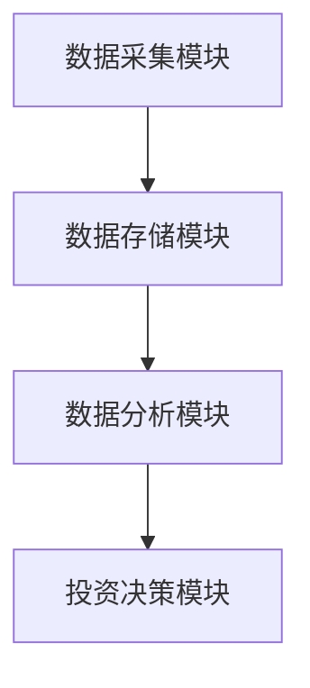
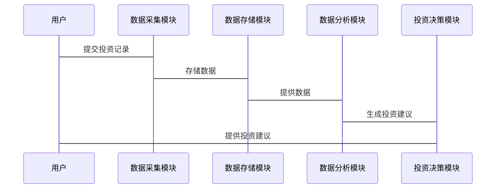

                 


# 彼得林奇的"跟踪记录"投资法

## 关键词：
- 彼得林奇投资法
- 跟踪记录法
- 投资决策
- 数据分析
- 系统架构

## 摘要：
彼得林奇的"跟踪记录"投资法是一种基于系统化记录与分析的投资策略，通过持续跟踪和记录投资行为，优化投资决策，降低风险。本文将从背景、原理、系统设计、项目实战等多方面深入剖析该方法，结合技术视角，提供详细的实现方案与实际案例。

---

# 第一部分: 彼得林奇"跟踪记录"投资法概述

## 第1章: 彼得林奇投资法的背景与核心理念

### 1.1 彼得林奇的背景与投资风格
#### 1.1.1 彼得林奇的生平简介
- 彼得·林奇（Peter Lynch）是美国著名投资专家，曾担任富达麦哲伦基金的经理，创造了辉煌的投资业绩。
- 他强调长期投资、价值发现和对公司基本面的深入研究。

#### 1.1.2 彼得林奇的投资哲学
- 投资不仅仅是数字游戏，而是对企业的深入了解。
- 避免短期波动，关注长期价值。

#### 1.1.3 跟踪记录投资法的起源与特点
- 跟踪记录法是彼得林奇在实践中总结出的一种投资策略。
- 特点：系统性、持续性、数据驱动。

### 1.2 跟踪记录投资法的核心概念
#### 1.2.1 投资记录的核心要素
- 时间维度：记录投资行为的时间点。
- 标的资产：记录投资的资产类别（股票、债券等）。
- 投资金额：记录每笔投资的金额。
- 风险与收益：记录每笔投资的风险和收益情况。

#### 1.2.2 跟踪记录与投资决策的关系
- 数据驱动：通过记录数据，分析投资行为的规律。
- 优化决策：通过数据反馈，优化投资策略。

## 第2章: 跟踪记录投资法的数学模型

### 2.1 投资组合优化的数学公式
- 投资组合的收益与风险可以通过均值-方差模型进行优化。
- 公式：$$\text{收益} = \sum w_i r_i$$，$$\text{风险} = \sqrt{\sum w_i w_j \sigma_i \sigma_j}$$

### 2.2 风险与收益的平衡模型
- 现代投资组合理论（MPT）的应用。
- 如何通过记录数据，构建最优投资组合。

### 2.3 投资记录的数据分析框架
- 数据清洗与预处理。
- 统计分析与可视化。
- 预测模型的建立。

---

# 第二部分: 跟踪记录投资法的系统分析与架构设计

## 第3章: 系统架构与模块划分

### 3.1 系统功能模块
#### 3.1.1 数据采集模块
- 数据来源：交易记录、市场数据、财务报表。
- 数据格式：结构化数据（如CSV、JSON）。

#### 3.1.2 数据存储模块
- 数据库设计：关系型数据库（如MySQL）。
- 数据表结构：投资记录表、资产表、用户表。

#### 3.1.3 数据分析模块
- 数据处理：使用Python的Pandas库。
- 数据可视化：使用Matplotlib或Seaborn。

#### 3.1.4 投资决策模块
- 风险评估：基于历史数据分析。
- 投资建议：生成投资策略报告。

### 3.2 系统架构设计
#### 3.2.1 模块之间的关系
- 数据采集 -> 数据存储 -> 数据分析 -> 投资决策。

#### 3.2.2 数据流与信息交互
- 数据采集模块将市场数据输入系统。
- 数据分析模块对数据进行清洗、处理和可视化。
- 投资决策模块根据分析结果生成投资建议。

#### 3.2.3 系统的可扩展性与灵活性
- 支持多种数据源的接入。
- 灵活调整分析模型。

### 3.3 系统架构的Mermaid图


## 第4章: 系统接口与交互设计

### 4.1 系统接口设计
#### 4.1.1 数据输入接口
- REST API接口：用于接收投资记录数据。
- 数据格式：JSON格式。

#### 4.1.2 数据输出接口
- 数据分析结果的输出接口。
- 数据格式：HTML报告或CSV文件。

#### 4.1.3 用户交互接口
- 界面设计：用户可以通过Web界面输入投资记录。
- 功能：查看历史数据、生成分析报告。

### 4.2 系统交互流程
#### 4.2.1 数据采集与处理流程
- 用户输入投资记录。
- 数据采集模块接收数据并存储。
- 数据分析模块对数据进行清洗和处理。

#### 4.2.2 数据分析与决策流程
- 数据分析模块生成可视化图表。
- 投资决策模块基于数据生成投资建议。

#### 4.2.3 投资结果反馈流程
- 反馈投资结果。
- 调整投资策略。

### 4.3 系统交互的Mermaid图


---

# 第三部分: 跟踪记录投资法的项目实战

## 第5章: 项目环境与工具安装

### 5.1 项目环境搭建
#### 5.1.1 操作系统
- Windows、Linux或macOS。

#### 5.1.2 开发工具
- Python（版本3.8及以上）。
- Jupyter Notebook或VS Code。

#### 5.1.3 数据库
- MySQL或SQLite。

#### 5.1.4 第三方库
- Pandas、Matplotlib、Seaborn、Flask。

### 5.2 工具安装步骤
#### 5.2.1 Python环境配置
- 安装Python：从官网下载安装包。
- 配置环境变量。

#### 5.2.2 安装第三方库
```bash
pip install pandas matplotlib seaborn flask
```

---

## 第6章: 系统核心实现

### 6.1 数据采集模块实现
#### 6.1.1 数据接口设计
- 使用Flask框架搭建REST API。
- 示例代码：
```python
from flask import Flask, request, jsonify
import sqlite3

app = Flask(__name__)
conn = sqlite3.connect('investment.db')

@app.route('/api/record', methods=['POST'])
def record():
    data = request.get_json()
    cursor = conn.cursor()
    cursor.execute("INSERT INTO investment_records VALUES (?, ?, ?, ?, ?)",
                   (data['time'], data['asset'], data['amount'], data['risk'], data['return']))
    conn.commit()
    return jsonify({'status': 'success', 'message': 'Record saved'})

if __name__ == '__main__':
    app.run(debug=True)
```

#### 6.1.2 数据存储模块实现
- 数据库设计：
```sql
CREATE TABLE investment_records (
    id INTEGER PRIMARY KEY AUTOINCREMENT,
    time TEXT,
    asset TEXT,
    amount REAL,
    risk REAL,
    return REAL
);
```

### 6.2 数据分析模块实现
#### 6.2.1 数据清洗与预处理
```python
import pandas as pd

df = pd.read_csv('data.csv')
df.dropna(inplace=True)
df['return'] = (df['return'] - df['return'].min()) / (df['return'].max() - df['return'].min())
```

#### 6.2.2 数据可视化
```python
import matplotlib.pyplot as plt

plt.figure(figsize=(10,6))
plt.plot(df['time'], df['return'], 'b-', label='Return')
plt.xlabel('Time')
plt.ylabel('Return')
plt.legend()
plt.show()
```

### 6.3 投资决策模块实现
#### 6.3.1 风险评估
- 使用标准差衡量风险：
```python
import numpy as np

returns = df['return'].values
std_dev = np.std(returns)
```

#### 6.3.2 投资策略生成
- 基于均值-方差模型优化投资组合：
```python
import numpy as np

def optimize_portfolio(returns):
    n = len(returns)
    C = np.zeros((n, n))
    for i in range(n):
        for j in range(n):
            C[i][j] = returns[i] * returns[j]
    w = np.dot(np.linalg.inv(C), np.ones(n))
    w = w / np.sum(w)
    return w

weights = optimize_portfolio(returns)
```

---

## 第7章: 项目实战与案例分析

### 7.1 实际案例分析
- 案例背景：假设一个投资者投资于股票和债券。
- 数据分析：分析过去5年的投资记录。
- 投资建议：根据数据分析结果，优化投资组合。

### 7.2 项目小结
- 通过跟踪记录法，投资者可以更科学地进行投资决策。
- 系统化的数据分析是优化投资策略的关键。

---

## 第8章: 最佳实践与注意事项

### 8.1 最佳实践
- 定期回顾和更新投资记录。
- 结合市场变化调整投资策略。
- 使用工具辅助数据分析。

### 8.2 注意事项
- 数据记录的及时性与准确性。
- 风险控制与投资纪律。
- 避免过度依赖历史数据。

### 8.3 小结
- 跟踪记录法是一种科学的投资方法。
- 结合系统化数据分析，可以显著提高投资效率。

### 8.4 拓展阅读
- 《彼得林奇的投资哲学》。
- 《量化投资：数据驱动的投资策略》。

---

通过以上目录结构，文章将从理论到实践，系统地讲解彼得林奇的“跟踪记录”投资法，结合技术视角，提供详细的实现方案与实际案例。

