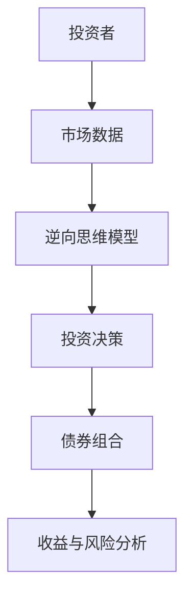
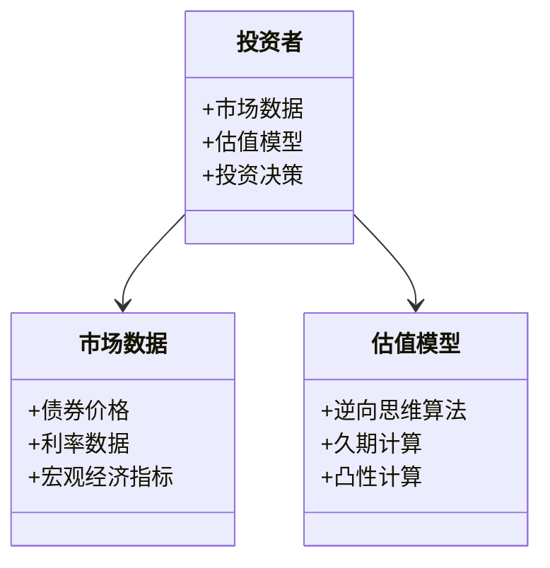

                 


# 彼得林奇的"逆向思维"在新兴市场债券投资中的运用

## 关键词
- 彼得林奇
- 逆向思维
- 新兴市场债券
- 投资策略
- 数学模型

## 摘要
本文探讨了彼得林奇的逆向思维在新兴市场债券投资中的应用。通过分析逆向思维的核心原理、新兴市场债券的特点，构建数学模型，设计投资策略，并结合实际案例，展示了逆向思维在提升投资收益和风险控制中的价值。文章还详细介绍了系统的架构设计和算法实现，为投资者提供实用的指导。

---

# 第一部分: 背景介绍

## 第1章: 新兴市场债券投资的背景与现状

### 1.1 新兴市场债券的定义与特点
- **定义**: 新兴市场债券是指发行主体位于新兴市场国家，以本币或外币计价的债务工具。
- **特点**: 
  1. 高收益与高风险并存。
  2. 市场流动性较低，波动性较大。
  3. �受全球经济和地缘政治影响显著。

### 1.2 彼得林奇投资理念的概述
- **生平简介**: 彼得林奇是美国著名基金经理，以价值投资和逆向思维著称。
- **逆向思维**: 在市场低迷时寻找被低估的投资标的，逆市场情绪进行投资。
- **债券投资**: 林奇认为债券是稳定收益的重要来源，尤其在新兴市场中有独特优势。

---

# 第二部分: 核心概念与联系

## 第2章: 逆向思维在债券投资中的核心概念

### 2.1 逆向思维的核心原理
- **定义**: 逆向思维是指在市场普遍看跌时买入，看涨时卖出。
- **特征**: 
  1. 逆市场情绪。
  2. 重视估值，而非市场趋势。
  3. 长期持有，避免频繁交易。

### 2.2 逆向思维与传统投资思维的对比
| 对比维度 | 逆向思维 | 传统投资思维 |
|----------|----------|--------------|
| 投资时机 | 逆市买入 | 趋势跟随     |
| 估值考量 | 重视估值 | 侧重技术分析 |
| 风险控制 | 高风险承受 | 风险厌恶     |

### 2.3 系统架构设计


---

# 第三部分: 算法原理讲解

## 第3章: 逆向思维在债券投资中的算法实现

### 3.1 债券定价模型
- **久期公式**: 
  $$ D = \frac{1}{(1+y)^n} $$
- **凸性**: 
  $$ C = \frac{D_1 + D_2}{2} $$

### 3.2 逆向思维量化模型


### 3.3 数学模型与公式
- **债券收益计算**: 
  $$ R = \frac{C}{P} $$
  其中，C为息票，P为购买价格。
- **风险调整后收益**: 
  $$ R_{adj} = R - \alpha \times \text{风险溢价} $$

---

# 第四部分: 系统分析与架构设计方案

## 第4章: 系统架构设计

### 4.1 项目介绍
- **目标**: 构建基于逆向思维的新兴市场债券投资系统。

### 4.2 系统功能设计


### 4.3 系统架构设计


---

# 第五部分: 项目实战

## 第5章: 项目实战与案例分析

### 5.1 环境配置
- **工具**: Python、Pandas、Matplotlib。
- **数据源**: 新兴市场债券数据，宏观经济指标。

### 5.2 核心代码实现
```python
import pandas as pd
import numpy as np

def calculate_duration(price, coupon, yield_to_maturity):
    duration = (price * coupon) / (1 + yield_to_maturity)
    return duration

# 示例数据
price = 100
coupon = 5
ytm = 0.05

duration = calculate_duration(price, coupon, ytm)
print(f"久期: {duration}")
```

### 5.3 案例分析
- **案例**: 投资某新兴市场债券，逆向买入。
- **分析**: 计算久期和凸性，评估风险和收益。

---

# 第六部分: 最佳实践与小结

## 第6章: 最佳实践与注意事项

### 6.1 最佳实践
- 定期评估模型，更新数据。
- 结合宏观经济分析，动态调整策略。
- 严格控制风险，避免过度杠杆。

### 6.2 小结
- 逆向思维在新兴市场债券投资中具有显著优势。
- 通过系统架构和数学模型，可以有效提升投资决策的科学性。

### 6.3 注意事项
- 市场波动大，需谨慎操作。
- 数据质量影响模型准确性，需确保数据来源可靠。
- 风险控制是投资成功的关键。

### 6.4 拓展阅读
- 推荐阅读《彼得林奇的投资智慧》和相关金融数学书籍。

---

通过以上步骤，我们详细分析了彼得林奇的逆向思维在新兴市场债券投资中的应用，从理论到实践，为投资者提供了全面的指导。

