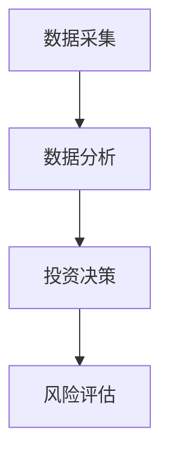
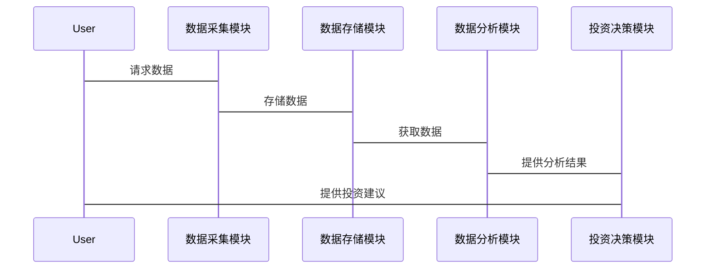

                 


# 彼得林奇的"逆向思维"在新兴市场投资中的应用

## 关键词：逆向思维，彼得·林奇，新兴市场，投资策略，数学模型

## 摘要：本文探讨了彼得·林奇的逆向思维投资策略在新兴市场中的应用，结合数学模型和系统架构设计，详细分析了如何通过逆向思维在新兴市场中寻找投资机会，优化投资组合，并提供实际案例和代码实现。

---

## 第一部分: 彼得林奇逆向思维投资策略概述

### 第1章: 彼得林奇与逆向思维投资

#### 1.1 彼得·林奇及其投资理念
- **1.1.1 彼得·林奇的生平简介**
  - 彼得·林奇是美国著名的投资经理，以其在富达基金的卓越表现闻名。
  - 他强调长期投资、价值发现和逆向思维。
- **1.1.2 逆向思维投资的核心概念**
  - 逆向思维是指在市场低迷时寻找被低估的机会。
  - 逆向思维的核心是关注市场非理性行为，寻找价值洼地。
- **1.1.3 逆向思维在投资中的重要性**
  - 在市场恐慌时，逆向思维能够捕捉低估资产。
  - 在市场狂热时，逆向思维能够避免过度投资。

#### 1.2 逆向思维投资的定义与特点
- **1.2.1 逆向思维的定义**
  - 逆向思维是指在市场中寻找与市场共识相反的投资机会。
- **1.2.2 逆向思维与传统投资策略的区别**
  - 传统策略基于市场趋势，逆向思维基于市场反向。
- **1.2.3 逆向思维投资的优势与劣势**
  - 优势：在市场低谷时发现机会，长期收益潜力大。
  - 劣势：需要承担短期波动风险，需要足够的市场知识和分析能力。

#### 1.3 逆向思维投资的核心要素
- **1.3.1 市场情绪分析**
  - 市场情绪可以通过新闻、社交媒体和市场指标（如VIX指数）进行分析。
- **1.3.2 价值评估与市场价格的差异**
  - 内在价值计算是逆向思维的核心，需要对比市场价格与内在价值。
- **1.3.3 投资机会的识别与选择**
  - 识别被市场忽视的公司，选择有潜力但被低估的标的。

### 第2章: 新兴市场投资的特点与挑战

#### 2.1 新兴市场的定义与特点
- **2.1.1 新兴市场的经济结构**
  - 经济增长快，但波动性大。
  - 市场不成熟，信息不对称严重。
- **2.1.2 新兴市场的投资机会**
  - 高增长潜力。
  - 行业集中度低，竞争激烈。
- **2.1.3 新兴市场的风险与不确定性**
  - 政治风险、经济政策变化。
  - 市场流动性不足，波动性高。

#### 2.2 新兴市场投资的主要挑战
- **2.2.1 政治与经济政策的不确定性**
  - 政治动荡和政策变化会影响市场。
- **2.2.2 市场波动性与流动性风险**
  - 市场波动大，流动性不足。
- **2.2.3 信息不对称与研究难度**
  - 新兴市场信息不透明，研究难度大。

#### 2.3 逆向思维在新兴市场中的应用前景
- **2.3.1 逆向思维在新兴市场中的独特优势**
  - 在新兴市场，逆向思维可以发现被低估的资产。
- **2.3.2 逆向思维策略在新兴市场中的可行性**
  - 需要深入研究市场和公司基本面。
- **2.3.3 逆向思维在新兴市场中的长期投资价值**
  - 长期来看，新兴市场有巨大的增长潜力。

---

## 第二部分: 逆向思维投资策略的数学模型与算法原理

### 第3章: 逆向思维投资的数学模型

#### 3.1 逆向思维投资的核心公式
- **3.1.1 市场价格与内在价值的比较公式**
  - 市场价格 = 市场情绪 × 内在价值
  - 内在价值 = 现金流折现值
- **3.1.2 价值低估的判断标准**
  - 市场价格 < 内在价值 × k（k为安全边际系数）
- **3.1.3 投资决策的数学模型**
  - 投资决策 = max(0, 内在价值 - 市场价格)

#### 3.2 逆向思维投资的算法原理
- **3.2.1 数据收集与处理流程**
  - 数据来源：股票价格、财务报表、行业数据。
  - 数据清洗：处理缺失值、异常值。
- **3.2.2 市场情绪分析的算法**
  - 使用VIX指数、社交媒体情感分析。
- **3.2.3 投资机会评估的算法**
  - 基于市盈率、市净率的估值模型。

### 第4章: 逆向思维投资的数学模型实现

#### 4.1 数据收集与处理
- **4.1.1 数据来源与获取方法**
  - 使用Yahoo Finance获取股票数据。
  - 使用新闻API获取市场情绪数据。
- **4.1.2 数据清洗与预处理**
  - 去除缺失值，标准化数据。
- **4.1.3 数据分析与可视化**
  - 使用Matplotlib绘制股价走势。

#### 4.2 价值评估模型
- **4.2.1 内在价值计算公式**
  - 内在价值 = FCFF / WACC
- **4.2.2 市场价格与内在价值的比较**
  - 计算价格与价值比（P/Value）。
- **4.2.3 价值低估的判断标准**
  - P/Value < 1 时，视为低估。

#### 4.3 投资决策算法
- **4.3.1 市场情绪分析算法**
  - 使用情感分析模型对新闻进行分类。
- **4.3.2 投资机会评估算法**
  - 综合考虑市场情绪和估值指标。
- **4.3.3 投资组合优化算法**
  - 使用均值-方差优化模型。

---

## 第三部分: 逆向思维投资策略的系统分析与架构设计

### 第5章: 逆向思维投资系统架构

#### 5.1 系统功能设计
- **5.1.1 数据采集模块**
  - 从多个来源获取数据。
- **5.1.2 数据分析模块**
  - 计算估值指标，分析市场情绪。
- **5.1.3 投资决策模块**
  - 根据分析结果生成投资建议。
- **5.1.4 风险评估模块**
  - 评估投资组合的风险。

#### 5.2 系统架构设计
- **5.2.1 模块之间的关系**
  - 数据采集模块 → 数据分析模块 → 投资决策模块。
- **5.2.2 数据流与信息交互**
  - 数据采集模块向数据分析模块提供数据。
  - 数据分析模块向投资决策模块提供分析结果。
- **5.2.3 系统的可扩展性与可维护性**
  - 模块化设计，便于扩展。

### 第6章: 系统接口与交互设计

#### 6.1 系统接口设计
- **6.1.1 数据接口**
  - API接口获取股票数据。
- **6.1.2 用户接口**
  - Web界面显示分析结果。
- **6.1.3 报告生成接口**
  - 生成投资报告。

#### 6.2 系统交互设计
- **6.2.1 用户操作流程**
  - 用户输入目标股票，系统生成分析结果。
- **6.2.2 系统反馈机制**
  - 反馈分析结果和投资建议。
- **6.2.3 异常处理与错误提示**
  - 处理数据获取失败或计算错误。

---

## 第四部分: 逆向思维投资策略的项目实战

### 第7章: 环境安装与数据获取

#### 7.1 环境安装
- **安装Python和必要的库**
  - 安装Python 3.x
  - 安装Pandas、NumPy、Matplotlib、requests、BeautifulSoup。

#### 7.2 数据获取
- **从Yahoo Finance获取股票数据**
  - 使用API获取历史股价。
- **从新闻网站获取市场情绪数据**
  - 使用新闻API进行情感分析。

### 第8章: 核心代码实现

#### 8.1 数据处理代码
```python
import pandas as pd
import requests
from bs4 import BeautifulSoup

# 获取股票数据
def get_stock_data(ticker):
    url = f"https://query1.finance.yahoo.com/v8/finance/chart/{ticker}"
    response = requests.get(url)
    data = response.json()
    df = pd.DataFrame(data['chart']['result'][0]['prices'])
    df['timestamp'] = pd.to_datetime(df['timestamp'], unit='s')
    df.set_index('timestamp', inplace=True)
    df = df[['close']]
    return df

# 获取新闻数据
def get_news_sentiment(company):
    url = f"https://api.example.com/news?company={company}"
    response = requests.get(url)
    data = response.json()
    return data['sentiment']
```

#### 8.2 价值评估与投资决策代码
```python
import pandas as pd
import numpy as np

def calculate_intrinsic_value(fcf, wacc):
    return fcf / wacc

def investment_decision(price, intrinsic_value):
    margin_of_safety = 0.25
    if price < intrinsic_value * (1 - margin_of_safety):
        return "Buy"
    elif price > intrinsic_value * (1 + margin_of_safety):
        return "Sell"
    else:
        return "Hold"

# 示例数据
fcf = 100
wacc = 0.10
price = 50
iv = calculate_intrinsic_value(fcf, wacc)
decision = investment_decision(price, iv)
print(f"内在价值={iv}, 价格={price}, 投资决策={decision}")
```

### 第9章: 案例分析与详细解读

#### 9.1 案例分析
- **选择新兴市场中的某公司**
  - 计算其内在价值和市场价格。
  - 分析市场情绪。
  - 生成投资决策。

#### 9.2 详细解读
- **数据来源**
  - 股票数据来源：Yahoo Finance。
  - 财务数据来源：公司财报。
- **分析过程**
  - 计算市盈率、市净率。
  - 分析市场情绪对股价的影响。
- **投资决策**
  - 根据分析结果，决定是否买入、卖出或持有。

### 第10章: 项目小结

#### 10.1 核心实现
- **数据处理**
  - 清洗和预处理数据。
- **模型应用**
  - 计算内在价值，分析市场情绪。
- **投资决策**
  - 根据模型结果生成投资建议。

#### 10.2 注意事项
- **数据准确性**
  - 确保数据来源可靠。
- **模型假设**
  - 模型假设可能与实际情况不符。
- **市场风险**
  - 市场波动可能影响模型结果。

---

## 第五部分: 最佳实践与小结

### 第11章: 最佳实践

#### 11.1 投资策略
- **分散投资**
  - 不将所有资金投入单一标的。
- **持续监控**
  - 定期评估投资组合。
- **风险管理**
  - 设定止损点，控制风险敞口。

#### 11.2 小结
- **总结全文**
  - 逆向思维在新兴市场中的应用能够发现低估机会。
  - 通过数学模型和系统架构设计，可以提高投资决策的科学性。
  - 实际应用中需要结合市场实际情况，灵活调整策略。

### 第12章: 注意事项与拓展阅读

#### 12.1 注意事项
- **市场风险**
  - 新兴市场波动大，风险较高。
- **数据风险**
  - 数据获取困难，可能导致分析偏差。
- **模型局限**
  - 模型假设可能与实际情况不符。

#### 12.2 拓展阅读
- **推荐书籍**
  - 《彼得·林奇的投资智慧》
  - 《新兴市场投资指南》
- **推荐网站**
  - Yahoo Finance
  - Bloomberg

---

## 附录: 代码与工具

### 附录A: 核心代码
- **数据处理代码**
  ```python
  import pandas as pd
  import requests
  from bs4 import BeautifulSoup

  def get_stock_data(ticker):
      url = f"https://query1.finance.yahoo.com/v8/finance/chart/{ticker}"
      response = requests.get(url)
      data = response.json()
      df = pd.DataFrame(data['chart']['result'][0]['prices'])
      df['timestamp'] = pd.to_datetime(df['timestamp'], unit='s')
      df.set_index('timestamp', inplace=True)
      df = df[['close']]
      return df

  def get_news_sentiment(company):
      url = f"https://api.example.com/news?company={company}"
      response = requests.get(url)
      data = response.json()
      return data['sentiment']
  ```

- **价值评估与投资决策代码**
  ```python
  import pandas as pd
  import numpy as np

  def calculate_intrinsic_value(fcf, wacc):
      return fcf / wacc

  def investment_decision(price, intrinsic_value):
      margin_of_safety = 0.25
      if price < intrinsic_value * (1 - margin_of_safety):
          return "Buy"
      elif price > intrinsic_value * (1 + margin_of_safety):
          return "Sell"
      else:
          return "Hold"

  # 示例数据
  fcf = 100
  wacc = 0.10
  price = 50
  iv = calculate_intrinsic_value(fcf, wacc)
  decision = investment_decision(price, iv)
  print(f"内在价值={iv}, 价格={price}, 投资决策={decision}")
  ```

### 附录B: 系统架构图


### 附录C: 系统交互图


---

## 结语

通过本文的详细分析，我们可以看到，彼得·林奇的逆向思维在新兴市场投资中具有重要的应用价值。结合数学模型和系统架构设计，投资者可以在新兴市场中发现低估机会，优化投资组合，实现长期收益。实际应用中需要结合市场实际情况，灵活调整策略，同时注意风险管理。

