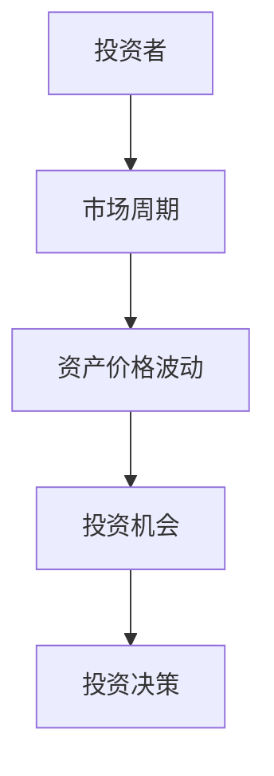
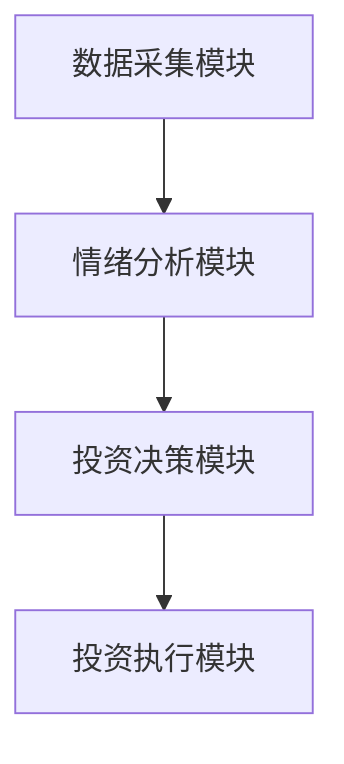

                 


# 彼得林奇的"逆向思维"投资技巧

> 关键词：彼得林奇，逆向思维，投资技巧，市场周期，投资策略，风险管理

> 摘要：本文将详细介绍彼得林奇的逆向思维投资技巧，分析其核心概念、算法原理、系统架构，并通过项目实战和最佳实践，帮助读者全面理解逆向思维在投资中的应用。

---

# 第1章: 逆向思维投资的背景与核心概念

## 1.1 逆向思维投资的定义与背景

### 1.1.1 逆向思维投资的定义
逆向思维投资是一种与传统投资策略相反的投资方法，强调在市场低迷时买入，在市场繁荣时卖出。这种策略的核心在于利用市场的非理性波动，捕捉被低估的投资机会。

### 1.1.2 逆向思维投资的背景与现状
传统投资策略往往依赖于市场趋势和历史数据，但在市场剧烈波动时，这种策略可能失效。逆向思维投资则通过分析市场情绪和周期，寻找投资机会。

### 1.1.3 逆向思维投资的核心要素
逆向思维投资的核心要素包括市场周期分析、投资者心理研究和资产价格波动预测。

## 1.2 彼得林奇投资理念的介绍

### 1.2.1 彼得林奇的生平简介
彼得林奇是著名的基金经理，以其成功的投资策略闻名。他的投资理念强调长期持有优质资产，并在市场低谷时增加投资。

### 1.2.2 彼得林奇的投资哲学
彼得林奇认为，市场的波动性为投资者提供了低价买入优质资产的机会。逆向思维投资的核心在于识别市场的非理性行为，并利用这些行为获利。

### 1.2.3 彼得林奇的成功案例分析
通过具体案例分析彼得林奇如何利用逆向思维在市场低谷时买入，从而在市场复苏时获得超额收益。

## 1.3 逆向思维投资的核心优势

### 1.3.1 逆向思维投资的独特性
逆向思维投资的独特性在于其反周期性，能够在市场底部捕捉机会，避免高位风险。

### 1.3.2 逆向思维投资的优势与劣势
优势：在市场低谷时获得廉价资产，长期收益潜力大。劣势：需要承担短期市场波动风险，对投资者心理素质要求较高。

### 1.3.3 逆向思维投资的适用场景
适用于市场周期性波动明显的资产，如股票和房地产。在经济衰退或市场恐慌时，逆向思维投资策略尤为有效。

## 1.4 逆向思维投资的边界与外延

### 1.4.1 逆向思维投资的边界
逆向思维投资不适用于所有市场环境，尤其在市场稳定或上涨周期中，其效果有限。

### 1.4.2 逆向思维投资的外延
逆向思维投资可以与其他投资策略结合使用，如价值投资和成长投资。

### 1.4.3 逆向思维投资与其他投资策略的区别
逆向思维投资与趋势投资和套利投资的区别在于其反周期性和对市场情绪的利用。

## 1.5 本章小结
逆向思维投资是一种有效的投资策略，尤其在市场低谷时表现突出。彼得林奇的成功案例证明了其可行性，但投资者需具备较高的心理素质和市场分析能力。

---

# 第2章: 逆向思维投资的核心概念与联系

## 2.1 核心概念原理

### 2.1.1 市场周期与逆向思维的关系
市场周期分为上升、下降、复苏和稳定阶段。逆向思维投资在市场下降阶段买入，在市场复苏阶段卖出。

### 2.1.2 投资者心理与逆向思维的关联
投资者的贪婪和恐惧情绪导致市场波动，逆向思维投资利用这种情绪波动进行操作。

### 2.1.3 逆向思维投资的数学模型
市场情绪指数模型：$$E = \sum_{i=1}^{n} (M_i \times W_i)$$
资产价格波动模型：$$P(t) = P(t-1) + \epsilon \times E$$

## 2.2 核心概念属性特征对比表格

| 对比维度 | 逆向思维投资 | 正向思维投资 |
|----------|--------------|--------------|
| 投资时机 | 市场低谷买入 | 市场上涨买入 |
| 持股策略 | 长期持有待涨 | 短期交易获利 |
| 风险承受 | 高 | 低 |

## 2.3 逆向思维投资的ER实体关系图



---

# 第3章: 逆向思维投资的算法原理

## 3.1 逆向思维投资的算法原理

### 3.1.1 市场情绪分析算法
市场情绪分析算法通过分析新闻、社交媒体和市场数据，判断市场的乐观或悲观情绪。

### 3.1.2 资产价格波动预测算法
基于市场情绪指数，预测资产价格的短期波动，制定买卖决策。

### 3.1.3 投资时机选择算法
当市场情绪指数低于阈值时，买入资产；当指数高于阈值时，卖出资产。

## 3.2 算法原理的数学模型

### 3.2.1 市场情绪指数模型
$$E = \sum_{i=1}^{n} (M_i \times W_i)$$
其中，$M_i$为市场情绪指标，$W_i$为权重。

### 3.2.2 资产价格波动模型
$$P(t) = P(t-1) + \epsilon \times E$$
其中，$\epsilon$为随机扰动项。

## 3.3 逆向思维投资算法的Python实现

```python
import numpy as np

def market_sentiment(sentiment_data, weights):
    return np.dot(sentiment_data, weights)

def asset_price(current_price, market_sentiment):
    return current_price + np.random.normal(0, 1) * market_sentiment

def investment_strategy(current_price, market_sentiment, threshold):
    if market_sentiment < threshold:
        return "买入"
    elif market_sentiment > threshold:
        return "卖出"
    else:
        return "观望"

# 示例数据
sentiment_data = [0.3, 0.5, 0.2]
weights = [0.5, 0.3, 0.2]
threshold = 0.4

market_sentiment = market_sentiment(sentiment_data, weights)
print("市场情绪指数:", market_sentiment)

current_price = 100
new_price = asset_price(current_price, market_sentiment)
print("当前价格:", current_price)
print("新价格:", new_price)

decision = investment_strategy(current_price, market_sentiment, threshold)
print("投资决策:", decision)
```

## 3.4 本章小结
通过算法实现逆向思维投资策略，投资者可以根据市场情绪和资产价格波动，制定相应的买卖决策。

---

# 第4章: 逆向思维投资的系统架构设计

## 4.1 系统功能设计

### 4.1.1 问题场景介绍
投资者需要根据市场情绪和资产价格波动，制定投资决策。

### 4.1.2 系统功能需求
- 数据采集模块：收集市场数据和情绪指标。
- 情绪分析模块：计算市场情绪指数。
- 投资决策模块：根据情绪指数和资产价格波动，制定投资决策。

## 4.2 系统架构设计



---

# 第5章: 逆向思维投资的项目实战

## 5.1 项目环境安装

### 5.1.1 数据采集工具
使用Python的`pandas`和`requests`库。

### 5.1.2 情绪分析工具
使用自然语言处理库如`nltk`或`spaCy`。

## 5.2 核心代码实现

```python
import pandas as pd
import requests

def get_market_data(ticker):
    url = f"https://api.example.com/stock/{ticker}"
    response = requests.get(url)
    return pd.DataFrame(response.json())

def calculate_sentiment(data):
    # 示例情绪计算
    return data['sentiment'].mean()

# 示例调用
data = get_market_data("AAPL")
sentiment = calculate_sentiment(data)
print("市场情绪:", sentiment)
```

## 5.3 项目小结
通过项目实战，投资者可以掌握逆向思维投资策略的具体实施方法。

---

# 第6章: 逆向思维投资的最佳实践

## 6.1 小结与反思
逆向思维投资是一种有效的策略，但需要结合市场环境和投资者自身情况。

## 6.2 注意事项
- 避免盲目跟风
- 保持风险意识
- 定期评估策略效果

## 6.3 拓展阅读
推荐阅读彼得林奇的相关书籍，深入理解逆向思维投资策略。

---

# 附录: 总结

逆向思维投资是一种有效的策略，通过分析市场情绪和资产价格波动，投资者可以在市场低谷时买入，市场高位时卖出，实现超额收益。

