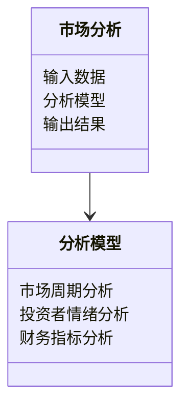

                 

# 彼得林奇的"逆向投资"在不同市场规模的应用

## 关键词：逆向投资、彼得林奇、股票市场、风险管理、投资策略

## 摘要：  
本文深入探讨了彼得林奇的逆向投资理念及其在不同市场规模中的应用策略。通过分析小盘股、中盘股、大盘股及全球市场的特点，结合系统化的市场分析框架和风险管理策略，展示了逆向投资的实际操作方法。文章还通过实战案例分析，总结了逆向投资的成功经验与失败教训，为投资者提供了实用的指导。

---

# 第一部分：逆向投资的核心理论与背景

## 第1章：逆向投资的定义与背景

### 1.1 逆向投资的定义与背景

#### 1.1.1 投资市场的基本概念
投资市场是资金流动和资产配置的主要场所，包括股票、债券、基金等多种资产类别。逆向投资是指在市场低迷时买入，市场高涨时卖出，与市场趋势相反的操作策略。

#### 1.1.2 逆向投资的起源与发展
逆向投资并非彼得林奇首创，但他在《彼得林奇投资哲学》中将其系统化。逆向投资的理念源于“市场先生”的概念，认为市场情绪波动会导致资产价格偏离其内在价值。

#### 1.1.3 彼得林奇与逆向投资的关系
彼得林奇是逆向投资的倡导者，他在任职富达基金经理期间，通过逆向投资策略取得了优异的业绩，尤其是在市场低谷时发现价值低估的公司。

### 1.2 逆向投资的核心原则

#### 1.2.1 市场波动与投资者心理
市场波动主要由投资者情绪驱动，逆向投资利用市场的非理性波动，在恐慌时买入，贪婪时卖出。

#### 1.2.2 逆向投资的逻辑基础
逆向投资基于价值投资理念，寻找市场低估的资产，通过长期持有实现收益。

#### 1.2.3 彼得林奇的投资哲学
彼得林奇强调基本面分析，注重公司财务健康和行业地位，避免跟风，坚持独立思考。

---

## 第2章：逆向投资的理论框架

### 2.1 市场周期分析

#### 2.1.1 市场周期的定义与特征
市场周期分为复苏、上升、峰值和衰退四个阶段，逆向投资在衰退期和复苏期表现尤为突出。

#### 2.1.2 不同周期的市场表现
通过mermaid流程图展示市场周期变化，帮助投资者识别逆向投资的最佳时机。

#### 2.1.3 逆向投资在周期中的应用
在衰退期寻找价值低估的资产，在峰值期避免过度投资。

### 2.2 逆向投资的数学模型

#### 2.2.1 市场波动的数学表达
使用随机游走模型描述市场波动，公式为：$$P_{t} = P_{t-1} + \epsilon$$，其中$\epsilon$为随机误差项。

#### 2.2.2 投资者情绪的量化分析
采用情绪指数模型，$$I = \alpha \cdot V + \beta \cdot M$$，其中V为成交量，M为市场消息量，$\alpha$和$\beta$为系数。

#### 2.2.3 逆向投资的收益计算公式
逆向投资的收益模型：$$R = \sum_{i=1}^{n} (P_i - \bar{P})$$，其中$\bar{P}$为市场平均价格。

### 2.3 彼得林奇的投资策略

#### 2.3.1 价值投资与逆向投资的区别
价值投资侧重于寻找低估资产，逆向投资则利用市场情绪波动，两者结合能提高投资收益。

---

# 第二部分：逆向投资在不同市场规模中的应用

## 第4章：小盘股市场的逆向投资

### 4.1 小盘股市场的特点

#### 4.1.1 小盘股市场的波动性
小盘股市场波动较大，逆向投资机会较多。

#### 4.1.2 小盘股的市场周期
小盘股市场周期与大盘股相似，但波动性更大。

### 4.2 小盘股市场的逆向投资策略

#### 4.2.1 小盘股的选股标准
关注低估值、高成长性的小盘股，使用基本面分析筛选标的。

#### 4.2.2 小盘股市场的风险管理
分散投资，设置止损点，控制仓位。

---

## 第5章：中盘股市场的逆向投资

### 5.1 中盘股市场的特点

#### 5.1.1 中盘股市场的稳定性
中盘股波动性介于小盘股和大盘股之间，风险适中。

### 5.2 中盘股市场的逆向投资策略

#### 5.2.1 中盘股的选股标准
选择财务健康、行业地位稳固的中盘股。

---

## 第6章：大盘股市场的逆向投资

### 6.1 大盘股市场的特点

#### 6.1.1 大盘股市场的稳定性
大盘股波动性较小，适合长期逆向投资。

### 6.2 大盘股市场的逆向投资策略

#### 6.2.1 大盘股的选股标准
选择行业龙头，具有持续盈利能力。

---

## 第7章：全球市场的逆向投资

### 7.1 全球市场的特点

#### 7.1.1 全球市场的多样性
不同国家和地区的市场波动不同，逆向投资机会多样。

### 7.2 全球市场的逆向投资策略

#### 7.2.1 全球市场的风险管理
分散投资不同国家，关注全球经济周期。

---

# 第三部分：逆向投资的系统化分析与架构设计

## 第8章：逆向投资的系统化分析

### 8.1 市场分析框架

#### 8.1.1 市场分析框架的构建
使用领域模型类图展示市场分析的核心要素。

### 8.2 投资组合构建

#### 8.2.1 投资组合构建的步骤
1. 确定投资目标
2. 选择资产配置
3. 评估风险承受能力

---

## 第9章：逆向投资的风险管理与心理调适

### 9.1 逆向投资中的风险管理

#### 9.1.1 风险管理策略
1. 设置止损点
2. 分散投资
3. 定期评估投资组合

### 9.2 投资者心理的调适

#### 9.2.1 心理调适方法
1. 培养理性思维
2. 避免情绪化决策
3. 保持耐心

---

## 第10章：逆向投资的实战案例分析

### 10.1 成功案例

#### 10.1.1 某公司的逆向投资案例
案例分析：某公司股价在市场低谷时被低估，逆向买入后股价回升。

### 10.2 失败案例

#### 10.2.1 某公司的逆向投资教训
案例分析：某公司因行业衰退，逆向投资失败。

---

## 第11章：逆向投资的总结与展望

### 11.1 总结

逆向投资是有效的投资策略，关键在于识别市场低估和高估的机会，结合系统化的分析和风险管理。

### 11.2 展望

随着市场的发展，逆向投资将更加依赖于数据和技术分析，未来可能结合AI技术优化投资决策。

---

通过以上结构，文章详细探讨了彼得林奇逆向投资的理论与实践，帮助读者在不同市场中灵活运用逆向投资策略。

