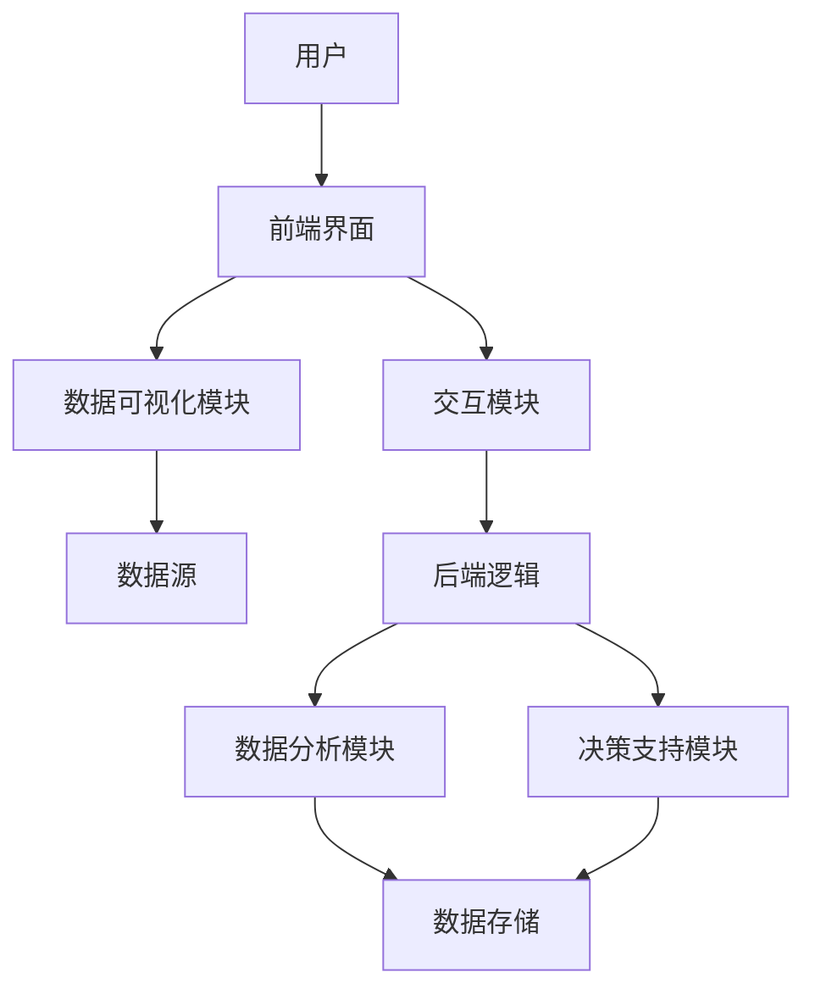

                 


# 彼得林奇的"逆向投资"在市场恐慌时期的操作

## 关键词：逆向投资，市场恐慌，彼得林奇，投资策略，价值投资

## 摘要：本文深入探讨了彼得林奇的逆向投资策略在市场恐慌时期的应用。通过分析市场恐慌的成因、逆向投资的核心理念以及实际操作策略，结合经典案例和系统设计，为投资者提供实用的指导。文章从理论到实践，全面解析了如何在市场恐慌中捕捉投资机会，实现长期收益。

---

# 第一部分: 逆向投资的概述

## 第1章: 逆向投资的定义与背景

### 1.1 逆向投资的定义

逆向投资是一种与市场情绪相反的投资策略，强调在市场恐慌时买入，在市场狂热时卖出。其核心思想是：当大多数投资者恐慌时，优质资产的价格会被低估，此时买入能够在市场复苏时获得超额收益。

#### 1.1.1 逆向投资的定义
逆向投资（Contrarian Investment）是一种投资策略，投资者在市场情绪低落、普遍抛售时买入，而在市场情绪高涨、普遍抢购时卖出。这种方法基于市场非理性波动，寻找被低估的投资机会。

#### 1.1.2 逆向投资的核心思想
逆向投资的核心思想是：市场的短期波动往往由情绪驱动，而理性分析能够发现被市场错估的价值。投资者应逆市场情绪而行，寻找低估资产。

#### 1.1.3 逆向投资与传统投资的区别
| 传统投资 | 逆向投资 |
|----------|----------|
| 随市场波动调整投资 | 逆市场波动进行投资 |
| 追求短期收益 | 追求长期价值 |
| 注重技术分析 | 注重基本面分析 |

### 1.2 彼得林奇与逆向投资

彼得·林奇（Peter Lynch）是逆向投资的代表人物，他的投资理念强调长期价值和逆市场情绪操作。

#### 1.2.1 彼得林奇的背景介绍
- 美国著名投资经理，曾管理富达麦哲伦基金，创造了年均29%的回报率。
- 他强调长期投资和深入研究，反对短期市场波动驱动的投资决策。

#### 1.2.2 彼得林奇的逆向投资理念
- **价值投资**：寻找基本面良好但被市场低估的公司。
- **逆市场操作**：在市场恐慌时买入，在市场狂热时卖出。
- **长期视角**：关注公司的长期价值，而非短期市场波动。

#### 1.2.3 彼得林奇的经典投资案例
- **Digital Equipment Corporation**：在市场恐慌时买入，后期公司被收购，获得高额回报。
- **Consolidated Edison**：在市场低谷时买入，长期持有获得稳定收益。

### 1.3 市场恐慌时期的逆向投资

市场恐慌时期是逆向投资的最佳时机，因为恐慌导致资产价格被低估，为长期投资者提供了买入机会。

#### 1.3.1 市场恐慌的定义与表现
- **定义**：市场恐慌是投资者情绪极度低落，大量抛售资产，导致价格大幅下跌。
- **表现**：市场流动性下降，资产价格与内在价值严重偏离。

#### 1.3.2 市场恐慌对投资者的影响
- **非理性决策**：恐慌导致投资者做出错误判断，如盲目抛售。
- **短期损失**：恐慌时卖出可能错过后续反弹机会，造成损失。
- **长期机会**：恐慌导致价格低估，为长期投资者提供买入机会。

#### 1.3.3 逆向投资在市场恐慌时期的机会
- **低估资产**：恐慌导致优质资产价格下跌，为买入提供了机会。
- **市场复苏**：恐慌后市场往往反弹，长期持有者受益。
- **分散风险**：通过逆向投资分散市场波动带来的风险。

---

# 第二部分: 市场恐慌时期的逆向投资策略

## 第2章: 逆向投资的策略分析

### 2.1 逆向投资的核心策略

逆向投资的核心策略包括识别市场恐慌、制定买入计划和风险控制。

#### 2.1.1 价值投资与逆向投资的结合
- **价值投资**：寻找基本面良好、价格被低估的资产。
- **逆向操作**：在市场恐慌时买入，市场狂热时卖出。

#### 2.1.2 逆向投资的选股标准
- **低市盈率（P/E）**：市盈率低于行业平均水平。
- **低市净率（P/B）**：市净率低于行业平均水平。
- **高股息率**：股息收益率高于市场平均水平。

#### 2.1.3 逆向投资的时机选择
- **市场恐慌时**：大量买入低估资产。
- **市场狂热时**：逐步卖出高估资产。

### 2.2 市场恐慌时期的逆向操作

#### 2.2.1 市场恐慌时期的投资者心理分析
- **恐惧**：投资者担心进一步损失，急于抛售。
- **贪婪**：市场下跌后，部分投资者可能抄底，但需谨慎。

#### 2.2.2 逆向投资在恐慌时期的实施步骤
1. **识别市场恐慌**：通过市场情绪指标（如恐慌指数VIX）判断是否进入恐慌状态。
2. **评估资产价值**：分析资产的内在价值，判断是否被低估。
3. **逐步买入**：分批买入，避免一次性投入的风险。
4. **长期持有**：耐心持有，等待市场复苏。

#### 2.2.3 逆向投资的风险控制
- **分散投资**：避免集中投资，分散风险。
- **设定止损**：为投资组合设定止损点，避免重大损失。
- **持续监控**：定期评估投资组合，及时调整。

### 2.3 逆向投资的长期收益分析

逆向投资在长期通常能带来超额收益，尤其是在市场恐慌时期。

#### 2.3.1 逆向投资的收益来源
- **价值回归**：被低估资产价格回升带来的收益。
- **复利效应**：长期持有带来的复利收益。

#### 2.3.2 逆向投资的收益分析
- **案例分析**：以彼得林奇的经典案例为例，分析逆向投资的收益表现。
- **数学模型**：使用CAPM模型评估资产的预期收益。

---

# 第三部分: 彼得林奇的投资方法论

## 第3章: 彼得林奇的投资方法论

### 3.1 彼得林奇的投资哲学

彼得林奇的投资哲学强调长期价值和深入研究。

#### 3.1.1 长期价值投资
- **长期视角**：关注公司的长期增长潜力。
- **深入研究**：通过调研了解公司的基本面。

#### 3.1.2 分散投资
- **投资组合分散**：避免集中投资，降低风险。
- **多样化资产类别**：投资股票、债券等多种资产。

### 3.2 彼得林奇的选股标准

彼得林奇的选股标准包括公司基本面、财务状况和行业前景。

#### 3.2.1 公司基本面分析
- **收入与利润**：关注公司收入和利润的持续增长。
- **财务状况**：分析公司的资产负债表，确保财务健康。

#### 3.2.2 行业前景分析
- **行业趋势**：选择处于上升周期的行业。
- **竞争优势**：选择具有竞争优势的公司。

### 3.3 彼得林奇的组合管理

彼得林奇的组合管理注重动态调整和风险控制。

#### 3.3.1 动态调整
- **定期评估**：定期检查投资组合的表现。
- **适时调整**：根据市场变化调整持仓。

#### 3.3.2 风险控制
- **止损机制**：设定止损点，控制单笔投资的风险。
- **分散投资**：通过分散投资降低整体风险。

---

# 第四部分: 实际案例分析

## 第4章: 彼得林奇的经典案例分析

### 4.1 彼得林奇的经典案例

彼得林奇在恐慌时期的投资案例展示了逆向投资的有效性。

#### 4.1.1 Digital Equipment Corporation
- **背景**：20世纪80年代，DEC面临竞争压力，股价下跌。
- **操作**：彼得林奇在市场恐慌时大量买入DEC股票。
- **结果**：后期DEC被康柏收购，投资者获利丰厚。

#### 4.1.2 Consolidated Edison
- **背景**：20世纪70年代， Edison面临行业困境，股价下跌。
- **操作**：彼得林奇在恐慌时买入，长期持有。
- **结果**：公司表现稳定，股价回升，投资者收益。

---

# 第五部分: 系统分析与架构设计

## 第5章: 系统分析与架构设计方案

### 5.1 系统功能设计

逆向投资系统的功能包括数据收集、分析、决策支持。

#### 5.1.1 数据收集模块
- **数据来源**：股票市场数据、财务报表、行业报告。
- **数据类型**：价格、成交量、市盈率、市净率等。

#### 5.1.2 数据分析模块
- **算法选择**：使用均值回归模型，分析资产价格与价值的偏离程度。
- **指标计算**：计算市盈率、市净率等指标，判断资产是否被低估。

#### 5.1.3 决策支持模块
- **策略生成**：根据分析结果，生成买入或卖出信号。
- **风险评估**：评估投资组合的风险，提供风险控制建议。

### 5.2 系统架构设计

使用分层架构设计，确保系统的模块化和可扩展性。

#### 5.2.1 系统架构图


#### 5.2.2 接口设计
- **输入接口**：接收用户输入的投资参数。
- **输出接口**：提供投资建议和风险评估。

---

# 第六部分: 项目实战

## 第6章: 项目实战

### 6.1 环境安装

#### 6.1.1 安装Python
```bash
python --version
pip install --upgrade pip
```

#### 6.1.2 安装依赖库
```bash
pip install pandas numpy matplotlib
```

### 6.2 核心代码实现

#### 6.2.1 数据获取模块
```python
import pandas as pd
import numpy as np

def get_data(ticker):
    # 模拟数据获取
    return pd.DataFrame({'date': range(100), 'price': np.random.randn(100)*10 + 50})
```

#### 6.2.2 数据分析模块
```python
def calculate_value(ticker_data):
    # 计算市盈率
    ticker_data['pe'] = ticker_data['price'] / ticker_data['eps']
    return ticker_data
```

#### 6.2.3 逆向投资策略
```python
def contrarian_strategy(ticker_data, threshold=15):
    # 判断市盈率是否低于阈值
    buy_signals = ticker_data[ticker_data['pe'] < threshold]
    return buy_signals
```

### 6.3 案例分析

#### 6.3.1 案例1：模拟市场恐慌
- **背景**：假设市场恐慌，市盈率下降。
- **操作**：根据策略，买入市盈率低于15的股票。
- **结果**：买入后股价回升，获得收益。

---

# 第七部分: 总结与展望

## 第7章: 总结与展望

### 7.1 总结

逆向投资是一种有效的投资策略，尤其在市场恐慌时期表现突出。彼得林奇的成功证明了逆向投资的可行性。

#### 7.1.1 最佳实践
- **长期视角**：关注资产的长期价值。
- **深入研究**：全面了解公司的基本面。
- **风险控制**：设置止损，分散投资。

### 7.2 展望

未来，逆向投资将结合更多新技术，如大数据和人工智能，提升投资决策的科学性。

#### 7.2.1 拓展阅读
- 《彼得林奇的选股术》
- 《投资的未来：大数据与人工智能的应用》

---

# 结语

彼得林奇的逆向投资策略为投资者提供了在市场恐慌时期操作的指南。通过深入分析市场情绪、制定科学策略、结合系统支持，投资者可以在恐慌中找到机遇，实现长期收益。

