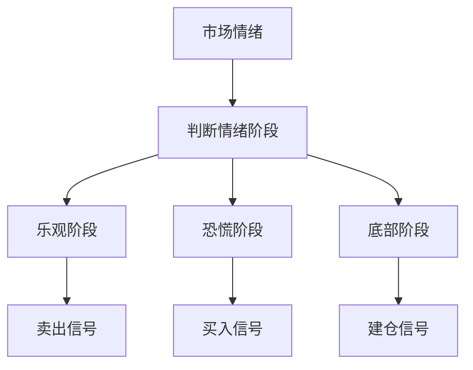
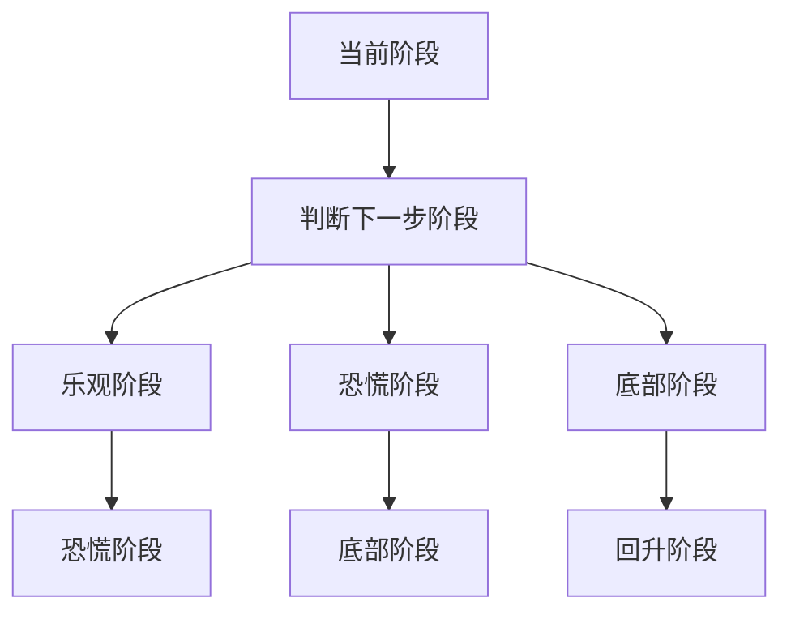
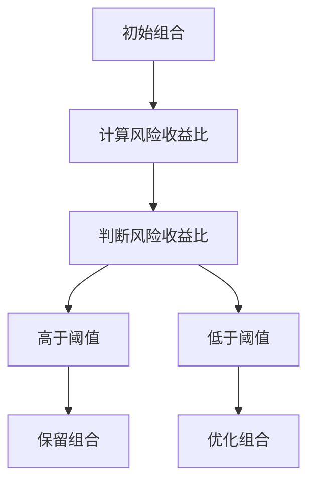
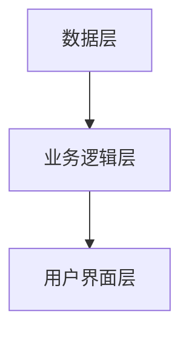
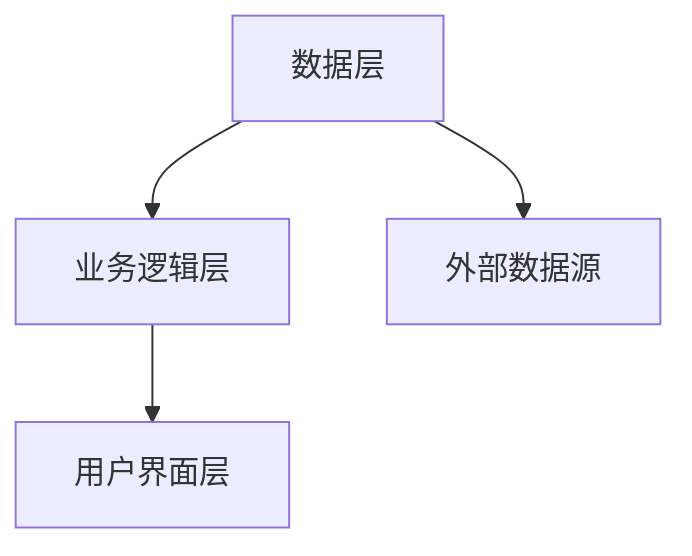

                 


# 彼得林奇的"逆向投资"在市场极端情绪中的操作原则

> 关键词：逆向投资，彼得林奇，市场情绪，投资策略，风险管理

> 摘要：本文深入探讨了彼得林奇的逆向投资理念在市场极端情绪中的应用原则，结合系统分析、数学模型和实际案例，详细讲解了如何在市场恐慌和狂热中把握投资机会，构建稳健的投资组合，并通过代码实现和系统架构设计，为读者提供一套完整的逆向投资解决方案。

---

# 第一部分: 逆向投资的背景与基础

## 第1章: 逆向投资的概述

### 1.1 逆向投资的核心概念

#### 1.1.1 逆向投资的定义与特点
逆向投资是一种与市场情绪相反的投资策略，强调在市场低迷时买入，在市场高涨时卖出。其核心特点包括：
- **非共识性**：逆向投资寻找市场忽视的机会。
- **反周期性**：在市场低谷时布局，高点时退出。
- **长期视角**：注重长期价值，而非短期波动。

#### 1.1.2 逆向投资与传统投资的区别
| **方面** | **逆向投资** | **传统投资** |
|----------|--------------|---------------|
| 时间窗口 | 长期         | 短期           |
| 市场情绪 | 利用极端情绪 | 随市场波动     |
| 交易时机 | 低点买入     | 高点买入       |
| 风险管理 | 高度关注     | 较少关注       |

#### 1.1.3 逆向投资的理论基础
逆向投资的理论基础源于市场有效性和有限理性。市场在短期内可能无效，但长期会回归理性。彼得林奇强调，投资者应利用市场短期非理性定价的机会。

### 1.2 彼得林奇的逆向投资理论

#### 1.2.1 彼得林奇的生平与投资理念
彼得林奇是富达投资的传奇经理人，其投资理念强调：
- **基本面分析**：注重公司财务状况和行业地位。
- **逆向思维**：在市场恐慌时寻找优质资产。

#### 1.2.2 逆向投资在彼得林奇投资策略中的地位
逆向投资是彼得林奇策略的核心，尤其是在市场恐慌时，他倾向于增持那些被市场抛弃但基本面良好的股票。

#### 1.2.3 彼得林奇的经典投资案例
- **案例1：买入恐慌性抛售的股票**：在1987年股灾后，彼得林奇大量买入被市场抛售的优质股票，最终获利丰厚。
- **案例2：行业低谷中的投资**：在互联网泡沫破裂后，他投资于被市场低估的互联网公司。

### 1.3 市场极端情绪与逆向投资的关系

#### 1.3.1 市场情绪的周期性波动
市场情绪呈现周期性波动，通常经历以下几个阶段：
1. **乐观阶段**：投资者情绪高涨，市场出现泡沫。
2. **恐慌阶段**：市场下跌，投资者恐慌性抛售。
3. **底部阶段**：市场触底，价值投资者开始布局。
4. **回升阶段**：市场逐步回升，价值回归。

#### 1.3.2 极端情绪对市场定价的影响
极端情绪会导致市场定价偏离基本面，为逆向投资者创造机会。例如：
- **恐慌性抛售**：优质资产价格被低估。
- **狂热情绪**：劣质资产价格被高估。

#### 1.3.3 逆向投资在市场极端情绪中的机会
- **恐慌时买入**：市场恐慌时，优质资产价格被低估，逆向投资者可以低位建仓。
- **狂热时卖出**：市场狂热时，优质资产价格被高估，逆向投资者可以高位卖出。

---

## 第2章: 逆向投资的核心原则

### 2.1 逆向投资的核心原则

#### 2.1.1 避免随大流
逆向投资的核心是避免跟随市场情绪。彼得林奇强调，投资者应独立思考，避免被市场情绪左右。

#### 2.1.2 寻找非共识性机会
逆向投资者应寻找市场忽视的机会，尤其是那些被市场抛弃但基本面良好的资产。

#### 2.1.3 长期视角与耐心等待
逆向投资需要耐心等待市场回归理性。彼得林奇曾说：“最好的投资机会往往出现在市场最悲观的时刻。”

### 2.2 市场极端情绪下的投资策略

#### 2.2.1 在恐慌中寻找机会
- **策略1：买入恐慌性抛售的股票**：市场恐慌时，优质资产价格被低估。
- **策略2：关注行业龙头**：行业龙头在市场恐慌时通常被过度抛售。

#### 2.2.2 在狂热中保持冷静
- **策略1：卖出高估的资产**：市场狂热时，优质资产价格被高估。
- **策略2：布局防御性资产**：如债券、黄金等，在市场狂热时提供避险功能。

#### 2.2.3 极端情绪下的风险管理
- **风险管理1：设置止损点**：在市场极端波动时，设置止损点以控制风险。
- **风险管理2：分散投资**：避免过度集中，降低市场波动带来的风险。

### 2.3 彼得林奇的选股标准

#### 2.3.1 公司基本面分析
彼得林奇注重公司的财务健康状况，包括：
- **盈利能力**：ROE（净资产收益率）高。
- **财务稳定性**：低负债率，健康的现金流。

#### 2.3.2 行业地位与竞争优势
- **行业地位**：公司是否是行业龙头。
- **竞争优势**：公司是否具有独特的竞争优势，如技术壁垒、品牌优势等。

#### 2.3.3 财务健康状况评估
- **财务健康状况**：关注公司的资产负债表，尤其是流动资产和流动负债的比例。
- **盈利能力**：关注净利润率和毛利率。

---

## 第3章: 逆向投资的数学模型与算法原理

### 3.1 逆向投资的数学模型

#### 3.1.1 市场情绪指数的构建
市场情绪指数可以通过以下步骤构建：
1. **数据收集**：收集市场的交易数据，包括价格、成交量等。
2. **情绪指标计算**：使用技术指标，如RSI（相对强弱指数）来衡量市场情绪。
3. **情绪指数合成**：将多个指标综合成一个市场情绪指数。

#### 3.1.2 市场定价偏差的计算
市场定价偏差可以通过以下公式计算：
$$ \text{定价偏差} = \text{市场价格} - \text{内在价值} $$

#### 3.1.3 逆向投资机会的量化评估
逆向投资机会可以通过以下步骤量化：
1. **计算定价偏差**：确定资产的定价偏差。
2. **判断投资机会**：当定价偏差为负时，资产价格被低估，存在投资机会。

### 3.2 逆向投资的算法原理

#### 3.2.1 基于情绪分析的投资决策树


#### 3.2.2 市场情绪周期的预测模型


#### 3.2.3 逆向投资组合优化算法


---

## 第4章: 系统分析与架构设计方案

### 4.1 系统功能设计

#### 4.1.1 市场情绪分析模块
- **功能1：数据收集**：收集市场的交易数据。
- **功能2：情绪指标计算**：计算市场情绪指数。

#### 4.1.2 投资机会评估模块
- **功能1：定价偏差计算**：计算资产的定价偏差。
- **功能2：投资机会判断**：判断是否存在投资机会。

#### 4.1.3 投资组合优化模块
- **功能1：组合优化**：优化投资组合。
- **功能2：风险控制**：控制投资组合的风险。

### 4.2 系统架构设计

#### 4.2.1 分层架构设计


#### 4.2.2 模块间交互关系


#### 4.2.3 系统性能优化
- **性能优化1：数据预处理**：优化数据处理流程。
- **性能优化2：算法优化**：优化算法的执行效率。

---

## 第5章: 项目实战与代码实现

### 5.1 环境安装与配置

#### 5.1.1 开发环境搭建
- **开发工具**：Python、Jupyter Notebook。
- **数据源**：Yahoo Finance API。

#### 5.1.2 数据源获取与处理
- **数据获取**：使用Yahoo Finance API获取市场数据。
- **数据处理**：清洗数据，计算技术指标。

#### 5.1.3 工具链安装
- **安装Python库**：pandas、numpy、yfinance。

### 5.2 核心代码实现

#### 5.2.1 市场情绪指数计算代码
```python
import pandas as pd
import numpy as np
import yfinance as yf

# 获取数据
data = yf.download('SPY', start='2020-01-01', end='2023-01-01')

# 计算RSI
def calculate_rsi(data, period=14):
    delta = data['Close'].diff()
    up = delta.where(delta > 0, 0)
    down = delta.where(delta < 0, 0)
    avg_up = up.rolling(period).mean()
    avg_down = down.rolling(period).mean()
    rsi = 100 - (100 - (avg_up / avg_down))
    return rsi

data['RSI'] = calculate_rsi(data)
print(data.tail())
```

#### 5.2.2 投资组合优化代码
```python
import pandas as pd
import numpy as np
from scipy.optimize import minimize

# 定义目标函数
def objective_function(weights, returns):
    return -weights.dot(returns)

# 定义约束条件
def constraint(weights):
    return np.sum(weights) - 1

# 求解优化问题
def optimize_portfolio(returns):
    n = returns.shape[1]
    weights = np.ones(n) / n
    result = minimize(objective_function, weights, args=(returns,), 
                      method='SLSQP', constraints=({'type': 'eq', 'fun': constraint}))
    return result.x

# 示例数据
returns = pd.DataFrame({'A': [0.1, 0.2, 0.15], 'B': [0.05, 0.3, 0.1]})
weights = optimize_portfolio(returns)
print(weights)
```

### 5.3 实际案例分析

#### 5.3.1 案例分析
- **案例1**：2020年新冠疫情市场恐慌时，彼得林奇买入被市场抛售的优质股票。
- **案例2**：2000年互联网泡沫破裂后，彼得林奇投资于被市场低估的互联网公司。

#### 5.3.2 代码应用解读
- **解读1**：市场情绪指数计算代码用于判断市场情绪。
- **解读2**：投资组合优化代码用于优化投资组合。

---

## 第6章: 风险管理与心理控制

### 6.1 风险管理策略

#### 6.1.1 设置止损点
- **止损点1**：当市场情绪指数低于阈值时，触发止损。
- **止损点2**：当资产价格偏离内在价值时，触发止损。

#### 6.1.2 分散投资
- **分散投资1**：将资金分配到不同的资产类别。
- **分散投资2**：将资金分配到不同的行业。

### 6.2 心理控制技巧

#### 6.2.1 保持冷静
- **冷静1**：在市场恐慌时，保持冷静，避免恐慌性抛售。
- **冷静2**：在市场狂热时，保持冷静，避免盲目追涨。

#### 6.2.2 坚持纪律
- **纪律1**：坚持逆向投资策略，不随市场情绪波动。
- **纪律2**：坚持长期投资，不被短期波动干扰。

---

## 第7章: 总结与展望

### 7.1 总结
彼得林奇的逆向投资理念在市场极端情绪中具有重要的应用价值。通过逆向投资，投资者可以在市场恐慌时买入优质资产，在市场狂热时卖出高估资产。

### 7.2 展望
未来，逆向投资将与大数据分析、人工智能等技术结合，进一步提升投资决策的科学性和准确性。

---

通过以上章节的详细讲解，我们可以看到彼得林奇的逆向投资理念在市场极端情绪中的应用策略。希望本文能为投资者提供有价值的参考，帮助他们在市场波动中把握投资机会，实现稳健的投资收益。

