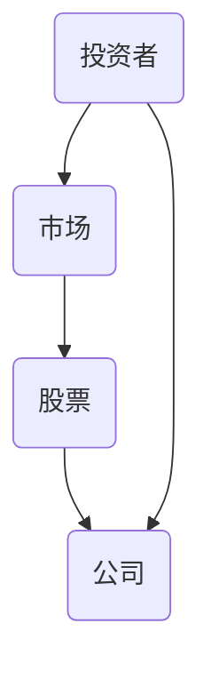
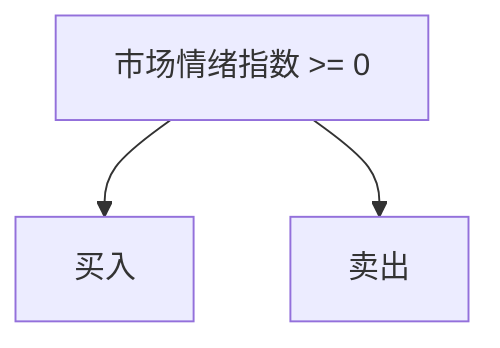
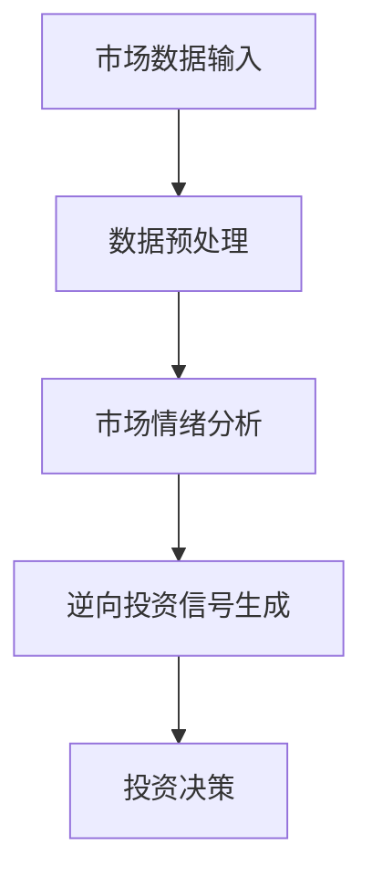
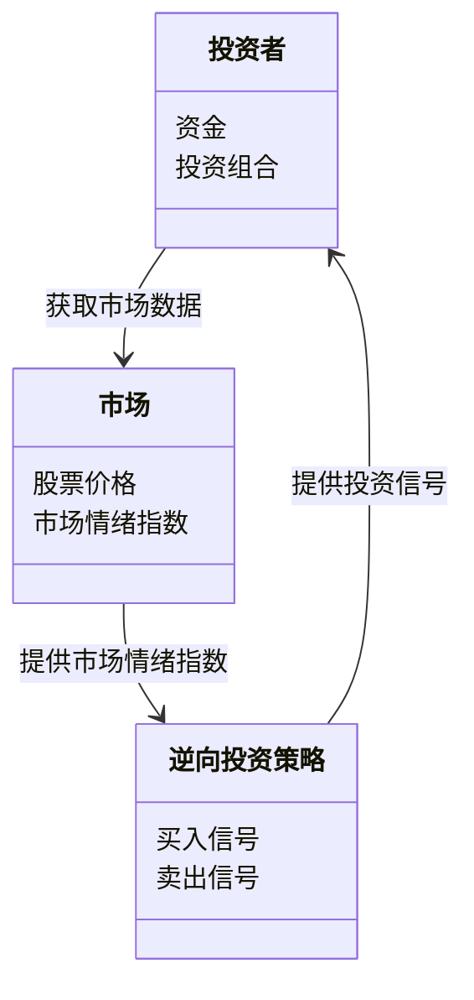
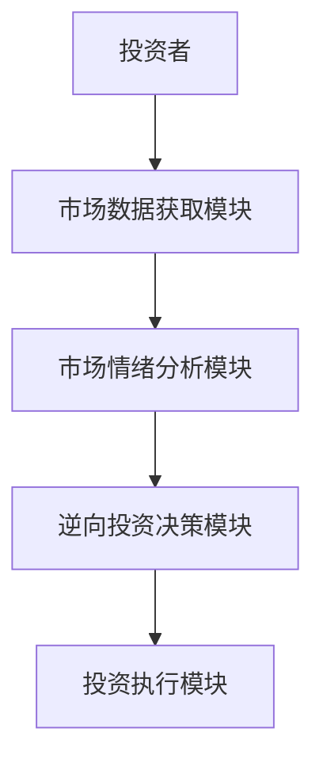
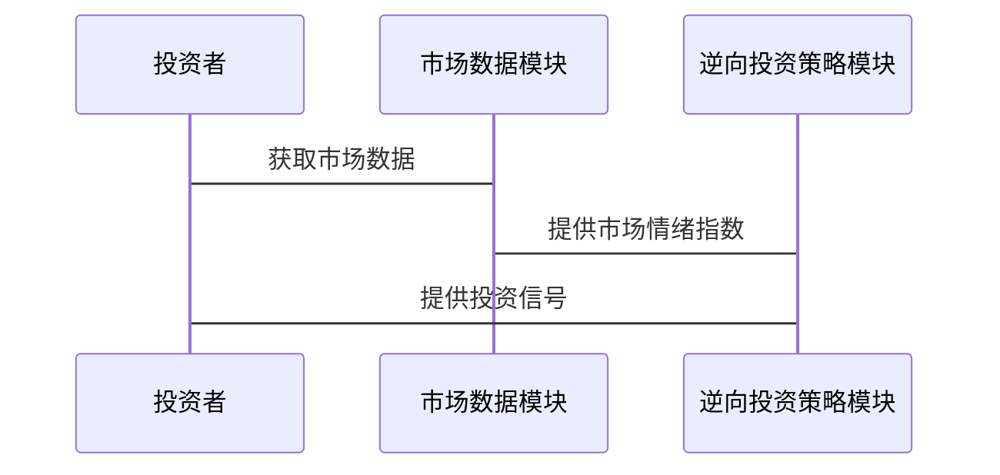

                 

<think>
好的，现在我要设计一本关于彼得·林奇“逆向投资”思想的书籍目录大纲。我需要按照用户的要求，确保每个章节都有足够的细节和结构，涵盖背景介绍、核心概念、算法原理、系统分析、项目实战、最佳实践等部分。

首先，我会从背景介绍开始。这部分需要解释逆向投资是什么，它与其他投资策略的区别，以及彼得·林奇在其中的作用。我需要确保这部分内容能让读者理解逆向投资的基本概念和其重要性。

接下来是核心概念部分。我需要详细讲解逆向投资的原理，比如市场情绪分析、价值评估等。这部分可能需要一到两章，包括具体的策略和方法，比如如何寻找被低估的股票，如何分析公司的基本面等。

然后是算法原理部分。虽然逆向投资更多是策略，但可能需要讨论一些量化的方法，比如如何用指标来判断市场的冷热，或者如何用数学模型来评估股票的价值。这部分可能需要一章，包括具体的数学模型和公式。

接下来是系统分析与架构设计。这部分可能需要讨论如何构建逆向投资的系统，比如数据收集、分析工具、交易策略等。可能需要一章，包括系统架构图和流程图。

然后是项目实战部分。我需要选择一个实际案例，展示如何应用前面提到的策略和方法。这部分可能需要一章，包括环境安装、数据收集、分析过程和结果解读。

最后是最佳实践和小结。总结逆向投资的关键点，注意事项，以及如何避免常见错误。可能需要一章，包括具体的建议和未来的趋势。

我需要确保每个部分都有足够的细节，并且结构清晰，逻辑连贯。同时，要使用专业的技术语言，但又不失易懂。可能还需要加入一些图表，比如ER图、流程图、类图等，来辅助理解。

现在，我开始撰写目录大纲：

# 彼得林奇的"逆向投资"思想

> 关键词：逆向投资，彼得·林奇，投资策略，市场分析，价值评估

> 摘要：逆向投资是一种在市场低迷时买入，市场高涨时卖出的投资策略，强调避开 crowd 的投资行为。本文将详细探讨逆向投资的核心概念、算法原理、系统架构、实战案例以及最佳实践，帮助读者掌握这一经典的股市投资策略。

## 第一部分: 逆向投资的背景与核心概念

### 第1章: 逆向投资的定义与背景

#### 1.1 逆向投资的定义
##### 1.1.1 逆向投资的基本概念
逆向投资是一种在市场低迷时买入，市场高涨时卖出的投资策略，强调避开 crowd 的投资行为。

##### 1.1.2 逆向投资的特点
- 逆周期性：在市场低谷时买入，高点时卖出。
- 价值导向：寻找被市场低估的资产。
- 长期视角：注重资产的长期价值而非短期波动。

##### 1.1.3 逆向投资与传统投资的区别
| 投资策略 | 逆向投资 | 传统投资 |
|----------|----------|----------|
| 时间选择 | 市场低谷 | 市场高点 |
| 价格关注 | 低价位   | 高价位   |
| 风险态度 | 追求风险 | 风险厌恶 |

#### 1.2 彼得·林奇的逆向投资思想
##### 1.2.1 彼得·林奇的选股标准
- 高质量公司：具备持续盈利能力。
- 合理估值：市盈率低于行业平均水平。
- 长期潜力：公司具有竞争优势。

##### 1.2.2 逆向投资的哲学基础
- 市场情绪与理性分析的对立统一。
- 投资者心理：贪婪与恐惧的交替驱动市场波动。

### 第2章: 逆向投资的核心概念与联系

#### 2.1 核心概念原理
##### 2.1.1 市场情绪与投资决策的关系
市场情绪（贪婪与恐惧）直接影响投资者的决策，逆向投资强调在市场情绪低落时介入。

##### 2.1.2 逆向投资的逻辑框架
- 识别市场周期：从低谷到高点再到低谷。
- 判断市场情绪：通过市场指标和公司估值。
- 执行投资策略：买入低估资产，卖出高估资产。

##### 2.1.3 投资者心理与逆向投资策略
- 避免从众心理：不跟随市场潮流。
- 独立思考：基于基本面分析做出决策。

#### 2.2 核心概念对比表格
| 指标       | 逆向投资   | 价值投资   |
|------------|------------|------------|
| 投资时机   | 市场低谷   | 公司价值低估时 |
| 估值标准   | 市盈率低   | 内在价值低  |
| 持股时间   | 中长期     | 长期持有   |

#### 2.3 实体关系图（ER图）


## 第三部分: 逆向投资的算法原理

### 第3章: 逆向投资的算法原理

#### 3.1 算法原理概述
##### 3.1.1 逆向投资的量化模型
- 市场情绪指数：综合反映市场的乐观或悲观程度。
- 估值指标：市盈率、市净率等。

##### 3.1.2 市场情绪分析的数学模型
$$ \text{市场情绪指数} = \frac{\text{上涨股票数量} - \text{下跌股票数量}}{\text{总股票数量}} $$

##### 3.1.3 逆向投资的决策树模型


#### 3.2 算法流程图（Mermaid）


#### 3.3 数学模型与公式
##### 3.3.1 市场情绪指数计算公式
$$ \text{市场情绪指数} = \frac{\text{上涨股票数量} - \text{下跌股票数量}}{\text{总股票数量}} $$

##### 3.3.2 逆向投资决策模型
$$ \text{投资信号} = \begin{cases}
    \text{买入} & \text{如果市场情绪指数 < -0.5} \\
    \text{观望} & \text{如果 -0.5 \leq 市场情绪指数 \leq 0.5} \\
    \text{卖出} & \text{如果市场情绪指数 > 0.5}
\end{cases} $$

## 第四部分: 系统分析与架构设计

### 第4章: 逆向投资的系统分析

#### 4.1 问题场景介绍
- 投资者需要在市场低谷时抓住投资机会。
- 如何量化市场情绪，制定投资策略。

#### 4.2 系统功能设计
##### 4.2.1 领域模型


#### 4.3 系统架构设计


#### 4.4 系统接口设计
- 投资者接口：提交投资需求。
- 市场数据接口：提供股票价格、市场指数等数据。
- 逆向投资策略接口：返回投资信号。

#### 4.5 系统交互序列图


## 第五部分: 项目实战

### 第5章: 逆向投资的实战应用

#### 5.1 环境安装
- 数据源：Yahoo Finance API
- 工具：Python、Pandas、Matplotlib
- 环境配置：安装必要的库和设置API密钥。

#### 5.2 核心实现源代码
```python
import pandas as pd
import requests

def get_market_data(ticker):
    # 获取股票数据
    url = f'https://query1.finance.yahoo.com/...{ticker}'
    response = requests.get(url)
    data = response.json()
    return pd.DataFrame(data['chart'])

def calculate_market_sentiment(stocks):
    up = sum(1 for stock in stocks if stock['price_change'] > 0)
    down = len(stocks) - up
    return (up - down) / len(stocks)

def inverse_investment_strategy(stocks):
    sentiment = calculate_market_sentiment(stocks)
    if sentiment < -0.5:
        return '买入'
    elif sentiment > 0.5:
        return '卖出'
    else:
        return '观望'

# 示例使用
stocks = get_market_data('AAPL')
signal = inverse_investment_strategy(stocks)
print(f'投资信号：{signal}')
```

#### 5.3 实际案例分析
- 案例：2020年新冠疫情导致市场崩盘，彼得·林奇建议投资者在市场低谷时买入优质股票。
- 分析：选择苹果公司（AAPL），计算其市盈率和市净率，判断是否低估。

#### 5.4 代码应用解读
- 数据获取：从Yahoo Finance获取股票数据。
- 情绪计算：通过上涨和下跌股票数量计算市场情绪指数。
- 投资决策：根据市场情绪指数生成买入、卖出或观望信号。

## 第六部分: 最佳实践与小结

### 第6章: 最佳实践与小结

#### 6.1 实战经验总结
- 定期评估市场情绪，及时调整投资策略。
- 结合基本面分析，选择优质公司。

#### 6.2 逆向投资的注意事项
- 避免过度依赖市场情绪指标。
- 考虑宏观经济环境和行业趋势。

#### 6.3 小结
逆向投资是一种有效的投资策略，通过在市场低谷时买入，市场高点时卖出，可以获得超额收益。彼得·林奇的策略强调独立思考和基本面分析，帮助投资者在市场波动中保持理性。

#### 6.4 拓展阅读
- 彼得·林奇的《投资最重要的事情》
- 其他逆向投资经典书籍和文章。

---

# END

---

通过以上思考过程，我设计了一个详细的逆向投资书籍目录大纲，涵盖了从基本概念到实战应用的各个方面，确保内容全面且结构清晰。

