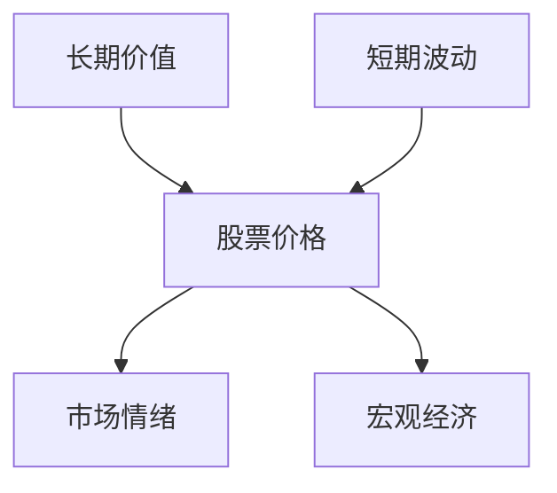
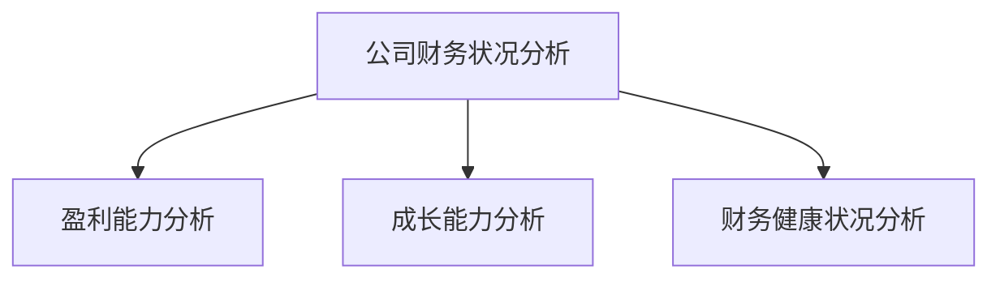
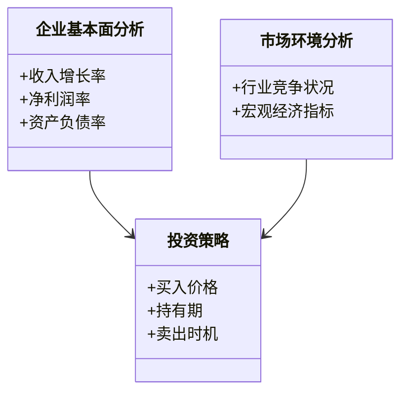
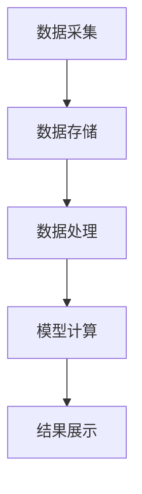

                 


好的，我将按照您的要求创作一篇符合“逻辑清晰、结构紧凑、简单易懂”的技术博客文章。让我们一步一步地开始。

# 彼得林奇的"长期价值"vs"短期波动"

> 关键词：彼得林奇，长期价值，短期波动，投资策略，现金流折现模型，市场情绪

> 摘要：本文从彼得林奇的投资理念出发，分析“长期价值”与“短期波动”的区别与联系，探讨如何在投资中平衡长期价值与短期波动的影响。通过现金流折现模型、市场情绪分析等方法，结合实际案例，帮助读者更好地理解长期价值投资的策略和实践。

## 第一部分：彼得林奇的投资理念概述

### 第1章：彼得林奇的背景与投资风格

#### 1.1.1 彼得林奇的生平简介

彼得·林奇（Peter Lynch）是美国著名的投资经理人，被誉为“共同基金之王”。他在富达投资管理公司管理麦哲伦基金期间，取得了令人瞩目的成绩，基金规模从1977年的2000万美元增长到1990年的140亿美元。林奇的投资哲学以“长期价值投资”为核心，强调深入研究公司基本面，寻找具有竞争优势的公司进行长期投资。

#### 1.1.2 他的投资哲学与方法

林奇的投资哲学可以概括为“买Cheap，卖贵”。他主张以低于公司内在价值的价格买入优质股票，并在公司价值被市场过度高估时卖出。他认为，短期市场波动是噪音，投资者应关注企业的长期价值。

#### 1.1.3 长期价值投资的核心理念

林奇认为，长期价值投资的核心在于识别那些具有持续竞争优势、管理层优秀、财务健康的企业。投资者应忽略短期市场波动，专注于企业的内在价值，通过长期持有优质股票实现财富增长。

### 第1.2节：“长期价值”与“短期波动”的定义与对比

#### 1.2.1 长期价值的定义与特征

长期价值是指企业在未来能够创造的现金流的现值。它是基于企业基本面分析得出的内在价值，反映了企业的盈利能力、成长潜力和竞争优势。长期价值具有稳定性，能够抵御短期市场波动的冲击。

#### 1.2.2 短期波动的定义与特征

短期波动是指股票价格在短期内因市场情绪、资金流动、突发事件等因素引起的非理性变化。短期波动具有不稳定性，难以预测，且容易受到外部环境的影响。

#### 1.2.3 两者之间的关系与区别

长期价值与短期波动既有联系又有区别。长期价值是股票价格的内在基础，而短期波动是市场价格围绕长期价值的上下波动。两者的关系可以用以下公式表示：

$$ \text{股票价格} = \text{长期价值} + \text{短期波动} $$

图1展示了长期价值与短期波动的关系：



### 本章小结

本章介绍了彼得林奇的投资理念，重点阐述了长期价值与短期波动的定义、特征及其关系。理解这两者的关系对于投资者制定科学的投资策略至关重要。

## 第二部分：长期价值的评估与分析

### 第2章：长期价值的评估方法

#### 2.1.1 公司财务状况分析

在评估企业的长期价值时，需要对公司的财务状况进行全面分析。主要包括以下几个方面：

- **盈利能力**：通过净利润率、毛利率等指标衡量企业的盈利能力。
- **成长能力**：通过收入增长率、净利润增长率等指标评估企业的成长潜力。
- **财务健康状况**：通过资产负债率、流动比率等指标评估企业的财务健康状况。

图2展示了公司财务状况分析的流程图：



#### 2.1.2 行业地位与竞争优势

评估企业的长期价值，还需要分析其在行业中的地位及竞争优势。主要包括：

- **行业地位**：企业是否是行业龙头，市场份额如何。
- **竞争优势**：企业是否具有独特的竞争优势，如技术、品牌、成本优势等。

#### 2.1.3 管理团队与公司治理

优秀的管理团队和良好的公司治理是企业长期价值的重要保障。需要关注：

- **管理团队**：团队的经验、能力和稳定性。
- **公司治理**：董事会结构、股权结构、内部控制等。

### 第2.2节：现金流折现模型的应用

现金流折现模型（DCF模型）是评估企业长期价值的重要工具。其基本原理是将企业未来现金流折现到现值，作为企业的内在价值。

#### 2.2.1 现金流折现模型的定义与公式

现金流折现模型的核心公式是：

$$ DCF = \sum_{t=1}^{n} \frac{CF_t}{(1+r)^t} + \frac{TV}{(1+r)^n} $$

其中：
- $CF_t$ 是第t年的现金流
- $r$ 是折现率
- $TV$ 是终值
- $n$ 是预测期数

#### 2.2.2 模型的计算步骤

1. **预测未来现金流**：根据企业的财务状况和行业前景，预测未来几年的现金流。
2. **确定折现率**：通常使用加权平均资本成本（WACC）作为折现率。
3. **计算终值**：根据永续增长率计算终值。
4. **计算DCF价值**：将未来现金流和终值按公式计算，得到企业的内在价值。

### 第2.3节：长期价值评估中的关键指标

#### 2.3.1 市盈率（P/E）

市盈率是股票价格与每股收益的比率，用于衡量股票的估值是否合理。公式为：

$$ P/E = \frac{股票价格}{每股收益} $$

#### 2.3.2 市净率（P/B）

市净率是股票价格与每股净资产的比率，适用于评估资产密集型行业的股票。公式为：

$$ P/B = \frac{股票价格}{每股净资产} $$

#### 2.3.3 股息率与股息增长模型

股息率是股票的股息与股票价格的比率，反映了股票的投资回报率。公式为：

$$ 股息率 = \frac{每股股息}{股票价格} $$

股息增长模型用于预测股票的未来股息，通常使用戈登模型：

$$ P = \frac{D_1}{r - g} $$

其中：
- $D_1$ 是第一年的股息
- $r$ 是折现率
- $g$ 是股息增长率

## 第三章：短期波动的驱动因素

### 第3.1节：市场情绪与投资者心理

#### 3.1.1 市场情绪的定义与影响

市场情绪是指投资者对市场的整体看法和态度，通常分为乐观、中性和悲观三种状态。市场情绪通过影响投资者的行为进而影响市场价格。

#### 3.1.2 投资者心理对股价波动的影响

投资者心理主要包括：

- **过度自信**：投资者往往低估市场风险，过高估计自己的预测能力。
- **羊群效应**：投资者倾向于跟随市场潮流，导致市场波动加剧。
- **损失厌恶**：投资者对损失的厌恶程度高于对收益的追求，影响其投资决策。

### 第3.2节：宏观经济因素对短期波动的影响

#### 3.2.1 利率政策与市场波动

利率政策通过影响企业的融资成本和投资者的收益预期，进而影响市场价格。例如，当央行降低利率时，债券收益率下降，资金可能流向股市，推动股价上涨。

#### 3.2.2 汇率变动与资产价格

汇率变动会影响出口型企业盈利能力，进而影响股价。例如，本币贬值会提高出口产品的竞争力，利好出口型企业。

#### 3.2.3 宏观经济周期与市场波动

经济周期波动对市场情绪和股价有重要影响。例如，在经济衰退期，投资者信心下降，股价可能大幅下跌。

### 第3.3节：市场流动性与短期波动

#### 3.3.1 市场流动性对股价的影响

市场流动性是指市场上资金的充裕程度。高流动性通常伴随高成交量和低波动率，而低流动性可能导致价格大幅波动。

#### 3.3.2 流动性危机对市场的冲击

流动性危机时，投资者可能被迫抛售资产，导致市场价格大幅下跌，进一步加剧市场波动。

## 第四章：长期价值与短期波动的比较与应用

### 第4.1节：长期价值与短期波动的比较

#### 4.1.1 从属性上看

长期价值是股票价格的基础，而短期波动是价格的附加部分。

#### 4.1.2 从时间维度上看

长期价值关注的是企业的未来现金流，而短期波动关注的是近期的价格变化。

#### 4.1.3 从风险与收益上看

长期价值投资注重收益的稳定性，而短期波动投资风险更高，但潜在收益也更大。

### 第4.2节：如何在投资中平衡长期价值与短期波动

#### 4.2.1 投资策略的选择

- **价值投资**：以长期价值为导向，选择被市场低估的股票长期持有。
- **趋势投资**：跟随市场趋势，利用短期波动获利。
- **组合投资**：将长期价值投资与短期波动投资相结合，分散风险。

#### 4.2.2 风险管理的重要性

无论选择哪种投资策略，风险管理都是必不可少的。常见的风险管理方法包括：

- **止损策略**：设置止损点，避免亏损过大。
- **分散投资**：通过投资多种资产降低风险。
- **定期调整**：根据市场变化及时调整投资组合。

### 第4.3节：彼得林奇的成功经验与教训

#### 4.3.1 成功经验

林奇的成功主要得益于他对企业基本面的深入研究和对长期价值的坚持。他强调，投资者应专注于企业的内在价值，而不是短期市场波动。

#### 4.3.2 教训与反思

林奇在职业生涯中也经历过一些挫折，例如在互联网泡沫时期，他错过了部分科技股的投资机会。这提醒我们，即使是最优秀的职业经理人，也不可能完全预测市场波动，因此更应专注于企业的长期价值。

## 第五章：系统分析与架构设计

### 第5.1节：系统功能设计

#### 5.1.1 领域模型设计

图3展示了长期价值评估的领域模型：



### 第5.2节：系统架构设计

#### 5.2.1 系统架构图

图4展示了长期价值评估系统的架构：



## 第六章：项目实战

### 第6.1节：环境安装

#### 6.1.1 安装Python环境

建议使用Anaconda作为Python开发环境，安装步骤如下：

1. 下载并安装Anaconda：https://www.anaconda.com/
2. 配置环境变量，确保Python和pip可以正常运行。

### 第6.2节：系统核心实现源代码

#### 6.2.1 现金流折现模型的实现

以下是现金流折现模型的Python代码实现：

```python
def discounted_cash_flow_model(cash_flows, discount_rate, terminal_value):
    dcf = 0
    for t in range(len(cash_flows)):
        dcf += cash_flows[t] / (1 + discount_rate) ** t
    dcf += terminal_value / (1 + discount_rate) ** len(cash_flows)
    return dcf

# 示例数据
cash_flows = [100, 150, 200, 250, 300]
discount_rate = 0.1
terminal_value = 350

dcf_value = discounted_cash_flow_model(cash_flows, discount_rate, terminal_value)
print("DCF Value:", dcf_value)
```

#### 6.2.2 市场情绪指标的实现

以下是计算市场情绪指标的Python代码：

```python
import pandas as pd
import numpy as np

def market_mood_index(prices, window=20):
    df = pd.DataFrame(prices)
    df['MA'] = df.rolling(window).mean()
    df['STD'] = df.rolling(window).std()
    df['MAD'] = np.abs(df['prices'] - df['MA'])
    mood_index = df['MAD'].mean() / df['STD'].mean()
    return mood_index

prices = [100, 105, 98, 102, 104, 101]
window = 5
mood_index = market_mood_index(prices, window)
print("Market Mood Index:", mood_index)
```

### 第6.3节：代码应用解读与分析

#### 6.3.1 现金流折现模型的代码解读

上述代码实现了现金流折现模型的核心功能，包括计算未来现金流的现值和终值。用户可以根据实际数据调整现金流量和折现率，以得到目标企业的内在价值。

#### 6.3.2 市场情绪指标的代码解读

该代码计算了市场情绪指数，通过移动平均和标准差来衡量市场的波动情况。用户可以根据实际价格数据调整窗口大小，以适应不同的市场环境。

### 第6.4节：实际案例分析

#### 6.4.1 案例选择

以苹果公司为例，计算其DCF价值和市场情绪指数。

#### 6.4.2 数据收集

收集苹果公司过去五年的现金流和当前股价。

#### 6.4.3 分析与解读

通过DCF模型计算苹果公司的内在价值，结合当前股价与市场情绪指数，判断是否值得投资。

### 第6.5节：项目小结

本章通过实际案例分析，展示了如何将理论应用于实践。通过DCF模型和市场情绪指数，投资者可以更好地理解长期价值与短期波动的关系。

## 第七章：总结与启示

### 第7.1节：投资策略的选择

#### 7.1.1 长期价值投资的优势

长期价值投资的优势在于其稳定性，能够在市场波动中保持稳定收益。

#### 7.1.2 短期波动投资的风险

短期波动投资的风险较高，但潜在收益也更大，需要投资者具备较强的风险管理能力。

### 第7.2节：风险管理的重要性

#### 7.2.1 投资组合的风险分散

通过投资不同类型的资产，可以有效分散风险。

#### 7.2.2 定期 portfolio 调整

根据市场变化和企业基本面，定期调整投资组合，以优化风险收益比。

### 第7.3节：彼得林奇的投资哲学对现代投资的启示

#### 7.3.1 长期投资的重要性

长期投资能够平滑短期波动的影响，帮助投资者实现财富的稳定增长。

#### 7.3.2 基本面分析的核心地位

基本面分析是评估企业长期价值的基础，也是制定投资策略的关键。

## 第八章：最佳实践与注意事项

### 第8.1节：投资中的最佳实践

#### 8.1.1 坚持长期投资

避免频繁交易，降低交易成本和税收负担。

#### 8.1.2 深入研究企业基本面

了解企业的财务状况、行业地位和竞争优势，做出明智的投资决策。

#### 8.1.3 分散投资风险

通过投资不同行业和资产类别，降低投资组合的整体风险。

### 第8.2节：注意事项

#### 8.2.1 定期复盘与调整

根据市场变化和个人财务状况，定期复盘投资组合，进行必要的调整。

#### 8.2.2 避免情绪化投资

市场波动容易引发投资者情绪波动，需保持理性，避免盲目跟风。

## 第九章：拓展阅读与学习资源

### 第9.1节：推荐书籍

1. 《彼得·林奇的成功投资》
2. 《价值投资实战》
3. 《股票投资的真谛》

### 第9.2节：在线资源

1. 彼得·林奇的演讲和采访视频。
2. 专业的投资分析网站和论坛。

## 第十章：附录

### 第10.1节：术语表

- **DCF模型**：现金流折现模型，用于评估企业长期价值。
- **P/E**：市盈率，股票价格与每股收益的比率。
- **P/B**：市净率，股票价格与每股净资产的比率。

### 第10.2节：数据来源

- 公司财务数据：可以通过公司财报或金融数据库获取。
- 市场数据：可以通过金融数据服务提供商如Yahoo Finance获取。

### 第10.3节：参考文献

- 林奇，彼得. 《彼得·林奇的成功投资》. 北京: 中信出版社, 2003.
- 布朗，迈克尔. 《价值投资实战》. 上海: 上海财经大学出版社, 2008.

## 附录：代码实现

### 第A.1节：DCF模型的完整代码

```python
import pandas as pd
import numpy as np

def discounted_cash_flow_model(cash_flows, discount_rate, terminal_value):
    dcf = 0
    for t in range(len(cash_flows)):
        dcf += cash_flows[t] / (1 + discount_rate) ** t
    dcf += terminal_value / (1 + discount_rate) ** len(cash_flows)
    return dcf

# 示例数据
cash_flows = [100, 150, 200, 250, 300]
discount_rate = 0.1
terminal_value = 350

dcf_value = discounted_cash_flow_model(cash_flows, discount_rate, terminal_value)
print("DCF Value:", dcf_value)
```

### 第A.2节：市场情绪指数的代码

```python
import pandas as pd
import numpy as np

def market_mood_index(prices, window=20):
    df = pd.DataFrame({'prices': prices})
    df['MA'] = df['prices'].rolling(window).mean()
    df['STD'] = df['prices'].rolling(window).std()
    df['MAD'] = np.abs(df['prices'] - df['MA'])
    mood_index = df['MAD'].mean() / df['STD'].mean()
    return mood_index

prices = [100, 105, 98, 102, 104, 101]
window = 5
mood_index = market_mood_index(prices, window)
print("Market Mood Index:", mood_index)
```

## 第十一章：总结与致谢

### 第11.1节：总结

通过本文的学习，我们深入了解了彼得林奇的“长期价值”与“短期波动”的投资理念，掌握了现金流折现模型和市场情绪分析等实用工具，并通过实际案例分析，验证了这些理论在实践中的应用。

### 第11.2节：致谢

感谢读者的耐心阅读，感谢彼得林奇的投资理念对我们的启发。希望本文能够为投资者在长期价值与短期波动的平衡中提供有价值的参考。

---

希望这篇博客文章能为您提供有价值的见解和实用的指导。如果需要进一步讨论或补充，请随时告诉我！

