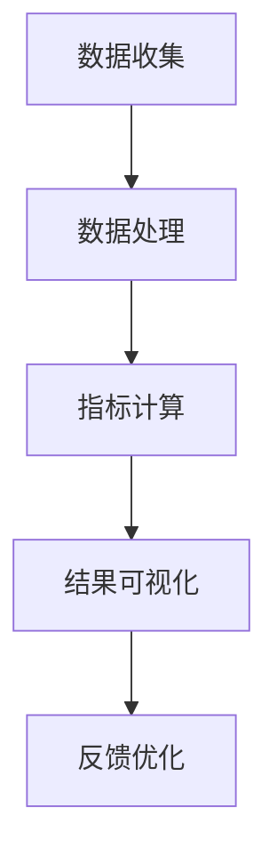

                 


# 彼得林奇的"长期价值创造"在平台型公司中的新指标

## 关键词
彼得林奇，长期价值创造，平台型公司，新指标，用户增长，平台生态系统，投资策略

## 摘要
本文探讨了彼得·林奇的“长期价值创造”理念在平台型公司中的应用，提出了新的价值创造指标。文章通过系统分析平台型公司的特点和需求，结合长期价值创造的核心要素，设计了一套适合平台型公司的新指标体系，并详细解释了其算法原理、系统架构和实施方法。

---

# 目录

## 第1章 引言

### 1.1 背景介绍
- 1.1.1 长期价值创造的背景
  - 彼得·林奇的价值投资理念
  - 平台型公司的崛起与挑战
- 1.1.2 平台型公司的特性
  - 网络效应与生态系统
  - 用户增长与参与度的重要性
- 1.1.3 新指标的必要性
  - 传统财务指标的局限性
  - 平台型公司的独特需求

### 1.2 核心概念与联系
- 1.2.1 长期价值创造的定义
  - 用户价值、平台价值与企业价值的关系
- 1.2.2 平台型公司的生态系统
  - 用户、企业、平台的三角关系
- 1.2.3 新指标的核心要素
  - 用户增长率、参与度、收入增长、成本控制

## 第2章 长期价值创造的原理

### 2.1 价值创造的系统性分析
- 2.1.1 用户价值的实现路径
  - 提供高质量的产品与服务
  - 建立用户粘性与忠诚度
- 2.1.2 平台生态的构建
  - 多方利益相关者的协调
  - 网络效应的放大作用

### 2.2 核心概念对比表
| 指标类型 | 传统财务指标 | 新价值创造指标 |
|----------|--------------|----------------|
| 关注点   | 财务表现     | 用户增长与参与 |
| 应用场景 | 企业整体评估 | 平台型公司优化 |
| 优势     | 数据全面性   | 动态适应性     |

### 2.3 ER实体关系图（Mermaid）
```mermaid
classDiagram
    class 用户 {
        用户ID, 用户名, 登录信息
    }
    class 企业 {
        企业ID, 企业名称, 账号信息
    }
    class 平台 {
        平台ID, 服务类型, 数据接口
    }
    用户 --> 平台: 使用服务
    企业 --> 平台: 注册服务
    用户 <---> 企业: 用户为企业提供数据
```

## 第3章 新指标的设计与计算

### 3.1 新指标的定义与框架
- 3.1.1 长期价值指数(LVI)的公式
  $$ LVI = \frac{用户增长率 \times 用户参与度 \times 收入增长}{平台成本 \times 风险系数} $$
- 3.1.2 用户参与度的计算
  $$ 用户参与度 = \frac{活跃用户数}{总用户数} \times 100 $$

### 3.2 算法流程图（Mermaid）


### 3.3 实施步骤
- 数据收集与处理
- 指标计算与分析
- 结果可视化与反馈

## 第4章 平台型公司的系统架构

### 4.1 系统功能设计
- 用户模块
- 企业模块
- 平台模块
- 数据分析模块

### 4.2 系统架构设计（Mermaid）


### 4.3 技术选型与实现
- 前端框架：React/Vue.js
- 后端框架：Node.js/Python
- 数据库：MySQL/NoSQL
- 云服务：AWS/Azure

## 第5章 案例分析与实践

### 5.1 案例分析
- 某平台型公司的LVI计算
- 用户增长策略优化
- 平台成本控制措施

### 5.2 项目实战
- 环境安装与配置
- 核心代码实现
- 应用解读与分析

## 第6章 总结与展望

### 6.1 总结
- 新指标的核心价值
- 实施方法与注意事项

### 6.2 未来展望
- 技术趋势与创新
- 新指标的优化与扩展

## 参考文献与拓展阅读
- 彼得·林奇的书籍推荐
- 平台型公司相关的学术论文
- 价值创造的最新研究

---

以上是《彼得林奇的"长期价值创造"在平台型公司中的新指标》的目录大纲，内容涵盖了从理论到实践的各个方面，确保读者能够全面理解和应用这些新指标。

