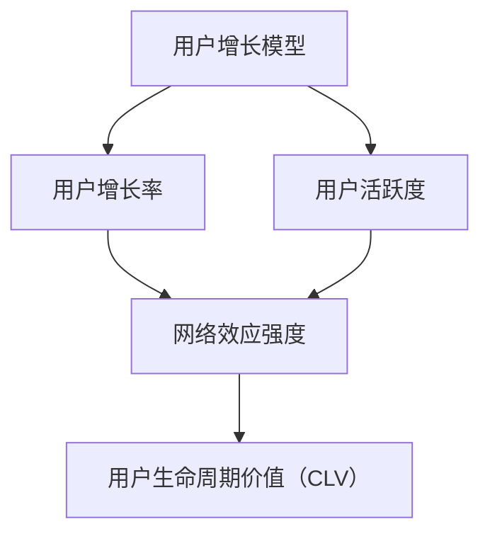
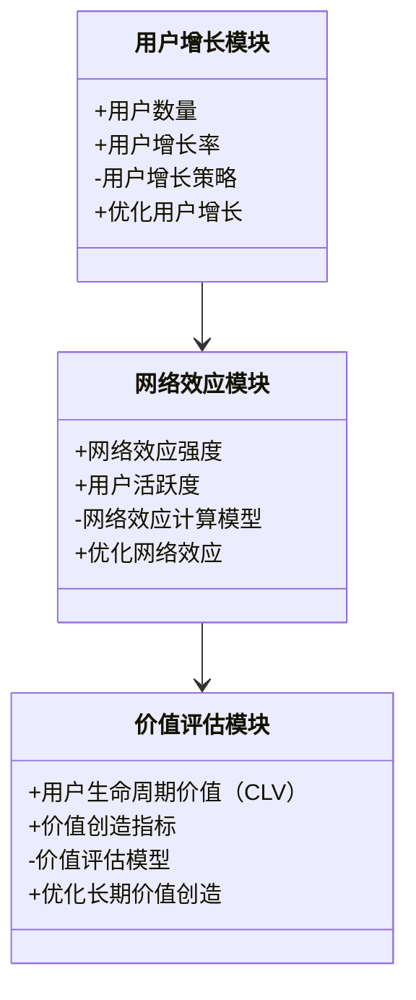
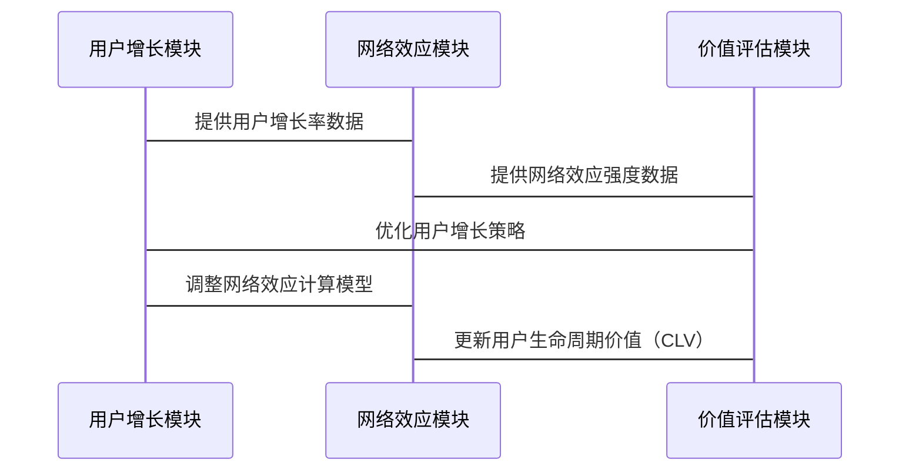

                 


# 彼得林奇的"长期价值创造"在网络效应企业中的新指标

> 关键词：彼得·林奇，长期价值创造，网络效应企业，价值评估指标，用户增长模型，系统架构设计

> 摘要：本文基于彼得·林奇的长期价值创造理论，探讨其在网络效应企业中的新应用。通过分析网络效应企业的特殊性，提出新的价值评估指标，并结合实际案例，详细阐述如何在网络效应企业中实现长期价值创造。文章从理论背景、指标构建、系统设计、项目实战等多个维度展开，为网络效应企业的价值评估与优化提供新的思路。

---

## 第一章：彼得·林奇的长期价值创造理论

### 1.1 价值投资的核心理念
彼得·林奇作为全球著名投资专家，其核心理念在于通过长期持有优质资产，实现价值的稳步增长。他强调选择那些具有持续增长潜力的企业，而非短期炒作。长期价值创造的关键在于企业是否能够持续为股东创造价值。

### 1.2 网络效应企业的定义与特点
网络效应企业是指那些通过用户的参与和互动，能够产生网络效应的企业。其特点包括：
- **用户价值的网络化**：用户的价值随着用户数量的增加而递增。
- **边际成本递减**：随着用户数量的增长，单位用户的边际成本逐渐降低。
- **外部性**：用户的行为对其他用户产生影响，形成正反馈。

### 1.3 理论与实践的结合点
彼得·林奇的长期价值创造理论在网络效应企业中的核心结合点在于，如何通过网络效应放大企业的价值创造能力。网络效应企业的用户增长和价值放大机制，为长期价值创造提供了新的可能性。

---

## 第二章：网络效应企业的价值评估指标

### 2.1 传统企业的价值评估指标
传统企业通常采用以下指标进行价值评估：
- **市盈率（P/E）**：股价与每股收益的比率。
- **市净率（P/B）**：股价与每股净资产的比率。
- **ROE（净资产收益率）**：衡量企业盈利能力的指标。

### 2.2 网络效应企业的特殊性
网络效应企业的价值创造机制与传统企业存在显著差异，其特殊性体现在：
- 用户数量的指数级增长。
- 网络效应对外部性的放大作用。
- 用户粘性与企业护城河的强关联性。

### 2.3 网络效应企业的价值创造新指标
为了更好地衡量网络效应企业的价值创造能力，提出以下新指标：
- **用户增长模型**：衡量用户数量的增长速度及稳定性。
- **网络效应强度**：量化网络效应对外部性的贡献。
- **用户生命周期价值（CLV）**：衡量用户在整个生命周期为企业带来的价值。

---

## 第三章：彼得·林奇理论在网络效应企业中的应用

### 3.1 长期价值创造的核心要素
- **用户体验的持续优化**：通过技术创新和产品迭代，提升用户参与度。
- **网络效应的放大作用**：通过用户增长和网络效应，放大企业价值。
- **企业护城河的构建**：通过技术、品牌和用户粘性构建竞争壁垒。

### 3.2 网络效应企业的长期价值创造策略
- **用户增长模型的优化**：通过数据分析和用户反馈，优化用户增长策略。
- **网络效应的扩展与深化**：通过功能扩展和用户激励，增强网络效应。
- **企业生态系统的构建**：通过合作伙伴和第三方服务，构建企业生态系统。

### 3.3 理论与实践的结合案例
以某社交媒体平台为例，分析其如何通过彼得·林奇的长期价值创造理论实现网络效应的放大。通过用户增长模型和网络效应强度的优化，该平台实现了用户数量的指数级增长和价值的持续提升。

---

## 第四章：网络效应企业的长期价值创造指标体系

### 4.1 核心指标的定义与计算
- **用户增长率**：$$用户增长率 = \frac{新用户数 - 旧用户数}{旧用户数} \times 100\%$$
- **网络效应强度**：$$网络效应强度 = \frac{用户数量 \times 用户活跃度}{单位成本}$$
- **用户生命周期价值（CLV）**：$$CLV = \text{用户平均收入} \times \text{用户生命周期长度}$$

### 4.2 指标体系的构建与应用
通过构建包含用户增长模型、网络效应强度和用户生命周期价值的指标体系，可以帮助企业更好地衡量和优化长期价值创造能力。以下是指标体系的架构图：



### 4.3 指标体系的优化与提升
通过动态调整用户增长策略和网络效应强度，企业可以不断提升用户的生命周期价值，实现长期价值创造。

---

## 第五章：系统分析与架构设计

### 5.1 系统功能设计
- **用户增长模块**：负责用户获取、激活和留存。
- **网络效应模块**：负责网络效应的计算和优化。
- **价值评估模块**：负责长期价值创造的指标计算和分析。

### 5.2 系统架构设计
以下是系统架构的类图：



### 5.3 系统交互设计
以下是系统交互的序列图：



---

## 第六章：项目实战

### 6.1 环境安装与配置
- **工具安装**：安装Python、Jupyter Notebook和相关数据分析库（如Pandas、Matplotlib）。
- **数据获取**：获取网络效应企业的用户增长数据和网络效应强度数据。

### 6.2 核心代码实现
以下是用户增长模型和网络效应强度计算的Python代码示例：

```python
import pandas as pd
import matplotlib.pyplot as plt

# 用户增长数据
user_growth = pd.DataFrame({
    '用户数量': [1000, 2000, 3000, 4000, 5000],
    '时间': [1, 2, 3, 4, 5]
})

# 网络效应强度计算
def calculate_network_effectiveness(user_growth, cost_per_user):
    return (user_growth['用户数量'] * user_growth['用户活跃度']) / cost_per_user

network_effectiveness = calculate_network_effectiveness(user_growth, 10)

# 可视化
plt.plot(user_growth['时间'], user_growth['用户数量'], label='用户数量')
plt.plot(user_growth['时间'], network_effectiveness, label='网络效应强度')
plt.xlabel('时间')
plt.ylabel('数值')
plt.legend()
plt.show()
```

### 6.3 案例分析与优化
以某电商平台为例，分析其用户增长和网络效应强度的变化，并提出优化建议。

---

## 第七章：总结与展望

### 7.1 本章小结
本文基于彼得·林奇的长期价值创造理论，提出了适用于网络效应企业的新价值评估指标，并通过系统设计和项目实战，展示了如何在网络效应企业中实现长期价值创造。

### 7.2 未来展望
未来的研究可以进一步结合大数据分析和人工智能技术，探索网络效应企业长期价值创造的更多可能性，如动态调整用户增长策略和实时优化网络效应强度。

---

## 关注点与注意事项

- **数据准确性**：在实际应用中，确保数据的准确性和实时性。
- **模型优化**：根据企业实际需求，不断优化用户增长模型和网络效应强度计算模型。
- **用户隐私**：在网络效应企业的数据收集和分析中，必须遵守用户隐私保护的相关法律法规。

---

## 拓展阅读

- 彼得·林奇的《投资最重要的事情》
- 网络效应相关的学术论文
- 大数据分析与机器学习在价值创造中的应用

