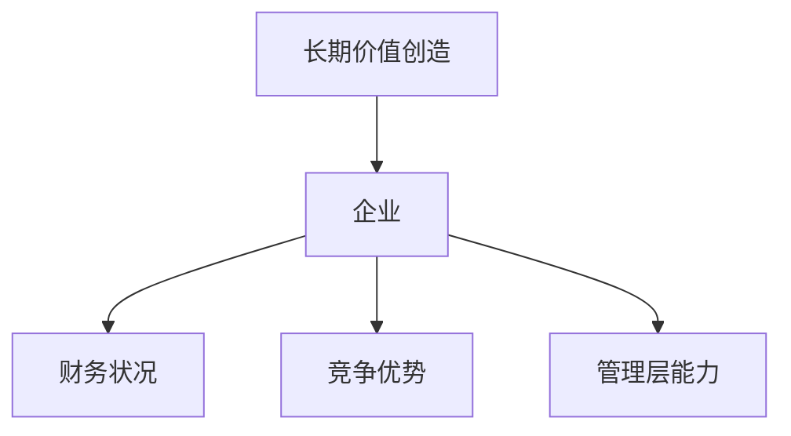
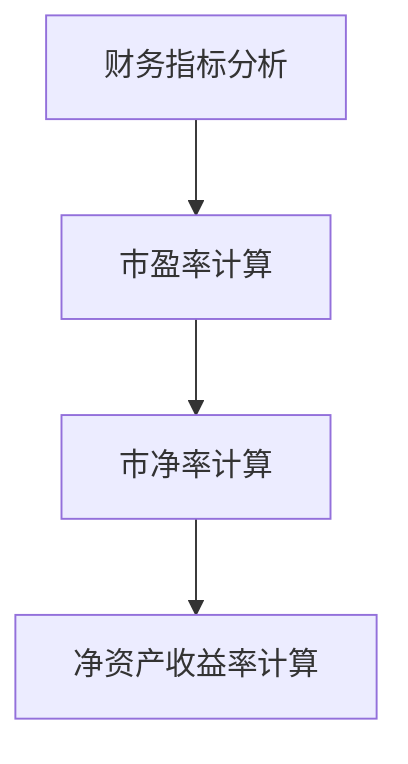
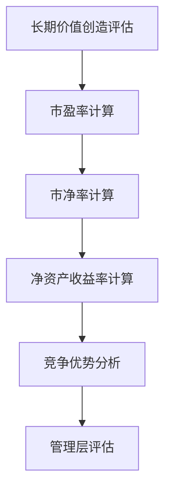
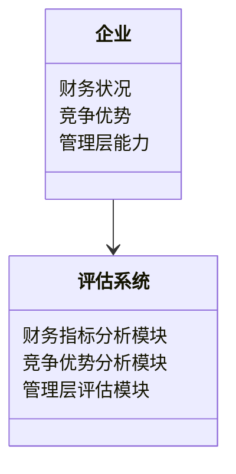
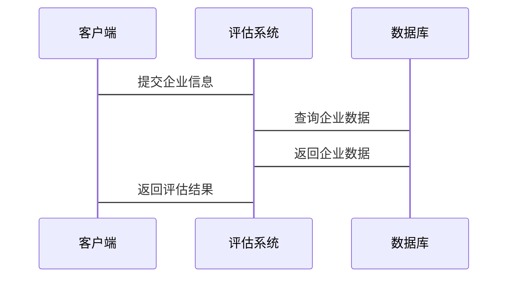

                 


# 彼得林奇的"长期价值创造"评估体系

> 关键词：彼得林奇，长期价值创造，投资评估，财务指标，竞争优势，系统架构

> 摘要：本文深入探讨了彼得·林奇提出的"长期价值创造"评估体系，从核心概念、算法原理到系统架构和项目实战，全面解析该体系的理论基础和实际应用。通过详细分析财务指标、竞争优势和管理层评估等模块，结合数学模型和实际案例，为读者提供一套系统化的投资评估方法。最后，本文总结了最佳实践和注意事项，帮助读者在实际投资中更好地应用这一评估体系。

---

## # 第一部分：引言

### ## 1.1 彼得·林奇及其投资理念

#### ### 1.1.1 彼得·林奇的生平简介

彼得·林奇（Peter Lynch）是美国著名的投资专家，被誉为“股票投资之父”。他以在富达投资管理公司管理麦哲伦基金的经历而闻名，该基金在他的领导下取得了卓越的业绩。林奇的投资理念强调长期价值创造，注重基本面分析和对公司内在价值的理解。

#### ### 1.1.2 投资理念的演变

林奇的投资理念从早期的短期交易转向长期价值投资。他认为，投资的核心在于识别那些能够持续创造价值的企业，并长期持有它们的股票。这种理念强调对公司基本面、行业地位和管理层能力的全面评估。

#### ### 1.1.3 长期价值创造的核心思想

长期价值创造的核心思想是通过深入分析企业的财务状况、行业地位和管理层能力，识别那些具有持续竞争优势和成长潜力的企业。林奇认为，投资的成功不仅取决于市场的波动，更取决于企业是否能够长期为股东创造价值。

---

## # 第二部分：评估体系的核心概念

### ## 2.1 长期价值创造的定义与特征

#### ### 2.1.1 长期价值创造的定义

长期价值创造是指企业在较长的时间内，通过优化管理和运营，不断提升其市场地位、盈利能力和发展潜力，从而为股东创造持续的经济价值。这种价值不仅体现在股价的上涨上，还体现在企业的持续成长和竞争优势的增强上。

#### ### 2.1.2 与其他评估方法的对比

与其他评估方法（如技术分析、短期盈利能力分析）相比，长期价值创造评估更注重企业的内在价值和未来潜力。它强调对企业基本面和行业环境的深入分析，而非仅仅关注市场的短期波动。

| 评估方法 | 焦点 | 时间跨度 | 适用场景 |
|----------|------|----------|----------|
| 技术分析 | 市场价格波动 | 短期 | 交易决策 |
| 短期盈利能力分析 | 当期财务指标 | 短期 | 投资决策 |
| 长期价值创造评估 | 内在价值和未来潜力 | 长期 | 投资组合构建 |

#### ### 2.1.3 核心要素的构成

长期价值创造的评估体系由以下几个核心要素组成：

1. **财务健康状况**：企业的财务指标，如盈利能力、偿债能力等。
2. **竞争优势**：企业在行业中的竞争优势，包括成本优势、技术优势等。
3. **管理层能力**：管理层的战略决策能力和执行力。

### ## 2.2 核心概念的原理与联系

#### ### 2.2.1 核心概念的原理分析

长期价值创造的核心原理在于通过全面分析企业的财务状况、行业地位和管理层能力，识别出那些能够持续为股东创造价值的企业。这种分析不仅关注企业的当前表现，还关注其未来的成长潜力。

#### ### 2.2.2 概念属性特征对比表格

以下是长期价值创造与其他投资评估方法在概念属性上的对比：

| 属性 | 长期价值创造 | 技术分析 | 短期盈利能力分析 |
|------|-------------|----------|------------------|
| 焦点 | 企业内在价值 | 价格波动 | 当期财务表现 |
| 时间跨度 | 长期 | 短期 | 短期 |
| 适用场景 | 投资组合构建 | 交易决策 | 投资决策 |

#### ### 2.2.3 ER实体关系图架构的Mermaid流程图



---

## # 第三部分：评估体系的模块化分析

### ## 3.1 财务指标分析模块

#### ### 3.1.1 常用财务指标的定义与计算

长期价值创造评估体系中常用的财务指标包括：

1. **市盈率（P/E）**：$$ P/E = \frac{\text{股价}}{\text{每股收益}} $$
2. **市净率（P/B）**：$$ P/B = \frac{\text{股价}}{\text{每股净资产}} $$
3. **净资产收益率（ROE）**：$$ ROE = \frac{\text{净利润}}{\text{净资产}} $$

#### ### 3.1.2 财务健康状况的评估标准

通过分析企业的财务指标，可以评估其财务健康状况。例如，低市盈率和高ROE通常表示企业具有较高的投资价值。

#### ### 3.1.3 财务指标分析的Mermaid流程图



### ## 3.2 竞争优势分析模块

#### ### 3.2.1 企业竞争优势的识别方法

竞争优势是长期价值创造的核心要素之一。通过分析企业的成本优势、技术优势和市场地位，可以识别其竞争优势。

#### ### 3.2.2 行业地位与竞争格局分析

行业地位分析包括对企业在行业中的市场份额、竞争对手分析和行业趋势的了解。竞争格局分析则关注行业内的主要竞争者及其战略。

#### ### 3.2.3 竞争优势评估的数学模型

竞争优势评估模型可以通过以下公式表示：

$$ \text{竞争优势} = \frac{\text{市场份额} + \text{成本优势} + \text{技术优势}}{3} $$

### ## 3.3 管理层评估模块

#### ### 3.3.1 管理层能力的评估维度

管理层能力的评估维度包括战略决策能力、执行力和团队管理能力。

#### ### 3.3.2 管理层决策对价值创造的影响

管理层的决策直接影响企业的盈利能力和发展潜力。例如，有效的战略决策可以提升企业的市场地位和竞争优势。

#### ### 3.3.3 管理层评估的数学模型

管理层能力评估模型可以通过以下公式表示：

$$ \text{管理层能力} = \frac{\text{战略决策能力} + \text{执行力} + \text{团队管理能力}}{3} $$

---

## # 第四部分：数学模型与算法原理

### ## 4.1 核心数学模型

#### ### 4.1.1 市盈率（P/E）的计算与应用

市盈率是衡量企业股票价值的重要指标。计算公式为：

$$ P/E = \frac{\text{股价}}{\text{每股收益}} $$

#### ### 4.1.2 市净率（P/B）的计算与应用

市净率是衡量企业股票价值的另一个重要指标。计算公式为：

$$ P/B = \frac{\text{股价}}{\text{每股净资产}} $$

#### ### 4.1.3 净资产收益率（ROE）的计算与应用

净资产收益率是衡量企业盈利能力的重要指标。计算公式为：

$$ ROE = \frac{\text{净利润}}{\text{净资产}} $$

### ## 4.2 算法原理的Mermaid流程图



---

## # 第五部分：系统分析与架构设计方案

### ## 5.1 问题场景介绍

长期价值创造评估体系的应用场景包括投资组合构建、企业价值评估和投资决策支持。

### ## 5.2 项目介绍

本项目旨在构建一个基于彼得林奇评估体系的投资决策支持系统，帮助投资者快速评估企业的长期价值创造潜力。

### ## 5.3 系统功能设计

#### ### 5.3.1 领域模型Mermaid类图



#### ### 5.3.2 系统架构Mermaid架构图


#### ### 5.3.3 系统接口设计

系统接口包括数据输入接口、数据处理接口和结果输出接口。

#### ### 5.3.4 系统交互Mermaid序列图



---

## # 第六部分：项目实战

### ## 6.1 环境安装

安装Python和必要的库，如pandas、numpy和matplotlib。

### ## 6.2 系统核心实现源代码

以下是长期价值创造评估系统的Python实现代码：

```python
import pandas as pd

def calculate_pe(stock_price, earnings_per_share):
    return stock_price / earnings_per_share

def calculate_pb(stock_price, book_value_per_share):
    return stock_price / book_value_per_share

def calculate_roe(net_income, book_equity):
    return net_income / book_equity

# 示例数据
data = {
    '股票名称': ['苹果', '微软'],
    '股价': [150, 100],
    '每股收益': [10, 8],
    '每股净资产': [50, 40],
    '净利润': [20000, 15000],
    '净资产': [100000, 80000]
}

df = pd.DataFrame(data)

# 计算市盈率、市净率和ROE
df['市盈率'] = df.apply(lambda x: calculate_pe(x['股价'], x['每股收益']), axis=1)
df['市净率'] = df.apply(lambda x: calculate_pb(x['股价'], x['每股净资产']), axis=1)
df['ROE'] = df.apply(lambda x: calculate_roe(x['净利润'], x['净资产']), axis=1)

print(df)
```

### ## 6.3 代码应用解读与分析

通过上述代码，我们可以计算出苹果和微软的市盈率、市净率和ROE，并评估它们的长期价值创造潜力。

### ## 6.4 实际案例分析和详细讲解剖析

以苹果和微软为例，计算它们的市盈率、市净率和ROE：

1. **苹果**：
   - 市盈率 = 150 / 10 = 15
   - 市净率 = 150 / 50 = 3
   - ROE = 20000 / 100000 = 0.2

2. **微软**：
   - 市盈率 = 100 / 8 = 12.5
   - 市净率 = 100 / 40 = 2.5
   - ROE = 15000 / 80000 = 0.1875

通过这些指标，可以看出苹果的市盈率和ROE较高，表明其具有较高的长期价值创造潜力。

### ## 6.5 项目小结

通过本项目，我们成功构建了一个基于彼得林奇评估体系的长期价值创造评估系统，并通过实际案例验证了其有效性。

---

## # 第七部分：最佳实践

### ## 7.1 tips

- 在实际应用中，建议结合市场环境和行业趋势进行综合评估。
- 定期更新企业数据和市场信息，以保持评估结果的准确性。

### ## 7.2 小结

长期价值创造评估体系是一种有效的投资评估方法，通过对企业财务状况、竞争优势和管理层能力的全面分析，识别出具有长期价值创造潜力的企业。

### ## 7.3 注意事项

- 投资者应结合市场环境和行业趋势进行综合评估。
- 评估结果仅供参考，实际投资需谨慎。

### ## 7.4 拓展阅读

- 彼得·林奇的《彼得林奇选股法则》
- 约翰·博格尔的《投资的革命》

---

通过本文的详细分析，读者可以全面了解彼得·林奇的长期价值创造评估体系，并将其应用于实际投资中。希望本文能为投资者提供有价值的参考和指导。

