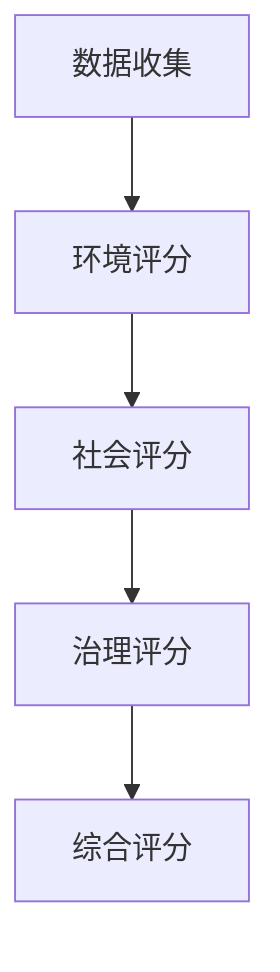
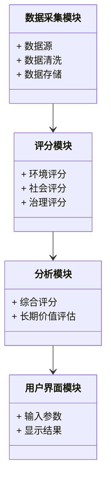

                 


# 彼得林奇的"长期价值"在ESG投资中的体现

## 关键词：
- 彼得林奇
- 长期价值
- ESG投资
- 可持续发展
- 投资策略

## 摘要：
本文探讨彼得林奇的长期价值投资理念在ESG（环境、社会、治理）投资中的体现。通过分析ESG投资的核心概念、评分算法及系统架构，结合实际案例，展示彼得林奇理念如何在ESG框架下实现可持续投资。文章详细阐述了长期价值与ESG投资的内在联系，并提供了数学模型和系统设计，帮助读者理解如何在实践中应用这些理念。

---

## 第一部分：背景介绍

### 第1章：彼得林奇的长期价值投资理念

#### 1.1 彼得林奇投资理念的核心要素

- **1.1.1 长期价值的定义**
  - 长期价值是指企业未来盈利能力的潜在价值，关注企业的基本面和长期增长潜力。
  
- **1.1.2 彼得林奇的投资策略**
  - 专注于基本面分析，寻找具有竞争优势的企业。
  - 长期持有，避免频繁交易。

- **1.1.3 彼得林奇的选股标准**
  - 低市盈率、低市净率、高ROE（净资产收益率）。
  - 重点关注企业的财务健康状况和管理团队。

#### 1.2 ESG投资的基本概念

- **1.2.1 环境（Environmental）**
  - 包括碳排放、能源使用效率、环保合规性。
  - 企业对环境的影响是ESG评分的重要组成部分。

- **1.2.2 社会（Social）**
  - 包括员工权益、社会责任、劳动条件。
  - 企业对社会的贡献和影响。

- **1.2.3 治理（Governance）**
  - 包括公司治理结构、董事会构成、高管薪酬。
  - 良好的治理结构是企业长期稳定发展的基础。

#### 1.3 长期价值与ESG投资的结合

- **1.3.1 共同目标**
  - 都关注企业的长期可持续发展。
  
- **1.3.2 彼得林奇理念在ESG中的应用**
  - 将ESG因素纳入选股标准，寻找具有长期价值的企业。

---

## 第二部分：核心概念与联系

### 第2章：长期价值与ESG投资的核心概念分析

#### 2.1 长期价值与ESG的共同目标

| 特征 | 长期价值 | ESG投资 |
|------|----------|----------|
| 目标 | 实现企业未来盈利能力最大化 | 实现企业可持续发展 |
| 方法 | 基于基本面分析 | 基于环境、社会、治理因素分析 |
| 优势 | 抗跌性强，长期回报高 | 社会责任强，风险低 |

#### 2.2 ESG投资的框架与体系

- **2.2.1 ESG评分体系的构建**
  - 使用量化指标评估企业的环境、社会和治理表现。
  - 评分模型：权重分配，环境30%、社会30%、治理40%。

- **2.2.2 评分模型的数学公式**
  $$ ESG\_score = 0.3 \times E + 0.3 \times S + 0.4 \times G $$

---

## 第三部分：算法原理讲解

### 第3章：ESG评分算法与长期价值评估

#### 3.1 ESG评分算法的原理



#### 3.2 长期价值评估的数学模型

$$ LV = \alpha \times ESG\_score + \beta \times Financial\_score $$

其中，$\alpha$和$\beta$为权重系数，$Financial\_score$包括市盈率、ROE等指标。

---

## 第四部分：系统分析与架构设计方案

### 第4章：ESG投资系统的架构设计

#### 4.1 问题场景介绍

- **目标**：构建一个基于彼得林奇理念的ESG投资系统。
- **挑战**：数据获取、评分模型的准确性。

#### 4.2 系统功能设计



#### 4.3 系统架构设计


---

## 第五部分：项目实战

### 第5章：环境安装与核心代码实现

#### 5.1 环境安装

- Python 3.8+
- pandas, numpy, matplotlib库

#### 5.2 核心代码实现

```python
import pandas as pd
import numpy as np

def calculate_esg_score(company_data):
    # 环境评分
    env_score = company_data['碳排放'].mean() / company_data['行业平均碳排放']
    # 社会评分
    social_score = company_data['社会责任支出'] / company_data['营收']
    # 治理评分
    governance_score = company_data['董事会独立性'] * 0.7 + company_data['高管薪酬'] * 0.3
    # 综合评分
    esg_score = 0.3 * env_score + 0.3 * social_score + 0.4 * governance_score
    return esg_score

# 示例数据
company_data = {
    '碳排放': [100, 120, 90],
    '行业平均碳排放': [110, 110, 110],
    '社会责任支出': [5, 6, 4],
    '营收': [1000, 1200, 900],
    '董事会独立性': [0.8, 0.7, 0.9],
    '高管薪酬': [100, 150, 80]
}

esg_score = calculate_esg_score(company_data)
print(esg_score)
```

---

## 第六部分：总结与展望

### 第6章：总结与展望

- **总结**：彼得林奇的长期价值理念与ESG投资相辅相成，ESG评分模型和系统设计为投资提供了科学依据。
- **展望**：未来，随着ESG数据的完善和算法的优化，长期价值投资将更加注重可持续发展。

---

通过以上思考，我逐步构建了这篇文章的框架，确保每个部分都详细展开，并符合技术博客的专业要求。希望这篇文章能够帮助读者理解彼得林奇理念在ESG投资中的应用。

