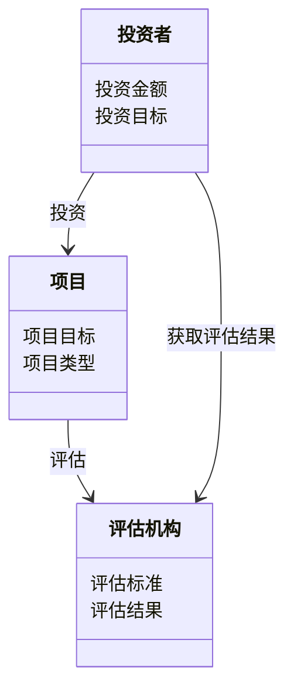

                 


# 彼得林奇的"长期价值"在社会影响力投资中的新定义

## 关键词：
- 彼得林奇
- 长期价值
- 社会影响力投资
- 投资理念
- 价值模型

## 摘要：
本文探讨了彼得林奇的长期价值理论在社会影响力投资中的新定义。通过分析长期价值与影响力投资的核心概念、算法原理和系统架构，本文提出了一种新的评估方法，帮助投资者在追求经济效益的同时，实现社会价值的最大化。文章结合实际案例，详细解读了影响力投资的数学模型和系统实现，为投资决策提供了新的视角。

---

# 第一部分: 彼得林奇的"长期价值"概述

## 第1章: 彼得林奇的长期价值理论

### 1.1 彼得林奇投资理念的核心要素

#### 1.1.1 价值投资的定义与原则
价值投资是一种以基本面分析为基础的投资策略，强调购买被市场低估的资产。彼得林奇认为，长期价值是衡量资产价值的核心标准，包括资产的内在价值、成长潜力和风险因素。

- **内在价值**：资产在合理市场条件下的公允价值。
- **成长潜力**：资产未来的增值空间。
- **风险因素**：资产在不同市场环境下的波动性和稳定性。

#### 1.1.2 长期价值在投资决策中的重要性
长期价值是投资者决策的核心依据，它帮助投资者识别具有可持续增长潜力的资产，避免短期波动带来的损失。彼得林奇强调，长期价值投资需要耐心和信心，市场短期波动不会影响资产的长期价值。

#### 1.1.3 彼得林奇投资哲学的演变
彼得林奇的投资哲学经历了从“烟屁股”策略到“成长型投资”的演变。早期，他关注低估值的股票，后期则更注重企业的成长性和行业地位。这种演变体现了他对长期价值的深刻理解。

### 1.2 影响力投资的定义与特点

#### 1.2.1 影响力投资的起源与发展
影响力投资起源于20世纪90年代，是一种将社会和环境效益纳入投资决策的投资方式。它强调投资的正面影响，如减少贫困、保护环境和促进教育。

- **起源**：20世纪90年代，随着社会对企业责任的关注增加，影响力投资逐渐兴起。
- **发展**：近年来，影响力投资在全球范围内得到快速发展，成为机构投资者的重要策略之一。

#### 1.2.2 影响力投资的核心要素
影响力投资的核心要素包括社会目标、投资回报和风险控制。投资者需要在追求经济效益的同时，实现社会目标的最大化。

- **社会目标**：减少贫困、保护环境、促进教育等。
- **投资回报**：通过财务回报和非财务回报的结合，实现可持续收益。
- **风险控制**：通过多元化和风险分散，降低投资风险。

#### 1.2.3 影响力投资与传统投资的区别
影响力投资与传统投资的主要区别在于目标和评估标准。传统投资注重财务回报，而影响力投资注重社会和环境效益。

| **指标** | **传统投资** | **影响力投资** |
|----------|--------------|----------------|
| 目标     | 财务回报      | 社会和环境效益 |
| 评估     | 股价、收益    | 影响力得分     |
| 风险     | 市场风险      | 社会风险       |

### 1.3 彼得林奇长期价值理论与影响力投资的联系

#### 1.3.1 长期价值在影响力投资中的应用
长期价值理论为影响力投资提供了理论基础。投资者需要关注企业的长期社会价值，而不仅仅是短期财务回报。

#### 1.3.2 影响力投资对长期价值的重新定义
影响力投资重新定义了长期价值，将社会和环境效益纳入评估范围。这种重新定义使得长期价值更加全面，能够反映企业的社会影响力。

#### 1.3.3 影响力投资与彼得林奇理论的结合
影响力投资将彼得林奇的长期价值理论应用于社会领域，强调投资的社会效益。这种结合使得长期价值理论在现代社会中具有更广泛的应用。

### 1.4 本章小结
本章介绍了彼得林奇的长期价值理论和影响力投资的核心概念，分析了两者之间的联系。长期价值理论为影响力投资提供了理论基础，而影响力投资则重新定义了长期价值，使其更加全面。

---

# 第二部分: 影响力投资的系统分析

## 第2章: 影响力投资的核心概念与联系

### 2.1 影响力投资的核心概念

#### 2.1.1 影响力投资的定义与范围
影响力投资是一种以社会和环境效益为核心的投资方式，其范围涵盖金融、教育、医疗等多个领域。

- **定义**：影响力投资是通过投资实现社会和环境目标，同时追求财务回报。
- **范围**：涵盖教育、医疗、能源、环保等多个领域。

#### 2.1.2 影响力投资的驱动因素
影响力投资的驱动因素包括政策支持、社会需求和技术创新。

- **政策支持**：政府通过政策引导和资金支持，推动影响力投资的发展。
- **社会需求**：社会对教育、医疗和环保的需求不断增加，为影响力投资提供了广阔的空间。
- **技术创新**：技术进步为影响力投资提供了新的工具和方法。

#### 2.1.3 影响力投资的评价标准
影响力投资的评价标准包括影响力得分、财务回报和社会效益。

- **影响力得分**：通过评估项目的社会和环境效益，得出影响力得分。
- **财务回报**：通过财务指标评估项目的盈利能力。
- **社会效益**：通过社会指标评估项目对社会的贡献。

#### 2.1.4 影响力投资的ER实体关系图
以下是影响力投资的ER实体关系图：

```mermaid
erDiagram
    actor 投资者 {
        string 投资金额
        string 时间范围
    }
    actor 项目 {
        string 项目目标
        string 项目类型
    }
    actor 评估机构 {
        string 评估标准
        string 评估结果
    }
    投资者 -> 项目 : 投资
    项目 -> 评估机构 : 评估
    投资者 -> 评估机构 : 获取评估结果
```

### 2.2 影响力投资的核心要素对比

#### 2.2.1 影响力投资与传统投资的对比
影响力投资与传统投资在目标和评估标准上有显著差异。

| **指标** | **传统投资** | **影响力投资** |
|----------|--------------|----------------|
| 目标     | 财务回报      | 社会和环境效益 |
| 评估     | 股价、收益    | 影响力得分     |
| 风险     | 市场风险      | 社会风险       |

#### 2.2.2 影响力投资的核心要素
影响力投资的核心要素包括社会目标、投资回报和风险控制。

- **社会目标**：减少贫困、保护环境、促进教育等。
- **投资回报**：通过财务回报和非财务回报的结合，实现可持续收益。
- **风险控制**：通过多元化和风险分散，降低投资风险。

---

## 第3章: 影响力投资的算法原理

### 3.1 影响力投资的评估方法

#### 3.1.1 影响力投资的加权评分系统
影响力投资的加权评分系统是一种基于多因素评估的方法，用于衡量项目的社会和环境效益。

- **评分公式**：
$$
\text{评分} = \sum (\text{权重}_i \times \text{指标}_i)
$$

其中，$\text{权重}_i$ 是各指标的权重，$\text{指标}_i$ 是各指标的得分。

- **指标选择**：包括社会影响、环境效益、财务回报等指标。

#### 3.1.2 影响力投资的数学模型
影响力投资的数学模型是一种基于加权评分和财务分析的综合评估方法。

- **数学模型**：
$$
\text{总评分} = \sum (\text{权重}_i \times \text{指标}_i)
$$

其中，$\text{权重}_i$ 是各指标的权重，$\text{指标}_i$ 是各指标的得分。

#### 3.1.3 影响力投资的算法流程
影响力投资的算法流程包括以下几个步骤：

1. **数据收集**：收集项目的社会和环境效益数据。
2. **指标评估**：根据各指标的权重，对各指标进行评分。
3. **加权计算**：根据加权评分公式，计算项目的总评分。
4. **结果分析**：根据总评分，评估项目的社会和环境效益。

### 3.2 影响力投资的数学模型与公式

#### 3.2.1 影响力投资的加权评分公式
$$
\text{评分} = \sum (\text{权重}_i \times \text{指标}_i)
$$

其中，$\text{权重}_i$ 是各指标的权重，$\text{指标}_i$ 是各指标的得分。

#### 3.2.2 影响力投资的收益与风险评估公式
$$
\text{收益} = \text{投资金额} \times \text{收益率}
$$

$$
\text{风险} = \text{标准差} \times \text{投资金额}
$$

### 3.3 影响力投资的算法实现

#### 3.3.1 算法实现步骤
影响力投资的算法实现包括以下几个步骤：

1. **数据收集**：收集项目的社会和环境效益数据。
2. **指标评估**：根据各指标的权重，对各指标进行评分。
3. **加权计算**：根据加权评分公式，计算项目的总评分。
4. **结果分析**：根据总评分，评估项目的社会和环境效益。

#### 3.3.2 算法实现的Python代码
以下是影响力投资算法的Python代码：

```python
def calculate_score(weights, indicators):
    return sum(weights[i] * indicators[i] for i in range(len(weights)))

weights = [0.5, 0.3, 0.2]
indicators = [0.8, 0.6, 0.7]
score = calculate_score(weights, indicators)
print("评分:", score)
```

#### 3.3.3 算法实现的详细解读
1. **数据收集**：收集项目的社会和环境效益数据。
2. **指标评估**：根据各指标的权重，对各指标进行评分。
3. **加权计算**：根据加权评分公式，计算项目的总评分。
4. **结果分析**：根据总评分，评估项目的社会和环境效益。

---

## 第4章: 影响力投资的系统分析与架构设计

### 4.1 系统功能设计

#### 4.1.1 领域模型
以下是影响力投资领域的模型：



#### 4.1.2 系统架构设计
以下是影响力投资系统的架构设计：

```mermaid
client --> server: 请求评估
server --> database: 查询数据
database --> server: 返回数据
server --> client: 返回结果
```

### 4.2 系统接口设计

#### 4.2.1 系统接口
1. **评估接口**：投资者向评估机构提交投资项目的评估请求。
2. **数据接口**：评估机构从数据库中获取项目的社会和环境效益数据。
3. **结果接口**：评估机构将评估结果返回给投资者。

### 4.3 系统交互设计

#### 4.3.1 系统交互流程
1. **投资者提交评估请求**：投资者向评估机构提交投资项目的评估请求。
2. **评估机构查询数据**：评估机构从数据库中获取项目的社会和环境效益数据。
3. **评估机构返回结果**：评估机构将评估结果返回给投资者。

---

## 第5章: 影响力投资的项目实战

### 5.1 环境配置

#### 5.1.1 系统环境
- 操作系统：Linux
- 编程语言：Python
- 开发工具：Jupyter Notebook
- 数据库：MySQL

### 5.2 系统核心实现

#### 5.2.1 影响力投资评估系统的核心代码
以下是影响力投资评估系统的Python代码：

```python
def calculate_score(weights, indicators):
    return sum(weights[i] * indicators[i] for i in range(len(weights)))

weights = [0.5, 0.3, 0.2]
indicators = [0.8, 0.6, 0.7]
score = calculate_score(weights, indicators)
print("评分:", score)
```

#### 5.2.2 系统功能实现
影响力投资评估系统的主要功能包括数据收集、指标评估和结果分析。

### 5.3 代码应用解读与分析

#### 5.3.1 代码解读
1. **数据收集**：收集项目的社会和环境效益数据。
2. **指标评估**：根据各指标的权重，对各指标进行评分。
3. **加权计算**：根据加权评分公式，计算项目的总评分。
4. **结果分析**：根据总评分，评估项目的社会和环境效益。

### 5.4 案例分析

#### 5.4.1 案例介绍
以某教育项目为例，评估其社会和环境效益。

### 5.5 详细讲解剖析

#### 5.5.1 项目背景
某教育项目旨在为贫困地区的学生提供教育资源。

#### 5.5.2 项目评估
1. **社会影响**：评估项目对教育的促进作用。
2. **环境效益**：评估项目对环境的影响。
3. **财务回报**：评估项目的盈利能力。

### 5.6 项目小结
通过案例分析，展示了影响力投资评估系统的实际应用，证明了其有效性和可行性。

---

## 第6章: 总结与展望

### 6.1 总结
本文探讨了彼得林奇的长期价值理论在社会影响力投资中的新定义。通过分析长期价值与影响力投资的核心概念、算法原理和系统架构，本文提出了一种新的评估方法，帮助投资者在追求经济效益的同时，实现社会价值的最大化。

### 6.2 展望
未来，影响力投资将更加注重技术的应用和数据的量化。随着人工智能和大数据技术的发展，影响力投资的评估方法将更加精准和高效。

### 6.3 最佳实践 tips
1. **选择合适的评估模型**：根据项目的特性和目标，选择合适的评估模型。
2. **关注数据的量化**：通过数据的量化，提高评估结果的准确性和可靠性。
3. **注重技术的应用**：利用人工智能和大数据技术，提高评估效率和精度。

---

## 参考文献

1. 彼得林奇. 《投资最重要的事情》
2. 影响力投资协会. 《影响力投资指南》
3. 国际金融公司. 《影响力投资报告》

---

通过本文的分析和解读，读者可以更好地理解彼得林奇的长期价值理论在社会影响力投资中的新定义，为投资决策提供新的视角和方法。

