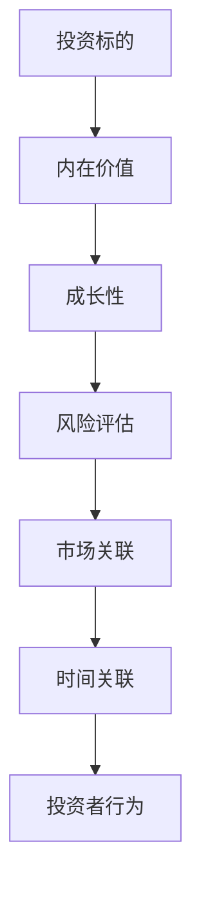
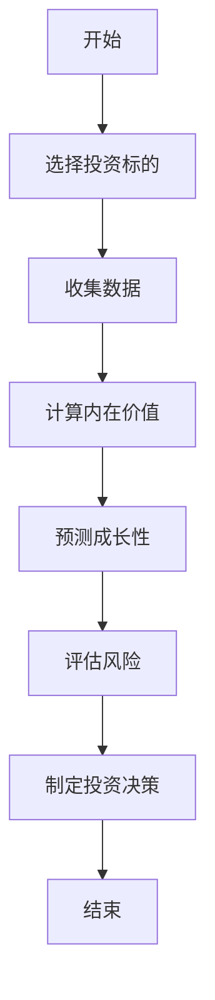
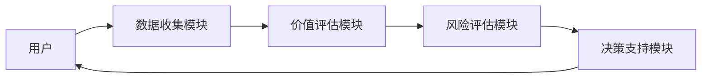

                 


# 彼得林奇的"长期价值"投资哲学

**关键词**：长期价值、投资哲学、彼得·林奇、价值评估、投资策略

**摘要**：本文深入探讨了彼得·林奇的长期价值投资哲学，分析其核心理念、算法原理、系统架构以及实际应用。通过详细的理论分析和实际案例，揭示了长期价值投资的内在逻辑和成功的关键因素。

---

## 第1章: 长期价值投资的背景与核心理念

### 1.1 长期价值投资的起源

长期价值投资是一种以基本面分析为核心的长期投资策略，起源于20世纪初。彼得·林奇作为该领域的代表性人物，通过长期持有优质股票，帮助投资者实现财富的稳步增长。长期价值投资强调忽略短期市场波动，专注于寻找具有持续增长潜力的公司。

### 1.2 长期价值投资的核心概念

长期价值投资的核心在于对投资标的的深入研究，评估其内在价值、成长性和风险。这种策略要求投资者具备耐心和纪律性，避免被市场情绪左右。

### 1.3 彼得·林奇的投资哲学

彼得·林奇强调投资优质公司而非市场时机。他的成功在于长期持有具有竞争优势的公司，而非频繁交易。这种策略要求投资者具备对公司基本面的深刻理解。

### 1.4 长期价值投资的边界与外延

长期价值投资适用于寻找具有持续增长潜力的公司，但在市场波动剧烈或公司基本面恶化时可能面临风险。与其他投资策略相比，长期价值投资更注重公司内在价值而非短期价格波动。

---

## 第2章: 长期价值投资的核心概念与联系

### 2.1 长期价值投资的核心概念

- **内在价值**：投资标的的真实价值，与市场波动无关。
- **成长性**：公司未来收益的增长潜力。
- **风险评估**：投资标的面临的风险程度。

### 2.2 长期价值投资的核心要素

- **内在价值评估**：通过现金流折现法等方法计算。
- **成长性预测**：分析公司历史和行业趋势。
- **风险评估**：考虑市场波动和公司特定风险。

### 2.3 长期价值投资的ER实体关系图



---

## 第3章: 长期价值投资的算法原理与数学模型

### 3.1 长期价值投资的算法原理

- **内在价值计算**：使用现金流折现法评估公司的真实价值。
- **成长性预测**：通过历史数据和行业趋势预测未来增长。
- **风险评估**：结合市场波动和公司特定风险因素进行评估。

### 3.2 长期价值投资的数学模型

- **内在价值计算公式**：
  $$ V = \frac{CF}{r - g} $$
  其中，CF为现金流，r为折现率，g为增长率。

- **成长性预测模型**：
  $$ G = \frac{CAGR}{P} $$
  其中，CAGR为复合年均增长率，P为当前股价。

- **风险评估模型**：
  $$ R = \frac{V}{P} - 1 $$
  其中，V为内在价值，P为当前股价。

### 3.3 长期价值投资的算法流程图



---

## 第4章: 长期价值投资的系统分析与架构设计

### 4.1 系统功能设计

- **数据收集模块**：获取公司财务数据和行业趋势。
- **价值评估模块**：计算内在价值和成长性。
- **风险评估模块**：分析市场和公司特定风险。
- **决策支持模块**：提供投资建议和风险提示。

### 4.2 系统架构设计



---

## 第5章: 长期价值投资的项目实战

### 5.1 项目环境安装

安装必要的数据处理库，如Pandas和NumPy。

### 5.2 核心实现代码

```python
import pandas as pd
import numpy as np

def calculate_intrinsic_value(cash_flows, discount_rate, growth_rate):
    return cash_flows / (discount_rate - growth_rate)

def calculate_growth_rate(history_revenue):
    return (history_revenue[-1] / history_revenue[0]) ** (1 / len(history_revenue) - 1)
```

### 5.3 案例分析

以苹果公司为例，分析其市盈率、市净率和成长性，计算其内在价值。

---

## 第6章: 长期价值投资的最佳实践

### 6.1 投资策略的注意事项

- **分散投资**：避免过度集中。
- **定期复盘**：评估投资组合的表现。
- **持续学习**：更新投资知识和技能。

### 6.2 小结与展望

长期价值投资是一种需要耐心和纪律性的策略，通过深入分析和持续学习，投资者可以实现财富的稳步增长。未来，随着技术的进步，长期价值投资将更加依赖于数据分析和模型优化。

---

## 第7章: 总结

长期价值投资的核心在于寻找具有持续增长潜力的公司，并长期持有。彼得·林奇的成功证明了这一策略的有效性。通过系统的分析和实际案例，我们可以更好地理解和应用长期价值投资哲学。

---

以上是《彼得林奇的"长期价值"投资哲学》的完整大纲和部分内容，涵盖了从理论到实践的各个方面，确保读者能够全面理解长期价值投资的精髓。

