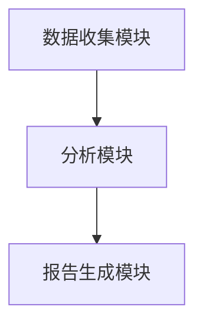

                 


# 彼得林奇的"长期价值"投资案例分析

## 关键词：
长期价值投资, 彼得·林奇, 投资策略, 财务分析, 竞争优势

## 摘要：
本文深入分析了彼得·林奇的“长期价值”投资理念及其经典案例，探讨了长期价值投资的核心要素，包括企业基本面分析、竞争优势评估和财务健康状况。通过系统化的分析方法，本文展示了如何运用这些要素进行投资决策，并通过实际案例分析验证了长期价值投资的有效性。

---

## 第1章: 长期价值投资的背景与核心概念

### 1.1 长期价值投资的定义与特点

长期价值投资是一种以长期持有优质企业股票为核心策略的投资方式，强调对企业基本面的深入研究和长期价值的挖掘。与短期交易不同，长期价值投资注重企业的内在价值和持续盈利能力，而非市场的短期波动。

#### 1.1.1 投资的定义与分类
投资是指将资金投入到能够产生收益的资产或项目中，常见的投资方式包括股票、债券、房地产等。长期价值投资属于股票投资的一种，强调长期持有和价值发现。

#### 1.1.2 长期价值投资的核心特点
- **长期持有**：投资者不因短期市场波动而频繁买卖，而是关注企业的长期价值。
- **价值发现**：通过深入分析企业的基本面，找到市场价格低于内在价值的投资标的。
- **注重质量**：选择具有强大竞争优势、良好财务状况和持续增长潜力的企业。

#### 1.1.3 彼得·林奇的投资理念
彼得·林奇是美国著名的投资专家，曾任富达麦哲伦基金的经理。他认为，成功的投资取决于对企业基本面的深入研究和对市场趋势的准确判断。他强调，投资的目的是找到那些能够持续增长的企业，并长期持有它们的股票。

### 1.2 彼得·林奇的生平与投资成就

#### 1.2.1 彼得·林奇的生平简介
彼得·林奇出生于1934年，曾在富达投资集团工作，担任麦哲伦基金的经理长达13年。他的投资策略以长期价值投资为核心，取得了显著的成就。

#### 1.2.2 彼得·林奇的投资风格
彼得·林奇的投资风格以稳健和注重基本面分析著称。他善于发现那些具有强大竞争优势、良好财务状况和持续增长潜力的企业，并长期持有它们的股票。

#### 1.2.3 彼得·林奇的经典投资案例
彼得·林奇在职业生涯中投资了许多成功案例，例如可口可乐和强生公司。他通过对企业基本面的深入分析，选择了那些具有强大竞争优势和持续增长潜力的企业。

### 1.3 长期价值投资的核心要素

#### 1.3.1 企业基本面分析
企业基本面分析是长期价值投资的核心要素之一。它包括对企业财务状况、行业地位和竞争优势的全面评估。

#### 1.3.2 企业的竞争优势
竞争优势是企业在市场上立足的关键因素。彼得·林奇认为，具有强大竞争优势的企业更有可能实现持续增长。

#### 1.3.3 企业的财务健康状况
财务健康状况是评估企业价值的重要指标。彼得·林奇强调，具有良好财务状况的企业更有可能抵御市场波动并实现长期增长。

### 1.4 长期价值投资与短期交易的对比

#### 1.4.1 长期价值投资的优势
- **稳定性**：长期持有能够减少市场波动对企业价值的影响。
- **增长潜力**：长期持有能够捕捉企业的长期增长潜力。

#### 1.4.2 短期交易的劣势
- **交易成本**：频繁买卖会增加交易成本，影响收益。
- **短期波动**：短期交易容易受到市场情绪的影响，难以实现稳定的收益。

#### 1.4.3 长期价值投资的适用场景
长期价值投资适用于那些具有强大竞争优势和持续增长潜力的企业。对于那些希望实现长期稳定收益的投资者来说，长期价值投资是一种理想的投资策略。

---

## 第2章: 长期价值投资的核心概念与联系

### 2.1 企业基本面分析的原理

#### 2.1.1 财务报表分析
财务报表分析是企业基本面分析的重要组成部分。它包括对资产负债表、利润表和现金流量表的分析。

#### 2.1.2 行业分析
行业分析是评估企业基本面的重要步骤。它包括对企业所在行业的市场地位、竞争格局和未来发展趋势的分析。

#### 2.1.3 宏观经济分析
宏观经济分析是评估企业基本面的重要因素。它包括对宏观经济环境、政策变化和经济周期的分析。

### 2.2 企业的竞争优势分析

#### 2.2.1 核心竞争力的定义
核心竞争力是企业在市场上立足的关键因素。它包括企业的技术优势、品牌优势和成本优势等。

#### 2.2.2 市场地位的评估
市场地位是评估企业竞争优势的重要指标。它包括企业在市场中的占有率、品牌影响力和客户忠诚度等。

#### 2.2.3 技术创新的评估
技术创新是评估企业竞争优势的重要因素。它包括企业研发投入、技术创新能力和技术领先地位等。

### 2.3 财务健康状况的评估

#### 2.3.1 财务指标的分类
财务指标是评估企业财务状况的重要工具。常见的财务指标包括盈利能力、偿债能力和运营效率等。

#### 2.3.2 财务健康状况的评估标准
财务健康状况的评估标准包括企业的盈利能力、资产负债率、现金流状况等。

#### 2.3.3 财务健康状况的改善策略
改善财务健康状况的策略包括优化资本结构、提高运营效率和加强成本控制等。

### 2.4 核心概念的联系与对比

#### 2.4.1 企业基本面与竞争优势的联系
企业基本面和竞争优势密切相关。企业的基本面状况是竞争优势的重要基础，而竞争优势则是企业基本面状况的重要体现。

#### 2.4.2 财务健康状况与长期价值的关系
企业的财务健康状况是长期价值的重要组成部分。良好的财务状况能够为企业的长期增长提供有力支持。

#### 2.4.3 核心概念的对比分析
企业基本面分析、竞争优势分析和财务健康状况评估是长期价值投资的三大核心概念。它们相互关联，共同构成了长期价值投资的理论基础。

---

## 第3章: 长期价值投资的算法原理

### 3.1 企业筛选算法

#### 3.1.1 企业筛选的逻辑
企业筛选的逻辑是基于长期价值投资的核心要素，包括企业基本面分析、竞争优势评估和财务健康状况。

#### 3.1.2 企业筛选的步骤
1. **行业分析**：选择具有增长潜力的行业。
2. **基本面分析**：评估企业的财务状况和盈利能力。
3. **竞争优势评估**：分析企业的竞争优势和市场地位。
4. **长期价值评估**：计算企业的内在价值和市场价值。

#### 3.1.3 企业筛选的数学模型
企业筛选的数学模型包括以下几个步骤：
1. **计算企业的市盈率（P/E）**：P/E = 市场价 / 每股收益。
2. **计算企业的市净率（P/B）**：P/B = 市场价 / 每股净资产。
3. **计算企业的ROE**：ROE = 净利润 / 净资产。

### 3.2 财务指标分析算法

#### 3.2.1 财务指标分析的逻辑
财务指标分析的逻辑是基于长期价值投资的核心要素，包括企业的盈利能力、财务健康状况和成长潜力。

#### 3.2.2 财务指标分析的步骤
1. **计算企业的ROE**：ROE = 净利润 / 净资产。
2. **计算企业的ROA**：ROA = 净利润 / 总资产。
3. **计算企业的净利率**：净利率 = 净利润 / 营业收入。

#### 3.2.3 财务指标分析的数学模型
财务指标分析的数学模型包括以下几个步骤：
1. **计算企业的ROE**：ROE = 净利润 / 净资产。
2. **计算企业的ROA**：ROA = 净利润 / 总资产。
3. **计算企业的净利率**：净利率 = 净利润 / 营业收入。

### 3.3 企业价值评估算法

#### 3.3.1 企业价值评估的逻辑
企业价值评估的逻辑是基于长期价值投资的核心要素，包括企业的内在价值和市场价值。

#### 3.3.2 企业价值评估的步骤
1. **计算企业的内在价值**：内在价值 = 股东权益 + 净债务。
2. **计算企业的市场价值**：市场价值 = 市场价 × 股票数量。

#### 3.3.3 企业价值评估的数学模型
企业价值评估的数学模型包括以下几个步骤：
1. **计算企业的内在价值**：内在价值 = 股东权益 + 净债务。
2. **计算企业的市场价值**：市场价值 = 市场价 × 股票数量。
3. **比较内在价值与市场价值**：如果内在价值 < 市场价值，则企业被高估；反之，则低估。

---

## 第4章: 系统分析与架构设计方案

### 4.1 问题场景介绍

长期价值投资需要对企业基本面、竞争优势和财务健康状况进行全面分析。为了实现这一目标，我们需要构建一个系统化的分析框架，包括数据收集、分析和报告生成等环节。

### 4.2 系统功能设计

#### 4.2.1 领域模型
领域模型是系统功能设计的核心。它包括企业基本面分析、竞争优势评估和财务健康状况评估三个主要部分。

#### 4.2.2 系统架构设计
系统架构设计包括数据收集、分析和报告生成三个主要模块。数据收集模块负责收集企业的财务数据和市场数据；分析模块负责对企业基本面、竞争优势和财务健康状况进行评估；报告生成模块负责生成投资报告。

### 4.3 系统架构设计

#### 4.3.1 系统架构图
以下是系统架构图：



#### 4.3.2 系统接口设计
系统接口设计包括数据输入接口、数据分析接口和报告生成接口。

#### 4.3.3 系统交互设计
系统交互设计包括用户与系统的交互流程，包括数据输入、数据分析和报告生成。

### 4.4 本章小结

系统分析与架构设计是长期价值投资的重要组成部分。通过构建一个系统化的分析框架，我们可以更高效地进行投资分析和决策。

---

## 第5章: 项目实战

### 5.1 环境安装

#### 5.1.1 安装Python
我们需要安装Python编程语言。以下是安装步骤：

1. 下载Python安装包。
2. 安装Python并配置环境变量。

#### 5.1.2 安装必要的库
我们需要安装以下Python库：

- pandas
- numpy
- matplotlib
- yfinance

安装命令如下：

```bash
pip install pandas numpy matplotlib yfinance
```

### 5.2 系统核心实现源代码

#### 5.2.1 数据收集模块
以下是数据收集模块的代码：

```python
import yfinance as yf

def get_stock_data(ticker):
    data = yf.download(ticker, start='2020-01-01', end='2023-12-31')
    return data
```

#### 5.2.2 数据分析模块
以下是数据分析模块的代码：

```python
import pandas as pd
import numpy as np

def calculate_roe(df):
    df['ROE'] = df['Net Income'] / df['Net Equity']
    return df

def calculate_roa(df):
    df['ROA'] = df['Net Income'] / df['Total Assets']
    return df

def calculate_net_profit_margin(df):
    df['Net Profit Margin'] = df['Net Income'] / df['Revenue']
    return df
```

#### 5.2.3 报告生成模块
以下是报告生成模块的代码：

```python
import matplotlib.pyplot as plt

def generate_report(df):
    plt.figure(figsize=(10, 6))
    plt.plot(df.index, df['ROE'], label='ROE')
    plt.plot(df.index, df['ROA'], label='ROA')
    plt.plot(df.index, df['Net Profit Margin'], label='Net Profit Margin')
    plt.legend()
    plt.title('Financial Metrics Analysis')
    plt.xlabel('Date')
    plt.ylabel('Value')
    plt.show()
```

### 5.3 代码应用解读与分析

#### 5.3.1 数据收集模块
数据收集模块使用yfinance库从Yahoo Finance获取股票数据。我们可以通过指定股票代码和日期范围来获取数据。

#### 5.3.2 数据分析模块
数据分析模块包括计算ROE、ROA和净利率。这些指标可以帮助我们评估企业的财务健康状况和盈利能力。

#### 5.3.3 报告生成模块
报告生成模块使用matplotlib库生成财务指标分析图表。通过可视化图表，我们可以更直观地了解企业的财务状况和盈利能力。

### 5.4 实际案例分析

#### 5.4.1 案例分析：亚马逊（Amazon）

1. **数据收集**：获取亚马逊的股票数据。
2. **数据分析**：计算亚马逊的ROE、ROA和净利率。
3. **报告生成**：生成亚马逊的财务指标分析图表。

#### 5.4.2 案例分析：可口可乐（Coca-Cola）

1. **数据收集**：获取可口可乐的股票数据。
2. **数据分析**：计算可口可乐的ROE、ROA和净利率。
3. **报告生成**：生成可口可乐的财务指标分析图表。

### 5.5 项目小结

通过项目实战，我们学会了如何使用Python进行长期价值投资的分析和报告生成。通过实际案例分析，我们验证了长期价值投资的有效性。

---

## 第6章: 最佳实践

### 6.1 小结

长期价值投资是一种以长期持有优质企业股票为核心策略的投资方式。通过对企业基本面、竞争优势和财务健康状况的全面分析，我们可以找到具有长期增长潜力的企业，并实现稳定的收益。

### 6.2 注意事项

1. **风险控制**：长期价值投资需要严格的风险控制，避免过度集中投资。
2. **持续学习**：投资需要持续学习和优化，不断更新自己的知识和技能。
3. **长期持有**：长期持有是长期价值投资的核心策略，需要耐心和信心。

### 6.3 拓展阅读

1. **彼得·林奇的投资哲学**：深入学习彼得·林奇的投资哲学和经典案例。
2. **价值投资的经典书籍**：阅读价值投资的经典书籍，如《巴菲特的智慧》。
3. **投资分析工具**：学习更多投资分析工具和方法，提升自己的分析能力。

---

## 第7章: 总结

长期价值投资是一种以长期持有优质企业股票为核心策略的投资方式。通过对企业基本面、竞争优势和财务健康状况的全面分析，我们可以找到具有长期增长潜力的企业，并实现稳定的收益。彼得·林奇的长期价值投资理念为我们提供了一个系统的分析框架，帮助我们在复杂多变的市场中实现长期稳定的投资收益。

