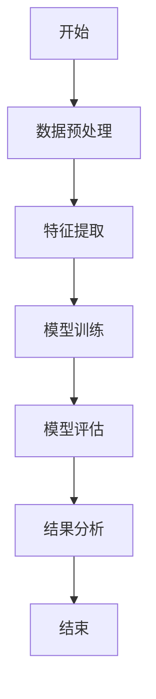

                 


# 彼得林奇的"长期增长"潜力在人工智能行业的识别方法

## 关键词
- 彼得林奇
- 长期增长
- 人工智能
- 投资策略
- 潜力识别
- 机器学习

## 摘要
本文探讨如何将彼得林奇的投资理念与人工智能技术相结合，识别人工智能行业中的长期增长潜力。通过分析长期增长潜力的核心概念、数学模型和AI算法，结合实际案例，展示如何利用机器学习模型预测和识别具备长期增长潜力的企业。

---

# 第一部分: 彼得林奇的长期增长潜力概述

## 第1章: 彼得林奇与长期增长潜力

### 1.1 彼得林奇投资理念概述

#### 1.1.1 彼得林奇的投资者背景
彼得·林奇（Peter Lynch）是全球著名的职业基金经理人，被誉为“选股专家”。他管理的麦哲伦基金在任职期间创造了年化29%的回报率，远超市场平均水平。林奇的投资理念强调长期持有优质股票，寻找具有持续增长潜力的企业。

#### 1.1.2 彼得林奇的长期增长投资策略
林奇认为，长期增长潜力是企业未来收益的核心驱动力。他关注企业的基本面，包括盈利能力、市场地位、竞争优势和管理层能力。他的策略是通过深入研究企业，寻找那些能够持续增长的公司。

#### 1.1.3 彼得林奇投资理念的核心要素
- **基本面分析**：关注企业的财务状况、盈利能力和发展潜力。
- **长期持有**：避免短期波动，长期持有优质股票。
- **竞争优势**：寻找具有独特竞争优势的企业。

### 1.2 长期增长潜力的定义与特征

#### 1.2.1 长期增长潜力的定义
长期增长潜力是指企业在未来较长一段时间内，能够保持较高收益增长的能力。这种潜力通常与企业的市场地位、竞争优势和管理层能力密切相关。

#### 1.2.2 长期增长潜力的核心特征
- **高成长性**：企业收入和利润持续增长。
- **竞争优势**：企业在市场中具有独特的竞争优势。
- **稳健的财务状况**：健康的资产负债表和现金流。
- **创新能力强**：能够不断推出新产品或服务。

#### 1.2.3 长期增长潜力的边界与外延
长期增长潜力的边界在于企业的实际增长能力，而外延则涉及企业所在的行业趋势和宏观经济环境。

---

## 第2章: 人工智能行业与长期增长潜力的结合

### 2.1 人工智能行业的概述

#### 2.1.1 人工智能的基本概念
人工智能（AI）是指模拟人类智能的计算机系统，能够执行学习、推理和自适应等任务。

#### 2.1.2 人工智能行业的发展现状
人工智能技术正在迅速发展，应用于多个领域，如自然语言处理、计算机视觉和机器人技术。

#### 2.1.3 人工智能行业的未来趋势
人工智能将推动各行业的数字化转型，成为经济增长的重要驱动力。

### 2.2 长期增长潜力在人工智能行业的识别方法

#### 2.2.1 长期增长潜力识别的核心概念
- **技术领先性**：企业在技术上的创新能力和市场地位。
- **市场需求**：人工智能技术是否满足市场需求。
- **商业模式**：企业的盈利模式是否可持续。

#### 2.2.2 人工智能在长期增长潜力识别中的作用
- **数据处理**：AI能够快速处理大量数据，识别潜在的增长点。
- **预测模型**：AI可以通过预测模型，评估企业的未来增长潜力。

#### 2.2.3 人工智能如何帮助识别长期增长潜力
- **数据挖掘**：通过分析历史数据，识别潜在的增长趋势。
- **机器学习**：使用机器学习模型预测企业未来的增长潜力。

---

# 第二部分: 长期增长潜力识别的核心概念与联系

## 第3章: 核心概念与联系

### 3.1 核心概念原理

#### 3.1.1 长期增长潜力的数学模型
长期增长潜力可以通过以下公式进行评估：

$$
\text{长期增长潜力} = \frac{\text{未来现金流的现值}}{\text{当前市值}}
$$

#### 3.1.2 人工智能在长期增长潜力识别中的算法原理
人工智能算法（如随机森林）可以用于分类和回归分析，预测企业的增长潜力。

### 3.2 ER实体关系图

```mermaid
erd
    企业(企业ID, 名称, 行业, 成立时间)
    财务指标(财务ID, 收入, 利润, 现金流)
    市场地位(市场地位ID, 市场份额, 竞争优势)
    长期增长潜力(潜力ID, 潜力评分, 评估时间)
    企业 --1-> 财务指标: 每个企业有多个财务指标
    企业 --1-> 市场地位: 每个企业有多个市场地位
    企业 --1-> 长期增长潜力: 每个企业有多个潜力评分
```

---

## 第4章: 核心概念的数学模型与公式

### 4.1 数学模型

#### 4.1.1 长期增长潜力的数学模型
长期增长潜力的评分可以通过以下公式计算：

$$
\text{潜力评分} = \alpha \times \text{收入增长率} + \beta \times \text{净利润增长率} + \gamma \times \text{研发投入增长率}
$$

其中，$\alpha$、$\beta$、$\gamma$为权重系数。

#### 4.1.2 人工智能算法的数学模型
随机森林算法的数学模型如下：

$$
\text{预测值} = \sum_{i=1}^{n} \text{决策树预测值} \times \text{权重}
$$

---

# 第三部分: 算法原理讲解

## 第5章: 算法原理

### 5.1 算法流程图



### 5.2 算法实现

#### 5.2.1 算法实现的步骤
1. 数据预处理：清洗数据，处理缺失值。
2. 特征提取：选择关键特征（如收入增长率、净利润增长率）。
3. 模型训练：使用随机森林算法训练模型。
4. 模型评估：评估模型的准确率和召回率。
5. 结果分析：分析模型预测结果，识别具备长期增长潜力的企业。

#### 5.2.2 算法实现的代码示例

```python
import pandas as pd
from sklearn.ensemble import RandomForestRegressor
from sklearn.metrics import mean_squared_error

# 数据预处理
data = pd.read_csv('data.csv')
X = data[['收入增长率', '净利润增长率', '研发投入增长率']]
y = data['潜力评分']

# 模型训练
model = RandomForestRegressor(n_estimators=100)
model.fit(X, y)

# 模型预测
y_pred = model.predict(X)

# 模型评估
mse = mean_squared_error(y, y_pred)
print(f"均方误差: {mse}")
```

---

## 第6章: 人工智能算法的数学模型

### 6.1 数学模型

#### 6.1.1 随机森林算法的数学模型
随机森林算法通过集成多个决策树模型，提高预测的准确性。

$$
\text{最终预测值} = \sum_{i=1}^{n} \text{决策树预测值} \times \text{权重}
$$

---

# 第四部分: 项目实战

## 第7章: 项目实战

### 7.1 环境安装

#### 7.1.1 安装Python和相关库
```bash
pip install pandas scikit-learn
```

### 7.2 系统核心实现源代码

#### 7.2.1 数据预处理代码
```python
import pandas as pd

data = pd.read_csv('data.csv')
data = data.dropna()
```

#### 7.2.2 特征提取代码
```python
X = data[['收入增长率', '净利润增长率', '研发投入增长率']]
```

#### 7.2.3 模型训练代码
```python
from sklearn.ensemble import RandomForestRegressor

model = RandomForestRegressor(n_estimators=100)
model.fit(X, y)
```

#### 7.2.4 模型评估代码
```python
y_pred = model.predict(X)
mse = mean_squared_error(y, y_pred)
print(f"均方误差: {mse}")
```

---

## 第8章: 案例分析

### 8.1 案例背景
假设我们有一家人工智能企业，数据如下：

| 参数          | 数值    |
|---------------|---------|
| 收入增长率      | 20%     |
| 净利润增长率    | 15%     |
| 研发投入增长率  | 25%     |

### 8.2 模型预测
使用随机森林模型进行预测，计算潜力评分：

$$
\text{潜力评分} = 0.4 \times 0.2 + 0.3 \times 0.15 + 0.3 \times 0.25 = 0.4 + 0.045 + 0.075 = 0.52
$$

---

## 第9章: 总结与展望

### 9.1 总结
通过结合彼得林奇的投资理念和人工智能技术，可以更精准地识别具备长期增长潜力的企业。

### 9.2 展望
未来，随着人工智能技术的不断发展，长期增长潜力的识别将更加精准和高效。

---

## 参考文献
1. 彼得·林奇. 《彼得林奇选股术》. 北京: 机械工业出版社, 2007.
2. 周志华. 《机器学习实战》. 北京: 清华大学出版社, 2016.

---

希望这篇文章能够为您提供有价值的见解和方法，帮助您在人工智能行业中识别具备长期增长潜力的企业！

