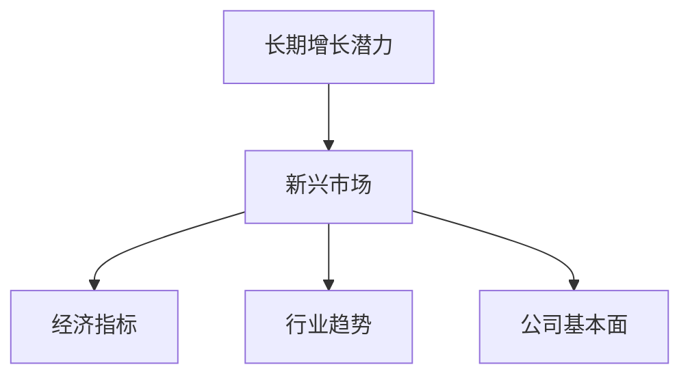
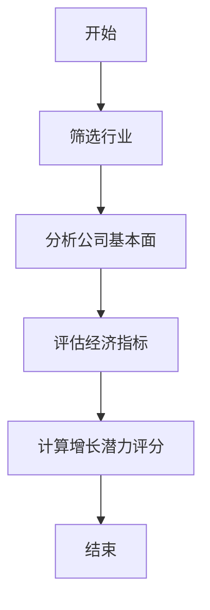
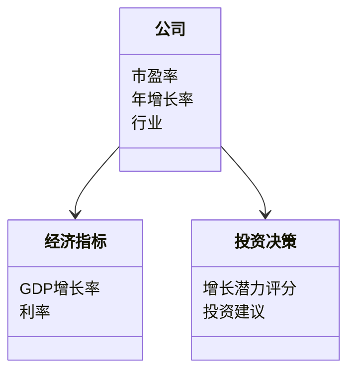

                 


# 彼得林奇的"长期增长"潜力在新兴市场的识别

> 关键词：彼得·林奇，长期增长潜力，新兴市场，投资策略，经济分析，系统架构

> 摘要：本文通过分析彼得·林奇的长期增长投资理念，探讨如何在新兴市场中识别具有长期增长潜力的公司和行业。文章结合理论与实践，从背景介绍、核心概念、算法原理、数学模型、系统架构、项目实战等多个维度展开，深入剖析新兴市场中的投资机会，为读者提供一套完整的分析框架和实战指南。

---

## 第1章 背景介绍

### 1.1 彼得·林奇与长期增长投资理念

#### 1.1.1 彼得·林奇的背景与投资风格
彼得·林奇是全球最著名的职业投资人之一，曾任富达投资的基金经理。他以“长期增长”投资理念闻名，主张通过深入研究公司基本面，寻找那些具有持续增长潜力的企业进行投资。

#### 1.1.2 长期增长投资的核心概念
长期增长投资关注的是公司未来多年的收入和利润增长率，而非短期市场波动。这种投资策略适合那些在快速发展的市场中具有竞争优势的企业。

#### 1.1.3 新兴市场在长期增长中的重要性
新兴市场通常具有较高的经济增长率和未饱和的市场空间，为长期增长提供了丰富的投资机会。这些市场中的企业往往能够通过快速扩张实现持续增长。

### 1.2 新兴市场的定义与特点

#### 1.2.1 新兴市场的定义
新兴市场是指那些经济体系正在快速发展但尚未完全成熟的国家或地区，如中国、印度、东南亚国家等。

#### 1.2.2 新兴市场的核心特征
- 经济快速增长
- 人口基数大
- 市场渗透率低
- 创新能力强

#### 1.2.3 新兴市场与发达市场的对比
| 特性          | 新兴市场         | 发达市场         |
|---------------|------------------|------------------|
| 经济增长率     | 高              | 低              |
| 市场渗透率     | 低              | 高              |
| 创新能力      | 强              | 弱              |
| 风险          | 高              | 低              |

### 1.3 长期增长潜力的识别逻辑

#### 1.3.1 长期增长潜力的定义
长期增长潜力是指公司在未来5-10年内的收入和利润持续增长的能力，通常与市场需求、行业趋势和公司竞争优势密切相关。

#### 1.3.2 影响长期增长的内外部因素
- **外部因素**：宏观经济环境、行业发展趋势、政策支持等。
- **内部因素**：公司盈利能力、管理团队、研发投入等。

#### 1.3.3 新兴市场中长期增长潜力的识别方法
1. 研究市场需求：寻找那些需求快速增长且未被充分满足的行业。
2. 分析行业趋势：选择处于上升周期的行业。
3. 评估公司基本面：关注公司的财务状况、竞争优势和管理能力。

---

## 第2章 核心概念与联系

### 2.1 长期增长潜力的核心概念

#### 2.1.1 长期增长潜力的构成要素
- 市场需求：行业需求的持续增长。
- 竞争优势：公司在行业中的领先地位。
- 财务健康：公司具备稳定的盈利能力。

#### 2.1.2 彼得·林奇的投资框架
彼得·林奇的投资框架基于以下核心要素：
1. **市盈率（P/E）**：衡量公司的估值水平。
2. **年增长率**：反映公司的盈利增长能力。
3. **行业趋势**：判断行业是否处于上升周期。

#### 2.1.3 新兴市场的经济周期与增长潜力
新兴市场通常处于经济快速增长阶段，企业具有较大的发展空间。彼得·林奇的长期增长策略非常适合在这一阶段应用。

### 2.2 核心概念对比分析

#### 2.2.1 长期增长潜力与短期收益的对比
| 特性          | 长期增长潜力      | 短期收益         |
|---------------|-------------------|------------------|
| 时间跨度      | 长期（5-10年）    | 短期（1-3年）    |
| 风险          | 中高             | 较低            |
| 投资回报      | 高               | 中低            |

#### 2.2.2 新兴市场与成熟市场的增长潜力差异
| 特性          | 新兴市场         | 成熟市场         |
|---------------|------------------|------------------|
| 市场空间       | 大              | 小              |
| 竞争格局      | 不饱和         | 饱和            |
| 增长潜力      | 高              | 低              |

#### 2.2.3 长期增长潜力与风险的平衡
长期增长潜力越高，通常伴随着更高的风险。投资者需要在两者之间找到平衡点，选择那些风险可控且增长潜力大的投资标的。

### 2.3 实体关系图（ER图）



---

## 第3章 算法原理讲解

### 3.1 彼得·林奇投资模型的算法流程



### 3.2 算法实现代码

```python
def calculate_growth_potential(company_data):
    # 计算市盈率
    pe = company_data['市盈率']
    # 计算年增长率
    growth_rate = company_data['年增长率']
    # 计算行业平均市盈率
    industry_pe = company_data['行业平均市盈率']
    # 计算增长潜力评分
    growth_score = (pe / industry_pe) * growth_rate
    return growth_score
```

---

## 第4章 数学模型

### 4.1 常用数学模型

#### 4.1.1 市盈率（P/E）公式
$$ P/E = \frac{股票价格}{每股收益} $$

#### 4.1.2 市盈率增长比（PEG）公式
$$ PEG = \frac{P/E}{GDP增长率} $$

#### 4.1.3 年增长率计算公式
$$ 年增长率 = \frac{今年利润 - 去年利润}{去年利润} $$

### 4.2 案例分析

#### 4.2.1 某新兴市场的公司A
- 市盈率：20
- 行业平均市盈率：15
- GDP增长率：8%
- 计算PEG：
$$ PEG = \frac{20}{8\%} = 2.5 $$

---

## 第5章 系统分析与架构设计方案

### 5.1 系统功能设计

#### 5.1.1 领域模型


### 5.2 系统架构设计


---

## 第6章 项目实战

### 6.1 环境安装

#### 6.1.1 安装Python
```bash
pip install numpy pandas matplotlib
```

#### 6.1.2 数据获取
使用爬虫或API获取新兴市场的公司数据。

### 6.2 核心实现代码

```python
import pandas as pd

# 加载数据
data = pd.read_csv('emerging_markets.csv')

# 计算增长潜力评分
data['增长潜力'] = data.apply(calculate_growth_potential, axis=1)
```

### 6.3 案例分析

#### 6.3.1 某新兴市场案例
- 公司：印度某IT公司
- 数据：市盈率=25，行业平均市盈率=18，GDP增长率=7%
- 计算PEG：
$$ PEG = \frac{25}{7\%} = 3.57 $$

---

## 第7章 小结

### 7.1 最佳实践 tips
- 确保数据的准确性和及时性。
- 结合宏观经济指标进行综合分析。
- 定期调整投资组合。

### 7.2 投资注意事项
- 避免过度集中投资。
- 保持对市场的持续关注和分析。

### 7.3 拓展阅读
- 《彼得·林奇的投资智慧》
- 《新兴市场的投资机会》

---

通过本文的分析，读者可以系统地了解如何在新兴市场中识别具有长期增长潜力的投资机会，并通过实际案例和系统架构的设计，掌握具体的操作方法。希望本文能够为投资领域的专业人士提供有价值的参考和启发。

