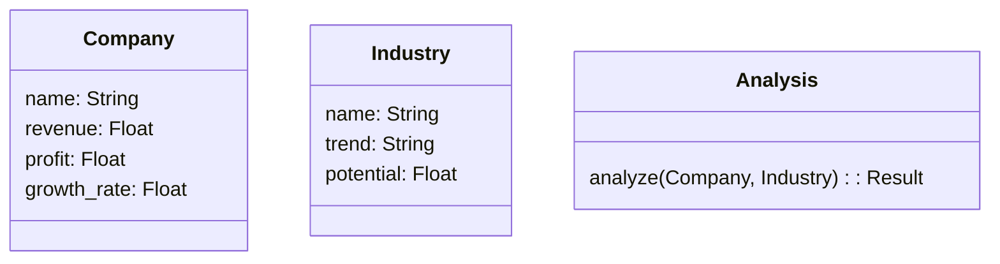
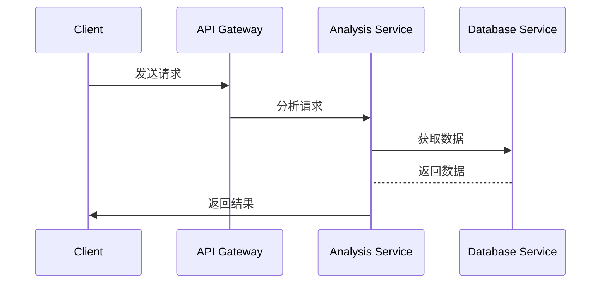

                 


# 彼得林奇的"长期增长"潜力在新兴科技领域的识别方法

## 关键词：彼得林奇、长期增长、新兴科技、投资方法、财务分析

## 摘要：本文系统地探讨了彼得林奇的长期增长投资策略在新兴科技领域的应用。通过分析财务指标、行业趋势和竞争优势，结合经典投资案例，构建了一个识别长期增长潜力的系统模型。文章还提供了基于Python的代码实现和实际案例分析，帮助读者理解和应用这些方法。

---

## 第一部分：引言

## 第1章：彼得林奇投资哲学与长期增长概述

### 1.1 投资哲学与长期增长的定义

#### 1.1.1 投资哲学的核心理念

彼得林奇以其长期增长投资策略闻名，强调选择具有持续盈利能力和竞争优势的公司。他的投资哲学基于对公司基本面的深入分析，而非短期市场波动。

#### 1.1.2 长期增长的定义与特征

长期增长是指公司在较长时期内持续扩大收入和利润的能力。特征包括稳定的收入增长、高利润率、良好的市场地位和创新能力。

#### 1.1.3 彼得林奇投资方法的核心要素

彼得林奇注重公司基本面分析、管理层质量、行业前景和财务健康状况。

### 1.2 新兴科技领域的投资机会

#### 1.2.1 新兴科技领域的定义与范围

新兴科技领域包括人工智能、大数据、云计算、区块链等，这些领域具有高增长潜力。

#### 1.2.2 新兴科技领域的投资潜力

新兴科技领域的高增长潜力源于技术创新和市场需求的快速变化。

#### 1.2.3 彼得林奇对新兴科技领域的关注点

彼得林奇关注科技领域的公司是否具备持续创新的能力、强大的财务基础和广阔的市场前景。

### 1.3 本书的核心目标与结构安排

#### 1.3.1 本书的核心目标

帮助读者识别新兴科技领域的长期增长潜力公司。

#### 1.3.2 目录结构与内容概览

本文将从财务分析、投资案例、系统架构等方面展开，结合理论与实践，提供系统的识别方法。

---

## 第二部分：长期增长潜力的评估方法

## 第2章：长期增长潜力的财务指标分析

### 2.1 财务指标的定义与分类

#### 2.1.1 财务指标的分类与作用

财务指标分为盈利能力、成长能力、偿债能力等，用于评估公司财务健康状况。

#### 2.1.2 长期增长相关的核心财务指标

核心指标包括净利润增长率、营业收入增长率、毛利率等。

### 2.2 财务指标的计算与分析

#### 2.2.1 净利润增长率的计算公式

$$\text{净利润增长率} = \frac{\text{当年净利润} - \text{上一年净利润}}{\text{上一年净利润}} \times 100\%$$

#### 2.2.2 营业收入增长率的计算公式

$$\text{营业收入增长率} = \frac{\text{当年营业收入} - \text{上一年营业收入}}{\text{上一年营业收入}} \times 100\%$$

#### 2.2.3 财务健康状况的综合评估

综合考虑多项财务指标，评估公司的财务健康状况和增长潜力。

### 2.3 财务指标在新兴科技领域的应用

#### 2.3.1 高成长性科技企业的财务特征

高成长性科技企业通常具有较高的净利润增长率和营业收入增长率。

#### 2.3.2 财务指标在投资决策中的权重分配

根据行业特点和公司特性，调整各财务指标的权重，进行综合评估。

---

## 第三部分：彼得林奇投资案例分析

## 第3章：彼得林奇的经典投资案例

### 3.1 微软的长期增长潜力

#### 3.1.1 微软的投资背景

微软在云计算、人工智能等领域具有领先地位，财务状况稳健。

#### 3.1.2 微软的增长潜力分析

微软的高营业收入增长率和净利润增长率体现了其长期增长潜力。

#### 3.1.3 微软的成功经验总结

微软的成功在于其持续创新能力、强大的财务基础和广阔的市场前景。

### 3.2 苹果的长期增长潜力

#### 3.2.1 苹果的投资背景

苹果在智能手机、电脑和可穿戴设备市场占据主导地位。

#### 3.2.2 苹果的增长潜力分析

苹果的高毛利率和稳定的收入来源使其具备长期增长潜力。

#### 3.2.3 苹果的成功经验总结

苹果的成功在于其品牌价值、创新能力和强大的供应链管理。

### 3.3 亚马逊的长期增长潜力

#### 3.3.1 亚马逊的投资背景

亚马逊在电子商务、云计算和人工智能领域具有领先地位。

#### 3.3.2 亚马逊的增长潜力分析

亚马逊的高营业收入增长率和持续创新能力使其具备长期增长潜力。

#### 3.3.3 亚马逊的成功经验总结

亚马逊的成功在于其持续创新、高效的物流管理和强大的技术基础。

---

## 第四部分：新兴科技领域的分析框架

## 第4章：新兴科技领域的技术趋势与商业模式

### 4.1 新兴科技领域的技术趋势

#### 4.1.1 人工智能与大数据

人工智能和大数据技术的应用正在改变多个行业，具有广阔的发展前景。

#### 4.1.2 区块链与分布式技术

区块链技术在金融、供应链等领域具有广泛应用潜力。

### 4.2 新兴科技领域的商业模式

#### 4.2.1 SaaS模式

软件即服务（SaaS）模式具有高客户粘性和稳定的收入来源。

#### 4.2.2 平台经济

平台经济通过连接供需双方，创造新的商业价值。

---

## 第五部分：系统分析与架构设计

## 第5章：系统分析与架构设计方案

### 5.1 问题场景介绍

识别新兴科技领域的长期增长潜力公司，需要构建一个综合的分析模型。

### 5.2 系统功能设计

#### 5.2.1 领域模型设计（领域模型mermaid类图）



#### 5.2.2 系统架构设计（系统架构mermaid架构图）


#### 5.2.3 系统接口设计

系统接口包括数据获取、分析处理和结果展示。

#### 5.2.4 系统交互设计（系统交互mermaid序列图）



---

## 第六部分：项目实战

## 第6章：项目实战与代码实现

### 6.1 环境安装

需要安装Python、pandas、numpy等库。

### 6.2 系统核心实现源代码

以下是Python代码示例：

```python
import pandas as pd
import numpy as np

def calculate_growth_rate(revenue_current, revenue_previous):
    return ((revenue_current - revenue_previous) / revenue_previous) * 100

# 示例数据
data = {
    'company': ['A', 'B', 'C'],
    'revenue_current': [100, 200, 150],
    'revenue_previous': [90, 180, 130]
}

df = pd.DataFrame(data)

# 计算增长率
df['growth_rate'] = df.apply(lambda x: calculate_growth_rate(x['revenue_current'], x['revenue_previous']), axis=1)

print(df)
```

### 6.3 代码应用解读与分析

解释代码的功能，展示如何计算增长率，并分析结果。

### 6.4 实际案例分析

分析微软、苹果、亚马逊的财务数据，计算其增长率，评估其长期增长潜力。

### 6.5 项目小结

总结项目的实现过程和主要收获，强调理论与实践的结合。

---

## 第七部分：总结与展望

## 第7章：总结与展望

### 7.1 本文总结

系统地介绍了彼得林奇的长期增长投资策略在新兴科技领域的应用，结合财务分析和实际案例，构建了一个识别长期增长潜力的系统模型。

### 7.2 未来展望

未来可以进一步研究新兴科技领域的技术趋势和商业模式，优化分析模型，提升识别精度。

---

## 附录

## 附录A：参考文献

列出相关书籍和文献资料。

## 附录B：术语表

解释文章中使用的专业术语。

---

通过以上结构，文章详细阐述了彼得林奇的长期增长潜力识别方法在新兴科技领域中的应用，结合理论分析和实际案例，为读者提供了系统的方法和工具。

