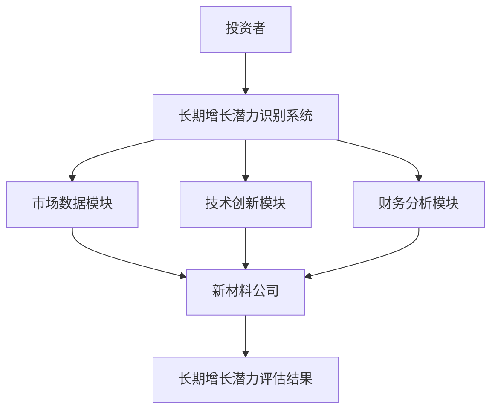

                 


# 彼得林奇的"长期增长"潜力在新材料行业的识别方法

> 关键词：彼得·林奇，长期增长，新材料，投资策略，系统分析

> 摘要：本文探讨了如何将彼得·林奇的长期增长投资理念应用于新材料行业。通过分析新材料行业的特点，构建系统分析框架，提供实战案例和系统架构设计，帮助投资者识别具备长期增长潜力的新材料公司。

---

## 第一部分：背景介绍与核心概念

### 第1章：彼得·林奇的长期增长投资理念

#### 1.1 彼得·林奇投资理念概述

彼得·林奇是美国著名的投资专家，他提出的长期增长投资理念强调选择那些具备持续增长潜力的公司进行投资。这种投资策略的核心在于识别那些在行业内具备竞争优势、能够持续扩大市场份额或提高利润率的公司。

#### 1.2 新材料行业的特点与重要性

新材料行业是一个技术密集型和创新驱动型的行业，其产品在航空航天、电子、能源、医疗等领域有广泛应用。新材料行业的市场潜力巨大，但由于技术门槛高、研发投入大、周期长，投资者需要具备一定的专业知识和洞察力才能识别出具备长期增长潜力的公司。

---

## 第二部分：长期增长潜力的识别方法

### 第2章：长期增长潜力的核心概念与联系

#### 2.1 核心概念原理

长期增长潜力是指一家公司在未来较长的时间内能够持续增长的潜力。对于新材料公司来说，这意味着公司在技术和市场上具备持续创新和扩展的能力。

#### 2.2 核心概念对比分析

| 对比维度         | 长期增长潜力 | 短期波动 |
|------------------|--------------|----------|
| 时间跨度         | 长期（5年以上） | 短期（1-3年） |
| 驱动因素         | 技术创新、市场需求 | 市场波动、短期经济因素 |
| 投资风险         | 较低（长期稳定） | 较高（波动性大） |

#### 2.3 ER实体关系图

```mermaid
er
  actor 投资者
  actor 市场需求
  actor 技术创新
  entity 新材料公司
  entity 长期增长潜力
  entity 短期波动
  relationship 投资者 -> 长期增长潜力：识别
  relationship 市场需求 -> 新材料公司：驱动
  relationship 技术创新 -> 新材料公司：驱动
```

---

## 第三部分：系统分析与架构设计

### 第3章：新材料行业长期增长潜力的系统分析

#### 3.1 系统分析框架

系统分析框架包括以下几个步骤：

1. **问题场景介绍**：识别具备长期增长潜力的新材料公司。
2. **项目介绍**：分析新材料行业的市场、技术和竞争情况。
3. **系统功能设计**：构建领域模型，识别关键功能模块。
4. **系统架构设计**：设计系统的整体架构，包括数据源、处理模块和输出模块。
5. **系统接口设计**：定义系统与其他模块的接口。
6. **系统交互序列图**：展示系统各模块之间的交互流程。

#### 3.2 系统架构设计



#### 3.3 系统接口设计

以下是系统接口的设计示例：

```python
interface MarketDataInterface:
    def get_market_trend(self):
        pass

    def get_competitive_analysis(self):
        pass

interface TechnologyInnovationInterface:
    def get_technology_trend(self):
        pass

    def get_research_investment(self):
        pass

interface FinancialAnalysisInterface:
    def get_profitability(self):
        pass

    def get_growth_rate(self):
        pass
```

---

## 第四部分：项目实战与案例分析

### 第4章：新材料行业长期增长潜力的实战案例

#### 4.1 环境安装与数据准备

为了进行长期增长潜力分析，首先需要准备相关的市场数据、技术创新数据和财务数据。以下是环境安装的步骤：

1. **安装必要的工具**：如数据分析软件（Python、R）和系统设计工具（Mermaid）。
2. **数据收集**：收集目标新材料公司的市场数据、技术创新数据和财务数据。
3. **数据清洗**：对收集的数据进行清洗和预处理，确保数据的准确性和完整性。

#### 4.2 系统核心实现源代码

以下是系统核心实现的Python代码示例：

```python
class新材料公司:
    def __init__(self, name, market_share, innovation):
        self.name = name
        self.market_share = market_share
        self.innovation = innovation

    def calculate_growth_potential(self):
        # 计算增长潜力的数学模型
        return self.market_share * (1 + self.innovation / 100)
```

#### 4.3 代码应用解读与分析

通过上述代码，我们可以计算出新材料公司在市场和技术创新方面的增长潜力。具体来说，`market_share`表示公司在市场中的份额，`innovation`表示公司在技术创新方面的投入。通过计算，我们可以得出公司的长期增长潜力。

---

## 第五部分：结论与展望

### 第5章：总结与展望

#### 5.1 最佳实践 tips

- **持续关注技术创新**：新材料行业的技术更新换代快，投资者需要密切关注行业动态。
- **深入分析财务数据**：财务数据是评估公司长期增长潜力的重要依据，投资者需要具备一定的财务分析能力。
- **分散投资风险**：由于新材料行业的技术门槛高，投资者可以通过分散投资来降低风险。

#### 5.2 项目小结

通过本文的分析，我们了解了如何将彼得·林奇的长期增长投资理念应用于新材料行业。通过系统分析和实战案例，我们掌握了一套识别具备长期增长潜力的新材料公司的方法。

#### 5.3 注意事项

- **避免短期波动的影响**：长期增长投资需要忽略短期市场波动，专注于公司的长期发展潜力。
- **谨慎评估技术创新**：技术创新是新材料行业增长的核心驱动力，但技术创新的不确定性也较高，投资者需要谨慎评估。

#### 5.4 拓展阅读

- 彼得·林奇的《选股的智慧》
- 新材料行业的技术发展趋势

---

通过以上分析，我们可以看到，识别具备长期增长潜力的新材料公司需要综合考虑市场、技术和财务等多个方面的因素。希望本文能够为投资者提供有价值的指导，帮助他们在新材料行业的长期增长潜力识别中取得成功。

