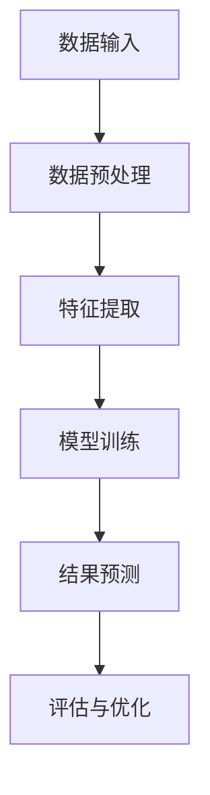
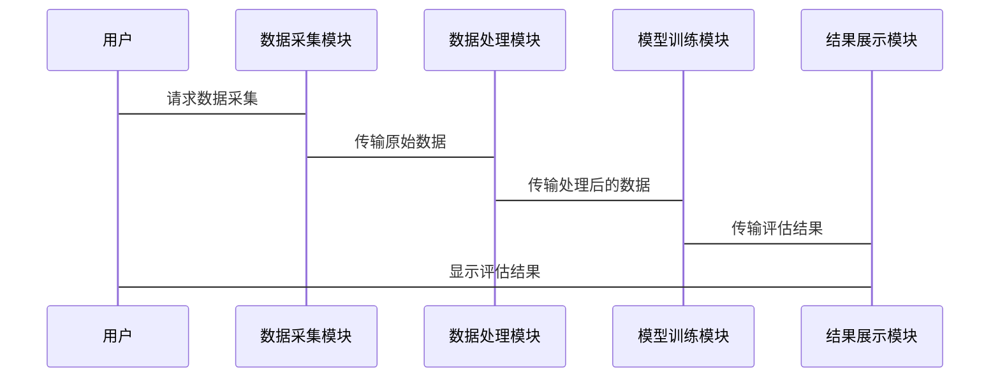

                 

# 彼得林奇的"长期增长"潜力识别方法

## 关键词：彼得·林奇，长期增长，投资策略，基本面分析，财务指标，竞争优势

## 摘要：彼得·林奇是全球著名的投资专家，他的长期增长投资策略专注于寻找具备持续增长潜力的公司。本文将详细介绍彼得·林奇的长期增长识别方法，涵盖基本面分析、竞争优势评估、财务指标筛选以及市场情绪分析等方面。通过系统的方法和详细的案例分析，帮助读者掌握如何识别具备长期增长潜力的公司。

---

# 第1章: 长期增长投资的基本概念

## 1.1 长期增长投资的定义与核心理念

### 1.1.1 投资的长期性与持续性

长期增长投资是一种以长期持有优质资产为核心策略的投资方法。彼得·林奇认为，投资的真正目的是找到那些能够在未来几年内持续增长的公司，并且通过长期持有这些公司的股票，分享其增长带来的收益。

### 1.1.2 长期增长投资的核心目标

长期增长投资的核心目标是寻找那些具备持续增长潜力的公司。这种增长不仅体现在收入和利润上，还包括市场份额的扩大、产品创新能力的提升以及管理团队的稳定性等方面。

### 1.1.3 彼得·林奇的投资风格与理念

彼得·林奇的投资风格以基本面分析为基础，注重对公司内在价值的评估。他认为，投资者应该选择那些具有强大竞争优势、良好财务状况和广阔市场前景的公司。他的投资理念强调长期持有优质资产，避免频繁交易，以减少交易成本和市场波动的影响。

---

## 1.2 彼得·林奇的背景与成就

### 1.2.1 彼得·林奇的生平简介

彼得·林奇（Peter Lynch）是美国著名的投资专家，曾在富达投资集团管理麦哲伦基金，创造了辉煌的投资业绩。他的投资策略以基本面分析和长期持有优质资产为核心，成为全球投资者学习的典范。

### 1.2.2 林奇在富达基金的辉煌历程

在富达基金期间，彼得·林奇将麦哲伦基金的资产从1977年的2000万美元增长到1990年的140亿美元，年平均回报率达到29%。这一成就使他成为全球最成功的基金经理之一。

### 1.2.3 林奇的投资哲学与经典语录

林奇强调，投资应该基于对公司基本面的深入研究，而不是市场的短期波动。他的经典语录包括“市场的最佳时机是当市场恐慌时买入”和“不要试图预测市场，预测市场的人都是失败者”。

---

## 1.3 长期增长投资的适用场景与限制

### 1.3.1 长期增长投资的适用市场环境

长期增长投资适用于那些市场环境稳定、经济持续增长的市场。在这些市场中，具备长期增长潜力的公司能够通过持续创新和优化管理实现价值增长。

### 1.3.2 长期增长投资的局限性与挑战

尽管长期增长投资有其优势，但也面临一些挑战。例如，在经济衰退或市场波动剧烈的情况下，长期持有股票可能会面临较大的波动风险。此外，长期增长投资需要投资者具备较强的风险承受能力和长期投资的耐心。

### 1.3.3 林奇方法的现代适应性分析

尽管林奇的投资方法主要基于传统基本面分析，但在现代市场环境下，结合量化分析和大数据技术，可以进一步优化长期增长潜力的识别方法。

---

# 第2章: 长期增长潜力的识别方法

## 2.1 公司基本面分析

### 2.1.1 收入与利润增长的评估

公司收入和利润的增长是衡量其长期增长潜力的重要指标。通过分析公司过去几年的收入增长率和利润率变化，可以预测未来的发展趋势。

### 2.1.2 财务健康状况的分析

财务健康状况是公司长期增长的重要保障。通过分析公司的资产负债表、利润表和现金流，可以评估公司的财务风险和偿债能力。

### 2.1.3 行业地位与竞争优势

公司所处的行业地位及其竞争优势是决定其长期增长潜力的关键因素。分析公司的市场份额、产品创新能力以及成本优势，可以帮助识别具备竞争优势的公司。

---

## 2.2 市场地位与竞争优势

### 2.2.1 市场份额的分析

市场份额是衡量公司市场地位的重要指标。拥有较高市场份额的公司通常具备更强的议价能力和竞争优势。

### 2.2.2 核心竞争力的评估

核心竞争力是公司长期增长的驱动力。分析公司的核心竞争力，包括产品创新能力、品牌影响力、技术优势等，可以帮助识别具备持续增长潜力的公司。

### 2.2.3 投资壁垒的判断

投资壁垒是指公司在行业内竞争对手难以复制或超越的优势。例如，专利技术、独特的商业模式或强大的分销网络等。

---

## 2.3 财务指标的筛选与分析

### 2.3.1 常用财务指标的定义与计算

以下是一些常用的财务指标：

- **收入增长率**：$$ \text{收入增长率} = \frac{\text{当年收入} - \text{上年收入}}{\text{上年收入}} \times 100\% $$
- **净利润率**：$$ \text{净利润率} = \frac{\text{净利润}}{\text{收入}} \times 100\% $$
- **ROE（净资产收益率）**：$$ \text{ROE} = \frac{\text{净利润}}{\text{股东权益}} \times 100\% $$

### 2.3.2 财务指标在长期增长评估中的应用

通过分析这些财务指标，可以评估公司的盈利能力和财务健康状况。例如，收入增长率高的公司可能具备更强的市场竞争力，而高ROE的公司可能具备更好的资产使用效率。

### 2.3.3 林奇对财务指标的特别关注点

彼得·林奇特别关注公司的收入和利润增长的可持续性。他认为，只有那些能够持续增长的公司才具备长期投资价值。

---

## 2.4 市场情绪与估值分析

### 2.4.1 市场情绪对投资决策的影响

市场情绪通常会影响股票的短期价格波动。然而，长期增长投资者应该关注公司的内在价值，而不是市场的短期情绪。

### 2.4.2 合理估值的判断方法

合理的估值是长期增长投资的重要条件。通过分析市盈率（P/E）、市净率（P/B）等估值指标，可以判断股票是否被高估或低估。

### 2.4.3 林奇对市场恐慌与贪婪的应对策略

在市场恐慌时，彼得·林奇倾向于寻找那些被市场低估的优质股票。他认为，恐慌情绪会导致股票价格暂时下跌，为长期投资者提供了买入的机会。

---

# 第3章: 长期增长潜力的量化评估模型

## 3.1 模型构建的基本思路

### 3.1.1 数据收集与处理

需要收集公司的财务数据、市场数据和行业数据。数据来源包括公司财报、行业报告和市场分析报告等。

### 3.1.2 模型假设与变量选择

模型假设包括：公司收入和利润能够持续增长，市场环境稳定等。变量选择包括收入增长率、净利润率、ROE等财务指标，以及市场份额、竞争优势等市场指标。

### 3.1.3 模型的验证与优化

通过历史数据验证模型的准确性，并根据实际情况进行参数调整和优化。

---

## 3.2 模型的核心算法与流程

### 3.2.1 数据预处理流程

1. 数据清洗：处理缺失值、异常值等。
2. 数据转换：对数据进行标准化或归一化处理。
3. 特征提取：从原始数据中提取有用的特征变量。

### 3.2.2 模型训练与验证

1. 选择合适的算法，如线性回归、决策树等。
2. 对模型进行训练，并验证其准确性。

### 3.2.3 模型预测与评估

1. 使用训练好的模型对目标公司进行预测。
2. 评估模型的预测结果，并根据实际情况进行调整。

---

## 3.3 模型的数学公式与实现

### 3.3.1 涵盖的主要公式

$$ \text{未来价值} = \text{当前价值} \times (1 + g)^n $$

其中，\( g \) 是收入增长率，\( n \) 是预测年数。

### 3.3.2 其他相关公式

$$ \text{市盈率} = \frac{\text{股价}}{\text{每股收益}} $$

---

## 3.4 模型的可视化与分析

### 3.4.1 模型流程图

### 3.4.2 模型架构图

---

# 第4章: 系统架构

## 4.1 系统功能设计

### 4.1.1 系统介绍

这是一个基于彼得·林奇长期增长潜力识别方法的投资分析系统，旨在帮助投资者识别具备长期增长潜力的公司。

### 4.1.2 系统功能模块

1. 数据采集模块：从多个数据源获取公司数据。
2. 数据处理模块：清洗和转换数据。
3. 特征提取模块：提取有用的特征变量。
4. 模型训练模块：训练长期增长潜力评估模型。
5. 结果展示模块：展示评估结果。

---

## 4.2 系统架构设计

### 4.2.1 系统架构图

### 4.2.2 系统接口设计

1. 数据采集模块接口：
   - 输入：数据源配置
   - 输出：原始数据

2. 数据处理模块接口：
   - 输入：原始数据
   - 输出：处理后的数据

3. 模型训练模块接口：
   - 输入：特征数据
   - 输出：评估结果

---

## 4.3 系统交互流程

---

# 小结

彼得·林奇的长期增长潜力识别方法是一种以基本面分析为核心的长期投资策略。通过深入分析公司的收入增长、财务状况、市场地位和竞争优势，投资者可以识别出具备长期增长潜力的公司。同时，结合量化模型和系统架构设计，可以进一步优化长期增长潜力的识别过程。希望本文能够帮助读者更好地理解和应用彼得·林奇的长期增长投资方法。

---

**注意事项：**
1. 长期增长投资需要耐心和信心，投资者应该避免频繁交易。
2. 在实际操作中，应结合市场环境和公司实际情况进行动态调整。
3. 风险提示：投资有风险，需谨慎决策。

**拓展阅读：**
- 彼得·林奇的著作《彼得·林奇的成功投资》
- 《投资学基础》
- 《股票投资实战》

