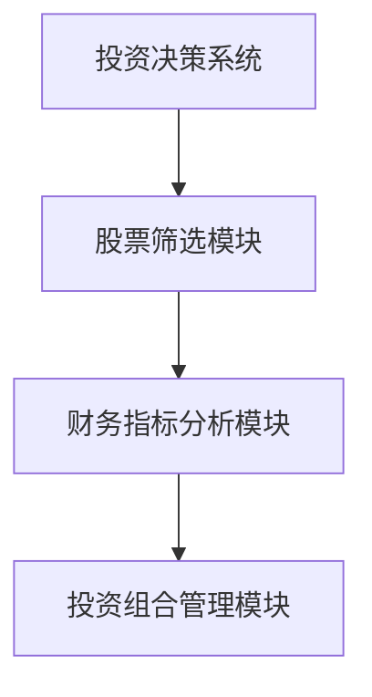

                 

# 彼得林奇的"长期增长"选股策略

> 关键词：彼得·林奇，长期增长，选股策略，投资，基本面分析

> 摘要：本文深入探讨了彼得·林奇的“长期增长”选股策略，从背景介绍到核心概念，再到数学模型和实战案例，详细分析了这一策略的原理和应用。通过本文，读者可以全面理解如何利用长期增长策略进行投资决策，掌握关键的分析方法和工具。

---

## 第1章：投资的基本概念与背景介绍

### 1.1 投资的基本概念

投资是指将资金投入到某种资产中，以期获得未来收益的行为。在股票市场中，投资的核心目标是通过买入并持有优质股票，实现资产的长期增值。

#### 1.1.1 什么是投资

投资不仅仅是购买股票，更是一种长期财富管理的手段。它要求投资者具备一定的市场知识和耐心，能够在市场波动中保持冷静，抓住优质资产的价值增长机会。

#### 1.1.2 投资的基本原则

- **分散投资**：不要将所有资金投入到单一资产中，分散可以降低风险。
- **长期持有**：避免频繁交易，长期持有优质资产可以获得复利效应。
- **价值投资**：关注公司的基本面，寻找具有长期增长潜力的公司。

#### 1.1.3 股票投资的核心要素

- **公司基本面**：包括收入、利润、资产负债情况等。
- **行业前景**：选择处于增长行业的公司。
- **管理层素质**：优秀的管理层能够带领公司持续发展。

### 1.2 彼得·林奇与长期增长策略

彼得·林奇是美国著名的投资经理，以其成功的投资策略闻名。他的长期增长策略专注于寻找那些能够持续增长的公司，长期持有，等待其价值实现。

#### 1.2.1 彼得·林奇的背景介绍

彼得·林奇是富达投资集团的前董事长，管理过麦哲伦基金，取得了卓越的投资业绩。他的投资理念强调长期持有优质股票，避免短期波动的干扰。

#### 1.2.2 长期增长策略的定义

长期增长策略是指通过分析公司的基本面，选择那些具有持续增长潜力的公司进行投资，并长期持有，以实现资产的增值。

#### 1.2.3 长期增长策略的核心目标

通过分析公司的财务数据和行业前景，寻找那些能够持续增长的公司，长期持有，实现资产的稳定增长。

---

## 第2章：长期增长选股策略的核心概念

### 2.1 基本面分析

基本面分析是长期增长策略的核心，通过分析公司的财务数据，评估其投资价值。

#### 2.1.1 市盈率（P/E）的计算与分析

市盈率是股票价格与每股净利润的比率，用于评估股票的估值是否合理。

$$ P/E = \frac{股票价格}{每股净利润} $$

如果市盈率过低，可能意味着股票被低估；过高则可能意味着高估。

#### 2.1.2 每股收益（EPS）的计算与意义

每股收益是公司净利润与总股本的比率，反映了公司的盈利能力。

$$ EPS = \frac{净利润}{总股本} $$

高每股收益通常意味着公司盈利能力强。

#### 2.1.3 营业收入与净利润增长率的对比

营业收入和净利润增长率是衡量公司成长性的关键指标。营业收入增长表明市场需求强劲，净利润增长表明公司盈利能力提升。

### 2.2 成长性评估

成长性评估是长期增长策略的重要部分，通过分析公司的竞争优势和行业前景，判断其未来的增长潜力。

#### 2.2.1 行业增长潜力的评估方法

选择处于增长行业的公司，如科技、医疗等，这些行业有较大的发展空间。

#### 2.2.2 公司竞争优势的分析

分析公司的核心竞争力，如技术优势、品牌影响力等，判断其能否在行业中持续发展。

#### 2.2.3 财务健康状况的评估指标

通过分析公司的资产负债表，判断其财务健康状况，确保公司具备稳健的财务基础。

### 2.3 风险管理

风险管理是投资过程中不可忽视的一部分，通过合理分散投资和控制风险，降低投资组合的波动性。

#### 2.3.1 投资组合的风险分散策略

将资金分配到不同行业和资产类别中，降低单一资产的风险。

#### 2.3.2 估值过高的识别方法

通过比较市盈率和行业平均水平，识别股票是否被高估。

#### 2.3.3 市场波动对长期投资的影响

市场波动是短期的，长期投资更关注公司的内在价值。

---

## 第3章：长期增长策略的数学模型与公式

### 3.1 市盈率模型

$$ P/E = \frac{股票价格}{每股净利润} $$

市盈率反映了股票的估值水平，合理的市盈率有助于判断股票的投资价值。

### 3.2 净资产收益率（ROE）

$$ ROE = \frac{净利润}{净资产} $$

ROE衡量了公司使用股东资产的效率，高ROE表明公司资产利用效率高。

### 3.3 股票估值公式

$$ 合理估值 = 市盈率 \times 每股净利润 $$

通过合理的市盈率和每股净利润，计算出股票的合理估值，作为投资决策的依据。

---

## 第4章：长期增长策略的系统架构设计

### 4.1 系统功能设计

#### 4.1.1 股票筛选模块

根据设定的筛选条件，筛选出符合条件的股票，如市盈率低于行业平均水平，净利润增长稳定等。

#### 4.1.2 财务指标分析模块

分析公司的财务指标，如ROE、营业收入增长率等，评估公司的财务健康状况和成长性。

#### 4.1.3 投资组合管理模块

根据筛选结果和财务分析，构建投资组合，分散投资风险。

### 4.2 系统架构图

系统架构图展示了各个模块之间的关系，股票筛选模块负责初步筛选，财务指标分析模块进一步评估，投资组合管理模块最终构建投资组合。

---

## 第5章：长期增长策略的实战案例分析

### 5.1 案例一：苹果公司的长期增长策略

#### 5.1.1 公司基本面分析

苹果公司是全球科技行业的领导者，拥有强大的品牌影响力和技术创新能力。

#### 5.1.2 成长性评估

苹果的营业收入和净利润持续增长，ROE保持在较高水平。

#### 5.1.3 投资决策过程

根据基本面分析，苹果公司具备长期增长潜力，符合长期增长策略的投资标准。

### 5.2 案例二：谷歌的长期增长策略

#### 5.2.1 行业增长潜力

谷歌所在的科技行业具有较大的增长空间，人工智能、云计算等领域发展迅速。

#### 5.2.2 公司竞争优势

谷歌在搜索引擎市场占据主导地位，技术创新能力强。

#### 5.2.3 估值分析

通过市盈率和ROE分析，谷歌的估值水平合理，具备长期投资价值。

---

## 第6章：长期增长策略的注意事项与最佳实践

### 6.1 投资中的常见误区

#### 6.1.1 过度关注短期波动

长期投资应关注公司的内在价值，而非短期价格波动。

#### 6.1.2 忽视风险管理

通过分散投资和风险评估，降低投资组合的风险。

#### 6.1.3 过度依赖单一指标

结合多种指标进行分析，避免因单一指标误判。

### 6.2 长期投资的注意事项

#### 6.2.1 定期复盘与调整

定期审视投资组合，根据市场变化和公司情况调整投资策略。

#### 6.2.2 避免情绪化决策

避免因市场波动和个人情绪影响投资决策。

#### 6.2.3 保持对市场的敏感性

关注行业动态和市场变化，及时捕捉投资机会。

---

## 第7章：长期增长策略的小结与展望

### 7.1 本书小结

本文全面介绍了彼得·林奇的长期增长选股策略，从背景介绍到核心概念，再到数学模型和实战案例，帮助读者理解这一策略的原理和应用。

#### 7.1.1 核心概念回顾

长期增长策略强调基本面分析和成长性评估，选择具有持续增长潜力的公司长期持有。

#### 7.1.2 实战案例总结

通过苹果和谷歌的案例分析，展示了长期增长策略的应用方法和实际效果。

#### 7.1.3 策略优缺点分析

优点：长期持有优质资产，复利效应显著；缺点：需要较长的时间周期，市场波动可能影响短期收益。

### 7.2 未来展望

随着市场的变化和技术的发展，长期增长策略需要不断调整和完善，以适应新的市场环境。

---

通过本文的详细分析，读者可以全面理解彼得·林奇的长期增长选股策略，掌握其核心概念和应用方法，为自己的投资决策提供有力支持。

