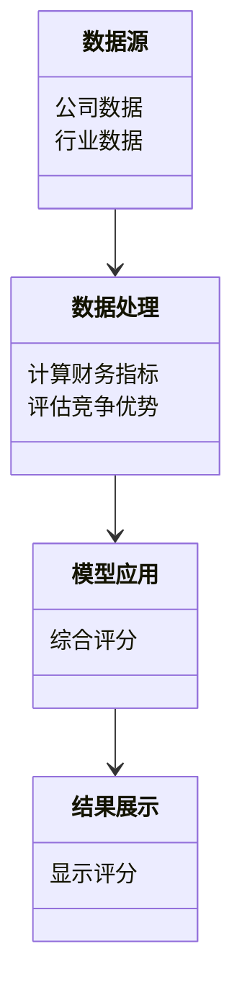
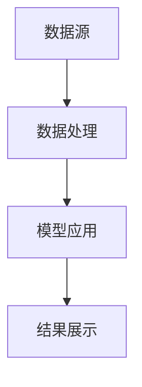
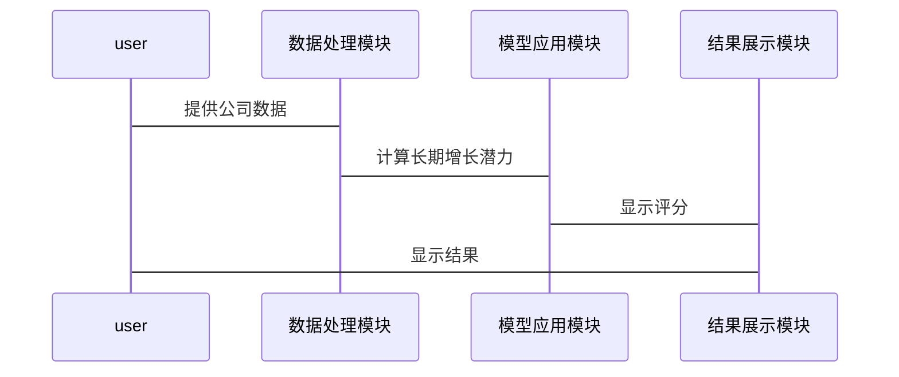

                 


# 彼得林奇的"长期增长"预测方法

> 关键词：彼得林奇，长期增长，投资策略，选股标准，数学模型，系统架构

> 摘要：本文详细介绍了彼得·林奇的长期增长预测方法，探讨了他的投资理念、选股标准、数学模型以及系统架构设计。通过实际案例分析和系统实现，帮助读者理解和应用这些方法。

---

## 第1章 彼得林奇与长期增长预测概述

### 1.1 彼得林奇的背景与投资理念

#### 1.1.1 彼得林奇的生平简介
彼得·林奇（Peter Lynch）是美国著名的投资专家，曾任富达投资集团的经理，管理着麦哲伦基金，取得了令人瞩目的成绩。他以选股能力强著称，提出了“长期增长”预测方法，专注于寻找那些具备持续增长潜力的公司。

#### 1.1.2 彼得林奇的投资哲学
彼得林奇的投资哲学强调长期持有优质股票，避免频繁交易。他认为，投资的关键在于找到那些能够长期增长的公司，并且在市场波动中保持耐心。

#### 1.1.3 长期增长预测的核心概念
长期增长预测是指通过分析公司的基本面、行业趋势和竞争优势，预测其未来是否具备持续增长的潜力。

### 1.2 长期增长预测的基本原理

#### 1.2.1 长期增长预测的定义
长期增长预测是一种通过分析公司财务数据、行业趋势和竞争优势，预测公司未来是否能够实现持续增长的方法。

#### 1.2.2 长期增长预测的核心要素
- **行业分析与趋势判断**：选择处于上升行业的公司。
- **公司基本面分析**：评估公司的财务健康状况。
- **竞争优势分析**：分析公司的核心竞争力。

#### 1.2.3 长期增长预测的边界与外延
- **边界**：仅关注具备长期增长潜力的公司。
- **外延**：扩展到行业分析和宏观经济趋势。

### 1.3 长期增长预测的数学模型与公式

#### 1.3.1 长期增长预测的数学模型
$$ \text{长期增长潜力} = f(\text{行业趋势}, \text{公司基本面}, \text{竞争优势}) $$

#### 1.3.2 相关公式与推导
- 收益增长率：$$ \text{收益增长率} = \frac{\text{净利润增长率}}{\text{行业平均增长率}} $$
- 净资产收益率（ROE）：$$ \text{ROE} = \frac{\text{净利润}}{\text{净资产}} $$

#### 1.3.3 示例与解释
以某公司为例，计算其收益增长率和ROE，评估其长期增长潜力。

---

## 第2章 彼得林奇投资策略的核心要素

### 2.1 长期增长预测的核心要素

#### 2.1.1 行业分析与趋势判断
选择处于增长行业的公司，如科技、医疗等。

#### 2.1.2 公司基本面分析
评估公司的财务健康状况，包括收入、利润、负债等。

#### 2.1.3 竞争优势分析
分析公司的竞争优势，如品牌、技术、成本优势等。

### 2.2 彼得林奇选股标准

#### 2.2.1 选股的核心标准
- 公司具备长期增长潜力。
- 公司财务健康，ROE高。
- 公司处于增长行业。

#### 2.2.2 行业选择与权重分配
根据行业趋势，分配投资比例。

#### 2.2.3 财务指标分析
分析收入、利润、负债等财务指标。

---

## 第3章 彼得林奇投资策略的数学模型与算法

### 3.1 长期增长预测的数学模型

#### 3.1.1 模型的构建与假设
构建一个包含行业趋势、公司基本面和竞争优势的模型。

#### 3.1.2 模型的输入与输出
- 输入：公司财务数据、行业趋势。
- 输出：长期增长潜力评分。

#### 3.1.3 模型的验证与优化
使用历史数据验证模型，并进行参数优化。

### 3.2 算法原理与流程图

#### 3.2.1 算法原理
- 收集数据。
- 计算财务指标。
- 评估竞争优势。
- 综合评分。

#### 3.2.2 算法流程图（使用 Mermaid）
```mermaid
graph TD
    A[开始] -> B[收集数据]
    B -> C[计算财务指标]
    C -> D[评估竞争优势]
    D -> E[综合评分]
    E -> F[结束]
```

---

## 第4章 彼得林奇投资策略的系统架构设计

### 4.1 系统架构概述

#### 4.1.1 系统架构图（使用 Mermaid）


### 4.2 数据流与交互设计

#### 4.2.1 数据流图（使用 Mermaid）


---

## 第5章 项目实战：基于彼得林奇方法的系统实现

### 5.1 环境配置

```bash
pip install pandas numpy matplotlib
```

### 5.2 核心实现源代码

```python
import pandas as pd
import numpy as np

def calculate_growth潜力(company_data):
    industry_growth = company_data['行业增长率']
    company_roe = company_data['ROE']
    competitive_advantage = company_data['竞争优势评分']
    return industry_growth * company_roe * competitive_advantage

# 示例数据
data = {
    '公司名称': ['A', 'B', 'C'],
    '行业增长率': [0.1, 0.08, 0.12],
    'ROE': [0.15, 0.1, 0.2],
    '竞争优势评分': [0.8, 0.6, 0.9]
}

df = pd.DataFrame(data)
df['长期增长潜力'] = df.apply(lambda x: calculate_growth潜力(x), axis=1)
print(df)
```

### 5.3 实际案例分析与解读
以具体公司为例，分析其长期增长潜力，并展示结果。

### 5.4 系统交互与结果可视化

#### 5.4.1 系统交互图（使用 Mermaid）


#### 5.4.2 结果可视化
使用Matplotlib绘制增长潜力评分图。

---

## 第6章 总结与展望

### 6.1 总结
彼得林奇的长期增长预测方法通过分析公司基本面、行业趋势和竞争优势，预测公司未来增长潜力。

### 6.2 展望
未来，随着大数据和人工智能的发展，长期增长预测方法将更加精确和多样化。

### 6.3 最佳实践 tips
- 定期评估投资组合。
- 保持对行业趋势的关注。
- 理解风险管理的重要性。

---

通过以上结构，本文详细介绍了彼得林奇的长期增长预测方法，并通过实际案例和系统实现，帮助读者理解和应用这些方法。

