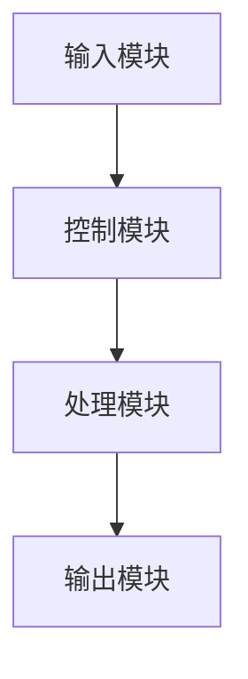

                 


# 彼得林奇的"长期持有"vs"动态再平衡"

> 关键词：彼得林奇、长期持有、动态再平衡、投资策略、资产配置、价值投资

> 摘要：本文深入分析了彼得·林奇的两种投资策略——长期持有和动态再平衡——探讨了它们的理论基础、优缺点、经典案例以及在实际投资中的应用。通过比较这两种策略，本文旨在为投资者提供全面的视角，帮助他们在不同市场环境下做出明智的投资决策。

---

## 第一部分: 背景介绍

### 第1章: 长期持有与动态再平衡概述

#### 1.1 长期持有的定义与背景

##### 1.1.1 长期持有的定义
长期持有是一种投资策略，强调买入优质资产后长期持有，不因短期市场波动而频繁交易。其核心理念是通过时间的积累实现复利增长，避免交易成本和短期波动的影响。

##### 1.1.2 长期持有在投资中的起源
长期持有的理念起源于价值投资，由本杰明·格雷厄姆和 Warren Buffett 等投资者推广。彼得·林奇作为著名的基金经理，进一步发展了这一策略，强调选择优秀的公司长期持有。

##### 1.1.3 长期持有与彼得·林奇的关联
彼得·林奇在其职业生涯中，通过长期持有优质股票实现了卓越的投资回报。他强调选择具有持续增长潜力的公司，并在市场恐慌时增加持有量。

#### 1.2 动态再平衡的定义与背景

##### 1.2.1 动态再平衡的定义
动态再平衡是一种投资策略，强调根据市场变化和投资者风险承受能力，定期调整投资组合的资产配置，以维持预设的目标比例。

##### 1.2.2 动态再平衡在投资中的起源
动态再平衡的理论基础源于资产配置和风险管理。20世纪80年代，随着金融市场的波动加剧，动态再平衡策略逐渐受到重视。

##### 1.2.3 动态再平衡与彼得·林奇的关联
尽管彼得·林奇更以长期持有策略闻名，但他也强调在市场大幅波动时，动态调整投资组合的重要性。这种策略在市场危机时尤为关键。

#### 1.3 长期持有与动态再平衡的比较

##### 1.3.1 两种策略的核心区别
- 长期持有强调买入并持有，注重长期增长。
- 动态再平衡注重资产配置的动态调整，适应市场变化。

##### 1.3.2 两种策略的优缺点对比

| 策略      | 优点                                                                 | 缺点                                                                 |
|-----------|--------------------------------------------------------------------|--------------------------------------------------------------------|
| 长期持有  | 避免交易成本，复利效应显著，减少短期波动的干扰。                   | 无法应对市场大幅波动，可能在市场崩盘时损失惨重。                   |
| 动态再平衡 | 根据市场变化调整，降低风险，维持目标资产配置。                   | 需要频繁调整，交易成本较高，难以捕捉长期趋势。                   |

##### 1.3.3 为什么需要比较这两种策略
在实际投资中，单一策略可能无法应对所有市场环境。通过比较长期持有和动态再平衡，投资者可以找到更灵活和稳健的组合策略。

---

## 第2章: 投资策略的基本原理

### 2.1 长期持有的理论基础

#### 2.1.1 价值投资理论
价值投资认为市场短期波动，但长期趋向于反映资产的真实价值。长期持有通过买入低估资产，等待其价值回归。

#### 2.1.2 长期持有与价值投资的关系
长期持有是价值投资的核心策略，强调选择优质资产长期持有，避免短期波动干扰。

#### 2.1.3 长期持有的数学模型
长期持有的复利公式：
$$ FV = PV \times (1 + r)^t $$
其中，PV为本金，r为年化收益率，t为持有时间。

### 2.2 动态再平衡的理论基础

#### 2.2.1 资产配置理论
资产配置理论认为，通过合理分配资产比例，可以降低风险，提高收益。

#### 2.2.2 动态再平衡与资产配置的关系
动态再平衡是资产配置的动态调整，根据市场变化和投资者风险偏好，维持预设的资产比例。

#### 2.2.3 动态再平衡的数学模型
动态再平衡调整公式：
$$ w_i = \frac{A_i}{A_{total}} $$
其中，\( w_i \) 为资产i的新权重，\( A_i \) 为当前资产i的价值，\( A_{total} \) 为总资产价值。

### 2.3 两种策略的数学模型对比

#### 2.3.1 长期持有的数学模型
$$ FV = PV \times (1 + r)^t $$

#### 2.3.2 动态再平衡的数学模型
$$ w_i = \frac{A_i}{A_{total}} $$

#### 2.3.3 对比分析
长期持有注重复利增长，而动态再平衡注重比例调整。两者结合可以在风险可控的前提下，追求长期收益。

---

## 第3章: 彼得·林奇的投资理念

### 3.1 彼得·林奇的长期持有策略

#### 3.1.1 彼得·林奇的长期持有理念
彼得·林奇认为，长期持有的关键是选择具有持续增长潜力的公司，并在市场恐慌时增加持有量。

#### 3.1.2 他如何选择长期持有的股票
他注重公司的基本面，选择具有强大竞争优势和增长潜力的公司。

#### 3.1.3 长期持有策略的经典案例
例如，他长期持有的麦当劳和迪士尼，在持有期间实现了显著的收益。

### 3.2 彼得·林奇的动态再平衡策略

#### 3.2.1 动态再平衡的定义与应用
彼得·林奇在市场波动时，动态调整投资组合，平衡风险和收益。

#### 3.2.2 彼得·林奇如何进行动态再平衡
他根据市场变化，定期调整资产配置，确保投资组合的风险可控。

#### 3.2.3 动态再平衡策略的经典案例
例如，在互联网泡沫时期，他调整投资组合，减少科技股比例，增加防御性股票。

### 3.3 两种策略的结合与平衡

#### 3.3.1 长期持有与动态再平衡的结合
彼得·林奇通过长期持有优质资产，同时在市场波动时进行动态调整，平衡风险和收益。

#### 3.3.2 两种策略在投资组合中的应用
在投资组合中，长期持有优质资产作为核心配置，动态再平衡应对短期波动。

#### 3.3.3 两种策略的优缺点总结
长期持有追求长期收益，动态再平衡注重风险控制，两者结合可以在不同市场环境下实现稳健收益。

---

## 第4章: 数学模型与系统架构

### 4.1 长期持有与动态再平衡的数学模型对比

#### 4.1.1 长期持有的数学模型
$$ FV = PV \times (1 + r)^t $$

#### 4.1.2 动态再平衡的数学模型
$$ w_i = \frac{A_i}{A_{total}} $$

### 4.2 系统架构设计

#### 4.2.1 系统功能设计
- 输入模块：接收市场数据和投资者参数。
- 处理模块：计算资产配置和长期持有收益。
- 输出模块：显示投资建议和调整方案。

#### 4.2.2 系统架构图


#### 4.2.3 系统接口设计
- 输入接口：市场数据和投资者参数。
- 输出接口：投资建议和调整方案。

---

## 第5章: 项目实战

### 5.1 环境安装

```bash
pip install numpy pandas matplotlib
```

### 5.2 核心代码实现

#### 5.2.1 长期持有模拟

```python
import numpy as np

def calculate_fv(pv, r, t):
    return pv * (1 + r) ** t

# 示例
pv = 1000
r = 0.07
t = 10
fv = calculate_fv(pv, r, t)
print(f"未来价值：{fv}")
```

#### 5.2.2 动态再平衡模拟

```python
import pandas as pd

def calculate_weights(assets):
    total = sum(assets)
    weights = {asset: (value / total) for asset, value in assets.items()}
    return weights

# 示例
assets = {'股票': 50000, '债券': 30000, '现金': 20000}
weights = calculate_weights(assets)
print("权重：", weights)
```

### 5.3 案例分析

#### 5.3.1 长期持有案例
假设投资1000美元，年化收益率7%，持有10年，未来价值为：
$$ FV = 1000 \times (1 + 0.07)^{10} = 2058.91 $$

#### 5.3.2 动态再平衡案例
资产配置：股票60%，债券30%，现金10%。市场下跌后，动态调整至股票50%，债券40%，现金10%。

---

## 第6章: 最佳实践 tips、小结、注意事项、拓展阅读

### 6.1 小结
彼得·林奇的长期持有和动态再平衡策略各有优缺点，投资者应根据市场环境和个人风险偏好选择合适的策略。

### 6.2 注意事项
- 长期持有需要选择优质资产。
- 动态再平衡需要定期调整，避免交易成本过高。

### 6.3 拓展阅读
建议阅读彼得·林奇的《投资之道》和《漫步华尔街》等书籍，深入理解这两种策略。

---

## 第7章: 展望与结论

彼得·林奇的长期持有和动态再平衡策略为投资者提供了丰富的选择。在实际投资中，结合这两种策略可以更好地应对市场波动，实现稳健收益。未来，随着市场的变化，投资者需要不断调整策略，以适应新的挑战。

---

以上是《彼得林奇的"长期持有"vs"动态再平衡"》的技术博客文章，希望对您有所帮助！

